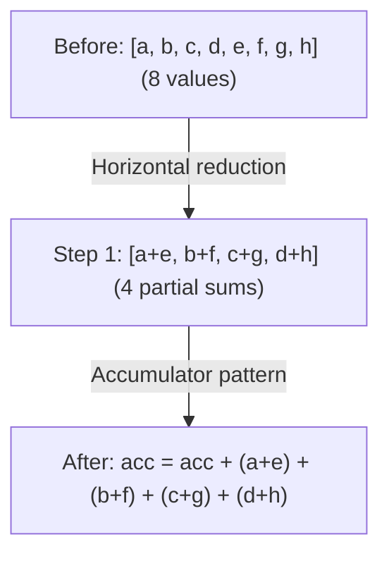

# Phase 3: Devectorizer

**Goal**: Lower from hardware-agnostic vectors to hardware-specific instructions.

---

## Stage 11: Remove Reduce

> **Stage at a Glance**
>
> **Goal**: Convert declarative REDUCE to imperative accumulation
> **Key Patterns**: Reduce to accumulator, horizontal reduction
> **Impact**: Maps to hardware reduction instructions

**What This Does**: Converts high-level REDUCE to accumulator pattern.

**Why This Matters**: A declarative "sum these values" needs to become imperative instructions: initialize accumulator, loop, add each value.

**Pattern**: `pm_reduce + gep_pushing`

```text
// Before: declarative reduction
REDUCE(Add, values, range)

// After: imperative accumulation
acc = DEFINE_REG(0.0)
for i in range:
    acc = ADD(acc, values[i])
```

**Horizontal reduction**:

Before we loop through a reduction dimension, we first combine neighboring values. This creates larger reductions that map better to hardware instructions.



**GEP pushing** pushes GEP (get element pointer) operations through ALUs for better vectorization:

```text
GEP(ADD(ptr_a, ptr_b), idx) → ADD(GEP(ptr_a, idx), GEP(ptr_b, idx))
```
*Why?* Enables SIMD on the two GEPs (can be computed in parallel).

**WMMA Tensor Core Fusion**:
```text
// Fuse tensor core accumulation inline
WMMA(a, b, c) + add → WMMA(a, b, c + add)
```
This pattern enables efficient FMA-style accumulation on NVIDIA tensor cores.

**Svod**: `devectorize.rs`

---

## Stage 12: Add GPU Dims

> **Stage at a Glance**
>
> **Goal**: Map abstract ranges to GPU thread indices
> **Key Patterns**: Range to SPECIAL replacement
> **Impact**: Enables parallel execution on GPU

**What This Does**: Replaces ranges with GPU thread indices.

**Why This Matters**: GPUs have hard limits: max 1024 threads per block, max 48KB shared memory. If your computation needs 2000 threads, the compiler must split it into multiple blocks. Dimension limiting handles this automatically.

**Pattern**: `pm_add_gpudims`

```text
// Before: abstract range
RANGE(end=256, Global)

// After: GPU-specific
SPECIAL(gidx0)  // global thread index
```

**Mapping**:

| Range Type | GPU Equivalent |
|------------|----------------|
| Global, THREAD | `gidx` (global index) |
| Local, WARP, GROUP_REDUCE | `lidx` (local/workgroup index) |
| Reduce | Loop (no mapping) |

**Dimension Limiting**:

GPUs have hardware limits (e.g., max 1024 threads per block). When ranges exceed these limits, the compiler:

1. **Groups** adjacent dimensions: `[256, 256, 256]` with max `[256, 256]` → `[65536, 256]`
2. **Splits** large dimensions: `[2048]` with max `[1024]` → `[2, 1024]`
3. **Reconstructs** indices via divmod

**Store Masking**:

Global stores that don't use all local dimensions are masked:
```text
// If STORE doesn't use lidx1, mask it:
STORE(INDEX(...), value) → STORE(INDEX(..., gate=(lidx1 == 0)), value)
```
This ensures stores only execute when unused local indices are 0.

**Svod**: `gpudims.rs`

---

## Stage 13: Add Loads

> **Stage at a Glance**
>
> **Goal**: Wrap INDEX operations in explicit LOAD
> **Key Patterns**: Add LOAD, remove redundant loads
> **Impact**: Makes memory operations explicit for codegen

**What This Does**: Wraps INDEX operations in explicit LOAD.

**Why This Matters**: Index operations compute addresses. LOAD actually reads memory. Making this explicit helps the code generator understand what memory accesses are needed.

**Pattern**: `pm_add_loads`

```text
// Before: bare index
INDEX(ptr, i)

// After: explicit load
LOAD(INDEX(ptr, i))
```

Also removes redundant loads from stores (write-only access).

Note: Not all INDEX operations get wrapped in LOAD. Pointer types (already addresses) and image textures (special hardware) use different access methods.

**Svod**: `devectorize.rs`

---

## Stage 14: Devectorize

> **Stage at a Glance**
>
> **Goal**: Convert abstract vectors to match hardware capabilities
> **Key Phases**: 4 coordinated passes
> **Impact**: Vectors work with actual hardware width

**What This Does**: Handles the transition from abstract vectors to hardware operations.

**Why This Matters**: Devectorize lowers `STACK` and `INDEX` lane structure to
the widths supported by the target, while preserving contiguous memory accesses.

**Device-Specific Fold Lengths**:

| Device | Fold Lengths | Notes |
|--------|--------------|-------|
| GPU (standard) | 4, 2, 1 | Standard GPU vectorization |
| Image | 4, 1 | Fixed for image textures |
| No-fold | 1 | Scalar fallback (forced) |

**Environment Variable** (Tinygrad only): `DEVECTORIZE`
- `0`: Skip `devectorize` only (keeps `correct_load_store`)
- `1`: Full devectorization (default)
- `≥2`: Skip both `devectorize` and `correct_load_store`

Note: Svod always runs the devectorizer and does not expose this env var.

**Pattern**: `devectorize + load_store_folding + correct_load_store + load_store_indexing`

**Split vectorized ALUs**:
```text
// If hardware doesn't support vec4 add
ADD(vec4_a, vec4_b) → [ADD(a[0], b[0]), ADD(a[1], b[1]), ...]
```

**Load/store chunk splitting**: Match hardware memory width.

**Image fixup**: Special handling for image tensor buffers.

**Svod**: `devectorize.rs`

---

## Stage 15: Lower Index Dtype

> **Stage at a Glance**
>
> **Goal**: Convert abstract Index type to concrete integers
> **Key Patterns**: Operation-specific lowering based on value bounds
> **Impact**: Indices use hardware-native integer types (i32 or i64)

**What This Does**: Converts abstract `Index` type to concrete integers.

**Why This Matters**: The Index type is abstract—hardware doesn't have it. We need to convert to i32 or i64, which the hardware actually supports.

**Pattern**: `pm_lower_index_dtype`

```text
// Before: abstract index type
idx: Index

// After: concrete type
idx: i32  // or i64, based on bounds
```

**Operation-Specific Lowering**:

Index type lowering uses a 3-phase cascade approach:

1. **Create concrete wrappers** for leaf nodes (CONST, DEFINE_VAR) — wraps them with concrete dtype
2. **Process wrapped values upward** (Binary, WHERE, RANGE, etc.) — propagates concrete types through the tree
3. **Strip wrappers** at terminal nodes (INDEX, SINK, END) — removes wrapping to produce final concrete types

Each operation type has specific patterns:

| Operation | Before | After |
|-----------|--------|-------|
| Binary ops | `ADD(Index, Index)` | `ADD(i32, i32)` with casts |
| CONST | `CONST(5): Index` | `CONST(5): i32` |
| WHERE | `WHERE(c, Index, Index)` | `WHERE(c, i32, i32)` |
| RANGE | `RANGE(end: Index)` | `RANGE(end: i32)` with cast |
| SPECIAL | `SPECIAL(gidx)` | Always i32 (GPU indices are 32-bit) |
| DEFINE_VAR | `DEFINE_VAR: Index` | i32 if bounds fit, else i64 |
| VECTORIZE | `VECTORIZE(Index...)` | Cast each to concrete scalar |
| CAST cleanup | `CAST(i32, Index)` | Just `i32` (remove redundant cast) |
| BIND | `BIND(var, val)` | `BIND(var.cast(dt), val.cast(dt)).cast(Index)` |

The `select_concrete_dtype()` function determines i32 vs i64 using vmin/vmax bounds analysis:
```text
dtype = i32 if bounds fit in [-2^31, 2^31-1] else i64
```

**Svod**: `symbolic/index_lowering.rs`

---

## Additional Devectorizer Passes

Svod runs several additional passes between Stage 14 and 15 that don't have direct Tinygrad equivalents:

| Pass | Purpose |
|------|---------|
| `pm_bool_devectorize` | Handle boolean vector patterns (expand/shrink) |
| `pm_reduce_devectorize` | Handle vector reductions (K-vec, bool, horizontal) |
| `bool_storage_patterns` | Convert between bool and uint8 for memory operations |
| `linearize_multi_index` | Flatten multi-dimensional indices to linear offsets |
| `merge_sibling_ends` | Merge adjacent END operations sharing the same ranges |
