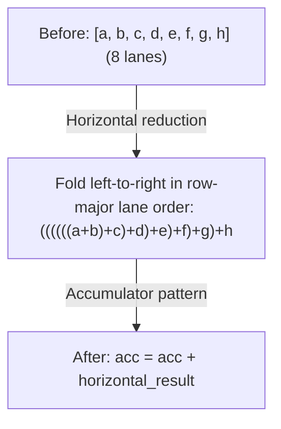

# Phase 3: Devectorizer

**Goal**: Lower from hardware-agnostic vectors to hardware-specific instructions.

---

## Stage 11: Remove Reduce

> **Stage at a Glance**
>
> **Goal**: Convert declarative REDUCE to imperative accumulation
> **Key Patterns**: Reduce to accumulator, horizontal reduction
> **Impact**: Maps to hardware reduction instructions

**What This Does**: Converts high-level REDUCE to accumulator pattern.

**Why This Matters**: A declarative "sum these values" needs to become imperative instructions: initialize accumulator, loop, add each value.

**Pattern**: `movement_cleanup_patterns + pm_reduce_local`

`pm_reduce_local` bundles the WMMA-add fusion, `pm_group_for_reduce`, the
accumulator and horizontal-reduce rules, and the group-SINK cleanup.

```text
// Before: declarative reduction
REDUCE(Add, values, range)

// After: imperative accumulation
acc = placeholder(AddrSpace::Reg)   // initialized to the reduce identity
for i in range:
    acc = STORE(acc, ADD(LOAD(acc), values[i]))
```

The accumulator loop is an AFTER / STORE / END chain, closed by an `END` over the
reduce ranges—there is no separate loop construct at this level.

**Horizontal reduction**:

Before we loop through a reduction dimension, we first combine the lanes of a shaped value. This creates larger reductions that map better to hardware instructions.



**WMMA Tensor Core Fusion**:
```text
// Fuse tensor core accumulation inline
WMMA(a, b, c) + add → WMMA(a, b, c + add)
```
This pattern enables efficient FMA-style accumulation on tensor cores. Two extra arms fuse through a `PERMUTE`, and through a `PERMUTE(RESHAPE(...))`, wrapper.

**Svod**: `devectorize.rs`

---

## Stage 12: Add GPU Dims

> **Stage at a Glance**
>
> **Goal**: Map abstract ranges to GPU thread indices
> **Key Patterns**: Range to SPECIAL replacement
> **Impact**: Enables parallel execution on GPU

**What This Does**: Replaces ranges with GPU thread indices.

**Why This Matters**: GPUs have hard limits: max 1024 threads per block, max 48KB shared memory. If your computation needs 2000 threads, the compiler must split it into multiple blocks. Dimension limiting handles this automatically.

**Pattern**: `pm_lower_device_ranges`, then `pm_add_gpudims` (only when the renderer has local or thread dimensions)

```text
// Before: abstract range
RANGE(end=256, Global)

// After: GPU-specific
SPECIAL(gidx0)  // global thread index
```

**Mapping**:

| Range Type | GPU Equivalent |
|------------|----------------|
| Global, Thread | `gidx` (global index) |
| Local, Warp, GroupReduce | `lidx` (local/workgroup index) |
| Device | PARAM variable `"_device_num"` (bound at launch) |
| Reduce | Loop (no mapping) |

Warp ranges are sorted to the front of the local dimensions, so they own the low bits of the thread index.

**Dimension Limiting**:

GPUs have hardware limits (e.g., max 1024 threads per block). When ranges exceed these limits, the compiler:

1. **Groups** adjacent dimensions when their product still fits: `[16, 16, 256]` with max `[256, 256]` → `[256, 256]`
2. **Splits** large dimensions: `[2048]` with max `[1024, 1024, 1024]` → `[1024, 2]`
3. **Reconstructs** indices via divmod

**Store Masking**:

Global stores that don't use all local dimensions are masked:
```text
// If STORE doesn't use lidx1, restrict its index validity:
STORE(INDEX(buf, idx), value) → STORE(INDEX(buf, WHERE(lidx1 == 0, idx, Invalid)), value)
```
This ensures stores only execute when unused local indices are 0. The mask stays in the index expression so that RANGE substitution carries it to the corresponding hardware index.

**Svod**: `gpudims.rs`

---

## Stage 13: Add Loads

> **Stage at a Glance**
>
> **Goal**: Wrap INDEX operations in explicit LOAD
> **Key Patterns**: Add LOAD to value operands
> **Impact**: Makes memory operations explicit for codegen

**What This Does**: Wraps INDEX operations in explicit LOAD.

**Why This Matters**: Index operations compute addresses. LOAD actually reads memory. Making this explicit helps the code generator understand what memory accesses are needed.

**Pattern**: `symbolic_simple + pm_expand_broadcast + pm_add_loads`

```text
// Before: bare index
INDEX(ptr, i)

// After: explicit load
LOAD(INDEX(ptr, i))
```

Also loads a STORE's value operand when that value is itself an address.

Note: only operands consumed *as values* are wrapped—an INDEX used purely as an address (a STORE target, a WMMA fragment address) stays bare.

**Svod**: `devectorize.rs`

---

## Stage 14: Devectorize

> **Stage at a Glance**
>
> **Goal**: Turn shaped operations into scalar ones
> **Key Phases**: One combined rewrite
> **Impact**: Every op becomes something the backend can emit

**What This Does**: Handles the transition from shaped values to scalar hardware operations.

**Why This Matters**: Devectorize lowers `STACK` and `INDEX` lane structure into
per-lane scalar operations, while preserving contiguous memory accesses.

**Scalarization is unconditional**: `devectorize_alu` computes the lane count as
the product of the static shape and emits one operation per coordinate, then
reassembles the result with `STACK` (or `GROUP`, for stores). There is no
per-device fold-length table—re-vectorization is left to the backend, where
LLVM's SLP vectorizer can widen the scalars again when profitable.

Note: Svod always runs the devectorizer; there is no env var to skip it.

**Pattern**: `symbolic_simple + devectorize_patterns + bool_storage_patterns + indexing_simplify`

**Split shaped ALUs**:
```text
// A shaped add becomes one op per lane
ADD(shaped_a, shaped_b) → STACK(ADD(a[0], b[0]), ADD(a[1], b[1]), ...)
```

**Bool storage**: bool LOAD/STORE go through `uint8`, because LLVM's `i1` can carry garbage in the upper bits.

**Index simplification**: `indexing_simplify` folds the addressing arithmetic the scalarization exposes.

**Svod**: `devectorize.rs`

---

## Stage 15: Lower Index Dtype

> **Stage at a Glance**
>
> **Goal**: Convert the weak index type to concrete integers
> **Key Patterns**: Operation-specific lowering based on value bounds
> **Impact**: Indices use hardware-native integer types (i32 or i64)

**What This Does**: Converts the abstract weak (`WeakInt`) dtype to concrete integers.

**Why This Matters**: The weak index type is abstract—hardware doesn't have it. We need to convert to i32 or i64, which the hardware actually supports. (Tinygrad calls this dtype `Index`; in Svod it is `ScalarDType::WeakInt`.)

**Pattern**: `lower_index_patterns` = `symbolic_simple + pm_fold_cast_const + pm_lower_index_dtype + indexing_simplify`

```text
// Before: weak index type
idx: WeakInt

// After: concrete type
idx: i32  // or i64, based on bounds
```

**Operation-Specific Lowering**:

Index type lowering uses a 3-phase cascade approach:

1. **Create concrete wrappers** for leaf nodes (CONST, VCONST, PARAM) — each becomes `concrete.cast(weak)`
2. **Process wrapped values upward** (Unary, Binary, WHERE, RANGE, STACK, SPECIAL) — propagates concrete types through the tree
3. **Absorb the casts** at any non-weak consumer, which takes the concrete dtype on its own edge

Each operation type has specific patterns:

| Operation | Before | After |
|-----------|--------|-------|
| Binary ops | `ADD(WeakInt, WeakInt)` | `ADD(i32, i32)` with casts |
| CONST | `CONST(5): WeakInt` | `CONST(5): i32` wrapped in `.cast(WeakInt)` |
| WHERE | `WHERE(c, WeakInt, WeakInt)` | `WHERE(c, i32, i32)` (the condition is skipped) |
| RANGE | `RANGE(end: WeakInt)` | `RANGE(end: i32)` with cast |
| SPECIAL | `SPECIAL(gidx)` | Concrete integer from the op's bounds (in practice the default int) |
| PARAM (variable) | `PARAM: WeakInt` | i32 if bounds fit, else i64 |
| STACK | `STACK(WeakInt...)` | Scalar dtype on the STACK, each lane cast individually |
| Double weak CAST | `CAST(weak, CAST(weak, x))` | Inner cast committed to a concrete dtype, outer weak cast kept |

The `select_dtype()` function determines i32 vs i64 using vmin/vmax bounds analysis:
```text
dtype = default_int if bounds fit in [-2^31, 2^31-1] else i64
```
It also resolves `WeakFloat` to the default float, and has separate arms for unsigned and bool bounds.

**Svod**: `symbolic/index_lowering.rs`

---

## Additional Passes Around the Devectorizer

Svod runs several passes between Stage 14 and index lowering that the 22-stage numbering doesn't name:

| Pass | Purpose |
|------|---------|
| `sym()` (early symbolic) | Full symbolic simplification once the graph is scalar |
| `memory_coalescing` | Merge neighbouring accesses into wider ones |
| `pm_simplify_add_image` (bottom-up) | Image-dtype address simplification, together with `no_vectorized_alu` |
| `extra_symbolic_patterns` | `sym() + indexing_simplify`, keeping indices weak while the index-validity rules can still fire |
