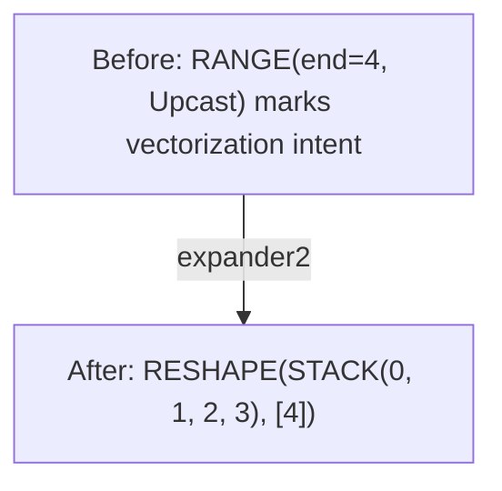
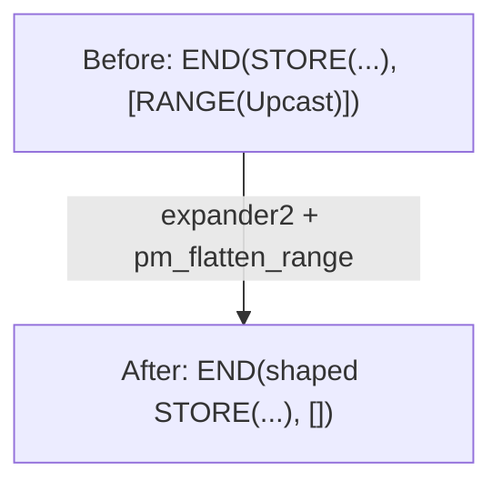
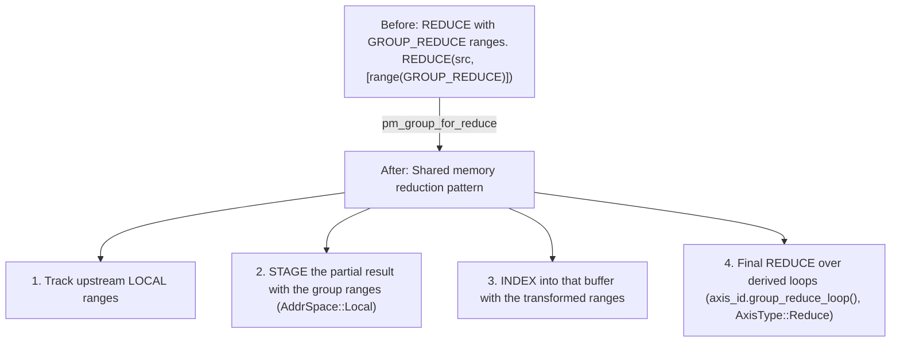

# Phase 2: Expander

**Goal**: Transform optimization primitives (UPCAST/UNROLL ranges) into explicit shaped operations.

---

## Stage 8: Post-Opt Symbolic

> **Stage at a Glance**
>
> **Goal**: Symbolic simplification after optimization
> **Key Patterns**: WHERE movement, constant folding
> **Impact**: Enables better load combining and vectorization

**What This Does**: Symbolic simplification after optimization, plus WHERE movement.

**Why This Matters**: WHERE operations are like `if` statements. This stage moves `if` checks from around an indexed read into the index expression itself. Hardware can skip loading when the condition is false, saving memory bandwidth.

**Pattern**: `sym + pm_move_where_on_load + pm_flatten_range + pm_reduce_unparented` (the `POST_OPT_SYM` matcher)

```text
// Before: WHERE guards an indexed read
WHERE(cond, INDEX(buf, idx), 0)

// After: validity moved into INDEX
INDEX(buf, WHERE(cond, idx, Invalid))
```

Moving validity into INDEX enables better load combining and vectorization.

**Note**: This pattern only matches when the alternative value is `0`; a second arm handles the inverted form `WHERE(cond, 0, INDEX(...))` with the negated condition. The transformation involves complex clause analysis: duplicate detection, range dependency checks, and data-dependent load verification.

**Note**: Svod keeps validity inside the index expression, as `WHERE(cond, idx, Invalid)`. It only becomes a `gate` field on LOAD/STORE much later, in `pm_move_gates_from_index` (`late/gater.rs`); INDEX itself has no gate field.

**Svod**: `pm_move_where_on_load()` in `symbolic/patterns.rs`

---

## Stage 9: Expander

> **Stage at a Glance**
>
> **Goal**: Expand UPCAST and UNROLL ranges into shaped STACK coordinates
> **Key Concepts**: range axis types, STACK, INDEX, pattern order
> **Impact**: Makes vectorization explicit and ready for hardware

**What This Does**: Transforms UPCAST/UNROLL range classifications into shaped coordinates.

**Why This Matters**: UPCAST and UNROLL mark intent—what we want to do. This stage makes that intent explicit so the hardware can actually do it.

**Pattern**: `expander2 + pm_flatten_range + mop_cleanup_patterns` (the `pre_expand()` entry point)

Note: no symbolic matcher runs inside `pre_expand`. `sym` already ran at Stage 8, and `symbolic_simple` runs again at Stages 13 and 14.

⚠️ **Important: Pattern Precedence**

The patterns are combined and run to fixpoint. The order affects which pattern is tried first when multiple could match:
1. `expander2` first (expands UPCAST/UNROLL ranges, REDUCE and WMMA operands)
2. `pm_flatten_range` second (rebuilds END range lists once ranges disappear)
3. `mop_cleanup_patterns` last (cleans up the movement ops expansion leaves behind)

Wrong precedence can cause incorrect vectorization or reduction scoping.

Expanded lanes are collected with `STACK` and selected with `INDEX`. UPCAST and
UNROLL are `AxisType`s on `RANGE`, not standalone operations. (`STACK` is Svod's
name for what Tinygrad calls VECTORIZE; there is no VECTORIZE op.)

**UPCAST / UNROLL range → shaped coordinate**:


Upcast and unroll ranges take the same path—one rule matches both axis types. The
RANGE node itself is replaced by a shaped constant coordinate, so every operation
that consumed it simply becomes shaped. Per-lane operations are materialized
later, by `devectorize_alu` at Stage 14.

When we say "operations duplicated," it sounds like copy-paste. But that's not what happens. The compiler creates a single SIMD instruction that processes all N elements together. Think of a SIMD register as a box holding 4 numbers; adding two boxes adds all 8 numbers at once.

**Expanded END interaction**:


`pm_flatten_range` rebuilds an END's range list from the RANGE nodes still
reachable through its sources. After expansion the upcast range is gone, so the
list empties. The per-lane stores appear at Stage 14, wrapped in `GROUP`.

**GROUP_REDUCE Handling** (`pm_group_for_reduce`):

GROUP_REDUCE is a special axis type for tensor core reductions:



This enables efficient tensor core accumulation via shared memory. Although
`pm_group_for_reduce` lives in `expand.rs`, it is composed into `pm_reduce_local`
and therefore fires during reduction removal, not inside `pre_expand`.

**Svod**: `expand.rs`

---

## Stage 10: Add Local Buffers

> **Stage at a Glance**
>
> **Goal**: Prepare buffers for fast memory (shared / L1)
> **Key Patterns**: Local buffer allocation, movement op pushdown
> **Impact**: Frequently-accessed data stays in fast memory

**What This Does**: Turns each staged intermediate into a real local buffer.

**Why This Matters**: **Local buffers** = fast memory close to the compute unit:
- GPU: Shared memory (LDS) — 100x faster than global memory
- CPU: L1 cache — 10x faster than main memory

The compiler moves frequently-accessed data to local buffers, similar to keeping important files on your desktop instead of a network drive.

**Pattern**: `pm_add_local_buffers`

| Transform | Purpose |
|-----------|---------|
| `add_local_buffer` | Allocate a local `placeholder` per STAGE node and rewrite it into INDEX / STORE / END / AFTER |
| `movement_op_patterns` | Push movement ops down so the new buffer's indices stay simple |

**Note on ordering**: reduction removal (Stage 11) actually runs *before* this
stage—`add_local_buffer` consumes the STAGE nodes that reduce lowering produces.
Tinygrad orders the two passes the same way.

**Svod**: `optimizer/mod.rs`, `rangeify/patterns.rs`
