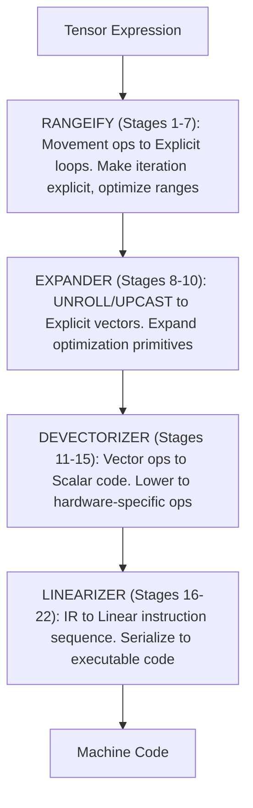

# Path of the UOp: The 22-Stage Codegen Pipeline

A UOp starts as a high-level tensor expression. By the time it reaches the hardware, it has been transformed through 22 distinct stages—each with a specific purpose, each building on the last. This chapter traces that journey.

The pipeline is a proven design for tensor compilation. Understanding it means understanding how tensor expressions become machine code.

---

## How to Read This Chapter

If you're not a compiler engineer, this chapter might seem intimidating. Here's what you need to understand before diving in.

### Key Concepts

**UOp (Micro-Operation)**
- Think of it as a node in a flowchart representing one computation
- Example: `ADD(a, b)` means "add a and b"

**Pattern**
- A find-and-replace rule for code structures (not text)
- Example: "If you see ADD(x, 0), replace with x"
- Patterns fire repeatedly until no more matches (fixpoint)

**Range**
- A loop iteration: `RANGE(0..10)` means "for i from 0 to 10"

**AxisType**
- What kind of loop is this?
  - Global: Parallel across GPU blocks / CPU threads
  - Local: Parallel within a workgroup
  - Reduce: Accumulator (sum, max, etc.)
  - Loop: Sequential iteration
  - Upcast / Unroll: Expanded away by the expander into lanes

**Stage**
- One transformation pass through the code
- Patterns fire until fixpoint, then move to the next stage

### Reading Strategy

1. **First pass**: Read just the "What This Does" and "Why This Matters" sections
2. **Second pass**: Look at the diagrams and examples
3. **Third pass** (if you want details): Read the pattern descriptions

### Questions to Ask

For each stage, ask:
- What does this stage accomplish? (High-level goal)
- Why do we need this stage? (Motivation)
- What would go wrong without it? (Consequences)

---

## Overview

The 22 stages fall into four phases:

Each stage applies pattern-based rewrites. Patterns fire until fixpoint, then the next stage begins.

### Additional Passes

Several passes run between the numbered stages and don't have their own stage number:

| Pass | Where It Runs | Purpose |
|------|---------------|---------|
| `bool_storage_patterns` | Inside Stage 14 | Convert bool ↔ uint8 for memory operations |
| `indexing_simplify` | Inside Stages 14 and 15 | Fold the addressing arithmetic scalarization exposes |
| `sym()` (early symbolic) | 14–15 | Full symbolic simplification once the graph is scalar |
| `memory_coalescing` | 14–15 | Merge neighbouring accesses into wider ones |
| `pm_simplify_add_image` | 14–15 (bottom-up) | Image-dtype address simplification |
| `pm_float_decomp` / `pm_long_decomp` | Inside Stage 18 | Emulate dtypes the target lacks (FP8/BF16, 64-bit ints) |
| `pm_move_gates_from_index` | 18–19 | Move index validity onto the LOAD/STORE `gate` field |
