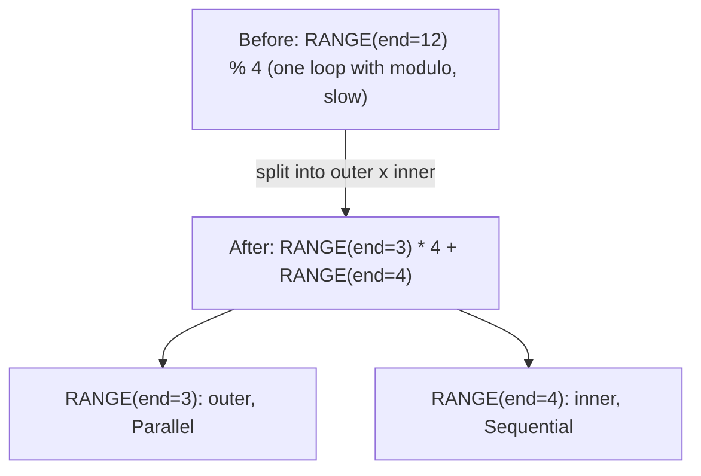
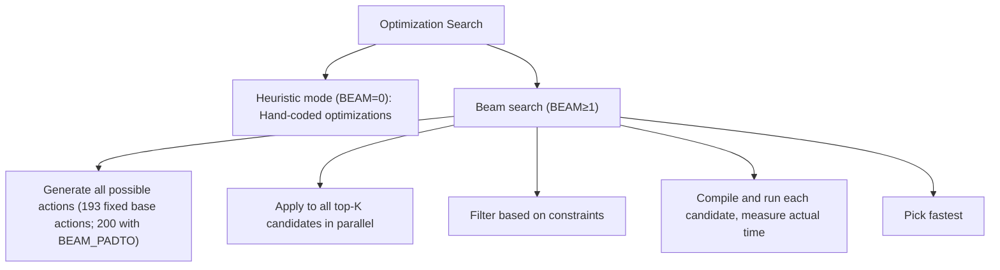

# Phase 1: Rangeify

**Goal**: Transform high-level movement operations into explicit loop structures and optimize ranges.

---

## Stage 1: Early Movement Ops

> **Stage at a Glance**
>
> **Goal**: Clean up movement operations before range assignment
> **Key Patterns**: Movement on INDEX, movement through wrappers, nested INDEX simplification
> **Impact**: Prevents missed optimizations later in the pipeline

**What This Does**: This stage cleans up movement operations by pushing index manipulations into places where they're actually needed. Think of it as organizing your desk before filing papers—move instructions closer to where the data is used.

**Why This Matters**: Movement operations (RESHAPE, PERMUTE, etc.) are convenient abstractions, but the hardware needs concrete index calculations. By cleaning them up early, we ensure patterns in later stages can match correctly.

**Pattern**: `movement_op_patterns()` (bottom-up)

| Pattern | Transformation | Visual | Location |
|----------|---------------|--------|----------|
| Movement on INDEX | Apply movement to index expressions | `INDEX(PERMUTE(arr), [i, j]) → INDEX(arr, [j, i])` | `movement_op_patterns()` |
| Movement through AFTER | Push movement (or INDEX) through the timing wrapper, keeping every dep | `AFTER(RESHAPE(x, arg), deps) → RESHAPE(AFTER(x, deps), arg)` | `movement_op_patterns()` |
| Movement through END | Unwrap movement from END wrapper | `END(RESHAPE(x), ranges) → END(x, ranges)` | `movement_op_patterns()` |

**Why bottom-up?** Child nodes must be clean before parents can match. Movement ops nest deeply; cleaning from bottom prevents missed patterns.

**Note**: `is_movement()` covers exactly RESHAPE, PERMUTE, EXPAND, PAD, SHRINK and FLIP. Nested INDEX flattening (`INDEX(INDEX(ptr, i), j) → INDEX(ptr, i, j)`) is *not* part of this stage; it lives in `mop_cleanup_patterns()` and runs with the Stage 9 expander and the devectorizer.

**Svod**: `movement_op_patterns()` in `rangeify/patterns.rs`

---

## Stage 2: Load Collapse

> **Stage at a Glance**
>
> **Goal**: Eliminate REDUCE operations by detecting range-independent computation
> **Key Patterns**: Bounded sum, gated load collapse, general reduce elimination
> **Impact**: Converts loop iterations to arithmetic operations

**What This Does**: Eliminates REDUCE operations by recognizing when the computation can be done without iteration. Uses range-independent computation detection and symbolic simplification.

**Why This Matters**: Reducing iterations to arithmetic operations eliminates loop overhead. Instead of running a loop 1000 times, compute the answer directly.

**Pattern**: `pm_load_collapse`

```text
// Before: Sum with bounds check
sum(1 for k in 0..64 if k >= length)

// After: Compute count directly (NO LOOP!)
count = clamp(64 - length, 0, 64)
```

The mechanism works by:
1. Identifying subexpressions that don't depend on the REDUCE range
2. Replacing those external inputs with synthetic scalar PARAM variables carrying their proven vmin/vmax
3. Wrapping the substituted body in a synthetic REDUCE over the same range and running the reduce-collapse matcher
4. If the simplified expression has no more ranges, the REDUCE is eliminated (and the temporary PARAMs are substituted back)

**Note**: WHERE movement through INDEX (`pm_move_where_on_load`) is a separate optimization that runs at Stage 8, embedding the condition into `INDEX.indices[0]` as `WHERE(cond, idx, Invalid)`. It doesn't eliminate REDUCE operations.

**Svod**: `pm_load_collapse()` in `rangeify/patterns.rs`

---

## Stage 3: Split Ranges

> **Stage at a Glance**
>
> **Goal**: Enable better optimization through divmod decomposition
> **Key Patterns**: Split ranges with modulo, flatten ranges
> **Impact**: Inner ranges can vectorize, outer can parallelize

**What This Does**: Handles modulo patterns by splitting a range into outer and inner components.

**Why This Matters**: Splitting ranges is like dividing a large task among team members. If you have 12 items and each person does 4, you get 3 people × 4 items. Inner loops (one person's 4 items) can be fast; outer loops (3 people) can run in parallel.

**Pattern**: `pm_split_ranges + pm_flatten_range`



This enables:
- Inner ranges can vectorize (SIMD)
- Outer ranges can parallelize (GPU blocks / CPU threads)

`pm_flatten_range` re-derives the range operand list of REDUCE and END nodes from the RANGE nodes still reachable through their sources. (Merging ranges is Stage 5's job.)

**Context**: A `SplitRangesContext` marks each `RANGE % const` site; the divmod substitution is performed once, at the SINK.

**Note**: The split only applies when `end % mod == 0` (divisibility check). Warp and Device ranges are never split, and every range an image STORE indexes is pinned against splitting.

**Svod**: `pm_split_ranges()` + `pm_flatten_range()` in `rangeify/transforms.rs`

---

## Stage 4: Initial Symbolic

> **Stage at a Glance**
>
> **Goal**: Simplify expressions using algebra rules
> **Key Patterns**: Constant folding, identity removal, div-mod recombine
> **Impact**: Eliminates expensive operations, reduces code size

**What This Does**: Applies 100+ constant folding and algebraic simplification rules.

**Why This Matters**: Computers are fast at simple math. Dividing and taking remainders are slow operations. This stage uses algebra rules to eliminate slow operations whenever possible.

**Pattern**: `sym() + pm_fold_cast_const() + pm_flatten_range()`

Note: `symbolic()` (tier 2) is a strict subset of `sym()` (tier 3); the same `sym` runs again at Stage 8.

**Constant folding**:
```text
ADD(CONST(2), CONST(3)) → CONST(5)
MUL(x, CONST(1)) → x
ADD(x, CONST(0)) → x
```

**Div-mod recombination**:
```text
(x / c) * c + (x % c) → x
```
*Why?* Computes the same value as `x` but with 3 operations instead of 1. This pattern finds and removes the redundancy (common in stride calculations).

**Boolean algebra**:
```text
x AND x → x
x OR FALSE → x
NOT(NOT(x)) → x
```

**Additional categories**:
- Identity removal (self-folding, redundant operations)
- Comparison simplification
- Cast optimization
- ALU/STACK reordering (`ALU(STACK, STACK) → STACK(ALU)`)
- Where folding (combine WHERE with same conditions)
- Reduce mul chain (move multiplications outside reduce)

**Svod**: `sym()` in `symbolic/patterns.rs`

---

## Stage 5: Simplify Ranges

> **Stage at a Glance**
>
> **Goal**: Merge adjacent ranges to reduce loop overhead
> **Key Patterns**: Range merging with cost analysis
> **Impact**: Fewer loops = less overhead

**What This Does**: Merges adjacent ranges when profitable.

**Why This Matters**: Merging ranges is like combining multiple small trips into one big one. Instead of going to the store 4 times for 4 items, go once for all 4 items. Saves the overhead of starting and stopping.

**Pattern**: `pm_flatten_range() + pm_simplify_ranges()`

```text
// Before: two separate ranges
RANGE(0..4), RANGE(0..8)

// After: merged (if compatible)
RANGE(0..32)
```

`pm_simplify_ranges` also narrows ranges proven bounded by every INDEX validity gate.

Merge criteria:
1. Axis types must be compatible (both output, both reduce, etc.)
2. REDUCE scope must remain consistent
3. **Cost-based**: Accept only if divmod operation count does not increase

The compiler only merges if it saves operations. Merging might require division/modulo to recalculate indices. If that costs more than it saves, merge is skipped.

**Svod**: `simplify_merge_adjacent()` in `rangeify/transforms.rs`

---

## Stage 6: Split Store

> **Stage at a Glance**
>
> **Goal**: Split graph at STORE boundaries into separate kernels
> **Key Function**: `split_all_stores()` + `split_store()`
> **Impact**: Enables per-kernel optimization

**What This Does**: Splits the UOp graph at STORE boundaries, creating separate kernels for each output.

**Why This Matters**: After bufferization, the graph may contain multiple STORE operations. Each STORE becomes its own kernel with its own set of buffers, ranges, and dependencies.

**Function**: `try_get_kernel_graph()` in `schedule/src/rangeify/kernel.rs`

Inside `kernel_graph_pre_cut`, after STAGE nodes have become STOREs, a `pm_flatten_range` pre-pass runs on the **full graph once** (bottom-up). This re-derives the range lists across all kernels in a single traversal, avoiding redundant per-kernel work on overlapping subgraphs. The pre-pass is a key compilation speed optimization — without it, each kernel's `split_store` would re-traverse shared subgraphs independently.

After the pre-pass, `split_all_stores` splits at STORE boundaries — each kernel numbering its own PARAM slots through `LocalAddBufferContext::param_slot` — and then `fix_assign` wires the inter-kernel dependencies, rejecting dependency cycles.

---

## Stage 7: Apply Opts

> **Stage at a Glance**
>
> **Goal**: Find optimal combination of vectorization, unrolling, memory usage
> **Key Algorithm**: Beam search or heuristics
> **Impact**: Can significantly improve performance

**What This Does**: The optimization search—either beam search or heuristic—explores different combinations of optimization actions.

**Why This Matters**: The compiler tries different combinations of optimizations (vectorize here? unroll there?) and picks the fastest. Finding the right combination can make code 10x faster.

**Function**: `optimize_kernel(ast, renderer)`

**Optimization actions**:

| Action | Effect | Hardware Target |
|--------|--------|-----------------|
| TC | Enable tensor core usage | NVIDIA, AMD, Apple Metal & Intel GPUs |
| UPCAST | Vectorize a dimension | All (SIMD) |
| LOCAL | Use local/shared memory | GPU only (requires `has_local`) |
| UNROLL | Unroll a loop dimension | All (avoid loop overhead) |
| GROUP | Inner split of a grouped reduce | GPU (shared memory; rejected once TC is applied) |
| GROUPTOP | Outer split of a grouped reduce | GPU (shared memory; rejected once TC is applied) |
| THREAD | Thread-based parallelism | CPU |
| NOLOCALS | Disable local memory usage | All (constraint, prevents further LOCAL actions) |
| SWAP | Swap two Global range assignments | GPU/CPU global axes (try different tiling) |
| PADTO | Pad for alignment | All (memory alignment) |

**Optimization Search Explained**:

The compiler searches for the best combination:
- **Heuristic mode** (BEAM=0): Fast hand-coded optimization patterns, no compilation
- **Beam search** (BEAM≥1): Compiles and runs candidates to measure actual performance



**Note**: NOLOCALS is a constraint that sets `dont_use_locals = true`, preventing further LOCAL actions and affecting shared memory usage decisions. It is not part of the base action list — it is appended per candidate when enabled.

**Svod**: `optimizer/mod.rs`, `optimizer/opts.rs`
