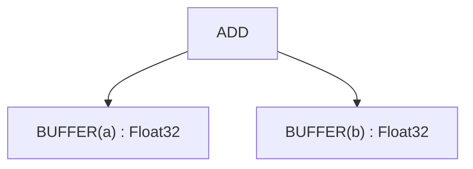
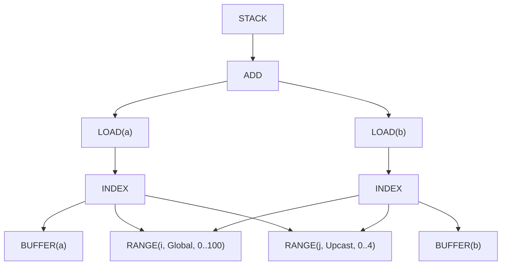
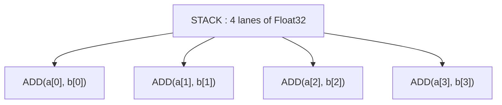

# Worked Example & Reference

---

## Worked Example: Tracing Through All 22 Stages

Let's trace `c = a + b` (where a, b are [100, 100] tensors) through the pipeline.

### Initial Tensor Graph


### After Stage 1: Early Movement Ops
(No change—no movement ops in this example)

### After Stage 2: Load Collapse
(No change—no reductions in this example)

### After Stage 3: Split Ranges
(No change—no modulo operations)

### After Stage 4: Initial Symbolic
(No change—no simplification needed)

### After Stage 5: Simplify Ranges
(No change—no adjacent ranges yet)

### After Stage 6: Split Store
(Not applicable—GPU backend)

### After Stage 7: Apply Opts
Optimization actions applied:
- UPCAST j dimension by 4 (vectorization)
- LOCAL for input buffers (if beneficial)

### After Stage 8: Post-Opt Symbolic
No changes—symbolic already clean.

### After Stage 9: Expander
UPCAST expansion is represented directly with STACK/INDEX structure:


Note: shared ranges and index expressions are deduplicated by hash consing.

### After Stage 10: Add Local Buffers
(If LOCAL opt was chosen)

### After Stage 11: Remove Reduce
(No change—no reductions)

### After Stage 12: Add GPU Dims
```
[SPECIAL(gidx0)] : WeakInt  // replaces RANGE(i)
```

### After Stage 13: Add Loads
(No change—loads already present)

### After Stage 14: Devectorize
Vector structure after devectorize (shows effect, not exact UOp structure):


### After Stage 15: Lower Index Dtype
```
[SPECIAL(gidx0)] : i32  // concrete type
```

### After Stage 16: Post-Index Symbolic
No changes needed.

### After Stage 17: Pre-Matcher
(No patterns for standard backends)

### After Stage 18: Decompositions
No decompositions needed—all ops supported.

### After Stage 19: Final Rewrite
No changes needed.

### After Stage 20: Add Control Flow
Dependencies tracked—no issues.

### After Stage 21: Linearize
Linear instruction sequence (simplified):
```
1. PARAM(0)  // Output buffer c
2. PARAM(1)  // Input buffer a
3. PARAM(2)  // Input buffer b
4. RANGE(i, 0..100, Global)  // gidx0
5. LOAD(a, i*4+0..i*4+3)  // Vector load (vec4)
6. LOAD(b, i*4+0..i*4+3)  // Vector load (vec4)
7. ADD(vec_a, vec_b)  // Vector add (vec4)
8. STORE(c, i*4+0..i*4+3, result)  // Vector store
9. END(RANGE(i))
```

Note: UPCAST was consumed by Stage 9 (expander), so there's no separate RANGE(j) loop. Vectorization is implicit in the vec4 operations.

### After Stage 22: Cleanup IF/ENDIF
No changes needed—no gated stores.

**Result**: Ready for code generation! The LLVM/CUDA/other backend will compile this to actual machine code.

---

## Pattern Application Strategy

Each stage uses one of two rewrite strategies:

**Top-down** (default): Process parents before children. Use when transformations create new matchable subterms.

**Bottom-up**: Process children before parents. Use when child state affects parent matching (stages 1, 20).

Both iterate to fixpoint—patterns fire until no more match.

---

## Debugging the Pipeline

When a kernel produces wrong results, the bug lives in one of these 22 stages. Every stage logs its UOp tree through `tracing`; `scripts/extract-ir.sh` turns those logs into a readable dump:

```bash
# See IR after each transformation
./scripts/extract-ir.sh failing_test -p svod-tensor -o /tmp/ir.txt

# Or dump a single stage straight to stderr (no tracing subscriber needed)
SVOD_PER_STAGE_UOPS=1 SVOD_DUMP_STAGE=09 cargo test failing_test -- --nocapture
```

### Quick Reference

| Symptom | Likely Stages | What to Check |
|---------|---------------|---------------|
| Wrong values in output | 4, 9, 11, 18 | Symbolic simplification, expansion, devectorization |
| Slow performance | 7, 9, 14, 21 | Optimization, expansion, devectorization, linearization |
| Crashes/panics | 11, 12 | Reduce, GPU dims |
| Wrong loop count | 3, 5, 12 | Split ranges, simplify ranges, GPU dims |
| Missing vectorization | 9, 14 | Expander, devectorizer |

### Common Issues

1. **Stage 3-4**: Range splitting/symbolic may lose constraints
2. **Stage 9**: Expansion order affects vectorization correctness
3. **Stage 11**: Accumulator initialization must match reduction identity
4. **Stage 14**: Hardware width mismatch—check vector fold length
5. **Stage 18**: Missing decomposition—check supported_ops list for backend
6. **Stage 21**: Priority bugs cause data races—verify dependencies

---

## Summary

The 22-stage pipeline transforms tensor expressions into machine code through systematic refinement:

1. **Stages 1-7**: Make iteration explicit, optimize ranges
2. **Stages 8-10**: Expand optimization primitives
3. **Stages 11-15**: Lower to hardware-specific operations
4. **Stages 16-22**: Serialize to executable instructions

Each stage has a single responsibility. Each builds on the last. The result: high-level tensor code runs at near-optimal speed on diverse hardware.

---

## Tinygrad vs Svod: Architectural Differences

This chapter describes the "ideal" 22-stage pipeline based on Tinygrad's implementation. Svod now closely follows this design with minimal differences.

### Remaining Architectural Differences

| Stage | Tinygrad | Svod | Notes |
|--------|-----------|-------|--------|
| 17: Pre-Matcher | Backend hooks sit on one `Renderer` class | Split across two traits: `svod_codegen::traits::Renderer` renders, `svod_device::device::Renderer` carries `decompositor()`, `extra_matcher()`, `pre_isel_matcher()`, `isel_matcher()` | Same hooks, different ownership |

### Aligned Stages (Previously Different)

The following stages were aligned with Tinygrad as of this implementation:

| Stage | What Changed |
|-------|--------------|
| 15: Index Dtype Lowering | Svod now has `pm_lower_index_dtype()` with full pattern coverage: Binary ops, CONST/VCONST, WHERE, STACK, SPECIAL, PARAM, RANGE, double weak CAST |
| 18: Decompositions | Added: `fast_division_patterns()`, `pm_div_to_shr()`, `pm_fdiv_to_mul()`, `pm_comparison_negations()`, De Morgan's law |
| 19: Final Rewrite | `renderer.extra_matcher()` and `pm_split_ends()` are summed into the schedule pipeline's final rewrite instead of running in codegen |

### Tinygrad-Only Patterns

Svod intentionally does not implement these Tinygrad-specific patterns:

| Pattern | Purpose | Why Svod Doesn't Need It |
|----------|-----------|-----------------------------|
| `pm_regalloc_rewrite` | Linear-scan register allocation for ISA backends | Svod emits LLVM IR / source, so register allocation belongs to the backend compiler |

### Svod Enhancements

Svod has some patterns/enhancements not in Tinygrad:

| Enhancement | Location | Purpose |
|-------------|---------|---------|
| Bool storage via `uint8` | `bool_storage_patterns()` in `devectorize.rs` | LLVM's `i1` can carry garbage in the upper bits, so bool LOAD/STORE go through `uint8` |
| Wide-float demotion | `demote_unsupported_floats()` in `late/dtype.rs` | Renderers without a wide float (Metal, WebGPU) compute internal f64 in f32 |

---

## Glossary

| Term | Simple Definition | Example |
|------|------------------|---------|
| **Accumulator** | Variable holding running total | `acc = acc + value` (in reduction) |
| **Axis** | One dimension of a tensor | Shape [100, 200] has 2 axes |
| **AxisType** | How a loop executes | Global=parallel, Reduce=accumulate |
| **Buffer** | Allocated memory holding data | A tensor's data lives in a buffer |
| **Bufferize** | Store result in memory instead of computing on-demand | Materialize intermediate value |
| **Devectorize** | Split vectors to match hardware | `vec8 → vec4, vec4` |
| **Divmod** | Division and remainder operations | `x // 7, x % 7` |
| **Fixpoint** | When applying patterns no longer changes anything | Patterns fire until fixpoint |
| **STACK** | Collect lanes into one shaped value (Tinygrad's VECTORIZE) | `STACK(a, b, c, d)` |
| **Hash consing** | Reuse identical expressions | `ADD(x, 0) + ADD(x, 0)` shares memory |
| **WeakInt** | Abstract integer type for indices, lowered at Stage 15 | i32 or i64, depending on the proven bounds |
| **Load** | Read from memory | `value = arr[i]` |
| **Pattern** | Find-and-replace rule for code | `ADD(x, 0) → x` |
| **Predicated store** | Write to memory conditionally | Write if valid else skip |
| **Range** | Loop iteration specification | `for i in 0..100` |
| **Reduction** | Combine many values into one | Sum, max, min |
| **Store** | Write to memory | `arr[i] = value` |
| **Symbolic** | Simplify using algebra rules | `(x/4)*4 → x` (when `x%4=0`) |
| **Tensor core** | Hardware for fast matrix multiply | NVIDIA, AMD, Apple Metal, Intel Xe |
| **Topological sort** | Order nodes respecting dependencies | A before B if B uses A's result |
| **UNROLL** | Axis type marking a loop to be unrolled | `RANGE(0..4, Unroll)` |
| **UPCAST** | Axis type marking intent to vectorize | `RANGE(0..4, Upcast)` |
| **Vectorize** | Process multiple values together | SIMD: add 4 numbers at once |
| **WHERE** | Conditional selection | `WHERE(cond, x, y) = x if cond else y` |
