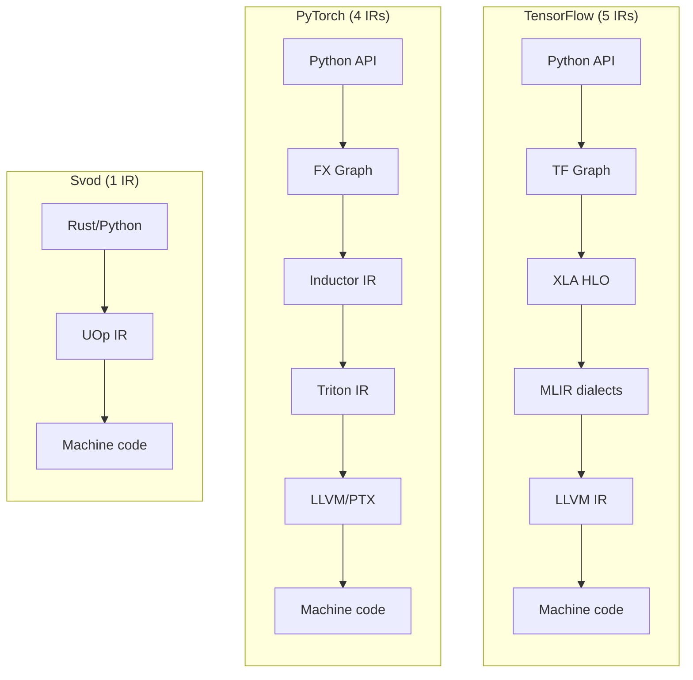
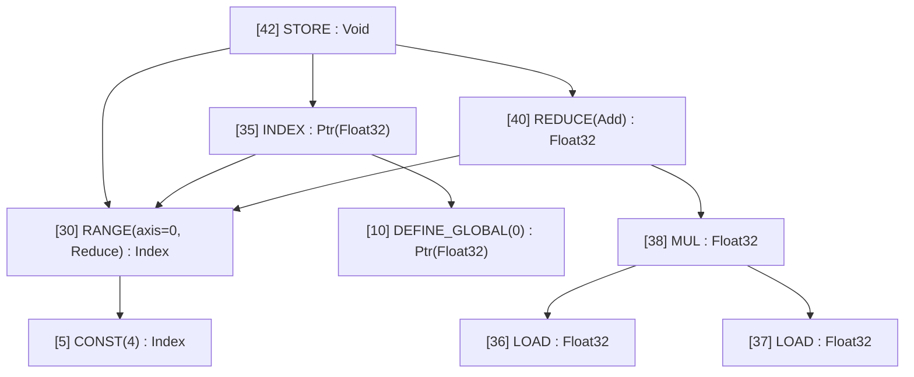
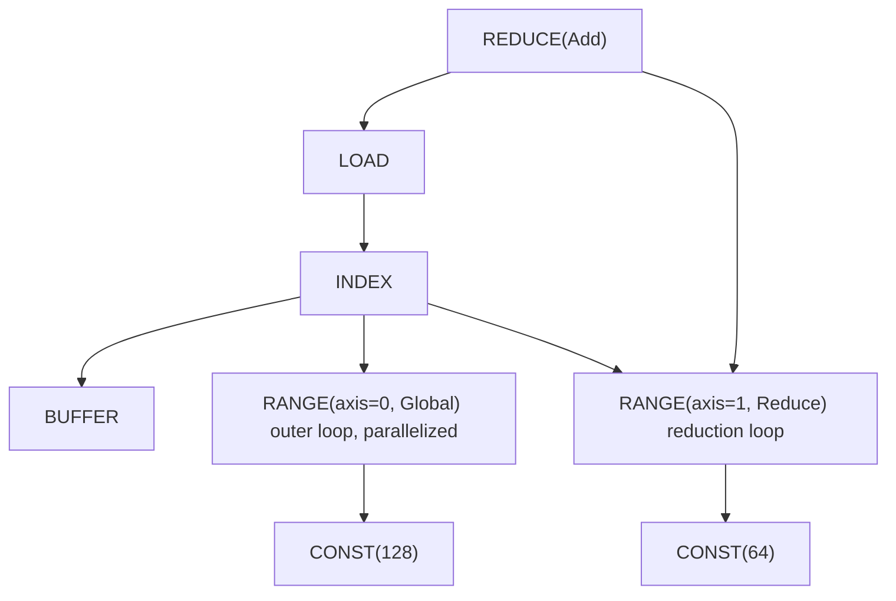
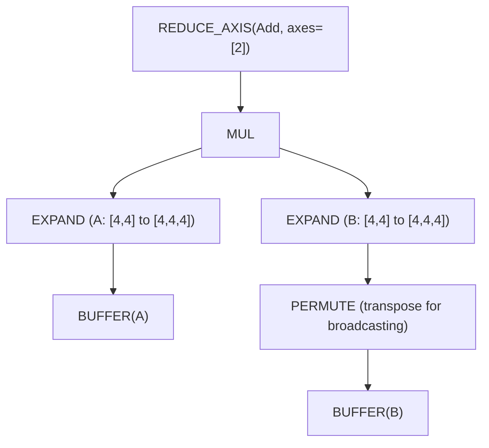
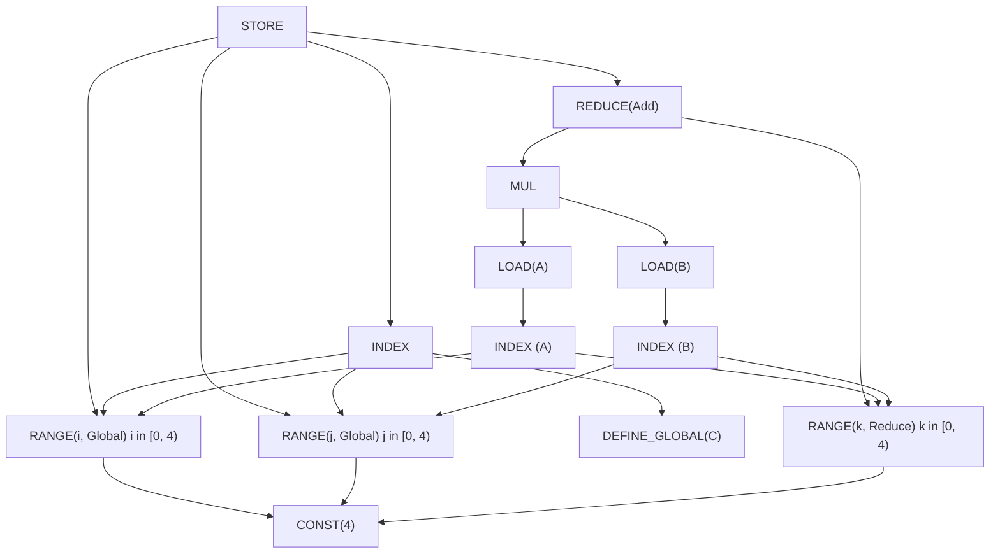

# One IR to Rule Them All

You're debugging a slow model. The profiler says "kernel X takes 200ms" but you have no idea what kernel X actually *does*. You trace through PyTorch's dispatcher, then ATen, then TorchInductor, then Triton IR, and finally land in LLVM IR. Five different representations, five different mental models, five different debugging tools.

This is the reality of modern ML compilation. TensorFlow's XLA has a similar story: Python → Graph → XLA HLO → MLIR → LLVM IR. Each layer was added to solve a real problem, but the accumulated complexity is staggering.

Svod takes a different approach, borrowed from [Tinygrad](https://github.com/tinygrad/tinygrad): **one IR from tensors to machine code**.



The simplest architecture often wins. This chapter explains how one carefully designed IR can replace an entire compiler stack.

---

## UOp: The Universal Node

A **UOp** (micro-operation) is a node in a computation graph. But unlike nodes in other IRs, a UOp can represent operations at *any* abstraction level—from high-level tensor reshapes down to individual CPU instructions.

Here's the key insight: instead of having separate IRs for "tensor operations" and "loop structures" and "memory accesses", we put them all in one enum:

```rust
pub enum Op {
    // High-level tensor operations
    Reshape { src: Arc<UOp>, new_shape: Arc<UOp> },
    Permute { src: Arc<UOp>, axes: Vec<usize> },
    ReduceAxis { src: Arc<UOp>, reduce_op: ReduceOp, axes: Vec<usize> },

    // Loop-level control flow
    Range { end: Arc<UOp>, axis_id: AxisId, axis_type: AxisType, deps: SmallVec<[Arc<UOp>; 2]> },
    End { computation: Arc<UOp>, ranges: SmallVec<[Arc<UOp>; 4]> },

    // Memory operations
    Load { buffer: Arc<UOp>, index: Arc<UOp>, alt: Option<Arc<UOp>> },
    Store { index: Arc<UOp>, value: Arc<UOp>, ranges: SmallVec<[Arc<UOp>; 4]> },

    // ALU operations (grouped enums with many individual values)
    Binary(BinaryOp, Arc<UOp>, Arc<UOp>),  // Add, Mul, etc.
    Unary(UnaryOp, Arc<UOp>),              // Sqrt, Exp, etc.
    Ternary(TernaryOp, Arc<UOp>, Arc<UOp>, Arc<UOp>),  // Where, MulAcc, etc.
}
```

The enum has ~60 Op variants organized by abstraction level (~80+ including individual UnaryOp/BinaryOp/TernaryOp values):

| Category | Examples | What It Represents |
|----------|----------|-------------------|
| **Movement** | `RESHAPE`, `PERMUTE`, `EXPAND`, `PAD` | Tensor shape transformations |
| **Reduction** | `REDUCE_AXIS`, `REDUCE` | Mathematical aggregations |
| **Control** | `RANGE`, `END`, `IF`, `BARRIER` | Loop and branch structure |
| **Memory** | `LOAD`, `STORE`, `INDEX`, `BUFFER` | Hardware memory access |
| **ALU** | `ADD`, `MUL`, `SQRT`, `EXP`, `WHERE` | CPU/GPU instructions |
| **Advanced** | `WMMA` | Tensor cores and their expansion metadata |

When you print a UOp graph, you see its tree structure:



Notice the arrows pointing to "(same RANGE as above)"? That's not just pretty-printing—it's a fundamental property called **hash consing**.

---

## Hash Consing: Structural Sharing

When you create the same expression twice in Svod, you get the *same pointer*. Not equal values—the same memory address.

```rust
let a = UOp::binary(Add, x.clone(), y.clone());
let b = UOp::binary(Add, x.clone(), y.clone());

assert!(Arc::ptr_eq(&a, &b));  // Same pointer!
```

:::note Origin is part of node identity
With `SVOD_ORIGIN=1` each node also carries the `OriginScope` it was built under, folded
into its content hash. Two identical subgraphs built under different scopes are then
*different* nodes and stay unshared until the kernel cut strips origins. Literals are the
exception, alongside `BUFFER`/`PARAM`/`UNIQUE`: two scopes build the same constant
independently, so an origin there would only split a node the cut merges back. See the
trade-off in [Profiling and benchmarking kernels](../tile-kernels/profiling.md#attributing-kernels-to-model-code).
:::

This works through a global lock-free cache (using the `papaya` crate with `Weak` references to avoid memory leaks). When constructing a UOp, we first check if an identical one exists:

```rust
pub fn new(op: Op, dtype: DType) -> Arc<Self> {
    let key = UOpKey::new(&op, dtype);

    // Check cache first
    if let Some(existing) = CACHE.get(&key) {
        return existing;
    }

    // Create new and cache it
    let uop = Arc::new(UOp { op, dtype, ... });
    CACHE.insert(key, uop.clone());
    uop
}
```

Why does this matter for ML engineers?

- **Pointer equality is semantic equality.** To check if two subexpressions are identical, just compare pointers: `Arc::ptr_eq(&a, &b)`. No tree traversal needed.

- **Pattern matching is O(1).** When the optimizer asks "have I seen this pattern before?", pointer comparison gives an instant answer.

- **Memory efficiency.** Common subexpressions (think: shared computations in attention, gradient graphs) are stored once, not duplicated.

- **Thread safety.** The same computation from different threads produces the same object—no synchronization bugs.

The tree printout shows this: when you see `[10] → (same as above)`, that's not a copy—it's the *same node* referenced from multiple places.

---

## Explicit Loops: The `RANGE` Operation

Most ML IRs hide loops inside operations. In ONNX, a reduction looks like:

```python
ReduceSum(data, axes=[1], keepdims=0)
```

Where's the loop? It's implicit—somewhere inside the runtime's implementation of `ReduceSum`. You can't see it, can't modify it, can't reason about it.

Svod makes loops *explicit* using `RANGE` operations. The same reduction becomes:



Each `RANGE` has an **AxisType** that tells the code generator how to compile it:

| AxisType | CPU | CUDA | Meaning |
|----------|-----|------|---------|
| **Loop** | `for` loop | `for` loop | Sequential iteration; rangeify default |
| **Global** | Thread pool | `blockIdx` | Outer parallel dimension |
| **Thread** | Thread pool | — | CPU parallelism |
| **Warp** | (N/A) | warp/wavefront | Sub-group parallelism |
| **Local** | (N/A) | `threadIdx` | Workgroup parallelism |
| **GroupReduce** | (N/A) | Shared memory | Two-stage reduction |
| **Upcast** | SIMD vector | Register tile | Vectorization |
| **Reduce** | Accumulator | Warp reduce | Reduction dimension |
| **Unroll** | Unrolled | Unrolled | Loop unrolling |

The AxisType hierarchy (Loop → Global/Thread → Warp → Local/GroupReduce → Upcast → Reduce → Unroll) maps to hardware execution models — outer loops have lower priority. A `RANGE` with `AxisType::Global` becomes `blockIdx.x` in CUDA. A `RANGE` with `AxisType::Local` becomes `threadIdx.x`.

Why explicit loops matter:

- **Optimization is visible.** You can *see* which loops will be parallelized, which will be unrolled, which will use SIMD.

- **Scheduling is graph rewriting.** Changing loop order, tiling, or unrolling is just a pattern transformation—no special "scheduling pass".

- **Same IR at every stage.** The `RANGE` that represents "iterate over batch dimension" at the tensor level is the *same* `RANGE` that becomes `for (int i = 0; i < N; i++)` in generated code.

---

## Graph Rewriting: One Transformation Mechanism

Traditional compilers have dozens of specialized passes: constant folding, dead code elimination, loop unrolling, operator fusion. Each pass has custom logic, custom data structures, custom bugs.

Svod uses one mechanism: **pattern-based graph rewriting**.

```rust
patterns! {
    // Identity folding: x + 0 → x
    Add[x, @zero] => x,

    // Constant folding: 3 + 4 → 7
    Add(a @const(a_val), _b @const(b_val))
        => eval_add(a_val, b_val).map(|r| UOp::const_(a.dtype(), r)),

    // Self-folding: x / x → 1
    Idiv(x, x) => UOp::one(x.dtype()),

    // Dead code: if(true) { x } else { y } → x
    Where(Const(ConstValue::Bool(true)), t, _f) => t,
}
```

The DSL is expressive:

- **`[x, y]` — commutative.** Try both orderings (for `ADD`, `MUL`, etc.)
- **`(x, y)` — ordered.** Match exactly this order.
- **`@zero`, `@one` — semantic constants.** Works for any dtype.
- **`c @const(val)` — extract value.** For compile-time computation.
- **`x, x` — same operand.** Detects pointer equality.
- **`=>` — rewrite.** Returns `Arc<UOp>`, `Option<Arc<UOp>>` (`None` declines) or `RewriteResult`.

The rewrite engine applies patterns bottom-up until no more matches:

```text
Original:       Add(Mul(x, 1), 0)
After Mul:      Add(x, 0)         # Mul(x, 1) → x
After Add:      x                 # Add(x, 0) → x
```

This single mechanism handles:

- **Algebraic simplification** — constant folding, identity removal
- **Rangeify transformation** — movement ops → explicit loops
- **Kernel optimization** — vectorization, unrolling, tensor cores
- **Code generation** — lowering to hardware primitives

Same patterns, same engine, different pattern sets for each stage.

---

## Worked Example: Matmul Journey

Let's trace `C = A @ B` (a 4×4 matrix multiply) through the entire pipeline.

### Stage 1: Tensor Construction

When you write `A.matmul(&B)`, Svod builds a high-level UOp graph:



This is pure math: "expand A and B to align dimensions, multiply elementwise, sum along the contracted axis."

### Stage 2: Rangeify

The rangeify pass converts movement ops (`EXPAND`, `PERMUTE`) into explicit index computations with `RANGE` loops:



Now we see the loop structure: `i` and `j` are `Global` (parallelized), `k` is `Reduce` (accumulated).

### Stage 3: Symbolic Simplification

Pattern rewrites clean up redundant operations, fold constants, and simplify index arithmetic.

### Stage 4: Code Generation

The final IR translates directly to loops:

```c
// GPU kernel (conceptual)
__global__ void matmul(float* C, float* A, float* B) {
    int i = blockIdx.x;   // from RANGE(i, Global)
    int j = blockIdx.y;   // from RANGE(j, Global)
    float acc = 0.0f;
    for (int k = 0; k < 4; k++) {  // from RANGE(k, Reduce)
        acc += A[i*4 + k] * B[k*4 + j];
    }
    C[i*4 + j] = acc;
}
```

The key observation: **structure is visible at every stage**. There's no magic fusion pass that turns three nested loops into something unrecognizable. The `RANGE` structure you see in Stage 2 is exactly what becomes loops in Stage 4.

---

## Comparison: How Other IRs Differ

Different IRs make different tradeoffs. Here's how they stack up:

| Aspect | ONNX | XLA HLO | Triton | **Svod** |
|--------|------|---------|--------|-----------|
| **Purpose** | Model interchange | Backend optimization | GPU kernel DSL | Full compilation |
| **Operators** | ~200 high-level | ~100–150 high-level | Tile operations | ~80 multi-level |
| **Loop model** | Implicit | Implicit | Tile-based | **Explicit `RANGE`** |
| **Memory** | Pure values | Pure values → buffers | Explicit pointers | **Explicit `LOAD`/`STORE`** |
| **Optimization** | None | Specialized passes | MLIR patterns | **Unified rewriting** |
| **Targets** | Runtime engines | CPU/GPU/TPU | GPU only | CPU/GPU |

**ONNX** maximizes portability. Operations like `Conv` and `MatMul` hide all implementation details. Great for model exchange, but you can't optimize what you can't see.

**XLA HLO** is functional and pure—no side effects, immutable tensors. This enables algebraic optimization but requires a separate "buffer assignment" phase before code generation. The transition from HLO to LMHLO (buffer-based) is a fundamental boundary.

**Triton** exposes more than ONNX but less than Svod. You write "tile-level" code—operations on blocks of data—and the compiler handles thread-level details. Explicit memory (`tl.load`, `tl.store`) but implicit parallelization within tiles.

**Svod** exposes everything: loops are explicit (`RANGE`), memory is explicit (`LOAD`/`STORE`), parallelization is explicit (`AxisType`). This means more to learn, but nothing is hidden.

---

## Why This Matters: Practical Benefits

Svod's transparent IR has practical benefits for ML engineers:

**Debugging is direct.** Print the graph at any stage:

```rust
println!("{}", tensor.uop().tree());
```

You'll see exactly what operations exist, how they connect, and where the computation happens. No "kernel X" mysteries.

**Performance tuning is informed.** See which loops are parallelized:

```text
[RANGE(batch, Global)]    # parallelized across GPU blocks
[RANGE(channel, Local)]   # parallelized within blocks
[RANGE(pixel, Loop)]      # sequential — might be slow!
```

If something should be parallel but isn't, you can see it.

**The mental model is simple.** There's one IR, one transformation mechanism, one set of operations. You don't need to learn XLA HLO *and* MLIR *and* Triton *and* LLVM. Just UOps.

**Optimization is composable.** Want a custom rewrite? Add a pattern:

```rust
patterns! {
    // Your custom optimization
    MyPattern(x, y) => better_version(x, y),
}
```

It works with the same engine as constant folding, fusion, and everything else.

---

## The Deeper Insight

Svod/Tinygrad proves that compiler complexity is often *accidental*, not essential. The multi-layer IR stacks in TensorFlow and PyTorch accumulated organically—each layer solved a real problem, but the combined system is harder to understand than any individual part.

One well-designed IR, one transformation mechanism, and principled composition can replace thousands of lines of specialized passes. It's the Unix philosophy applied to compilers: do one thing well, and compose.

The cost is explicitness—you see loops, memory accesses, and parallelization hints that other IRs hide. But visibility is a feature, not a bug. When your model is slow, you want to see *why*, not hope the compiler figures it out.

That's the bet Svod makes: transparent complexity beats hidden complexity.
