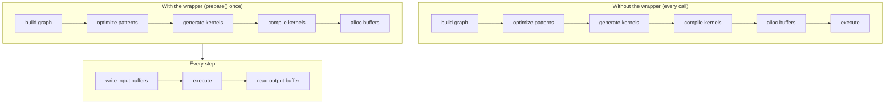

# JIT Graphs

A streaming ASR pipeline calls the same encoder hundreds of times. Building
the tensor graph, optimizing it, generating kernel source, compiling it through
the backend's [JIT loader](../backends/jit-loader.md), and allocating device buffers on
every call wastes work that does not depend on the input.

The `jit_wrapper!` macro and the `model::jit` runtime layer turn that
build-once / run-many pattern into **a typed Rust struct**. You declare the
inputs and the graph; the macro generates a wrapper that compiles the graph
once during `prepare()` and replays it on every `execute()` with the device
buffers held in place.



The wrapper composes with the [pattern engine](./optimizations/pattern-system.md)
(which runs at `prepare()` time) and the [JIT loader](../backends/jit-loader.md) (which
turns the optimized kernels into in-memory machine code). This page covers the
wrapper layer that sits above both.

---

## The `jit_wrapper!` DSL

A wrapper declaration names the struct, the model type the build closure
receives, the inputs the wrapper exposes, optional symbolic shape variables,
and a `build` block that constructs the graph:

```rust
jit_wrapper! {
    MyModelJit(MyModel) {
        input1: Tensor,
        input2: Tensor,

        vars {
            b: (1, max_batch),
            t: (1, max_time),
        }

        build(input1, input2, b, t) {
            model.forward(input1, input2, &b, &t)
        }
    }
}
```

| Section | Meaning | Required |
|---|---|---|
| `WrapperName(ModelType) { ... }` | name of the generated struct and the type of the model the build closure receives | yes |
| `input_name: Tensor` lines | one per input the wrapper exposes; the `: Tensor` annotation is informational | optional (usually one or more) |
| `vars { name: (min, max), ... }` | symbolic shape variables with compile-time bounds | optional |
| `outputs { name, ... }` | one named buffer accessor per output; the `build` closure then returns a tuple of that many tensors, in this order | optional |
| `build(args...) { ... }` | closure that builds the output tensor from inputs and vars; `model` is in scope | yes |

The `build` arguments must each name either an input or a declared var (the
macro rejects names that don't match at expansion time). Inside the block,
each input is a `&Tensor` (the macro allocates a zero-initialized placeholder
when `prepare()` runs), each var is a `svod_tensor::BoundVariable` already
bound to its upper bound — pass it on as `&name` — and `model` is a shared
reference to the wrapper's owned model value. The closure returns
`Result<Tensor, E>` for any `E: std::error::Error + Send + Sync + 'static`;
failures surface as `JitError::Build`.

Without an `outputs` block the closure returns a single `Tensor`, reachable
through `output()`. With one, it returns a tuple of exactly that many tensors
and each gets its own named `&Buffer` accessor, positioned by declaration
order. If the scheduler fused or elided one of them the positional accessors
would silently misalign, so `prepare()` fails with
`JitError::OutputCountMismatch` instead.

---

## Symbolic variables

A `vars { ... }` block declares values that participate in the graph as shape
or index expressions but whose exact value is supplied at execute time. They
let one prepared plan serve a range of input shapes without recompiling.

Each entry `name: (min, max)` generates three configuration setters on the
wrapper:

| Setter | Effect |
|---|---|
| `with_<name>_bound(max)` | override only the upper bound; panics if `max < min` |
| `with_<name>_min_bound(min)` | override only the lower bound; panics if `min > max` |
| `with_<name>_fixed(value)` | pin both bounds to `value`, turning the var into a JIT-time constant; panics on `value == 0` |

All three return `Self` (builder style) and must be called before `prepare()`
because the build closure captures the bounds when it runs.

A wider range generates a more general kernel that has to handle every shape
in the range; a tighter range lets the optimizer specialize. Pin a var with
`with_<name>_fixed` when the value never changes, and shrink the upper bound
when an outer caller advertises a smaller maximum than the model's hard
ceiling.

At execute time, pass actual values through `execute_with_vars`:

```rust
jit.execute_with_vars(&[("b", batch as i64), ("t", time as i64)])?;
```

Each pair binds one var; vars not listed keep whatever they hold — their
`prepare()`-time upper bound, or the value a previous `execute_with_vars` left
them at. Bindings are sticky, not per-call. A value outside the var's declared
`[min, max]` is an out-of-bounds access rather than an error: buffers are
allocated to `max`.

---

## Generated runtime API

The macro emits one method group per phase of the wrapper's life cycle:

| Method | Phase | Notes |
|---|---|---|
| `new(model)` | construction | takes the model by value; no kernels compiled yet |
| `with_<var>_bound` / `with_<var>_min_bound` / `with_<var>_fixed` | between `new` and `prepare` | configure shape envelope |
| `prepare(input1: InputSpec, ...)` | one-time | build graph, run patterns, compile kernels, allocate buffers; reads `PrepareConfig::from_env()` |
| `prepare_with_config(..., &PrepareConfig)` | one-time | same as `prepare` with an explicit config |
| `<input>_mut() -> Result<&mut Buffer>` | per step | typed accessor for each declared input |
| `output() -> Result<&Buffer>` | per step | output of the prepared graph |
| `execute() -> Result<()>` | per step | replay with current input buffers |
| `execute_with_vars(&[(name, value)]) -> Result<()>` | per step | replay and rebind one or more symbolic variables |
| `execute_profiled` / `execute_with_vars_profiled` | optional | same as the non-profiled variants but return `Vec<KernelProfile>` |
| `execute_profiled_static()` | optional | one profiled run through `ExecutionPlan::profile`, returning the last stage's kernels |
| `copy_output_to_<input>(out_pos, dst_off, src_off, len)` | per step | on-device copy of an output region back into an input buffer; no host round-trip |
| `replicate() -> Result<Self>` | optional | deep-copy a prepared JIT for concurrent execution: forked buffers, shared model and kernels, its own queue |

Four lower-level accessors expose plan details for tooling:

| Accessor | Returns |
|---|---|
| `buffers()` | every buffer the plan owns |
| `output_buffers()` | the plan's declared output buffers |
| `input_buffer_ids()` | device buffer ids the wrapper writes to |
| `prepared_kernels()` | the compiled kernels |

Most callers do not need these. Calling any per-step method before `prepare()`
returns `JitError::NotPrepared`.

---

## `InputSpec`

`prepare()` takes one `InputSpec` per declared input:

```rust
pub struct InputSpec {
    pub shape: Vec<usize>,
    pub dtype: DType,
    /// Allocate the input device-local (no host mapping).
    pub device_local: bool,
}

impl InputSpec {
    pub fn new(shape: &[usize], dtype: DType) -> Self { ... }
    pub fn f32(shape: &[usize]) -> Self { ... }
    pub fn i32(shape: &[usize]) -> Self { ... }
    pub fn i64(shape: &[usize]) -> Self { ... }
    pub fn device_local(mut self) -> Self { ... }
}
```

The macro uses the shape and dtype to allocate a zero-initialized placeholder
tensor before invoking the build closure. Callers do not construct
`Tensor::zeros(...).realize()` placeholders themselves. The shape becomes the
maximum input size; symbolic variables shrink it at execute time through
operations like `try_shrink` — a coding pattern, not a runtime contract
enforced by the wrapper. `device_local()` drops the host mapping for inputs the
host only writes through `copyin` or refills on-device — recurrent state the
host never needs to observe per step.

---

## Recurrent execution

Recurrent models reuse a host-side LSTM state across calls. The wrapper for
that pattern is `JitRecurrent<J>`. It takes a `jit_wrapper!`-generated JIT
that also implements the `RecurrentJit` trait, plus an initial `LstmState`
and the head length in `f32` elements:

```rust
pub struct LstmState {
    pub h: Vec<f32>,
    pub c: Vec<f32>,
}

pub trait RecurrentJit {
    fn pack_state(&mut self, state: &LstmState) -> Result<()>;
    fn execute_step(&mut self) -> Result<()>;
    fn output_buffer(&self) -> Result<&Buffer>;
}
```

:::tip[Output layout contract]
The JIT's output buffer must be a flat `f32` block of `[head | h_flat | c_flat]`
along the last axis, where `h_flat` and `c_flat` each have length
`state.h.len()` and `state.c.len()` respectively. `JitRecurrent::new` checks
the output buffer's size once at construction against the declared head plus
state size, and returns `JitError::OutputLayoutMismatch`
if the math does not match. This catches build-closure drift at construction
time rather than letting a silent mis-split corrupt downstream values.
:::

Each call to `step(|jit| pack_inputs(jit))` runs one recurrent iteration:

1. The closure writes per-step non-state inputs (audio chunk, token id,
   encoder frame, ...) through the JIT's typed `*_mut` accessors.
2. `RecurrentJit::pack_state` copies the current host state into the JIT's
   state input buffers.
3. `execute_step` replays the plan.
4. The wrapper splits the output buffer into head, new `h`, new `c`, updates
   the host state in place, and returns the head slice as `&[f32]`.

`reset()` zeros the host state without touching the JIT, ready for a new
sequence. `last_timing` exposes the most recent per-step `pack` / `exec` /
`read` durations for profiling.

---

## Example: GigaAM encoder

The GigaAM Conformer encoder is prepared at constant shape. The batch and
mel-frame bounds are computed once at construction and baked into the plan;
shorter chunks are zero-padded into the same buffers:

```rust
jit_wrapper! {
    GigaAmEncoderJit(GigaAm) {
        mel: Tensor,
        lengths: Tensor,

        build(mel, lengths) {
            let out = model.encoder.forward_batch(mel, lengths)?;
            // Permute [B, d_model, T_sub] → [B, T_sub, d_model] on-device: the
            // RN-T decoder consumes frame-major rows, and doing it here turns
            // a host-side strided transpose into one contiguous copyout.
            out.cast(svod_dtype::DType::Float32).context(TensorSnafu)?
                .try_permute(&[0, 2, 1]).context(TensorSnafu)
        }
    }
}
```

The wrapper takes a mel-spectrogram input and a per-batch length vector and
produces `[B, T_sub, d_model]`. `GigaAmTranscriber` sizes the plan once: the
mel length is rounded up to the next power of two so codegen sees a clean
factorisation and clamped to `config.max_mel_frames`, and the batch is capped so
the live SDPA score tiles stay inside `max_scores_mib`. Every chunk then
replays the same plan through `execute()`.

The `out.cast(DType::Float32)` is the fp32 boundary between the
encoder and any downstream head. The encoder may run in fp16 or bf16 for
speed, but every consumer (CTC log-softmax, RN-T predictor and joint) sees a
uniform fp32 input. Placing the cast inside the JIT lets it fuse into the
encoder's tail kernels.

---

## Example: Silero VAD

Silero V5 is a recurrent network, but its recurrence is far too small to pay
for a launch per window. The JIT therefore covers only the batched conv
front-end plus the LSTM input projection; the scan itself stays on the host:

```rust
jit_wrapper! {
    SileroVadFeatureJit(SileroVad) {
        chunks: Tensor,

        build(chunks) {
            // [FEATURE_BATCH, CHUNK_LEN] -> [FEATURE_BATCH, 4*HIDDEN] LSTM gate
            // pre-activations (conv features + input projection, biases folded).
            model.forward_gates(chunks)
        }
    }
}
```

The leading dimension is a fixed `FEATURE_BATCH` (4096) rather than a var: the
front-end is row-independent, so a partial batch simply fills fewer rows, and a
symbolic leading dim trips the reflect-pad lowering. Preparation asks for a
device-local output, because the 8 MiB gate readback belongs on the copy engine
rather than the host mapping:

```rust
let mut jit = SileroVadFeatureJit::new(vad);
let mut config = svod_tensor::PrepareConfig::from_env();
config.device_local_outputs = true;
jit.prepare_with_config(InputSpec::f32(&[FEATURE_BATCH, CHUNK_LEN]), &config)?;
```

`VadInference::probs` then walks the waveform in `FEATURE_BATCH`-sized
dispatches — pack `chunks_mut()`, `execute()`, `copyout_prefix` the valid rows
— and hands the gates to `VadHead::scan`, an 8-lane `f32x8` LSTM plus sigmoid
head on the host. That split replaced a one-tiny-dispatch-per-window path whose
round-trip latency dominated the whole model.

---

## Data-independence contract

The wrapper compiles the graph once and replays it many times. That only
works if the graph topology is fixed at `prepare()` time. Anything that can
change at execute time has to flow through input buffers (via `*_mut`) or
symbolic vars (via `execute_with_vars`). A branch on a tensor value inside
the build closure specializes the graph to that branch; this is a build-time
decision, not a runtime one.

:::note[Pitfalls]
- A `Tensor::full(value).realize()` inside the build closure bakes that value
  into the single prepared plan. Any per-call variation requires re-running
  `prepare()` from scratch — full graph build plus kernel compile. Host-side
  scratch buffers (for example `ndarray::Array3`) are the right choice for
  per-step setup that the JIT does not need to see.
- The idiomatic way to handle dynamic shape inside the JIT is `try_shrink`
  on a maximum-sized input with a var-bound length, paired with
  `execute_with_vars` at the call site. ResNet and YOLO both shrink the batch
  dimension this way.
:::

Violating the contract produces one of two failure modes: wrong results,
because the cached plan replays with a stale assumption about a value that
turned out to vary; or silent slowness, because every call ends up in a
recompile path. Diagnose these by re-reading the build closure; kernel output
rarely helps.

---

## Errors

`JitError` covers the runtime failures the wrapper can raise. Most are
unrecoverable and indicate a usage bug rather than a transient condition.

| Variant | Triggered by |
|---|---|
| `NotPrepared` | per-step method called before `prepare`, or output buffer unavailable |
| `InputBufferNotFound` | input index resolution failed inside the prepared plan |
| `DuplicateInputBuffer` | two declared inputs map to the same device buffer at `prepare` time |
| `InputAliased` | an input resolved to a foreign plan buffer — a concurrent `prepare` corrupted its graph identity |
| `Build` | the build closure returned `Err`; the inner error is preserved as `Box<dyn Error + Send + Sync>` |
| `Tensor` | tensor op failed during `prepare` or in the build closure |
| `Device` | a device or buffer operation failed |
| `OutputLayoutMismatch` | `JitRecurrent::new` saw an output element count different from the declared head plus state size |
| `OutputCountMismatch` | a multi-output wrapper declared N outputs but the compiled plan kept a different number |
| `Runtime` | kernel execution failed |

Configuration mistakes on the symbolic-variable setters (`with_<var>_*`)
panic at the call site instead of returning an error, since they happen
before any plan exists.

---

## Why this matters

**Lifecycle is explicit.** `prepare` is the only way into the prepared state,
and every per-step accessor goes through it. The wrapper holds the plan behind
an `Option`, so calling out of order fails immediately with
`JitError::NotPrepared` rather than reading a half-built plan.

**Replay is cheap.** One graph build, one kernel compile, one set of
allocations — paid once. Every subsequent call is buffer writes plus an
`execute`.

**Contract is local.** The data-independence rule is the single invariant
that lets the wrapper skip the per-call dance safely. Every other guarantee
follows from it.

**Errors are explicit.** Runtime failures surface as `JitError` variants;
only configuration-time misuse on the variable setters still panics.

The wrapper does not invent new primitives. It takes the build / prepare /
execute cycle and gives it a shape that the type system can hold, so
streaming inference runs at the speed of one-shot evaluation without the
per-call overhead.
