# Op Bestiary: A Field Guide to UOp Operations

When debugging Svod IR dumps, you'll encounter operations that aren't obvious from their names. This chapter documents non-trivial operations with signatures, field explanations, and examples.

**What's covered:** Operations that require explanation—loop control, reductions, memory operations, kernel structure, vectorization, tensor cores.

**What's NOT covered:** Trivial ALU operations (`Add`, `Mul`, `Sqrt`, etc.) that work exactly as you'd expect.

---

## Loop Control: RANGE and END

### RANGE — Loop Scope Opener

```rust
Range {
    end: Arc<UOp>,           // loop bound (exclusive)
    axis_id: AxisId,         // identifier for deduplication
    axis_type: AxisType,     // scheduling behavior
    deps: SmallVec<[Arc<UOp>; 2]>,  // range dependencies
}
```

**Fields:**

| Field | Type | Purpose |
|-------|------|---------|
| `end` | `Arc<UOp>` | Upper bound (exclusive), typically a `CONST` |
| `axis_id` | `AxisId` | `Unrenumbered(n)` before kernel splitting, `Renumbered(n)` after |
| `axis_type` | `AxisType` | Determines how the loop is scheduled (see below) |
| `deps` | `SmallVec<[Arc<UOp>; 2]>` | Other ranges this range depends on |

**AxisType Hierarchy:**

| Type | Priority | GPU Mapping | Purpose |
|------|----------|-------------|---------|
| `Placeholder` | -3 | — | Transient canonical range used during RESHAPE caching |
| `Loop` | -1 | `for` loop | Default range produced by rangeify; schedule-level wrappers paired with `END(Call)` |
| `Global` | 0 | `blockIdx` | Grid parallelism |
| `Thread` | 0 | thread pool | CPU parallelism |
| `Warp` | 1 | warp/wavefront | Sub-group parallelism |
| `Local` | 2 | `threadIdx` | Workgroup parallelism |
| `GroupReduce` | 2 | shared memory | Two-stage reduction |
| `Upcast` | 3 | SIMD | Vectorization |
| `Reduce` | 4 | accumulator | Reduction dimension |
| `Unroll` | 5 | unrolled | Loop unrolling |

Priority determines loop nesting order — lower values are outer loops.
Kernel-boundary framing is structural via `Call`/`Function`, not a dedicated
axis type.

**Example:**
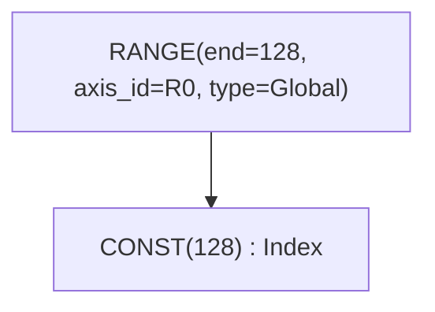

### END — Loop Scope Closer

```rust
End {
    computation: Arc<UOp>,              // value computed inside loop
    ranges: SmallVec<[Arc<UOp>; 4]>,    // ranges being closed
}
```

END closes one or more RANGE scopes and removes them from the active set. Multiple ranges can be closed simultaneously.

**Example:**
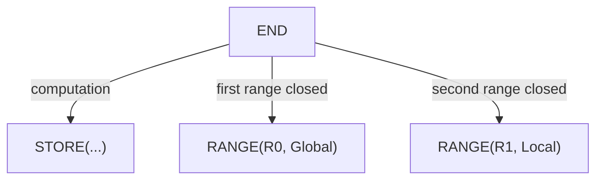

---

## Reduction: REDUCE vs REDUCE_AXIS

Two operations with similar names serve different purposes.

### REDUCE_AXIS — Tensor Dimension Reduction (High-Level)

```rust
ReduceAxis {
    src: Arc<UOp>,           // input tensor
    reduce_op: ReduceOp,     // Add, Mul, Max, Min
    axes: Vec<usize>,        // axes to reduce
}
```

Used **before** rangeify. Operates on tensor dimensions like NumPy's `.sum(axis=0)`.

**Example:**
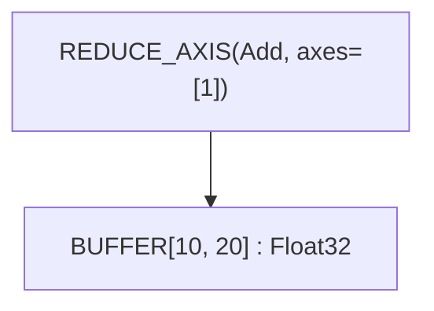

This reduces a `[10, 20]` tensor to `[10]` by summing along axis 1.

### REDUCE — Range Iteration Reduction (Low-Level)

```rust
Reduce {
    src: Arc<UOp>,                      // value to accumulate
    ranges: SmallVec<[Arc<UOp>; 4]>,    // ranges being reduced
    reduce_op: ReduceOp,                // Add, Mul, Max, Min
}
```

Used **after** rangeify. Accumulates values across RANGE iterations and closes the specified ranges.

**ReduceOp Variants:**

| Op | Identity | Operation | Tinygrad |
|----|----------|-----------|----------|
| `Add` | 0 | `acc + value` | ✓ |
| `Mul` | 1 | `acc * value` | ✓ |
| `Max` | -∞ | `max(acc, value)` | ✓ |
| `Min` | +∞ | `min(acc, value)` | Svod-only |

> **Compatibility:** Tinygrad's spec restricts REDUCE_AXIS to `{Add, Mul, Max}`. Svod extends this with `Min`.

**Example:**
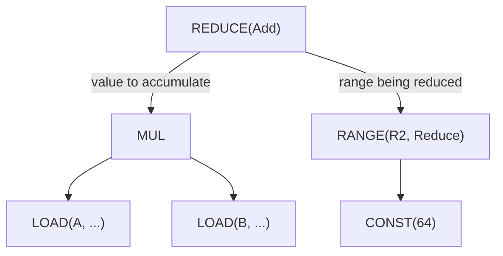

### ALLREDUCE — Cross-Device Reduction

```rust
AllReduce {
    src: Arc<UOp>,           // local partial result
    device: Arc<UOp>,        // device specification
    reduce_op: ReduceOp,     // reduction operation
}
```

Performs distributed reduction across multiple devices. Used for multi-GPU training.

---

## Buffer Operations

### BUFFER — Buffer Declaration

```rust
Buffer {
    unique: Arc<UOp>,        // UNIQUE op for identity
    device: Arc<UOp>,        // DEVICE op
    size: usize,             // total element count
}
```

Declares a buffer for tensor storage. The `unique` field ensures distinct buffers even with identical size/device.

### BUFFERIZE — Materialization Marker

```rust
Bufferize {
    compute: Arc<UOp>,                  // computation to materialize
    ranges: SmallVec<[Arc<UOp>; 4]>,    // output dimensions
    opts: BufferizeOpts,                // address space, device
}
```

Marks where computation should materialize to memory. Triggers kernel splitting.

**BufferizeOpts:**

| Field | Type | Purpose |
|-------|------|---------|
| `device` | `Option<DeviceSpec>` | Target device, `None` for local |
| `addrspace` | `AddrSpace` | `Global` (device) or `Local` (shared) |
| `removable` | `bool` | When `false`, `buffer_removal` is forbidden from inlining this BUFFERIZE — used at multi-consumer realize boundaries to keep the buffer fixed across mega-pass fixpoint iterations |

**Example:**
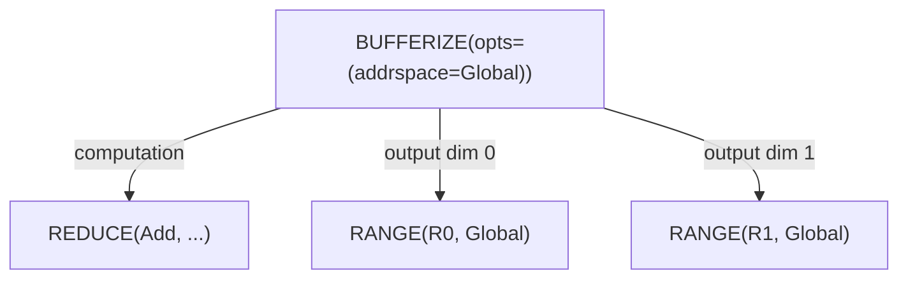

### INDEX — Multi-Dimensional Buffer Access

```rust
Index {
    buffer: Arc<UOp>,                   // BUFFER or PARAM
    indices: SmallVec<[Arc<UOp>; 4]>,   // index per dimension
    gate: Option<Arc<UOp>>,             // optional predicate
}
```

Computes memory address from multi-dimensional indices. Returns element dtype (not pointer).

**Example:**
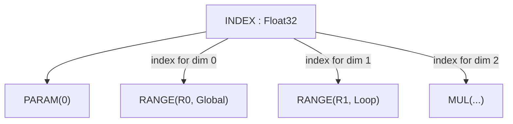

### POINTER_INDEX — Low-Level Pointer Arithmetic

```rust
PointerIndex {
    ptr: Arc<UOp>,           // base pointer
    offset: Arc<UOp>,        // byte offset
}
```

Direct pointer arithmetic. Used after linearization when indices are flattened.

> **Compatibility:** Tinygrad uses `INDEX` with a `ptr=True` flag instead of a separate operation.

### LOAD — Memory Read

```rust
Load {
    buffer: Arc<UOp>,        // buffer or pointer
    index: Arc<UOp>,         // INDEX op
    alt: Option<Arc<UOp>>,   // alternative value for gated loads
}
```

Read value from buffer at index. For gated loads, the `alt` field provides a value when the INDEX's `gate` is false (avoids the memory access entirely).

**Example:**
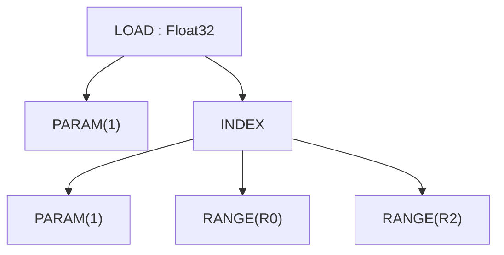

### STORE — Memory Write

```rust
Store {
    index: Arc<UOp>,                    // INDEX op (buffer accessed via index.src[0])
    value: Arc<UOp>,                    // value to write
    ranges: SmallVec<[Arc<UOp>; 4]>,    // ranges being closed
}
```

Write value to buffer. The buffer is accessed through the INDEX node (via `index.src[0]`), not a separate field. STORE closes the specified ranges, which represent output iteration dimensions. UPCAST and UNROLL remain range axis classifications during expansion.

For gated stores, use an INDEX with a gate (INDEX has an optional `gate` field).

> **Compatibility:** Svod's STORE has no separate `buffer` field—sources are: index=0, value=1, ranges=2+ (range_start=2). Tinygrad's layout is similar.

**Example:**
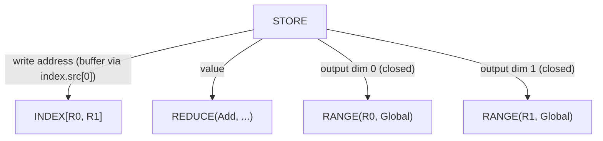

---

## Kernel Structure & Callable IR

Schedule-level work is expressed as a callable IR mirroring tinygrad's
`CALL`/`FUNCTION`/`PROGRAM` model: a `Function` defines a body (typically a
`Sink` of stores) parametrized by arguments, a `Call` invokes it with concrete
arguments, and a `Program` carries the body through the strict
`SINK → LINEAR → SOURCE → BINARY` compilation staging.

### CALL — Invoke a Function Body

```rust
Call {
    body: Arc<UOp>,                     // FUNCTION (or its body)
    args: SmallVec<[Arc<UOp>; 4]>,      // concrete argument values
    info: CallInfo,                     // annotations (name, origin, ...)
}
```

Invokes a callable body with arguments. Range-ending: closes any `Range`
operations in `args` (range_start_index = 1; `body=0`, `args=1+`).

`CallInfo` carries cache-key-safe annotations:

| Field | Type | Purpose |
|-------|------|---------|
| `name` | `Option<String>` | Human-readable callable name |
| `grad_tag` | `Option<String>` | Reserved for gradient-callback identity |
| `origin` | `Option<OriginId>` | Origin of the stored value's root — what the kernel is charged to |
| `origins` | `OriginSet` | Every origin reachable in the body before it was stripped |
| `precompile` / `precompile_backward` | `bool` | Eager-compile hints |

The kernel CALL is where a dispatch keeps the attribution the profiler rollups read; see
[Profiling and benchmarking kernels](../tile-kernels/profiling.md).

### FUNCTION — Reusable Body

```rust
Function {
    body: Arc<UOp>,                     // computation
    args: SmallVec<[Arc<UOp>; 4]>,      // formal parameters
    info: CallInfo,
}
```

A reusable callable. Its dtype is always `Void`; bodies that return multiple
values are wrapped in a `Tuple` so the function boundary stays Void. Same
range-ending shape as `Call`.

### TUPLE / GET_TUPLE — Multi-Value Returns

```rust
Tuple { src: SmallVec<[Arc<UOp>; 4]> }
GetTuple { src: Arc<UOp>, index: usize }
```

`Tuple` packs heterogeneous values; its dtype is always `Void`. `GetTuple`
extracts element `index` from a `Tuple` (or from a `Function` whose body is a
`Tuple`); its dtype matches the inner element. Used to thread multiple
outputs through the otherwise-Void function boundary.

### PROGRAM — Compile-Pipeline Container

```rust
Program {
    sink: Arc<UOp>,                     // root SINK
    device: Arc<UOp>,                   // DEVICE
    linear: Option<Arc<UOp>>,           // LINEAR (after linearize)
    source: Option<Arc<UOp>>,           // SOURCE (after render)
    binary: Option<Arc<UOp>>,           // PROGRAM_BINARY (after compile)
}
```

Carries a kernel through the `SINK → LINEAR → SOURCE → PROGRAM_BINARY`
staging enforced by `codegen/src/program_pipeline.rs`
(`do_linearize`/`do_render`/`do_compile`/`get_program`). Each stage fills in
the next field. The C/LLVM renderers expect `Op::Linear` input and
surface `Error::InvalidGraph` via per-context `pending_error` rather than
panicking; multi-index `INDEX`s must be lowered with `pm_linearize_multi_index`
before render.

### LINEAR — Linearized Op Stream

```rust
Linear { ops: SmallVec<[Arc<UOp>; 8]> }
```

Flat sequence of ops produced by linearization. Consumers iterate `ops`
directly without re-walking the graph.

### SOURCE / PROGRAM_BINARY — Compilation Artifacts

```rust
Source { code: String }              // rendered source (C / LLVM-IR)
ProgramBinary { bytes: Vec<u8> }     // compiled artifact
```

Terminal stages of the program pipeline. Both are leaves (no children).

### SINK — Multiple Root Collector

```rust
Sink {
    sources: SmallVec<[Arc<UOp>; 4]>,
    info: Option<KernelInfo>,           // structural marker for kernel ASTs
}
```

Collects multiple outputs into a single root. A `Function`'s body is
typically a `Sink` of stores. The `info` field is a hash-consed structural
marker that distinguishes kernel-AST SINKs from otherwise-identical bare
SINKs without relying on type-erased side-channel metadata.

**Example:**
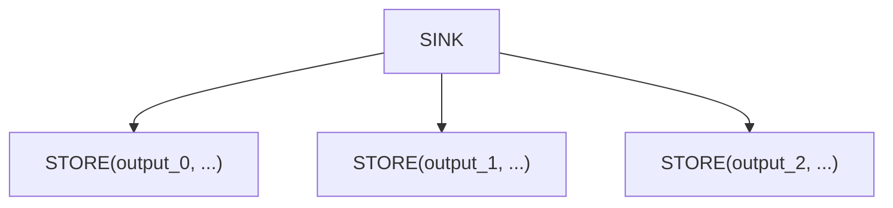

### AFTER — Dependency Marker

```rust
After {
    passthrough: Arc<UOp>,              // value that flows through
    deps: SmallVec<[Arc<UOp>; 4]>,      // operations that must complete
}
```

Expresses execution dependencies between kernels without data dependency. The `passthrough` value is returned unchanged, but only after all `deps` complete.

**Example:**
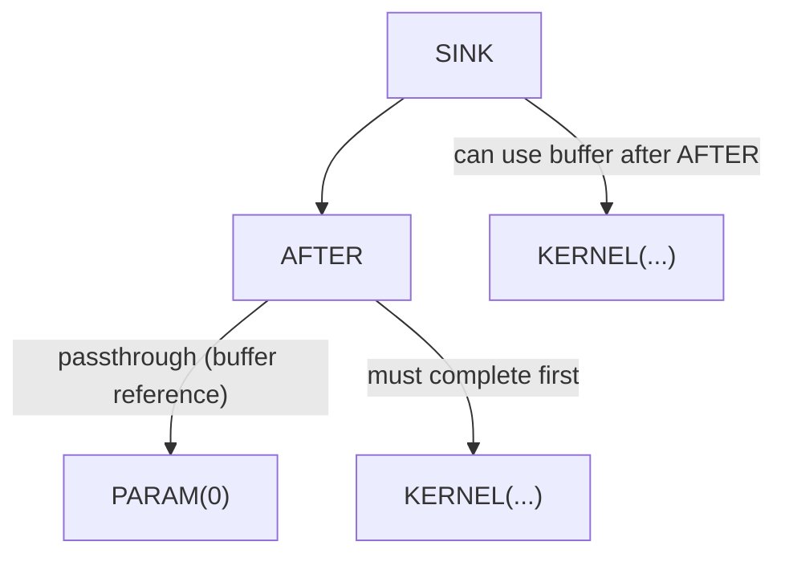

### BARRIER — Synchronization Fence

```rust
Barrier {
    src: Arc<UOp>,                      // value passing through
    deps: SmallVec<[Arc<UOp>; 4]>,      // operations to wait for
}
```

GPU workgroup synchronization. Ensures all threads in a workgroup reach the barrier before continuing.

---

## Vector Operations

### VECTORIZE — Create Vector from Scalars

```rust
Vectorize {
    elements: SmallVec<[Arc<UOp>; 4]>,
}
```

Combines N scalar values into a vector of size N. All elements must have the same base dtype.

**Example:**
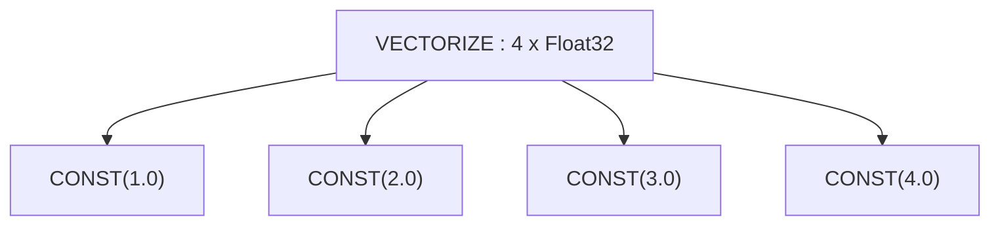

### GEP — Get Element Pointer (Vector Extract)

```rust
Gep {
    vector: Arc<UOp>,        // source vector
    indices: Vec<usize>,     // positions to extract
}
```

Extracts elements from a vector:
- Single index → scalar
- Multiple indices → smaller vector

**Example:**
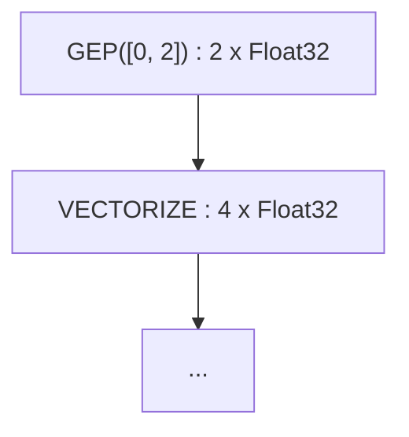

### VConst — Vector Constant

```rust
VConst {
    values: Vec<ConstValue>,
}
```

Vector of compile-time constants. More efficient than `VECTORIZE` of `CONST` nodes.

Lane aggregation uses `STACK`; lane and address selection use `INDEX`. Loop
unrolling is represented by `Range` with `AxisType::Unroll`, not a separate
operation. Tensor-core expansion axes live in `WmmaMetadata`.

---

## Tensor Cores: WMMA

### WMMA — Warp Matrix Multiply-Accumulate

```rust
Wmma {
    a: Arc<UOp>,             // matrix A fragment
    b: Arc<UOp>,             // matrix B fragment
    c: Arc<UOp>,             // accumulator C fragment
    metadata: WmmaMetadata,  // hardware configuration
}
```

Hardware tensor core operation: `D = A × B + C`. Requires specific matrix shapes and data layouts.

**WmmaMetadata Fields:**

| Field | Type | Purpose |
|-------|------|---------|
| `name` | `String` | Instruction name (e.g., `"__hmma..."`) |
| `dims` | `(N, M, K)` | Matrix dimensions (e.g., `(16, 16, 16)`) |
| `dtype_in` | `DType` | Input matrix precision (e.g., `Float16`) |
| `dtype_out` | `DType` | Output precision (e.g., `Float32`) |
| `device` | `RendererDevice` | Renderer / TC backend that produced this WMMA |
| `threads` | `usize` | Threads per warp (typically 32) |
| `upcast_axes` | `WmmaUpcastAxes` | Per-operand vectorization (fields: `a`, `b`, `c`) |
| `reduce_axes` | `Vec<(usize, usize)>` | Contraction axes |

**Example:**
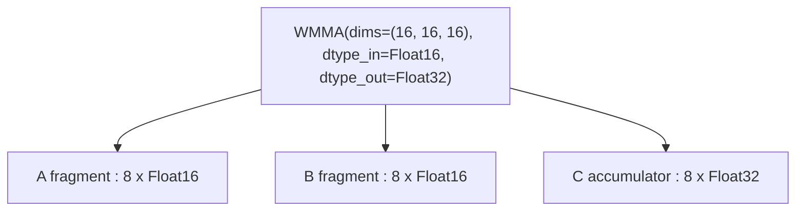

---

## Control Flow

### IF / ENDIF — Conditional Execution

```rust
If {
    condition: Arc<UOp>,                // boolean predicate
    body: SmallVec<[Arc<UOp>; 4]>,      // operations to execute
}

EndIf {
    if_op: Arc<UOp>,         // corresponding IF op
}
```

Execute body only when condition is true. Used for boundary checks and sparse operations.

**Example:**
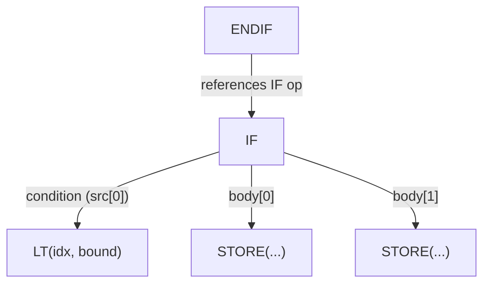

---

## Definition Operations

### PARAM — Buffer Parameter

```rust
Param { slot: usize, size: usize, device: Option<Arc<UOp>> }
```

Normalized buffer parameter — positional reference to an input/output buffer.
Created by pre-schedule normalization (BUFFER→PARAM) to erase buffer identity,
enabling structural deduplication of identical computations on different buffers.
`slot` is the position in the kernel argument list, `size` is element count.

### DEFINE_LOCAL — Shared Memory Allocation

```rust
DefineLocal(usize)           // local memory index
```

GPU shared memory (LDS) allocation. Visible within a workgroup.

### DEFINE_VAR — Symbolic Runtime Variable

```rust
DefineVar {
    name: String,            // variable name
    min_val: i64,            // minimum bound
    max_val: i64,            // maximum bound
}
```

Runtime variable with known bounds. Used for dynamic shapes where bounds are known.

**Example:**
```text
DEFINE_VAR(name="batch_size", min=1, max=128) : Index
```

### DEFINE_REG — Register Allocation

```rust
DefineReg {
    size: usize,             // register size
    id: usize,               // unique accumulator ID
}
```

Allocates a register for intermediate storage. The `id` field disambiguates registers of the same dtype—without it, two same-dtype reduces would share one DEFINE_REG via hash consing. Used in code generation.

### BIND — Variable Binding

```rust
Bind {
    var: Arc<UOp>,           // DEFINE_VAR
    value: Arc<UOp>,         // concrete value
}
```

Binds a symbolic variable to a concrete value at runtime.

---

## Special Operations

### SPECIAL — Hardware-Provided Values

```rust
Special {
    end: Arc<UOp>,           // upper bound for this dimension
    name: String,            // e.g., "blockIdx.x", "threadIdx.y"
}
```

Accesses hardware-provided values (thread/block indices). Not a loop—the hardware provides the value directly.

**Example:**
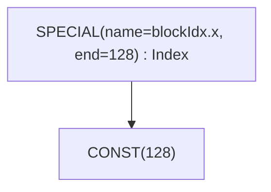

### UNIQUE / LUNIQUE — Identity Markers

```rust
Unique(usize)                // global identity counter
LUnique(usize)               // local-scope identity counter
```

Creates a unique identity for buffer disambiguation. Two buffers with
different `Unique` values are distinct even if otherwise identical. `LUnique`
provides the same disambiguation within a local scope (e.g. inside a
`Function` body) without colliding with the global counter, so callable
bodies can be hash-consed independently of where they're called from.

### DEVICE — Device Specification

```rust
Device(DeviceSpec)           // device specification
```

Specifies target device for computation.

---

## Movement Operations

High-level tensor shape transformations. These are converted to explicit INDEX operations during rangeify.

| Operation | Signature | Purpose |
|-----------|-----------|---------|
| `Reshape` | `{ src, new_shape }` | Change shape, same elements |
| `Permute` | `{ src, axes: Vec<usize> }` | Transpose/reorder axes |
| `Expand` | `{ src, new_shape }` | Broadcast to larger shape |
| `Pad` | `{ src, begin_pads, end_pads }` | Add padding |
| `Shrink` | `{ src, begins, ends }` | Extract sub-region |
| `Flip` | `{ src, axes: Vec<bool> }` | Reverse along axes |

**Example:** RESHAPE
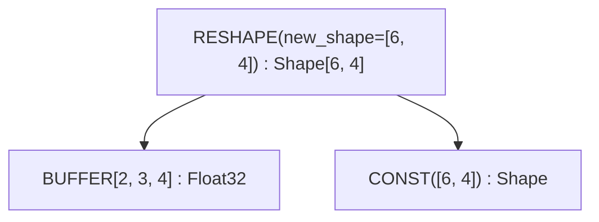

---

## Additional Operations

The following operations exist in the `Op` enum but are either internal or rarely encountered during debugging:

| Operation | Purpose |
|-----------|---------|
| `Copy` | Explicit copy of a value |
| `Slice` | `{ buffer, offset, size }` - contiguous typed slice metadata over a buffer |
| `MStack` | Memory stack allocation |
| `MSelect` | Memory select (conditional memory access) |
| `Multi` | Multi-output operation |
| `Group` | Group operations for scheduling |
| `Detach` | Detach from graph (prevent optimization through) |
| `Contiguous` | Hint that data is contiguous |
| `ContiguousBackward` | Backward pass for contiguous hint |
| `Precast` | Pre-cast for type conversion |
| `Custom` / `CustomI` | Inline custom operation extensibility (C only for `Custom`) |
| `CustomFunction` | Runtime custom-function hook (kinds: `EncDec`, `Graph`) |

---

## Quick Reference

### By Category

| Category | Operations |
|----------|------------|
| **Loop Control** | `RANGE`, `END` |
| **Reduction** | `REDUCE_AXIS`, `REDUCE`, `ALLREDUCE` |
| **Memory** | `BUFFER`, `SLICE`, `STAGE`, `INDEX`, `LOAD`, `STORE` |
| **Kernel & Callable** | `SINK`, `CALL`, `FUNCTION`, `TUPLE`, `GET_TUPLE`, `PROGRAM`, `LINEAR`, `SOURCE`, `PROGRAM_BINARY`, `AFTER`, `BARRIER` |
| **Vector** | `STACK`, `INDEX`, `VCONST` |
| **Expansion** | `RANGE` with `AxisType::Upcast` or `AxisType::Unroll` |
| **Hardware** | `WMMA`, `SPECIAL` |
| **Control** | `IF`, `ENDIF` |
| **Definition** | `PARAM`, `DEFINE_LOCAL`, `DEFINE_VAR`, `DEFINE_REG`, `BIND`, `UNIQUE`, `LUNIQUE`, `DEVICE` |
| **Movement** | `RESHAPE`, `PERMUTE`, `EXPAND`, `PAD`, `SHRINK`, `FLIP` |
| **ALU** | `Unary(...)`, `Binary(...)`, `Ternary(...)`, `Cast`, `BitCast` |

### Range-Ending Operations

Operations that close RANGE scopes (remove ranges from active set):

| Operation | Range Start Index |
|-----------|-------------------|
| `BUFFERIZE` | 1 (compute=0, ranges=1+) |
| `REDUCE` | 1 (src=0, ranges=1+) |
| `STORE` | 2 (index=0, value=1, ranges=2+) |
| `WMMA` | 3 (a=0, b=1, c=2) |
| `END` | 1 (computation=0, ranges=1+) |
| `CALL` / `FUNCTION` | 1 (body=0, args=1+) |

### Expandable Operations

Operations that propagate UNROLL through the computation graph:

- ALU: `Unary`, `Binary`, `Ternary`
- Type: `Cast`, `BitCast`
- Vector: `Gep`, `Vectorize`
- Memory: `Load`, `Store`, `Index`, `PointerIndex`
- Control: `Reduce`, `End`, `After`
- Buffer: `Bufferize`
- Hardware: `Wmma`
