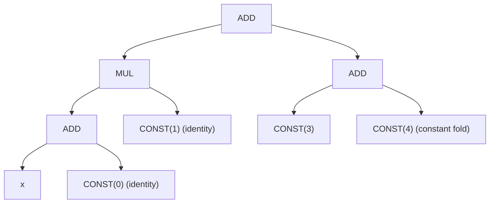
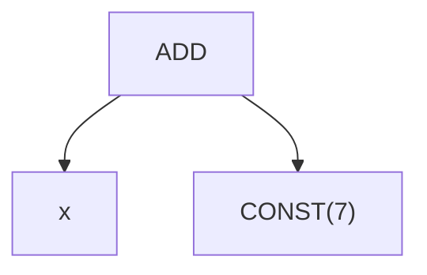

# Algebraic Simplification Patterns

Svod's symbolic simplifier rewrites UOp computation graphs using 140+ algebraic patterns defined in `schedule/src/symbolic/patterns.rs`. These patterns fire at multiple points in the pipeline:

| Where | Matcher | Context |
|-------|---------|---------|
| Pre-optimization | `symbolic()` | After rangeify + range splitting, before kernel optimization |
| Post-opt (Stage 8) | `symbolic()` | After optimization actions, before expansion |
| Post-index (Stage 16) | `symbolic()` | After index dtype lowering, final cleanup |
| Decomp+Render (Stage 18-19) | `symbolic_simple()` | Combined with late rewrites and render patterns |

`symbolic()` = `symbolic_simple()` + GEP pushing patterns. All stages except the final decomp+render pass run the full `symbolic()` set.

**Range analysis**: Each UOp tracks the minimum (`vmin`) and maximum (`vmax`) values it can take at runtime, computed eagerly during node construction from its inputs' bounds. Many patterns use these bounds to prove conditions at compile time (e.g., "x is always non-negative" or "x < n for all values").

**Notation**: `OP[a, b]` denotes a commutative pattern (both operand orderings tried). `OP(a, b)` is ordered. `@zero`/`@one`/`c @const(v)` match constant values. When the same variable name appears twice (e.g., `Idiv(x, x)`), both operands must be the same node (`Arc::ptr_eq` — i.e., structurally deduplicated via hash consing).

**Tinygrad reference**: `tinygrad/uop/symbolic.py`, `tinygrad/uop/divandmod.py`

---

## Worked Example: Optimization Cascade

A simple expression showing how patterns compose:

Before:



Steps:

```text
Step 1 (identity):    ADD(x, 0) -> x
Step 2 (identity):    MUL(x, 1) -> x
Step 3 (const fold):  ADD(3, 4) -> CONST(7)
Step 4 (result):      ADD(x, 7)
```

After:



The rewrite engine applies patterns bottom-up: children simplify first, then the parent re-matches. This enables multi-step cascades in a single traversal.

---

## Pattern Ordering

The `symbolic_simple()` matcher composes pattern groups in a specific order. Within a group, patterns are tried sequentially until one matches. Groups are concatenated with the `+` operator:

```text
propagate_invalid          -- MUST be first (before x*0=0)
fold_invalid_load_store
constant_folding_dsl_patterns
vconst_folding_patterns
identity_and_zero_patterns
commutative_canonicalization
self_folding_dsl_patterns
zero_folding_dsl_patterns
division_dsl_patterns
cast_dsl_patterns
cast_where_dsl_patterns
term_combining_dsl_patterns
alu_folding_dsl_patterns
advanced_division_dsl_patterns
div_mod_recombine_dsl_patterns
comparison_dsl_patterns
boolean_dsl_patterns
minmax_dsl_patterns
where_bound_patterns
power_dsl_patterns
negation_dsl_patterns
range_based_mod_div_patterns
dce_dsl_patterns
dead_loop_patterns
after_simplification_patterns
pm_move_where_on_load       -- WHERE->INDEX embedding for masked loads
```

---

## 1. Constant Folding

Evaluates operations on compile-time constants using dtype-aware arithmetic. Results respect type boundaries (e.g., Int32 wraps at 32 bits).

**Tinygrad**: `symbolic.py:40-118`

### Scalar Constants

| Category | Ops | Pattern |
|----------|-----|---------|
| Unary (7) | Neg, Sqrt, Exp2, Log2, Sin, Reciprocal, Trunc | `op(CONST(c))` -> `CONST(eval(op, c))` |
| Binary (13) | Add, Mul, Sub, Mod, Max, Pow, Idiv, Fdiv, And, Or, Xor, Shl, Shr | `op(CONST(a), CONST(b))` -> `CONST(eval(op, a, b))` |
| Ternary (2) | Where, MulAcc | `op(CONST(a), CONST(b), CONST(c))` -> `CONST(eval(op, a, b, c))` |

### Vector Constants

| Pattern | Result |
|---------|--------|
| `op(VCONST(a), VCONST(b))` | `VCONST(eval(op, a, b))` element-wise |
| `op(CONST(a), VCONST(b))` | `VCONST(eval(op, broadcast(a), b))` |
| `op(VCONST(a), CONST(b))` | `VCONST(eval(op, a, broadcast(b)))` |
| `unary_op(VCONST(v))` | `VCONST(eval(op, v))` element-wise |

VConst folding covers 11 binary ops (excludes Pow and Fdiv) and all 7 unary ops.

---

## 2. Identity and Zero Propagation

| Pattern | Result | Notes |
|---------|--------|-------|
| `ADD[x, 0]` | `x` | Commutative |
| `MUL[x, 1]` | `x` | Commutative |
| `OR[x, 0]` | `x` | Commutative |
| `XOR[x, 0]` | `x` | Commutative |
| `SUB(x, 0)` | `x` | Ordered |
| `IDIV(x, 1)` | `x` | Ordered |
| `FDIV(x, 1)` | `x` | Ordered |
| `MOD(x, 1)` | `0` | Anything mod 1 is zero |
| `Floor/Ceil/Trunc/Round(x)` | `x` | Only when `x` is integer (rounding is no-op) |
| `MUL[x, 0]` | `0` | Only when NOT float |
| `AND[_, 0]` | `0` | Commutative |

:::caution IEEE 754: MUL by zero
`MUL[x, 0]` is **not** simplified for floats because IEEE 754 requires:
- `NaN * 0 = NaN`
- `Inf * 0 = NaN`

The guard `!x.dtype().is_float()` prevents this optimization for floating-point types.
:::

---

## 3. Self-Folding

Patterns where the same operand appears on both sides. Uses `Arc::ptr_eq` checks (hash consing guarantees structurally equal subexpressions share the same pointer).

| Pattern | Result | Notes |
|---------|--------|-------|
| `IDIV(x, x)` | `1` | |
| `IDIV(x, -1)` | `NEG(x)` | Constant check on RHS |
| `MOD(MOD(x, y), y)` | `MOD(x, y)` | Idempotent mod |
| `AND(x, x)` | `x` | |
| `OR(x, x)` | `x` | |

---

## 4. Zero Folding

| Pattern | Result | Notes |
|---------|--------|-------|
| `MOD(x, x)` | `0` | |
| `LT(x, x)` | `false` | NOT for floats (NaN < NaN is false, but guard needed for soundness) |
| `NE(x, x)` | `false` | Only ints -- `NaN != NaN` is `true` in IEEE 754 |

---

## 5. Division Simplification

| Pattern | Result | Notes |
|---------|--------|-------|
| `FDIV(0.0, 0.0)` | `NaN` | IEEE 754 indeterminate form |
| `FDIV(MUL[_, 0], 0)` | `NaN` | Any zero-expression / zero |
| `FDIV(x, x)` | `1.0` | Float self-division |
| `FDIV(MUL(x, y), y)` | `x` | Cancellation (float) |
| `IDIV(MUL(x, y), y)` | `x` | Cancellation (integer) |

:::caution Pattern priority
`FDIV(0, 0) -> NaN` must come before `FDIV(x, x) -> 1` in the matcher to take priority. The ordering within `division_dsl_patterns()` ensures this.
:::

---

## 6. Cast Optimization

| Pattern | Result | Notes |
|---------|--------|-------|
| `CAST(CONST(c), dtype)` | `CONST(c.cast(dtype))` | Compile-time cast folding |
| `CAST(x, dtype)` | `x` | When `x.dtype() == dtype` (noop) |
| `CAST(CAST(x, a), b)` | `x` | When `x.dtype() == b` and `a` preserves all values of `b` |
| `CAST(CAST(x, a), b)` | `CAST(x, b)` | When `a` doesn't narrow `x` (widening chain) |
| `CAST(WHERE(s, a, b), dtype)` | `WHERE(s, CAST(a, dtype), CAST(b, dtype))` | Push cast through branches |

The `can_safe_cast(to, from)` function determines whether an intermediate type can hold all values. It checks bit widths, signedness, and float/int categories.

:::caution Truncation kills round-trips
`CAST(CAST(x, i8), i64)` is NOT collapsed to `x` when `x` is `i64`. The intermediate `i8` truncates values -- `can_safe_cast(i64, i8)` returns `false` because `i8` cannot hold all `i64` values.

Safe example: `CAST(CAST(x, i32), bool)` -> `CAST(x, bool)` when `x` is `bool`, because `i32` can represent both `true` and `false`.
:::

---

## 7. Term Combining

| Pattern | Result |
|---------|--------|
| `ADD(x, x)` | `MUL(2, x)` |
| `ADD(MUL(c1, x), MUL(c2, x))` | `MUL(c1+c2, x)` |
| `ADD(MUL(x, c1), MUL(x, c2))` | `MUL(x, c1+c2)` |

Both ordered variants are matched (constant on left or right of MUL).

---

## 8. ALU Chain Folding

Folds constants in associative operation chains and pushes constants outward for canonical form.

### Constant Folding

| Pattern | Result | Notes |
|---------|--------|-------|
| `ADD[ADD[x, c1], c2]` | `ADD(x, c1+c2)` | Commutative outer Add |
| `MUL[MUL[x, c1], c2]` | `MUL(x, c1*c2)` | Commutative outer Mul |
| `ADD[SUB(x, c1), c2]` | `ADD(x, c2-c1)` or `SUB(x, c1-c2)` | Sign-normalized |
| `SUB(ADD(x, c1), c2)` | `ADD(x, c1-c2)` or `SUB(x, c2-c1)` | Sign-normalized |
| `SUB(SUB(x, c1), c2)` | `SUB(x, c1+c2)` | |

### Constant Pushing

| Pattern | Result | Notes |
|---------|--------|-------|
| `ADD[ADD[x, c], y]` | `ADD(ADD(x, y), c)` | Pushes constant outward; `y` must not be const |

Constant pushing is essential for index extraction. It ensures constants bubble to the outermost level, enabling downstream patterns (like div-mod simplification) to see clean `variable + offset` forms.

### Sub Canonicalization

| Pattern | Result | Notes |
|---------|--------|-------|
| `SUB(a, SUB(b, x))` | `ADD(x, SUB(a, b))` | Exposes inner variable |

Svod keeps `SUB` as a first-class IR op (unlike Tinygrad which canonicalizes `a-b` to `ADD(a, NEG(b))`). This pattern ensures nested `SUB`s don't block further simplification.

---

## 9. Boolean Logic

| Pattern | Result | Notes |
|---------|--------|-------|
| `NOT(NOT(x))` | `x` | Double negation elimination |
| `XOR(x, x)` | `0` | Self-cancellation |
| `OR[x, NOT(x)]` | `true` | Tautology (bool only) |
| `AND[x, NOT(x)]` | `false` | Contradiction (bool only) |
| `OR[true, x]` | `true` | Absorbing element |
| `AND[false, x]` | `false` | Absorbing element |
| `AND[true, x]` | `x` | Identity |
| `OR[false, x]` | `x` | Identity |
| `AND[NOT(x), NOT(y)]` | `NOT(OR(x, y))` | De Morgan |
| `OR[NOT(x), NOT(y)]` | `NOT(AND(x, y))` | De Morgan |

All patterns using `[]` are commutative (both operand orderings are tried).

---

## 10. Comparison Simplification

### Self-Comparison (non-float, ptr_eq)

| Op | Result |
|----|--------|
| `LT(x, x)`, `GT(x, x)`, `NE(x, x)` | `false` |
| `LE(x, x)`, `GE(x, x)`, `EQ(x, x)` | `true` |

:::caution Float self-comparison
Self-comparison patterns are guarded by `!x.dtype().is_float()`. For floats, `NaN != NaN` is `true` and `NaN == NaN` is `false`, so these identities do not hold.
:::

### Constant and Range-Based

| Pattern | Result | Notes |
|---------|--------|-------|
| `op(CONST(a), CONST(b))` | `CONST(eval(op, a, b))` | Direct constant fold |
| `op(x, y)` when bounds prove it | `true` or `false` | `ComparisonAnalyzer` uses vmin/vmax |

The `ComparisonAnalyzer` checks: if `x.vmax < y.vmin` then `LT(x, y)` is provably `true`.

### Algebraic Transforms

| Pattern | Result | Notes |
|---------|--------|-------|
| `LT(ADD[c0, x], c1)` | `LT(x, c1-c0)` | Offset elimination |
| `LT(NEG(x), NEG(y))` | `LT(y, x)` | Negation flip |
| `LT(IDIV(x, d), c)` | `LT(x, c*d)` | Lift division (d > 0) |

The division lifting for `LT(x//d, c)` handles both positive and non-positive `c`:
- `c > 0`: equivalent to `x < c*d`
- `c <= 0`: equivalent to `x < c*d - (d-1)`

---

## 11. Min/Max Elimination

| Pattern | Result | Notes |
|---------|--------|-------|
| `MAX(x, x)` | `x` | Self-max is identity |
| `MAX(x, y)` | `x` | When `x.vmin >= y.vmax` (bounds prove dominance) |
| `MAX(x, y)` | `y` | When `y.vmin >= x.vmax` |

Uses `VminVmaxProperty` for range analysis. No separate `MIN` patterns -- Svod lowers `MIN(a,b)` to `NEG(MAX(NEG(a), NEG(b)))` before these patterns fire.

---

## 12. WHERE Optimization

### Condition Elimination

| Pattern | Result | Notes |
|---------|--------|-------|
| `WHERE(cond, t, f)` | `t` | When `cond.vmin == cond.vmax == true` |
| `WHERE(cond, t, f)` | `f` | When `cond.vmin == cond.vmax == false` |
| `WHERE(LT(x, c), t, f)` | `t` | When `x.vmax < c.vmin` (always true) |
| `WHERE(LT(x, c), t, f)` | `f` | When `x.vmin >= c.vmax` (always false) |

### Branch Simplification

| Pattern | Result | Notes |
|---------|--------|-------|
| `WHERE(_, t, t)` | `t` | Same branches |
| `WHERE(x, true, false)` | `x` | Bool identity |
| `WHERE(x, false, true)` | `NOT(x)` | Bool negation |
| `WHERE(NOT(cond), t, f)` | `WHERE(cond, f, t)` | Condition flip |
| `WHERE(a, WHERE(b, c, d), d)` | `WHERE(AND(a, b), c, d)` | Branch merging (ptr_eq on `d`) |

:::caution Invalid guard on condition flip
`WHERE(NOT(cond), t, f) -> WHERE(cond, f, t)` is **not** applied when `f` contains `Invalid`. Padding creates `WHERE(valid, idx, Invalid)` structures, and swapping would move `Invalid` to the true branch where downstream patterns cannot match it. Both scalar `Invalid` and vectorized `VECTORIZE(Invalid, ...)` are checked.

Tinygrad has the same guard: `symbolic.py:201-202`.
:::

---

## 13. Invalid Propagation

Invalid is Svod's sentinel for out-of-bounds tensor regions created by padding operations. These patterns must run **before** identity patterns like `x*0=0`, otherwise validity markers are destroyed.

### Pattern Priority Example

```text
Without ordering:  MUL(0, WHERE(cond, x, Invalid)) -> 0    (x*0=0 fires, loses Invalid)
With ordering:     MUL(0, WHERE(cond, x, Invalid))
                 -> WHERE(cond, MUL(0, x), Invalid)         (Invalid propagation fires first)
                 -> WHERE(cond, 0, Invalid)                  (then x*0=0 is safe)
```

### WHERE-Invalid Merging

| Pattern | Result |
|---------|--------|
| `WHERE(c1, WHERE(c2, x, Inv), Inv)` | `WHERE(AND(c1, c2), x, Inv)` |
| `WHERE(c1, WHERE(c2, x, Inv), y)` | `WHERE(AND(c1, c2), x, y)` |

Multi-dimensional padding creates nested WHERE-Invalid after propagation through linearized index arithmetic. Merging to a single level ensures `pm_lower_index_dtype` can consume it in one step.

### Push Operations Through WHERE-Invalid

| Pattern | Result | Ops |
|---------|--------|-----|
| `CAST(WHERE(c, x, Inv))` | `WHERE(c, CAST(x), Inv)` | |
| `op(WHERE(c, x, Inv), y)` | `WHERE(c, op(x, y), Inv)` | 13 binary ops (non-comparison) |
| `op(y, WHERE(c, x, Inv))` | `WHERE(c, op(y, x), Inv)` | 13 binary ops (non-comparison) |
| `cmp(WHERE(c, x, Inv), y)` | `cmp(x, y)` | Lt, Le, Eq, Ne, Gt, Ge |
| `cmp(y, WHERE(c, x, Inv))` | `cmp(y, x)` | Lt, Le, Eq, Ne, Gt, Ge |

For comparisons, WHERE-Invalid is stripped -- the Invalid region is already gated downstream.

### Bare Invalid Propagation

| Pattern | Result | Guard |
|---------|--------|-------|
| `op(Invalid, y)` | `Invalid` | `y.dtype() == DType::Index`, left position only |

Tinygrad alignment: `symbolic.py:37`. Right-position bare Invalid is NOT propagated to avoid contaminating non-index computations.

### Dead Loads/Stores from Invalid Indices

| Pattern | Result |
|---------|--------|
| `LOAD(INDEX(buf, Invalid))` | `CONST(0)` |
| `LOAD(CAST(INDEX(buf, Invalid)))` | `CONST(0)` |
| `STORE(INDEX(buf, Invalid), val)` | `NOOP` |
| `STORE(CAST(INDEX(buf, Invalid)), val)` | `NOOP` |

---

## 14. Dead Code Elimination

### Dead Ranges

| Pattern | Result | Notes |
|---------|--------|-------|
| `RANGE(end)` where `vmax < 0` | `CONST(0)` | Empty range (never executes) |
| `RANGE(CONST)` where `vmin == vmax` | `CONST(vmin)` | Trivial range (single value) |
| `END(computation, ranges)` | `END(computation, live_ranges)` | Filter dead ranges from END |
| `END(computation, [])` | `computation` | All ranges dead -- unwrap |

### Dead Reduces

| Reduce Op | Identity Element |
|-----------|-----------------|
| Add | `0` |
| Mul | `1` |
| Max | `-inf` (dtype minimum) |
| Min | `+inf` (dtype maximum) |

When ALL ranges of a REDUCE are dead (empty), the REDUCE is replaced by its identity element.

### Dependency Simplification

| Pattern | Result |
|---------|--------|
| `AFTER(x, [])` | `x` |

No dependencies means no ordering constraint.

---

## 15. Power and Negation

| Pattern | Result |
|---------|--------|
| `POW(x, 0)` | `1` |
| `POW(x, 1)` | `x` |
| `NEG(NEG(x))` | `x` |

---

## 16. GEP Pushing

GEP (Get Element Pointer) extracts elements from vectors. These patterns push GEP through other operations to reach the vector source, enabling scalar simplification after devectorization.

Only included in `symbolic()` (Stage 4), not `symbolic_simple()` (Stages 8, 16).

### Composition and Extraction

| Pattern | Result | Notes |
|---------|--------|-------|
| `GEP(GEP(x, inner), outer)` | `GEP(x, inner[outer])` | Compose nested |
| `GEP(VECTORIZE(x,x,x,x), [i])` | `x` | Through broadcast (all ptr_eq) |
| `GEP(VECTORIZE(elems), [i])` | `elems[i]` | Through VECTORIZE |
| `GEP(scalar, [i])` | `scalar` | Scalar identity (vcount == 1) |
| `GEP(VCONST(vals), [i])` | `CONST(vals[i])` | Through VConst |
| `GEP(x, [0,1,...,n-1])` | `x` | Identity removal |

### Pushing Through Operations

| Pattern | Result | Guard |
|---------|--------|-------|
| `GEP(op(a, b), idx)` | `op(GEP(a, idx), GEP(b, idx))` | Binary, Index dtype only |
| `GEP(unary(x), idx)` | `unary(GEP(x, idx))` | Unary, Index dtype only |
| `GEP(WHERE(c, t, f), idx)` | `WHERE(GEP(c, idx), GEP(t, idx), GEP(f, idx))` | Index dtype only |
| `GEP(MULACC(a, b, c), idx)` | `MULACC(GEP(a, idx), GEP(b, idx), GEP(c, idx))` | Index dtype only |

:::caution Index dtype guard prevents graph explosion
GEP pushing through ALU ops is restricted to `Index` dtype (Tinygrad: `symbolic.py:167`). Without this guard, combining GEP pushing with `no_vectorized_alu` causes exponential graph blowup on high-dimensional kernels.
:::

### Pushing Through Structural Ops

| Pattern | Result |
|---------|--------|
| `INDEX(STACK([a, b]), 1)` | `b` |
| `GEP(CAST(x, dtype), idx)` | `CAST(GEP(x, idx), scalar_dtype)` |
| `GEP(BITCAST(x, dtype), idx)` | `BITCAST(GEP(x, idx), scalar_dtype)` |
| `GEP(WMMA(a, b, c), idx)` | `WMMA(GEP(a, ...), GEP(b, ...), GEP(c, ...))` |
| `GEP(void_node, _)` | `void_node` |

The WMMA pattern maps tile indices through upcast axes to extract corresponding input subgroups.

### Re-collection

| Pattern | Result |
|---------|--------|
| `VECTORIZE(GEP(x,[0]), GEP(x,[1]), ..., GEP(x,[N-1]))` | `GEP(x, [0,1,...,N-1])` |

This collapses VECTORIZE structures created by `no_vectorized_alu` back into a single GEP, which the identity pattern then removes.

---

## 17. WHERE on LOAD (Stage 8 only)

**Function**: `pm_move_where_on_load()`

Transforms masked loads by embedding the condition into the INDEX operation:

```text
Before:  WHERE(cond, INDEX(buf, idx), 0)
After:   INDEX(buf, WHERE(combined_cond, idx, Invalid))
```

This enables hardware predication for masked loads and eliminates WHERE overhead.

### How It Works

1. **Split** condition into AND clauses
2. **Partition** clauses into moveable vs. remaining:
   - Moveable: all RANGE dependencies within INDEX scope, no external INDEX dependencies
   - Remaining: everything else
3. **Embed** moveable clauses as `WHERE(cond, idx, Invalid)` in `indices[0]`
4. **Wrap** in outer WHERE if remaining clauses exist

Supports partial clause movement -- only clauses whose ranges are within the index scope are moved. Existing validity clauses in `indices[0]` are deduplicated.

The inverted pattern `WHERE(cond, 0, INDEX(buf, idx))` is also handled by negating the condition.

---

## 18. Commutative Canonicalization

For commutative binary ops on Index dtype, operands are sorted by UOp id (smaller id on left):

| Ops | Guard |
|-----|-------|
| Add, Mul, Max, Eq, Ne, And, Or, Xor | `dtype == DType::Index && b.id < a.id` |

Without this, mathematically equivalent expressions like `R1*8000 + R2*16` and `R2*16 + R1*8000` would not be deduplicated by hash consing, breaking grouping in `expand_vector_index`.

Only applied to Index dtype to avoid breaking vector math merging. Tinygrad: `symbolic.py:178-182`.

---

## 19. Div-Mod Simplification

### Range-Based Fast Paths

| Pattern | Result | Condition |
|---------|--------|-----------|
| `MOD(x, n)` | `x` | `0 <= vmin(x)` and `vmax(x) < n` |
| `IDIV(x, n)` | `k` | All values in range divide to same `k` |
| `MOD(ADD[MUL[a, m], b], n)` | `MOD(b, n)` | `m == n` (factor out multiples) |
| `IDIV(ADD[MUL[a, m], b], n)` | `a + IDIV(b, n)` | `m == n` |
| `IDIV(ADD[MUL[a, m], b], n)` | `a` | `m == n` and `0 <= b < n` |

### Unified Div-Mod Engine (`fold_divmod_general`)

For IDIV and MOD on Index dtype, a unified engine tries simplification rules in priority order. Based on Tinygrad's `fold_divmod_general` (`divandmod.py:8-93`).

| Priority | Rule | Description |
|----------|------|-------------|
| 1 | cancel_divmod | Range lies in single denominator interval |
| 2 | remove_nested_mod | `(a%4 + b)%2 -> (a+b)%2` when `2 | 4` |
| 3 | fold_binary_numerator | Single term with range of 2 |
| 4 | fold_divmod_congruence | Factor congruence modular arithmetic |
| 5 | gcd_with_remainder | Factor out common GCD from numerator |
| 6 | divide_by_gcd | Variable denominator GCD factoring |
| 7 | factor_remainder | `(d*x+y)//d -> x + y//d` (last resort) |

### Div-Mod Recombination

Patterns that recombine separated div and mod operations back into the original expression:

| Pattern | Result | Guard |
|---------|--------|-------|
| `ADD[MOD(x, n), MUL[IDIV(x, n), n]]` | `x` | ptr_eq on x, n |
| `ADD[MOD(IDIV(x, a), c), MUL[IDIV(x, b), c]]` | `IDIV(x, a)` | `a * c == b` |
| `ADD[MUL[MOD(x, c1), c2], MUL[IDIV(x, c1), c3]]` | `MUL(x, c2)` | `c1 * c2 == c3` |
| `ADD[ADD[y, MOD(x, n)], MUL[IDIV(x, n), n]]` | `ADD(y, x)` | ptr_eq on x, n |
| `IDIV(ADD[IDIV(a, c1), c2], c3)` | `IDIV(ADD(a, c1*c2), c1*c3)` | Nested division |

### Advanced Division

| Pattern | Result | Notes |
|---------|--------|-------|
| `IDIV(IDIV(a, b), c)` | `IDIV(a, b*c)` | Compose nested division |
| `IDIV(expr, d)` | `expr.divides(d)` | Generic exact division |
| `IDIV(ADD(a, b), c)` | `IDIV(a, c) + IDIV(b, c)` | When both divide evenly |
| `IDIV(SUB(a, b), c)` | `IDIV(a, c) - IDIV(b, c)` | When both divide evenly |
| `MUL(c, ADD(a, b))` | `ADD(MUL(c, a), MUL(c, b))` | Distribute multiplication |

---

## Cross-References

- [Execution Pipeline](../pipeline.md) -- stages where these patterns run
- [Pattern Engine](./pattern-system) — how the pattern matching engine works
- [Rangeify](../codegen/rangeify.md) -- Stage 4 context (patterns run after movement op lowering)
- [Expander](../codegen/expander.md) -- Stage 8 context (patterns run after optimization actions)
- [Linearizer](../codegen/linearizer.md) -- Stage 16 context (final cleanup)
