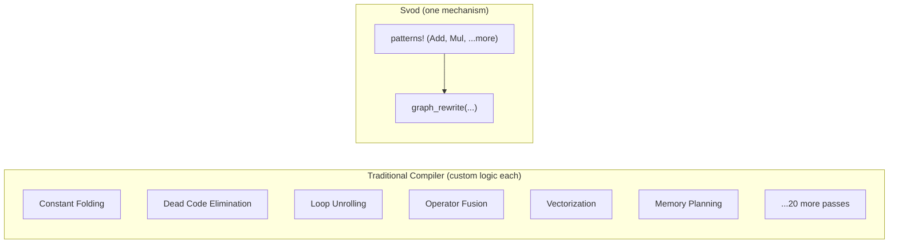
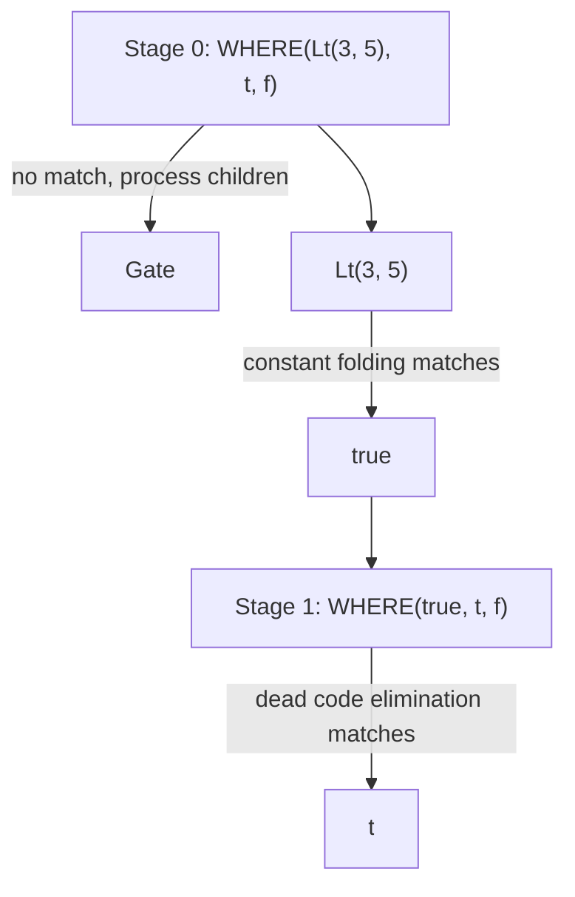

# The Pattern Engine

Open any production ML compiler and you'll find dozens of optimization passes: constant folding, dead code elimination, operator fusion, loop tiling, vectorization, memory layout optimization. Each pass has its own data structures, its own traversal logic, its own bugs.

Svod takes a different approach: **one mechanism for everything**.



Every optimization in Svod is expressed as a **pattern**: "when you see this structure, replace it with that structure." The same `graph_rewrite()` function applies [algebraic simplification](./algebraic-simplification.md), [index arithmetic](./index-arithmetic.md), [strength reduction](./strength-reduction.md), and [range optimization](./range-optimization.md).

---

## The `patterns!` DSL

Svod provides a domain-specific language for writing optimization patterns:

```rust
patterns! {
    // Identity folding: x + 0 → x
    Add[x, @zero] => x,

    // Constant folding: 3 + 4 → 7
    Add(a @const(a_val), _b @const(b_val))
        => eval_add(a_val, b_val).map(|r| UOp::const_(a.dtype(), r)),

    // Self-folding: x / x → 1
    Idiv(x, x) => UOp::one(x.dtype()),

    // Dead code elimination: if(true) { t } else { f } → t
    Where(Const(ConstValue::Bool(true)), t, _f) => t,
}
```

The macro compiles these patterns into efficient Rust code:

| Syntax | Meaning | Example |
|--------|---------|---------|
| `(x, y)` | **Ordered.** Match in exact order. | `Sub(x, @zero) => x` |
| `[x, y]` | **Commutative.** Try both orderings. | `Add[x, @zero] => x` |
| `@zero` | **Zero constant.** Matches 0 or 0.0. | `Mul[_, z @ @zero] => z` |
| `@one` | **One constant.** Matches 1 or 1.0. | `Mul[x, @one] => x` |
| `c @const(val)` | **Extract constant.** Binds the value. | `Add(a @const(av), _b @const(bv))` |
| `x, x` | **Same operand.** Auto-generates ptr_eq check. | `Idiv(x, x) => UOp::one(...)` |
| `=>` | **Rewrite.** Returns `Arc<UOp>`, `Option<Arc<UOp>>` (`None` declines) or `RewriteResult`. | `=> eval(...).map(...)` |
| `for op in binary [...]` | **Template.** Generate patterns for multiple ops. | See below |
| `@context Type` | **Stateful.** Access mutable context in patterns. | See below |

### Template Expansion

Instead of writing the same pattern for every binary operation, use a for-loop:

```rust
patterns! {
    for op in binary [Add, Mul, Sub, Idiv, Fdiv, Max] {
        op(a @const(a_val), _b @const(b_val))
            => eval_binary(op, a_val, b_val)
                .map(|r| UOp::const_(a.dtype(), r))
    }
}
```

This expands to six separate patterns at compile time — one for each operation.

### Stateful Patterns

Some optimizations need context (e.g., which kernel we're in, what ranges are active):

```rust
patterns! {
    @context KernelContext;

    reduce @ ReduceAxis { src, .. } => {
        ctx.record_reduction(reduce);
        transform_reduce(reduce, src, ctx)
    }
}
```

### Context Lifting

When combining matchers with different context types, use `.with_context()`:

```rust
let pm_add_images = symbolic_simple().clone().with_context::<AddImageContext>()
    + no_vectorized_alu().clone().with_context()
    + pm_simplify_add_image();
```

---

## How Pattern Matching Works

The `patterns!` macro compiles a block into one function that dispatches on the root's operation kind with a `match`, then tries that kind's patterns in source order.

### The OpKey Index

Every UOp has an operation type (Add, Mul, Load, etc.). The macro generates an `OpKey` enum that maps operations to hashable keys:

```rust
match OpKey::from_op(tree.op()).index() {
    KEY_ADD => { /* rules rooted at Add, in source order */ }
    KEY_MUL => { /* rules rooted at Mul */ }
    _ => {}
}
// wildcard rules (`x if cond`) run as sequential steps between the matches
```

When matching a UOp:
1. **Extract OpKey** from the UOp's operation
2. **Jump** to that kind's `match` arm
3. **Try each closure** until one matches
4. **Fall back** to wildcards if no indexed pattern matches

### Commutative Handling

For patterns like `Add[x, @zero]`, the macro generates code that tries both orderings:

```rust
// Try (x, @zero)
if let Some(result) = try_match_ordered(&children[0], &children[1]) {
    return result;
}
// Try (@zero, x)
if let Some(result) = try_match_ordered(&children[1], &children[0]) {
    return result;
}
```

### Duplicate Detection

When you write `Idiv(x, x)`, the pattern only matches if both operands are the *same* UOp (pointer equality via `Arc::ptr_eq`, not structural equality). This leverages hash consing — identical subexpressions share the same pointer.

---

## The Rewrite Engine

Pattern matching alone isn't enough. Consider:

```text
WHERE(Lt(3, 5), t, f)
```

To simplify it, we need two steps:
1. `Lt(3, 5)` → `true` (constant folding)
2. `WHERE(true, t, f)` → `t` (dead code elimination)

But the `WHERE` pattern won't match until its child is simplified. The rewrite engine solves this with a **two-stage algorithm**.

### Stage 0: Pattern Application

Apply patterns to each node. If no pattern matches, signal to process children first.

### Stage 1: Source Reconstruction

After children are rewritten, rebuild the node with new children and try patterns again:



The reconstruction stage re-applies patterns, enabling multi-step optimizations in a single traversal.

### Rewrite Strategies

Three rewrite functions, matching Tinygrad's `graph_rewrite`:

| Strategy | Patterns see | Use when |
|----------|-------------|----------|
| `graph_rewrite(pm)` (default) | OPTIMIZED children | Algebraic simplification, expansion |
| `graph_rewrite_bottom_up(bpm)` | ORIGINAL children | Nested structure matching, buffer removal |
| `graph_rewrite_with_bpm(pm, bpm)` | Both (bpm: original, pm: optimized) | Kernel splitting (gate + transform in one pass) |

The engine always traverses bottom-up; the distinction is *when* patterns fire: in Stage 0 (before children are processed — sees originals) or Stage 1 (after children — sees optimized results). Matchers are combined with the `+` operator: `matcher_a() + matcher_b()` merges their pattern sets into one.

### Safety Limits

To prevent infinite loops:
- **500,000 rewrite-stack entries** maximum (`REWRITE_STACK_LIMIT`)
- Panics with diagnostic info if limits exceeded

In practice, well-formed patterns converge quickly.

---

## Why This Matters

**Debugging is direct.** Patterns are readable code. Add a `println!` to any pattern to trace when it fires.

**Extensibility is easy.** Adding a custom optimization is two lines — no need to understand compiler internals, write visitors, or modify pass managers.

**Correctness is local.** Each pattern is a small theorem: "if this structure appears, replacing it with that structure preserves semantics." Verify each pattern independently. Composition of correct patterns yields correct programs.

**Performance is tunable.** O(1) pattern dispatch is fast by default. Combine with [beam search](./kernel-search.md) for production workloads.

---

## The Deeper Insight

Pattern matching trades generality for composability.

A general-purpose optimization pass can do anything — but that's exactly the problem. It's hard to verify, hard to extend, hard to compose with other passes. Ordering matters. Interactions are subtle.

A pattern is constrained: it matches a specific structure and produces a specific replacement. But constraints enable composition. For well-designed pattern sets, running patterns to a fixed point yields deterministic results. New patterns can be added with localized impact, and deleted without cascading failures — though in practice, pattern interactions should be tested to ensure convergence.

Each pattern is a theorem about semantic equivalence. The rewrite engine is a theorem prover, finding derivations from input to optimized output. Correctness follows from the correctness of individual steps.

This is the Unix philosophy applied to compilers: small, focused tools that compose.
