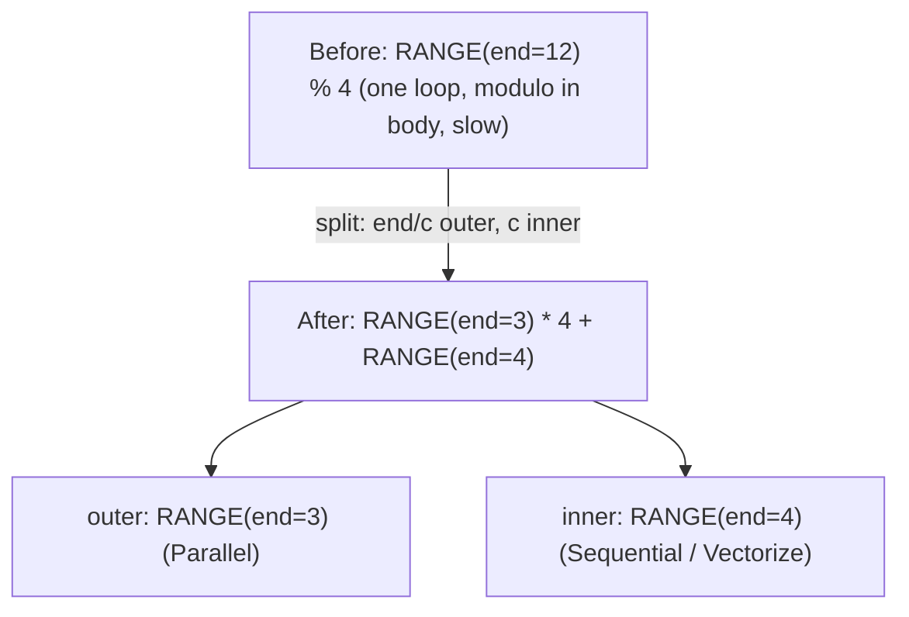
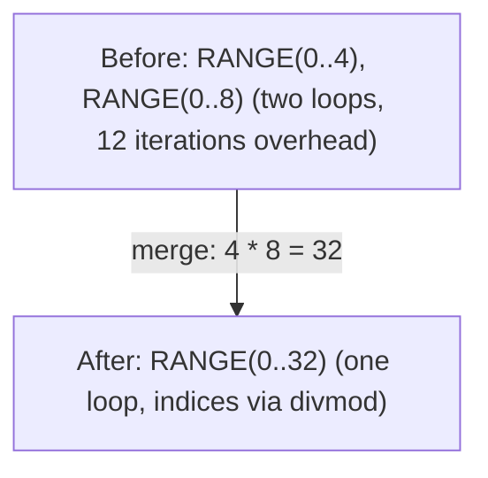
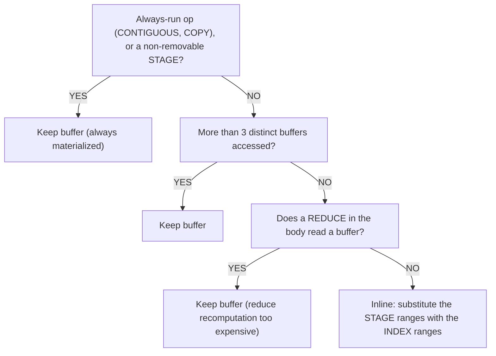

# Range and Reduce Optimization

Loop structures are the primary target for optimization in tensor compilers. A naive element-wise addition of two `[1024, 1024]` tensors generates a single loop over 1M elements. After optimization, it becomes 1024 parallel threads each processing 1024 elements with vectorized loads/stores. Range optimization is how we get there.

These patterns live in `schedule/src/rangeify/` and run during Stages 1-5 of the [codegen pipeline](../codegen/overview.md).

Tinygrad source: `tinygrad/codegen/simplify.py`.

---

## Range Splitting

**What**: Decompose a single range into outer and inner components via divmod.

**When**: A range variable is used with modulo: `RANGE(end) % c` where `end % c == 0`.



**Why**: After splitting, the inner range can be vectorized (UPCAST to SIMD width) while the outer range can be parallelized (GPU blocks, CPU threads). Without splitting, the modulo prevents both optimizations.

**Mechanism**: The `pm_split_ranges` pattern matcher collects ranges with modulo usage but does NOT transform immediately. It waits until it sees the SINK node, then performs all substitutions at once (avoids inconsistent partial rewrites). The outer and inner ranges append `0` and `1` to the original axis path, matching Tinygrad without allocating global range IDs.

**Guard**: Only fires when `end % c == 0` (exact divisibility). Non-divisible cases are left as-is.

Tinygrad: `simplify.py:60-64`. Svod: `pm_split_ranges()` in `rangeify/transforms.rs`.

---

## Range Merging

**What**: Merge two adjacent ranges into one, reducing loop overhead.



**Why**: Loop overhead (branch prediction, counter increment) is per-iteration. Merging reduces the number of loops at the cost of divmod operations to reconstruct the original indices.

**Decision criterion**: Accept merge only if the total divmod operation count does not increase. The compiler counts divmod operations before and after — if merging introduces more divisions than it eliminates loop overhead, the merge is rejected.

**Constraints**:
- Both ranges must have compatible axis types (both output, both reduce, etc.)
- REDUCE scope must remain consistent
- Both ranges must appear in the same REDUCE scopes

Tinygrad: `simplify.py:39-41` (`simplify_merge_adjacent`). Svod: `pm_simplify_ranges()`.

---

## Range Flattening

**What**: Flatten nested END/REDUCE/STORE chains into flat range lists.

```text
Before:  END(END(END(comp, [r0]), [r1]), [r2])
After:   END(comp, [r0, r1, r2])
```

**Why**: Nested END chains arise from successive transformations. Flattening normalizes the structure so other patterns (merging, splitting) can operate on a clean range list.

Tinygrad: `simplify.py:14-17`. Svod: `pm_flatten_range()`.

---

## Load Collapse

**What**: Eliminate a REDUCE loop entirely when the computation can be expressed as closed-form arithmetic.

```text
Before:  sum(1 for k in 0..64 if k >= length)    // Loop: 64 iterations
After:   clamp(64 - length, 0, 64)                // Arithmetic: 3 ops
```

**How it works**:
1. Identify subexpressions independent of the REDUCE range
2. Create `DEFINE_VAR` for those subexpressions (treat as loop-invariant)
3. Substitute the range with `DEFINE_VAR` and run symbolic simplification
4. If the simplified expression has no remaining ranges, the REDUCE is eliminated

This is the most powerful single optimization — it can eliminate entire reduction loops, converting O(N) computation to O(1).

Tinygrad: `simplify.py:145-149`. Svod: `pm_load_collapse()`.

---

## Reduce Collapse

Analytical elimination of ADD reductions. More sophisticated than load collapse — applies algebraic transformations within the reduce body.

### Bound Patterns

These handle gated reductions where a comparison limits which iterations contribute:

| Pattern | Before | After |
|---------|--------|-------|
| Lower bound | `sum(r < cut ? 0 : val, r=0..N)` | `max(0, N - cut) * val` |
| Upper bound | `sum(r < cut ? val : 0, r=0..N)` | `max(0, min(N, cut)) * val` |
| Two-sided | `sum(r >= lo & r < hi ? val : 0, r=0..N)` | `max(0, min(N,hi) - max(0,lo)) * val` |
| NE-gated (gather) | `sum(idx != r ? 0 : expr, r=0..N)` | `in_bounds ? expr[r:=idx] : 0` |

The NE-gated pattern is particularly important for gather operations — it recognizes that summing over all indices where `idx == r` is equivalent to a single indexed access.

### Lifting Transforms

Move comparisons outside the reduce scope to expose bound patterns:

| Transform | Before | After |
|-----------|--------|-------|
| Lt lifting | `(x + y) < c` | `x < (c - y)` |
| Ge lifting | `(x + y) >= c` | `x >= (c - y)` |
| EQ lifting | `(x + y) == c` | `x == (c - y)` |

### Distributive Law

`sum(x + y) → sum(x) + sum(y)` — split reduce over addition. This enables each half to be independently collapsed by the bound patterns.

### MUL-casted-bool

`x * bool.cast() → WHERE(bool, x, 0)` — converts multiplication by a boolean cast into a WHERE, which can then be analyzed by the bound patterns.

Tinygrad: `simplify.py:82-142`. Svod: `pm_reduce_simplify()` + `reduce_collapse_inner_patterns()`.

---

## Buffer Removal (Partial Contiguous)

**What**: Decide whether to materialize an intermediate result to a buffer or inline the computation, by substituting the bufferized ranges with the ranges the reader indexes with.

When the rangeify pass creates a `STAGE` node (marking "this needs a buffer"), the buffer removal pass evaluates whether actually allocating memory is worthwhile. A `STAGE` is Svod's intermediate representation between "this needs a buffer" and the final `STORE`+`BUFFER`+`AFTER` — it lets this pass decide if materialization is actually needed. If the computation is cheap enough, it substitutes the range variables and inlines the expression directly.

### Decision Tree



:::caution[Buffer Reads Inside a Reduce]
The reduce guard is not about how cheap the operation is — it fires whenever any REDUCE in the body reads a buffer (`Param`, `Buffer` or a `Stage`). Reason: if `argmax(-x)` inlines the negation, `-x` is recomputed on every reduction iteration — N extra loads and negations instead of one buffer read. A reduce over values that touch no buffer is still inlinable.
:::

### Related Patterns

| Pattern | What |
|---------|------|
| Stage folding | `STAGE(CONST) → CONST` — a stage of a constant is just the constant |
| Index folding | `INDEX(CONST) → CONST` — indexing into a constant is the constant |
| Copy folding | `COPY(CONST) → CONST` — copying a constant is the constant |
| MStack folding | `INDEX(MSTACK([CONST, ...])) → CONST` — a multi-device stack of constants |
| Identity fold | `INDEX(STAGE(compute, ranges), ranges) → compute` — same ranges cancel |

Svod: `pm_remove_bufferize()` and `buffer_folding()` in `rangeify/patterns.rs`.

---

## Dead Axis Removal

**What**: Remove unused dimensions from STAGE operations.

A dimension is "dead" when:
- It has size 1 (contributes nothing)
- It appears as a constant in the index (not a variable)
- The compute expression doesn't reference it

Dead axes are removed from STAGE, then the shape is restored via RESHAPE (insert size-1 dims) and EXPAND (broadcast to original size). This reduces the dimensionality of the buffer allocation.

:::caution[Scalar Case]
Even when ALL ranges are dead (scalar output), STAGE must be kept with empty ranges — removing it entirely causes `NoKernelsFound` since no STORE gets created during kernel splitting.
:::

Svod: `dead_axis_removal()` in `rangeify/patterns.rs`.

---

## Reduce Unparented

**What**: Remove ranges from a REDUCE that aren't referenced by the reduce body.

| Reduce Op | Unreferenced range of size N | Transform |
|-----------|------|-----------|
| ADD | Range not used in body | Multiply result by N |
| MUL | Range not used in body | Raise result to N-th power |
| MAX / MIN | Range not used in body | Just remove range |

Example: `sum(x, r=0..N)` where `x` doesn't depend on `r` → `x * N`. The sum of a constant over N iterations is N times the constant.

Tinygrad: `simplify.py:82-86`. Svod: `pm_reduce_simplify()`.

---

## Split ReduceOp

**What**: Split large reductions into two stages for better parallelism.

**When**: Input/output ratio exceeds 32768.

```text
Before:  REDUCE(data, axes=[0])       // shape [65536] → scalar
After:   REDUCE(                       // shape [256] → scalar (second stage)
           CONTIGUOUS(
             REDUCE(                   // shape [65536] → [256] (first stage)
               RESHAPE(data, [256, 256]),
               axes=[1]
             )
           ),
           axes=[0]
         )
```

**Why**: A single huge reduction cannot be parallelized. Splitting into two stages allows the first stage to run in parallel (256 threads each reducing 256 elements), then the second stage reduces the 256 partial results.

**Guard**: Only applies when the reduction dimension can be factored and the input/output ratio exceeds the threshold. Non-factorizable dimensions are skipped.

Svod: `split_reduceop()` in `rangeify/kernel.rs`.
