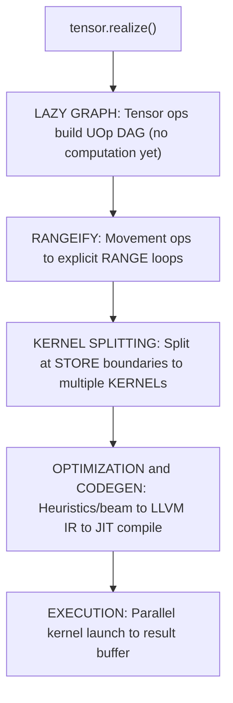
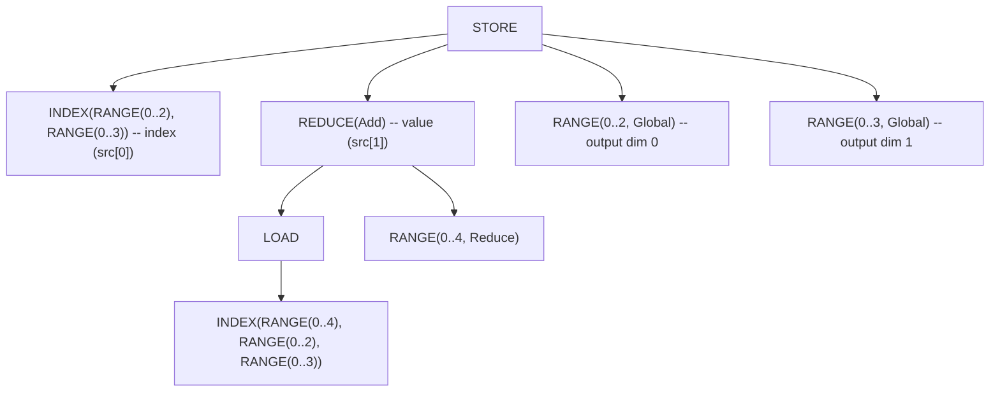
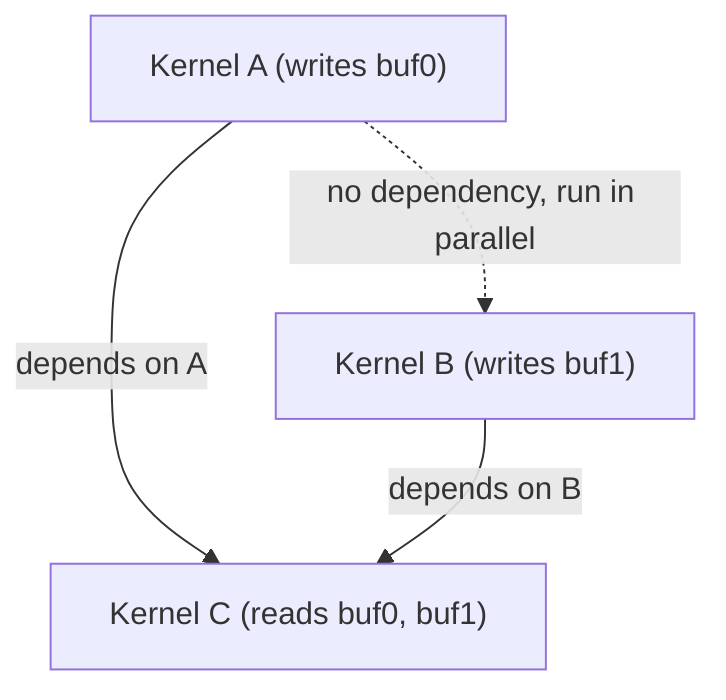
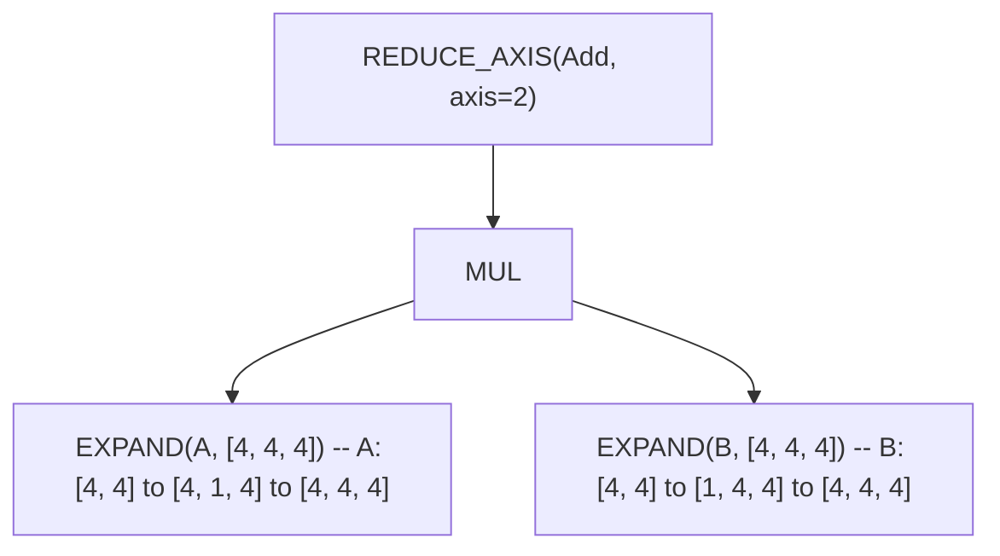
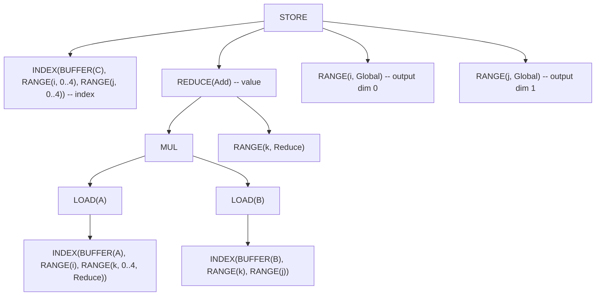
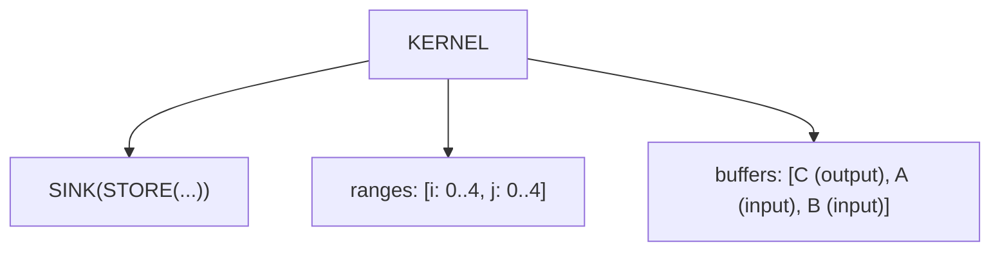

# From Tensor to Machine Code

In most ML frameworks, computation happens immediately. Write `a + b` in PyTorch and it runs *now*—the GPU crunches numbers before you can even inspect the result. This eager execution is simple to understand, but it leaves optimization opportunities on the table. How can a compiler optimize a computation it hasn't seen yet?

Svod takes the opposite approach: **lazy evaluation**. When you write `a.try_add(&b)?`, nothing computes. Svod builds a graph describing *what* to compute, not *when*. The magic happens when you call `realize()`—that single method triggers the entire compilation pipeline, from high-level tensor operations down to JIT-compiled machine code.

This chapter traces that journey.



Each box is a distinct phase. Let's walk through them.

---

## Lazy Evaluation: Building the Graph

A `Tensor` in Svod is surprisingly lightweight:

```rust
pub struct Tensor {
    entry: Arc<TensorEntry>,      // Computation graph
    buffer: Option<Arc<Buffer>>,  // Materialized data (if any)
}
```

The `entry` holds a `TensorEntry` containing the UOp graph—the computation this tensor represents. The `buffer` is optional: lazy tensors don't have one, only realized tensors do.

### Three Ways to Create Tensors

**1. Input tensors** — buffer allocated immediately:

```rust
let a = Tensor::from_slice([1.0f32, 2.0, 3.0]);
// `a.buffer` = Some(Arc<Buffer>) with actual data
```

When you create a tensor from data, Svod allocates device memory and copies your bytes. The UOp graph contains a `BUFFER` node pointing to this allocation.

**2. Lazy operations** — no buffer, only graph:

```rust
let b = a.try_add(&a)?;   // b.buffer = None
let c = b.try_mul(&a)?;   // c.buffer = None
```

Arithmetic operations don't compute anything. They build a UOp graph: `Binary(Add, a.uop, a.uop)`. The tensor exists purely as a description of future work.

**3. Movement operations** — shares the original buffer:

```rust
let d = a.try_reshape(&[1, 3])?;  // d.buffer = same as a.buffer
```

Reshape, permute, and similar operations create new *views* of existing data. The buffer is shared; only the UOp graph changes to describe the new indexing.

### The Global Registry

Svod maintains two global maps (lock-free, thread-safe):

| Map | Key → Value | Purpose |
|-----|-------------|---------|
| `TENSORS` | tensor_id → `Weak<TensorEntry>` | Track all tensors for graph substitution |
| `BUFFERS` | uop_id → `Arc<Buffer>` | Find buffers during scheduling |

This registry enables a critical feature: **global graph substitution**. When an optimization transforms a UOp, all tensors referencing that UOp automatically see the updated version. No stale references, no manual updates.

### Hash Consing in Action

Because UOps use hash consing (content-based deduplication), identical computations share memory:

```rust
let x = a.try_add(&b)?;
let y = a.try_add(&b)?;
// x.uop() and y.uop() point to the SAME Arc<UOp>
```

This matters for caching: when we compile kernels, we cache by UOp ID. Hash consing means identical computations automatically hit the cache, even if constructed separately.

---

## Rangeify: Making Loops Explicit

When you write `tensor.reshape([2, 3]).expand([4, 2, 3]).sum(axis=0)`, those movement operations (reshape, expand) are high-level descriptions. To generate actual loops, we need explicit iteration structure.

**Rangeify** transforms movement operations into `RANGE` loops and `INDEX` arithmetic. The entry point is `rangeify()` in `schedule/src/rangeify/transforms.rs`.

### The Rangeify Pipeline

Rangeify isn't a single transformation—it's a multi-stage pipeline:

| Stage | Purpose |
|-------|---------|
| **0. Range Assignment** | Create RANGE UOps for each tensor dimension |
| **1. Early Movement Ops** | Clean up movement operations before range assignment |
| **2. Load Collapse** | Eliminate REDUCE operations via range-independent detection |
| **3. Split Ranges** | Split ranges with modulo, flatten ranges |
| **4. Initial Symbolic** | Algebraic simplification, constant folding |
| **5. Simplify Ranges** | Merge adjacent ranges with cost analysis |
| **6. Split Store** | Split graph at STORE boundaries |
| **7. Apply Opts** | Optimization search (beam or heuristic) |
| **Mega-pass** | Symbolic + reduce + buffer folding + buffer removal + reduction simplification |

The mega-pass combines multiple symbolic and structural optimizations into a single fixpoint loop. Per-kernel passes then run in `apply_pre_optimization()`.

Each pass uses pattern-based rewriting (see the [Pattern Engine](./optimizations/pattern-system) chapter). Patterns fire until no more match, then the next pass begins.

### Before and After

Consider this tensor expression:

```text
Before: BUFFER.reshape([2, 3]).expand([4, 2, 3]).sum(axis=0)
```

After rangeify, movement ops become explicit index computations:



The `EXPAND` became a `RANGE(0..4)` that doesn't affect the buffer index—broadcasting. The `RESHAPE` became different index arithmetic. The `SUM` became `REDUCE(Add)` with the first range marked as `Reduce` type.

### Movement → Index Arithmetic

Each movement operation has a specific transformation:

| Operation | Transformation |
|-----------|----------------|
| **RESHAPE** | Flatten/unflatten index expressions |
| **PERMUTE** | Reorder dimensions in INDEX |
| **EXPAND** | Index becomes 0 (or range doesn't affect index) |
| **PAD** | WHERE(in_bounds, LOAD, pad_value) |
| **SHRINK** | Offset adjustment in INDEX |
| **FLIP** | `size - 1 - index` |

After rangeify, there are no more movement ops—just arithmetic operations on indices.

---

## Kernel Splitting: Finding the Boundaries

A computation graph might have multiple outputs, or intermediate values that need materialization. **Kernel splitting** identifies these boundaries and creates separate kernels.

The entry point is `try_get_kernel_graph()` in `schedule/src/rangeify/kernel.rs`.

### Kernel Splitting Pipeline

The splitting proceeds through several coordinated steps:

**Step 1: STAGE → STORE**

`STAGE` nodes mark where values should materialize. `pm_add_buffers_patterns()` converts them to explicit `STORE` operations:

```text
Before: STAGE(computation, ranges)
After:  END(STORE(INDEX(...), computation), ranges)
```

The `END` wrapper captures which ranges scope this store. Buffers are allocated and assigned IDs during this phase.

**Step 2: Split stores into kernels**

`split_all_stores()` and `split_store()` split the graph at STORE boundaries, creating separate kernels. Buffer numbering is assigned via `LocalAddBufferContext.param_slot` counter during splitting.

```text
Before: END(STORE(...), ranges)
After:  KERNEL(SINK(STORE(...)), ranges, buffer_list)
```

The `KERNEL` node wraps everything: the computation (as a `SINK`), the iteration ranges, and the list of buffers this kernel reads and writes.

**Step 3: Fix assignments**

`fix_assign()` maps each buffer_id to the kernel that writes it and builds the dependency graph.

### Tracking Dependencies

When one kernel's output feeds another kernel's input, we need dependency tracking:

1. `fix_assign()` maps each buffer_id to the kernel that writes it and builds the dependency graph
2. When kernel B reads a buffer written by kernel A, B depends on A
3. Dependencies appear as `AFTER` nodes in the IR

Dependencies appear as `AFTER` nodes in the IR, ensuring kernels execute in valid order.

### Buffer Numbering

Buffer numbering is handled by the `LocalAddBufferContext.param_slot` counter in `split_store()`. Each kernel argument becomes a `PARAM(slot=N)`, and the slots are assigned during the split process in pattern-match order—no separate renumbering pass is needed.

---

## Schedule Creation: Preparing for Execution

Once kernels are split, we need to **schedule** them: determine execution order, allocate buffers, and prepare for compilation.

`create_schedule()` in `tensor/src/schedule.rs` produces a `Vec<ScheduleItem>`:

```rust
pub struct ScheduleItem {
    pub kernel: Arc<UOp>,              // Callable (CALL) wrapper: dependency identity
    pub ast: Arc<UOp>,                 // Inner computation (for codegen)
    pub buffers: Vec<Buffer>,          // Device buffers
    pub buffer_uop_ids: Vec<u64>,      // UOp IDs for registry cleanup
    pub fixedvars: HashMap<String, i64>,  // Bound iteration variables
    pub loop_var_names: HashSet<String>,  // fixedvars fed by schedule-loop counters
    pub dependencies: Vec<u64>,        // Producer callable UOp IDs
    pub instance_dependencies: Vec<usize>, // Producer schedule-item indices
}
```

### Buffer Allocation Strategy

- **Input buffers**: Already allocated (from `Tensor::from_slice`)
- **Intermediate buffers**: Allocated during scheduling (for kernel outputs that feed other kernels)
- **Output buffer**: Allocated and registered with the final tensor

### Parallel Group Analysis

Not all kernels need sequential execution. Independent kernels can run in parallel:



The scheduler uses **Kahn's algorithm** to find parallel groups:

1. Build the kernel dependency DAG
2. Find all kernels with no incoming edges → Group 1
3. Remove Group 1, repeat → Group 2, etc.

Each group's kernels execute in parallel, then the next group starts.

---

## Code Generation: From UOp to LLVM IR

With kernels scheduled, we generate actual code. Svod has two renderers, and the device backend decides which one runs:

| Device backend | Renderer | Output |
|----------------|----------|--------|
| **CPU** | LLVM text (default) or C | LLVM IR, or C source |
| **CUDA** | LLVM text, NVPTX target | LLVM IR (`ptx_kernel`) |
| **AMD** | LLVM text, AMDGPU target | LLVM IR (`amdgpu_kernel`) |
| **Metal** | C, Metal dialect | Metal Shading Language |

The `Renderer` trait abstracts code generation:

```rust
pub trait Renderer {
    fn render(&self, uop: &Arc<UOp>, name: Option<&str>) -> Result<RenderedKernel>;
    fn backend_name(&self) -> &str;
    fn decompositor(&self) -> Option<TypedPatternMatcher<()>>;
}
```

### LLVM CPU Renderer

The LLVM renderer (`codegen/src/llvm/cpu/`) traverses the UOp graph and emits LLVM IR:

```llvm
define void @kernel_0(ptr noalias align 32 %buf0, ptr noalias align 32 %buf1) #0 {
entry:
  br label %loop_0

loop_0:
  %i = phi i32 [ 0, %entry ], [ %i.next, %loop_0 ]
  ; ... computation ...
  %i.next = add nsw i32 %i, 1
  %cond = icmp slt i32 %i.next, 128
  br i1 %cond, label %loop_0, label %exit

exit:
  ret void
}
```

Each buffer is a direct `ptr noalias align 32` parameter — no indirection through an args array. Symbolic variables (for dynamic shapes) and thread IDs are passed as additional typed parameters (e.g. `i32 %N`).

### Post-Optimization Passes

Before code generation, ~15 pattern-based passes clean up the IR:

| Pass | Purpose |
|------|---------|
| `pm_add_loads` | Wrap INDEX operations in LOAD |
| `pre_expand` | Convert UNROLL/UPCAST ranges to explicit operations |
| `devectorize` | Group contiguous memory accesses |
| `pm_reduce_devectorize` | Handle vector reductions (K-vec, bool, horizontal) |
| `pm_bool_devectorize` | Handle boolean vector patterns |
| `pm_split_ends` | Split multi-range ENDs into nested single-range ENDs |
| `pm_fma_decomposition` | Convert `a*b+c` to fused multiply-add (for backends that support it) |
| `pm_float_decomp` | Decompose floating-point operations |
| `bool_storage_patterns` | Convert bool ↔ uint8 for memory operations |

These passes transform the optimized AST into a form suitable for code generation. The result is clean, vectorized code with proper memory access patterns.

### Backend Support

Two renderers cover the four device backends:

| Renderer | Output | Used by |
|----------|--------|---------|
| **LLVM text** | LLVM IR for the CPU, AMDGPU and NVPTX targets | CPU (default), AMD, CUDA |
| **C** | C source, or Metal Shading Language | CPU (`SVOD_CPU_BACKEND=clang`), Metal |

---

## Execution: Running the Kernels

Code generation produces source strings — LLVM IR, C, or Metal Shading Language. Execution involves compiling them at runtime and launching the kernels.

### The ExecutionPlan

`prepare()` (single tensor) or `prepare_batch()` (multiple tensors) builds an `ExecutionPlan` (`runtime/src/execution_plan.rs`):

```rust
pub struct ExecutionPlan {
    ops: Vec<PreparedOp>,               // Compiled kernels and buffer copies
    op_order: Vec<usize>,               // Topological execution order
    op_levels: Vec<Vec<usize>>,         // Parallel groups (Kahn levels)
    buffers: Vec<Buffer>,
    ast_to_buffer: HashMap<u64, usize>, // AST id -> buffer index mapping
    output_buffer_indices: Vec<usize>,  // Indices of output buffers (multi-output)
    device: DeviceSpec,
    // ... graph/queue state elided
}
```

Plans now support **multiple outputs** via `realize_batch()` / `prepare_batch()`. When several tensors share subgraphs, batch scheduling lets the compiler share kernels across outputs.

Key methods:

| Method | Purpose |
|--------|---------|
| `output_buffer_at(i)` | Get the i-th output buffer (matches SINK source order) |
| `num_outputs()` | Number of output buffers in this plan |
| `execute_with_vars(var_vals)` | Re-execute with different symbolic variable values (no recompilation) |

The plan is **reusable**: compile once, execute many times with different data.

### JIT Compilation

The LLVM runtime (`runtime/src/llvm.rs`) compiles IR to machine code. There is no LLVM `ExecutionEngine`: the IR becomes a relocatable object, which an in-process ELF loader maps and relocates.

1. **Compile** the IR text to a relocatable object at `-O2` — in-process through a `dlopen`ed libLLVM when one is available, otherwise `clang -x ir -c -O2`
2. **Reuse** the object from the on-disk cache, keyed by the source digest plus compiler identity
3. **Load** it with the ELF loader: sections into an anonymous mmap, relocations applied
4. **Cache** the resulting function by (AST ID, device) for reuse

```rust
// Simplified compile flow
let object = producer.compile_object(ir_string)?;  // libLLVM in-process, or `clang -x ir -c -O2`
validate_relocatable_object(&object, &entry_point)?;
let (fn_ptr, _mmap) = jit_load(&object, &entry_point)?;  // ELF loader, no linker
// Cache: (ast_id, device) → function
```

### Kernel Execution

With kernels compiled, execution iterates through kernels in topological order, respecting dependencies:

```rust
for kernel in &plan.kernels {
    // Dependencies tracked per-kernel via kernel.dependencies
    kernel.execute(buffers);
}
```

Kernels carry their own device specification, so a plan can span multiple devices.

### Kernel Caching

Hash consing makes kernel caching highly effective:

- **Key**: `(UOp ID, device string)`
- **Storage**: Lock-free HashMap (papaya crate)
- **Hit rate**: High, because identical computations share UOp IDs

When you compute the same expression twice, the second call hits the cache—no recompilation.

---

## Worked Example: Matrix Multiply

Let's trace `C = A @ B` through the entire pipeline. Assume 4×4 matrices.

### Stage 1: Lazy Graph Construction

```rust
let a = Tensor::from_slice(a_data);  // Input buffer allocated
let b = Tensor::from_slice(b_data);  // Input buffer allocated
let c = a.matmul(&b);                 // Graph built, no computation
```

At this point, `c` is a lazy tensor with this UOp graph:



### Stage 2: Rangeify

Movement ops become explicit loops:



The `i` and `j` ranges are output dimensions. The `k` range is the reduction (contracted) dimension.

### Stage 3: Kernel Splitting

Single STORE → single KERNEL:



### Stage 4: Schedule

One `ScheduleItem` with:
- `kernel`: The KERNEL UOp
- `ast`: The inner SINK/STORE
- `buffers`: [C, A, B]
- `dependencies`: [] (no prior kernels)

### Stage 5: Optimization

Heuristic optimizer applies:
- Vectorization: UPCAST j dimension by 4
- Loop ordering: Ensure good cache behavior

### Stage 6: Code Generation

Generated LLVM IR (simplified):

```llvm
define void @matmul(ptr noalias align 32 %C, ptr noalias align 32 %A, ptr noalias align 32 %B) #0 {
entry:
  br label %loop_i

loop_i:
  %i = phi i64 [ 0, %entry ], [ %i.next, %loop_i.end ]
  br label %loop_j

loop_j:
  %j = phi i64 [ 0, %loop_i ], [ %j.next, %loop_k.end ]
  %acc = ... ; initialize accumulator
  br label %loop_k

loop_k:
  %k = phi i64 [ 0, %loop_j ], [ %k.next, %loop_k ]
  %a_val = load float, ptr ...  ; A[i, k]
  %b_val = load float, ptr ...  ; B[k, j]
  %prod = fmul float %a_val, %b_val
  %acc.new = fadd float %acc, %prod
  %k.next = add i64 %k, 1
  %k.cond = icmp slt i64 %k.next, 4
  br i1 %k.cond, label %loop_k, label %loop_k.end

loop_k.end:
  store float %acc.new, ptr ...  ; C[i, j]
  ; ... continue j, i loops
}
```

### Stage 7: Execution

1. JIT compile the LLVM IR
2. Execute: `kernel([C_ptr, A_ptr, B_ptr], [])`
3. Result is in C buffer

Total: one function call, result ready.

---

## Comparison: How Other Frameworks Execute

| Aspect | PyTorch | JAX | TVM | **Svod** |
|--------|---------|-----|-----|-----------|
| **Evaluation** | Eager (immediate) | Traced (jit decorator) | Lazy (te.compute) | Lazy (realize) |
| **Graph capture** | torch.compile | jax.jit trace | Explicit schedule | Implicit via ops |
| **Compilation** | TorchInductor | XLA backend | Auto-scheduler | Pattern + beam |
| **Caching** | Per-graph hash | Per-trace | Per-schedule | Per-AST (hash consing) |
| **Parallelism** | DataParallel/DDP | pmap/pjit | Parallel schedule | Parallel groups |

**PyTorch**: Eager by default, torch.compile for optimization. TorchInductor generates Triton or C++ code.

**JAX**: Functional transformations (jit, grad, vmap) trace computations. XLA compiles to optimized kernels.

**TVM**: Explicit separation of computation and schedule. Auto-scheduler searches for good schedules.

**Svod**: Fully lazy—nothing executes until `realize()`. Hash consing provides automatic caching. Pattern-based optimization with optional beam search for production quality.

---

## The Deeper Insight

The pipeline embodies several design principles:

**Lazy evaluation enables global optimization.** By deferring computation, we see the entire graph before generating code. No local decision limits global optimization.

**Explicit loops enable hardware-specific scheduling.** Movement ops are convenient abstractions, but GPUs need loops. Rangeify bridges the gap.

**Hash consing makes caching automatic.** Identical computations share pointers, so cache keys are trivial. No complex graph hashing needed.

**Separation of concerns keeps each stage simple.** Rangeify doesn't know about LLVM. Code generation doesn't know about tensor semantics. Each stage does one thing well.

The result: a compilation pipeline that's both powerful and maintainable. From `tensor.realize()` to machine code, every step is visible, debuggable, and extensible.
