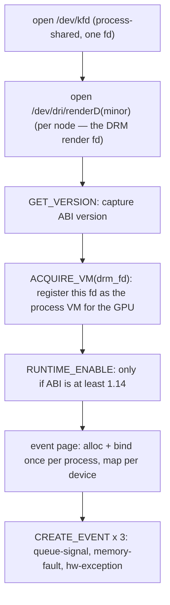

# KFD Bindings

The backend speaks to the kernel through a small, fixed set of `ioctl` calls on
`/dev/kfd`. This page covers how those calls are bound to Rust, which ones the
backend actually uses, how GPU nodes are discovered, and the allocation flow
that turns an `ioctl` into a mapped GPU buffer. For *why* the backend is
KFD-direct rather than HIP-based, see the [Overview](./overview.md).

---

## How the bindings are generated

KFD's ABI is a C header, `kfd_ioctl.h`, vendored verbatim from the kernel into
`device/include/kfd_ioctl.h` (the upstream AMD file, complete with its ABI
version history). Rust bindings are generated from it at build time by
`bindgen`:

- `device/build.rs` runs `bindgen` **unconditionally on every host** — there is
  no platform gate and no empty-stub branch. It is **hermetic**: it needs no
  system kernel headers. The two headers `kfd_ioctl.h` transitively pulls
  (`<linux/ioctl.h>` for the `_IOC`/`_IO*` macros, `<linux/types.h>` for the
  `__uNN`/`__sNN` aliases) plus a stub `<drm/drm.h>` (vestigial — the body uses
  only `__u32 drm_fd` fields) are themselves vendored under `device/include/`,
  and `build.rs` passes `-Iinclude` so bindgen resolves them instead of
  `/usr/include`. The switch to vendored headers was verified byte-equivalent:
  the regenerated bindings differ from the system-header baseline only in 8
  fixed-width type-alias spellings (`__u32 = u32` vs `c_uint`, identically
  sized) — all 60 structs and 34 constants are identical. (bindgen needs
  `libclang`, which ships with the Xcode CLT on macOS.)

  It allow-lists exactly the KFD types and constants the backend needs:

  ```text
  allowlist_type:  kfd_ioctl_.*_args, kfd_process_device_apertures,
                   kfd_event_data, kfd_hsa_signal_event_data,
                   kfd_hsa_memory_exception_data, kfd_hsa_hw_exception_data,
                   kfd_memory_exception_failure, __u\d+, __s\d+
  allowlist_var:   KFD_IOC_.*, KFD_MMAP_TYPE.*, KFD_MAX_QUEUE_PERCENTAGE,
                   AMDKFD_IOC_.*
  ```

  (The `AMDKFD_IOC_*` request codes are allow-listed but never materialize:
  bindgen can't const-fold their `_IOWR(...)` macro expansions, which is exactly
  why the ioctl numbers are computed Rust-side — see the note below.)

  with `.derive_default(true).layout_tests(false).generate_comments(false)`. The
  output is written to `$OUT_DIR/kfd_sys.rs`.

- `device/src/amd/sys/kfd.rs` is a one-liner that `include!`s the generated
  file.

- A **second bindgen pass** covers the AQL/HSA side: `include/amd_hsa_wrapper.h`
  pulls the vendored ROCm `hsa/` headers and yields `$OUT_DIR/hsa_sys.rs`
  (`hsa_kernel_dispatch_packet_t`, `hsa_queue_t`, `amd_queue_t`, `amd_signal_t`
  and friends), `include!`d by `device/src/amd/sys/hsa.rs`. Here `layout_tests`
  is deliberately left **on**: the 256-byte `amd_queue_t` and the 64-byte AQL
  packet are layout-critical, so a mis-sized struct must fail the build.

Compiling the bindings everywhere is what makes the AMD backend a
[runtime-detected execution provider](./overview.md) rather than a compile-time
feature: the bindings are generated everywhere, every Unix `cargo check`
type-checks the KFD call sites above them (the `nix` ioctl wrappers are the only
`cfg(unix)` part), and a host with no GPU simply never registers the factory.

:::note[Why hand-written ioctl macros]
`bindgen` emits the argument *structs* but not the `_IOWR` ioctl-number macros.
Those are declared by hand in `device/src/amd/sys/ioctl.rs` using
`nix::ioctl_readwrite!`, with the type code `KFD_IOCTL_BASE = b'K'`. Every
ioctl is declared `readwrite` even where the header says `_IOR`/`_IOW` — KFD
treats the argument struct as in/out, and the kernel tolerates both directions.
:::

---

## The ioctls the backend uses

The `(group, opcode, args)` triples come straight from `kfd_ioctl.h`. These are
the ones with live call sites:

| Wrapper | Op | Used for |
|---|---|---|
| `kfd_get_version` | `0x01` | Read the KFD ABI version (gates `RUNTIME_ENABLE`) |
| `kfd_create_queue` | `0x02` | `setup_ring` — create a compute/SDMA queue |
| `kfd_destroy_queue` | `0x03` | `teardown_ring` |
| `kfd_update_queue` | `0x07` | Unmap/remap an AQL queue so CP firmware re-reads its `amd_queue_t` scratch descriptor |
| `kfd_create_event` | `0x08` | The queue-signal, memory-fault, and hw-exception events; binding the event page |
| `kfd_destroy_event` | `0x09` | Tear the three events down on `Drop` |
| `kfd_wait_events` | `0x0C` | `wait_events` — block on completion / fault events |
| `kfd_acquire_vm` | `0x15` | Register the DRM render fd as this process's VM for the GPU |
| `kfd_alloc_memory_of_gpu` | `0x16` | `alloc_raw` — allocate VRAM/GTT |
| `kfd_free_memory_of_gpu` | `0x17` | `free_raw` |
| `kfd_map_memory_to_gpu` | `0x18` | Bind an allocation into the GPU page table |
| `kfd_unmap_memory_from_gpu` | `0x19` | `free_raw` |
| `kfd_runtime_enable` | `0x25` | Enable the runtime (KFD ABI ≥ 1.14 only) |

Five more (`set_memory_policy`, `get_clock_counters`, `get_process_apertures`,
`set_event`, `reset_event`) are declared for completeness but not currently
called.

### Device bring-up sequence

`KfdIface::open` (`device/src/amd/iface.rs`) issues these in order, mirroring
tinygrad's `ops_amd.py`:



The chain is strictly ordered: `ACQUIRE_VM` must precede any allocation, and the
event page must be bound before the first `CREATE_QUEUE`.

The DRM render fd is interesting: there are **no DRM ioctls**. The `drm_fd` is
used only two ways — passed *by number* into `ACQUIRE_VM`, and as the `mmap` fd
for host-visible mappings. The doorbell, by contrast, is `mmap`ped from the KFD
fd.

---

## Topology: finding the GPU

GPU nodes are enumerated from sysfs, not via an ioctl.
`device/src/amd/topology.rs` reads
`/sys/devices/virtual/kfd/kfd/topology/nodes/<N>/properties` — one
`key value` pair per line — plus the sibling `<N>/gpu_id`, and returns a
`Vec<AmdNode>`, skipping CPU nodes (`gpu_id == 0`). It never panics: a host with
no `/dev/kfd` yields an empty vector.

This same enumeration is what gates the whole backend at runtime.
`topology::has_devices()` — "any node whose `gfx_target_version` resolves to a
supported `AmdArch`" — is the side-effect-free probe the runtime calls to decide
whether to register the `"AMD"` device factory at all (the
[provider model](./overview.md)). No supported node ⇒ no `"AMD"` device type; and
if a factory is asked for a node that isn't there, it returns a clean
`Err(NoAmdGpu)`.

Each `AmdNode` carries the fields the rest of the backend needs:
`gpu_id`, `drm_render_minor`, `gfx_target_version` (e.g. `110000` → gfx1100),
`simd_count`, `simd_per_cu`, `max_waves_per_simd`, `num_xcc`, `lds_size_in_kb`,
`max_slots_scratch_cu`, and friends — these feed scratch sizing and the PM4-vs-
AQL decision.

:::tip[Testing without hardware]
The sysfs root is overridable with **`SVOD_KFD_TOPOLOGY`**, so the parser is
unit-tested against a fabricated nodes directory with no GPU present.
:::

---

## The allocation flow

Every buffer follows the same four-step path, implemented once in
`KfdIface::alloc_raw`:

```text
1. reserve_va(size)                     mmap(PROT_NONE, …) — reserve host VA
2. ALLOC_MEMORY_OF_GPU(va, size, flags) → returns handle + mmap_offset
3. if host-visible:                     mmap(va, …, MAP_FIXED, drm_fd, offset)
4. MAP_MEMORY_TO_GPU(handle)            bind into the GPU page table
```

The host VA is reserved first with an anonymous `PROT_NONE` mapping so the
host-visible `mmap` in step 3 can land at exactly that address (`MAP_FIXED`).
Freeing reverses it: `UNMAP_MEMORY_FROM_GPU` → `munmap` → `FREE_MEMORY_OF_GPU`.

### Allocation flavors

`alloc_raw` takes an `AllocKind` that selects the KFD flag set — the single
place those flags are composed:

| `AllocKind` | Flags | Used for |
|---|---|---|
| `DeviceVram { executable }` | `VRAM \| WRITABLE \| NO_SUBSTITUTE` (+ `EXECUTABLE` for code, + `PUBLIC` when host-visible) | Tensor data, code objects, scratch |
| `UncachedGtt` | `GTT \| WRITABLE \| EXECUTABLE \| NO_SUBSTITUTE \| PUBLIC \| COHERENT \| UNCACHED` | Command rings, GART pages, signal slots, the event page |

The `UNCACHED | COHERENT` GTT flavor matters: the command ring and the signal
slots must be immediately visible between CPU and GPU, or the host spins forever
waiting on a completion value stuck in GPU L2. KFD rejects `CREATE_QUEUE` on a
plain-VRAM ring with `EINVAL`.

### `cpu_access` follows the copy queue

The allocator (`device/src/amd/allocator.rs`) computes
`cpu_access = options.cpu_access || !self.dev.has_sdma_queue()`. When an SDMA copy
queue is installed (the default on CDNA — see [Overview](./overview.md)), an
intermediate can be **device-only** VRAM and copies go through DMA:
`_copyin`/`_copyout` stage
through the copy queue, `_transfer` is a direct device→device copy. When no copy
queue is present, `has_sdma_queue()` is `false`, so every buffer is forced
host-visible and copies fall back to a plain host `memmove` after the scoped
`wait_storage`. The generic `LruAllocator` (`device/src/allocator.rs`) pools
freed buffers by `(size, BufferSpec)`; the `nolru` spec bypasses the pool for
code objects and the EOP / CWSR context-save buffers, while rings, GART pages,
signal slots and scratch skip the pooled allocator entirely and go straight to
the seam through `alloc_uncached_tagged` / `alloc_host_visible_tagged` /
`alloc_scratch`.

:::note[Process-shared state]
`/dev/kfd` is opened once per process and shared by all devices (events are
addressed by id against that fd). The 0x8000-byte KFD **event page** is likewise
allocated and bound once per process; subsequent devices only `MAP_MEMORY_TO_GPU`
it into their own `gpu_id`. Both mirror tinygrad's per-process model.
:::

---

## Why this matters

The entire kernel-facing surface is **a handful of vendored headers, thirteen
ioctls, and a sysfs parser**. That is the whole reason the backend can avoid the
ROCm userspace stack: the kernel ABI is small and stable, so binding it directly
is less code than integrating HIP would be — and it leaves the
[backend seam](./overview.md) free to swap KFD out for the userspace
[AM driver](./am-driver.md) without touching anything above it.
