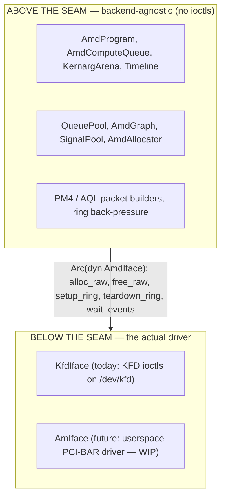
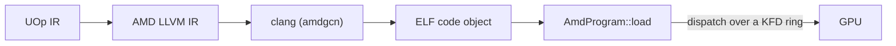

# The AMD Backend

Svod runs on AMD GPUs by talking to the kernel driver directly. There is no HIP,
no ROCr/HSA runtime, no `libamdhip64.so` — the only external dependency is
`clang` (for compilation, exactly as the [CPU JIT loader](../jit-loader.md)
uses it). Everything else — allocating VRAM, building command rings, dispatching
kernels, waiting on completion — is done with raw `ioctl` calls against
`/dev/kfd`, the Linux **KFD** (Kernel Fusion Driver) interface that ships inside
the `amdgpu` kernel module.

This is a faithful port of [tinygrad](https://github.com/tinygrad/tinygrad)'s
`ops_amd.py`, which is itself KFD-direct. Nearly every function in the backend
carries a `ops_amd.py:NNN` / `hcq.py:NNN` citation so the design can be checked
against its reference.

The code lives in the `svod-device` crate under `device/src/amd/`.

---

## A runtime-detected execution provider

The AMD backend is **always compiled** (on every Unix host — `cfg(unix)`, since
`nix` is Unix-only), never gated behind a cargo feature. Availability is decided
**at runtime, not at compile time**, ORT-style: the device registry probes for
hardware with `svod_device::amd::has_devices()` — a sysfs-only, side-effect-free
read of the KFD topology — and registers the `"AMD"` device factory *only* when a
supported GPU is present. A host with no `/dev/kfd` cleanly has no `"AMD"` device
type.

The point is robustness: because the backend is in every build's type-check, an
API change in the generic core (a `Program` or `PlanContext` trait, say) is caught
on every dev box at `cargo check`, not only on the GPU host. The cost is compile
time, which is accepted. The bindgen step is correspondingly **hermetic** — it
runs on all platforms against vendored headers, with no system kernel headers
required (see [KFD Bindings](./kfd-bindings.md)).

---

## Why KFD-direct instead of HIP

A "sane person" writing an AMD backend reaches for HIP (the CUDA-alike runtime)
or the HSA runtime underneath it. Svod deliberately does not. The reasoning:

- **No userspace runtime dependency.** HIP/ROCr is hundreds of megabytes of
  shared libraries that must match the kernel driver version. KFD is a stable
  kernel `ioctl` ABI; a Svod binary links `libc` + `nix` and shells out to
  `clang`, nothing else. The backend works on any host with a recent enough
  `amdgpu` and `clang`'s `amdgcn` target — no ROCm install.
- **Deterministic control.** We own the command ring, the doorbell, the
  timeline signal, the page-table-visible allocations, and the scratch buffer.
  There is no runtime between us and the hardware reordering submissions or
  hiding state, which matters for the lock-free multi-owner dispatch the backend
  is built around (see [Queues & Dispatch](./queues-and-dispatch.md)).
- **A proven reference.** tinygrad's HCQ (Hardware Command Queue) model is
  KFD-direct and battle-tested. Porting it means we inherit its exact packet
  layouts and bring-up sequence rather than reverse-engineering our own.

HIP and ROCr both sit *on top of* KFD — they open the same `/dev/kfd` and issue
the same ioctls we do. Going direct removes the middle layers, not a capability.

:::note
KFD-direct is the AMD analogue of what the [CPU JIT loader](../jit-loader.md)
does for x86/ARM: skip the heavyweight vendor toolchain and drive the bare
mechanism in-process. The CPU loader pipes through `clang` and `mmap`s the
result; the AMD backend pipes through `clang` and dispatches the result over a
KFD ring.
:::

---

## The backend seam

The backend is split into two halves by the **`AmdIface`** trait
(`device/src/amd/iface.rs`):



Everything that is *not* a kernel call — the 16 MiB command ring, the PM4/AQL
packet construction, the kernarg bump arena, the timeline counter, the program
loader — lives above the seam and is shared by every backend. The trait is
deliberately tiny: **five required methods** (`alloc_raw`, `free_raw`,
`setup_ring`, `teardown_ring`, `wait_events`) plus three hooks that default to a
no-op (`queue_event_mailbox`, `publication_checkpoint`,
`update_queue_percentage`). The key insight that keeps it small is that the
ring, GART page, EOP buffer and MQD are *just GPU memory* — they get allocated
above the seam via `alloc_raw`, and the only thing a driver genuinely has to do
differently is **activate the queue** (map the doorbell, tell the scheduler the
ring exists): that is `setup_ring`.

The implementor is chosen at device-open time from the `SVOD_AMD_BACKEND`
environment variable:

| `SVOD_AMD_BACKEND` | Backend | Status |
|---|---|---|
| `kfd` (default) | `KfdIface` — KFD-direct | Production |
| `am` | `AmIface` — userspace AM driver | Not yet selectable — see below |

:::caution[AM is not runnable yet]
Setting `SVOD_AMD_BACKEND=am` currently returns an error (`device.rs` accepts
only `kfd`) — no AM type implements the seam yet. The userspace **AM** driver
targets a **CDNA3 SR-IOV VF** (gfx9.4.3) and is a work in progress:
discovery, the VF↔GIM mailbox, indirect register access, the GMMU, and GMC
bring-up are implemented and **validated on the live VF**, but no GPU engine yet
consumes work (the doorbell aperture is host-owned). See
[The AM Driver](./am-driver.md) for exactly what exists today and where the
boundary is.
:::

---

## Device-local memory and the SDMA copy queue

The backend installs an **SDMA copy queue** (`AmdCopyQueue`) at device-open on
CDNA parts — RDNA keeps the host-visible path, and `AMD_DISABLE_SDMA` turns the
attempt off entirely — which flips `has_sdma_queue` true. With it, intermediates
can live in **device-only VRAM** (`cpu_access = false`) and host↔device copies go
through asynchronous DMA: `_copyin`/`_copyout` stage through the SDMA queue,
`_transfer` does a direct device→device copy. When no copy queue is present the
allocator falls back to the simpler model — every buffer is forced host-visible
(CPU-mappable VRAM or GTT) and copies are plain `memmove` after a
`synchronize()`. Allocation and copies are covered in
[KFD Bindings](./kfd-bindings.md).

---

## Running on AMD

Select the AMD GPU with the `SVOD_DEVICE` environment variable — `AMD:0` is the
first AMD node in the [KFD topology](./kfd-bindings.md). For example, running a
model end-to-end:

```bash
SVOD_DEVICE=AMD:0 cargo run --release -p svod-model --example gigaam_infer -- ./audio.wav
```

The only host requirement beyond a supported AMD GPU is `clang` with the
`amdgcn` target on `PATH` (used to compile kernels — see
[Compile & Graph](./compile-and-graph.md)); there is no ROCm/HIP install. The
[Queues & Dispatch](./queues-and-dispatch.md) page lists every environment knob.

---

## Where it sits in the pipeline

The AMD backend is the device half of the compiler. The frontend lowers tensors
to a single UOp IR; codegen maps that IR onto GPU thread indices (the
["Add GPU Dims"](../../architecture/codegen/devectorizer.md) stage turns ranges into
`gidxN`/`lidxN` SPECIAL indices, per [IR Design](../../architecture/ir-design.md)); the renderer emits
AMD LLVM IR; and this backend compiles and runs it:



The [JIT Graphs](../../architecture/jit-graphs.md) layer wraps this so a model graph compiles
once and replays many times.

---

## Reading guide

| Page | What it covers |
|---|---|
| [KFD Bindings](./kfd-bindings.md) | How the kernel ABI is bound (bindgen over a vendored header), the exact ioctls used, sysfs topology, and the allocation flow |
| [Queues & Dispatch](./queues-and-dispatch.md) | The command ring, PM4 vs AQL, the bounded compute-lane pool, publication and device-wide drains, the timeline, and every configuration env var |
| [Compile & Graph](./compile-and-graph.md) | How a kernel goes from LLVM IR to a loaded program, how it dispatches, and how graph capture/replay works (AQL by default, PM4 opt-in) |
| [The AM Driver](./am-driver.md) | The in-progress userspace driver: what is built, what is deferred, and how it plugs into the seam |
| [Debugging](./debugging.md) | The VA→allocation registry for fault triage, the poison latch, and the dispatch/tracing diagnostics |
