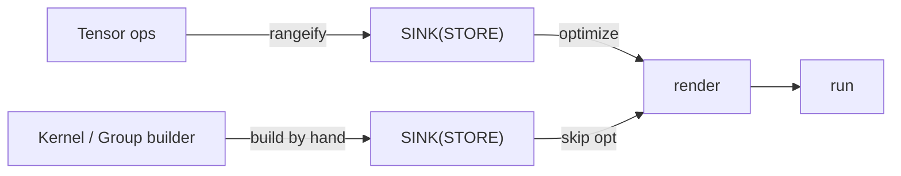
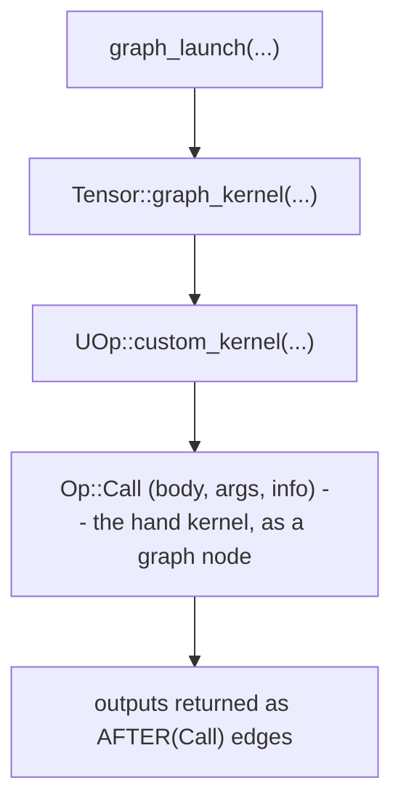
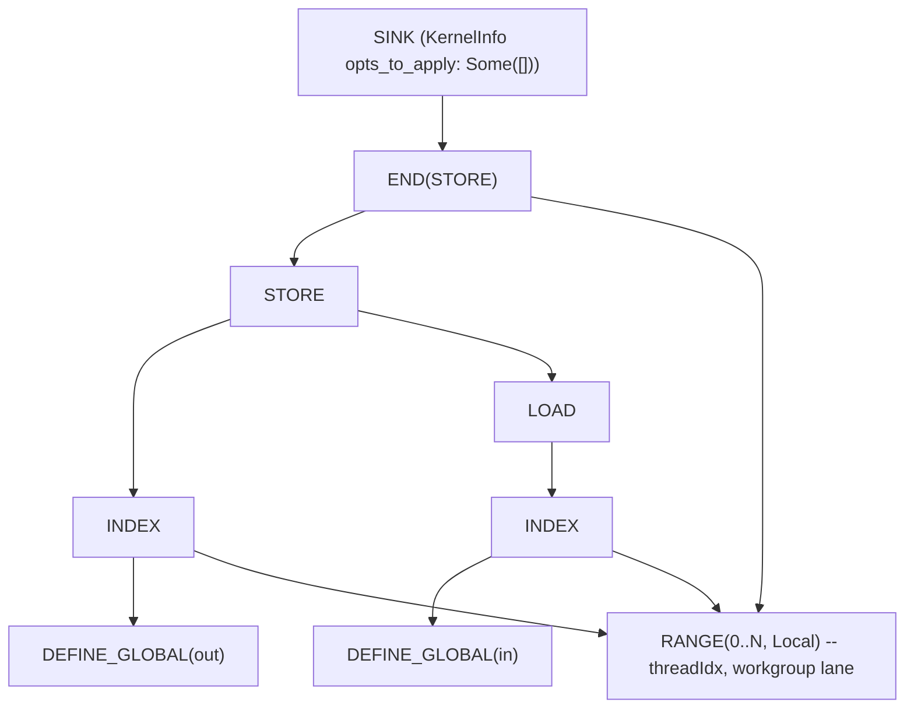

# Authoring into the One IR

Most tile frameworks answer "how do I let users hand-write a kernel?" by adding a *layer*. That
layer is a new DSL with its own compiler, its own debugger, and its own profiler bolted onto the
side of the framework. `tk`'s defining choice is to add **no layer at all**. A hand-written kernel
lowers into the *same* UOp IR as everything else, so it shares one rendering path, one debugger,
and one profiler — and a developer building an ML application has exactly **one IR to learn**,
from a `Tensor` add all the way down to a hand-tuned attention kernel.

This chapter shows how that works. It assumes you've read
[One IR to Rule Them All](../architecture/ir-design) and the
[Execution Pipeline](../architecture/pipeline) — you should know what a UOp is and how a lazy
`Tensor` becomes a compiled kernel. We won't re-explain that philosophy; we'll show how a
hand-written kernel slots *into* it.

---

## No new layer: a kernel is just a subgraph

Recall the claim from the [Overview](./overview): `tk` is a builder, not a backend. It does not
emit assembly, and it does not define an IR of its own. It emits the *exact same* lowered IR the
normal codegen path already consumes — `RANGE` loops, `INDEX`/`LOAD`/`STORE` memory ops, `WMMA`
matrix instructions (and, where you need it, raw LLVM/ASM as `Op::Custom`).

So authoring a kernel is just *constructing a UOp DAG by hand* instead of letting `rangeify`
construct it for you. The output is a `SINK` UOp — the very same thing the scheduler produces for
an autotuned kernel. Hand-written and compiler-generated kernels aren't two kinds of object;
they're the same kind, built two different ways:



---

## What staying in one IR buys you

This is the whole point of the chapter, so it's worth making concrete. Because a hand-written
kernel *is* just more UOps, it inherits all of the compiler's infrastructure for free — there is
nothing tk-specific to build or to learn:

- **One renderer.** The same `svod-codegen` path that lowers graph kernels to LLVM IR — and from
  there to an AMD binary or to PTX — renders your `tk` kernel. There is no second backend to write, port, or keep in sync.
- **One debugger.** You inspect a `tk` kernel exactly like any computation: print the UOp tree.
  A hand-written Flash Attention and an autotuned matmul appear in the *same* textual form, with
  the same op names — no separate dump format, no "what is kernel X" mystery.
- **One profiler.** Because a `tk` kernel carries its `name` through the IR, it shows up in the
  device profile *by that name* — not as an anonymous blob — timed by the same hardware-timestamp
  path as every other kernel. Profiling hand-written and graph kernels is one workflow.
- **One IR to learn.** This is the developer-facing payoff. To build, optimize, debug, and
  profile an ML application on Svod — from a `Tensor` add down to a hand-tuned attention kernel —
  you learn exactly *one* representation. There's no "tensor IR vs. kernel DSL vs. backend IR" to
  hold in your head, because there is only the one UOp graph.

The usual arrangement is the opposite: a tile DSL is a *separate* language with its own compiler,
its own debugger, and its own profiler view, bolted onto the side of the framework. Each of those
is a layer the framework has to build and a thing the user has to learn. `tk` adds none of them —
that is the cost it refuses to pay.

---

## The builder: `Kernel` and `Group`

You author with two types (from the AUTHOR face in `tk/src/lib.rs`):

- **`Kernel`** (`tk/src/kernel.rs`) is the eager builder. It hands you the raw materials —
  grid/block dimensions (which become `SPECIAL` ops), loop ranges (`RANGE`), shared-memory
  buffers (`DEFINE_LOCAL`), register buffers (`DEFINE_REG`), and global parameters. You bind
  tensors to it and ask it for tiles.
- **`Group`** (`tk/src/group.rs`) is the cooperating wave (or group of waves). It carries the
  *compute* vocabulary: loads and stores between memory spaces, the `mma` matrix multiply,
  reductions, shuffles, elementwise maps.

Every `Group` operation builds UOp nodes directly. A load opens the necessary `RANGE`s, emits a
`STORE` that closes them, and returns the destination tile re-wrapped with a dependency edge so
the next operation orders after it. You're writing a graph, eagerly, one tile op at a time.

When you're done, you call `Kernel::finish(...)`, which closes the open ranges and wraps
everything in a terminal `SINK`.

---

## The one marker that changes everything

Here's the field that makes hand-authoring work. The `SINK` that `finish` produces carries a
`KernelInfo`, and `tk` stamps it with:

```rust
KernelInfo { opts_to_apply: Some(vec![]), name: Some(...), .. }
```

That `opts_to_apply: Some(vec![])` is the whole game. When the optimizer encounters a kernel,
it checks this field (in `schedule/src/optimizer/`):

| `opts_to_apply` | Meaning |
|-----------------|---------|
| `None` | "You choose." Run heuristics, or [beam search](../architecture/optimizations/kernel-search) if enabled. |
| `Some(vec![])` | "This body is **already lowered**. Apply *zero* further optimizations." |
| `Some(non-empty)` | "Apply exactly these optimizations, in order." |

A `tk` kernel uses `Some(vec![])`: you wrote the schedule by hand, so the optimizer leaves it
untouched. The rewrite passes that *do* still run (algebraic simplification, index lowering)
are told not to descend into the kernel body. Your hand-tuned loop survives to codegen exactly
as written — but it's still a normal UOp graph that the *same* renderer turns into LLVM IR and
the *same* runtime executes.

And this isn't only a convenience ("you already optimized it, so don't bother"). It's a
**safety contract**, because the optimizer *cannot* safely touch a hand-written body. That body
may contain raw LLVM/ASM intrinsics as `Op::Custom` — the machine-scheduler primitives from
[Where the FLOPS Hide](./where-flops-hide) are exactly this. The optimizer has **no model of
what those opaque ops do**, so re-tiling, reordering, or fusing across them could silently change
the kernel's results — or quietly destroy the performance you hand-built. So `Some(vec![])` tells
the optimizer the only safe thing it can do with a body it doesn't fully understand: leave it
alone.

---

## Two ways in: direct launch and graph node

There are two routes from a finished `Kernel` to running code, for the two different audiences.

:::tip For GPU experts
The scheduler treats the kernel's `Op::Call` like any other graph node — it walks the `AFTER`/`Call` dependency chains to find kernel boundaries and emits it as one scheduled kernel, while the rewrite passes run in a *calls-preserving* traversal that doesn't descend into the body. So your hand-lowered `SINK` is scheduled and dependency-tracked exactly like an autotuned kernel, but its interior is never rewritten.
:::

### Direct launch (the DEBUG face)

`compile` / `launch` / `run_kernel` (`tk/src/launch.rs`) take a finished `SINK`, bind it to
concrete device buffers, render, compile, and dispatch — bypassing the tensor scheduler
entirely. This is how you test and benchmark a kernel in isolation; see
[Debugging](./debugging).

### Graph node (the USE face)

In production you don't want a separate launch — you want the kernel to be part of the lazy
graph, so it fuses into scheduling and dependency tracking like everything else. That path is:



The finished `SINK` becomes the `body` of an `Op::Call` node (see `Op::Call` in the
[Op Bestiary](../architecture/op-bestiary)). Each output tensor is returned as an
`AFTER(Call)` — an ordinary dependency edge. From the scheduler's point of view, your kernel is
just one more node in the DAG with inputs and outputs. It gets scheduled, its buffers get
allocated, its dependencies get tracked — by the same machinery described in the
[Execution Pipeline](../architecture/pipeline).

That's the payoff of "one IR": the hand-written kernel and the autotuned kernel are *peers*.

---

## No silent fallbacks

A subtle failure mode in kernel libraries: you call the fast path, it quietly decides it can't
handle your input, and you get the slow path with no warning — or worse, a wrong answer. `tk`'s
public kernels (`tk/src/kernels/{fa,matmul}.rs`, via `launch_custom` in `tk/src/launch.rs`) are
built to make that impossible. Every entry point returns a three-way result:

| Result | Meaning | What you do |
|--------|---------|-------------|
| `Ok(Some(tensor))` | The kernel ran. | Use the tensor. |
| `Ok(None)` | "Doesn't apply here" — unsupported arch, or the shape doesn't tile cleanly. | Fall back to a graph implementation, deliberately. |
| `Err(...)` | The *request* is malformed — wrong dtype, dimensions not divisible, non-square operands. | Fix the call. This is a bug, raised loudly. |

The distinction between `Ok(None)` (a legitimate "not me") and `Err` (a caller mistake) is the
point. Unsupported hardware routes to a fallback; a dtype the kernel can't accept is an error
you see immediately, not a silent detour to the slow path.

---

## What it looks like as IR

The reward for all this is that a hand kernel prints like any other UOp graph. A trivial tile
store — load a tile, write it back — lowers to the familiar `RANGE` / `INDEX` / `STORE` shape:



No new node types, no separate dialect — the same operations the
[matmul journey in the IR chapter](../architecture/ir-design)
ends on. A real kernel adds `WMMA`, `DEFINE_LOCAL` (LDS), and `DEFINE_REG` (registers), but the
shape is the same: a SINK over a STORE, scoped by ranges.

---

## Why this matters

The reason Svod can offer *both* "let the compiler find the schedule" and "I'll write the
schedule myself" — without two compilers — is that both produce the same artifact: a `SINK` of
UOps. The optimizer's `opts_to_apply` field is the seam between them, and it's one enum away
from `None`. [tk vs HipKittens vs CuTile](./comparison) returns to why that's unusual.

Next, put the builder to work end to end: [Writing a Kernel](./first-kernel) walks through
authoring and running the simplest real kernel, line by line.
