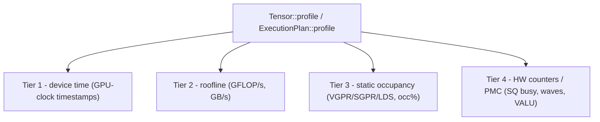

# Profiling and Benchmarking Kernels

[Debugging](./debugging) answers "is this kernel correct, and roughly how fast?" with a single
hardware timestamp. This chapter is about the question after that: *where does the time go, and
what is the bottleneck?* Svod ships a **layered kernel profiler** that answers it in four tiers —
device time, a roofline, static occupancy, and AMD hardware counters — all behind one call.

The profiler lives in the `runtime` crate, not in `tk`, and that placement is the point: it works
on **any** `Tensor` or `ExecutionPlan`, whether the kernels inside came from the graph optimizer
or were hand-authored with `tk`. A graph matmul, a fused feed-forward block, and a hand-written
Flash Attention all show up in the same table, timed and analysed the same way. It is documented
in this section only because hand-kernel authors are the readers most likely to reach for it.

:::note Framework-wide, not tk-only
Everything below applies to any realizable `Tensor`. The [one-IR design](./lowering) is what makes
this possible: a `tk` kernel is just more UOps, so it carries its `name` into the device profile
and is measured by the exact same path as an autotuned kernel.
:::

---

## The four tiers

Each tier adds a column group to the report. Lower tiers are cheap and always available; higher
tiers need more (an estimate, a descriptor decode, a stable GPU). You opt into the expensive ones.



| Tier | What it reports | Source | Needs execution? |
|------|-----------------|--------|------------------|
| **1 — device time** | per-kernel GPU execution time | GPU-clock dispatch timestamps | yes |
| **2 — roofline** | derived **GFLOP/s** and **GB/s** | FLOP estimate from the kernel's IR; bytes from the plan's buffers | yes (rates need time) |
| **3 — static occupancy** | VGPR / SGPR / LDS / scratch usage and VGPR-limited **occupancy %** | decoded from the AMD kernel descriptor | no — pure static decode |
| **4 — hardware counters (PMC)** | SQ/GRBM/L2 counters — busy cycles, waves, VALU/SALU, LDS bank conflicts, MFMA-busy, L2 hit/miss — plus derived metrics (MFMA util, bank-conflict rate, achieved clock) | PM4 perf-counter packets (gfx11: on the ring; gfx942: AQL vendor packets, gang-run across XCCs) | yes, on a stable GPU |

A few details worth knowing:

- **Tier 2** estimates FLOPs by walking the kernel's IR (AST). For scheduler-built kernels the
  ranges are bounded, so the estimate is a real count and the GFLOP/s column is populated. The
  GB/s figure counts each distinct LOAD/STORE buffer once, so it is available whenever Tier 2 is.
- **Tier 3** is modeled for RDNA3.5 (wave32), whose register-file geometry is known, so it reports
  an occupancy %. On CDNA3 (wave64) the resources (VGPR/SGPR/LDS/scratch) are still decoded and
  shown, but the occupancy column reads `-` because that geometry is not modeled. Occupancy here is
  the **VGPR-limited** first-order limiter only — LDS and workgroup limits are not folded in.
- **Tier 4** programs the perf counters via PM4 and sums them across the grid (on gfx942, across
  all XCCs). Availability is per-arch: **gfx11 (RDNA3.5)** exposes three SQ selectors — `sqbusy`,
  `waves`, `valu`. **gfx942 (CDNA3)** exposes the full set — `sqbusy`, `waves`, `valu`, `salu`,
  `bankconflict`, `ldsact`, `mfmabusy`, `mfma`, `gui` (GRBM active), `l2hit`, `l2miss` — and the
  report adds columns *derived* from them, matched to rocprofiler-compute's gfx942 definitions:
  `bankconf` (conflicts per clean access), `valuutil`, `mfmaduty` (MFMA / SQ-busy), `mfmautil`
  (clock-normalized MFMA utilization), `sclk` (achieved core clock), and `l2hitpct`. Selecting a
  counter the running arch does not implement is dropped with a warning, not an error.

The report's columns adapt to what was collected: a Tier-1-only run prints just timing, and the
GFLOP/s, resource, and counter columns appear only when their tier ran.

---

## The API: `profile` on a `Tensor` or `ExecutionPlan`

There are two entry points. Both take a `&ProfileOptions` and return a `RunProfile`.

```rust
// tensor/src/realize.rs — realizes the tensor as a side effect, like realize()
pub fn profile(&mut self, opts: &ProfileOptions) -> Result<RunProfile>

// runtime/src/execution_plan.rs — profile an already-prepared plan
pub fn profile(&self, opts: &ProfileOptions) -> Result<RunProfile>
```

`Tensor::profile` is the convenient one: it prepares the plan, runs the profiled path, and
finalizes the result so the tensor ends up realized exactly as `realize()` would leave it.
`ExecutionPlan::profile` is for when you already hold a prepared plan (it is what the benches and
`Tensor::profile` both call underneath).

```rust
use svod_runtime::ProfileOptions;

// Any Tensor — a tk kernel here, but a pure graph computation works identically.
let mut out = svod_tk::flash_attention(&q, &k, &v)?;
let report = out.profile(&ProfileOptions::default())?;

// The library NEVER prints. render_table() returns a String; the caller decides.
print!("{}", report.render_table());
```

Or against a plan you prepared yourself:

```rust
let plan = out.prepare()?;
let report = plan.profile(&ProfileOptions::from_env())?;
print!("{}", report.render_table());
```

`RunProfile::render_table()` returns a `String` — a per-kernel table (kernels aggregated by entry
point, sorted by total time) with whichever tier columns were populated. The profiler is a pure
formatter: it never writes to stdout or stderr itself, so logging, files, and stderr echoes are
always the caller's choice.

---

## `ProfileOptions` and `from_env`

```rust
// runtime/src/profiler.rs
pub struct ProfileOptions {
    pub iters: u32,             // replays; the per-kernel minimum device time is kept
    pub static_analysis: bool,  // Tier 2/3 (flops/bytes/resources) — cheap, on by default
    pub counters: PmcSelection, // Tier 4 hardware counters
}
```

`ProfileOptions::default()` is `{ iters: 1, static_analysis: true, counters: PmcSelection::None }`
— Tiers 1–3, single pass. Construct it directly for explicit control:

```rust
use svod_runtime::{ProfileOptions, PmcSelection};

let opts = ProfileOptions {
    iters: 50,
    static_analysis: true,
    counters: PmcSelection::Default, // add Tier 4
};
```

`PmcSelection` is `None` (Tiers 1–3 only), `Default` (the implemented SQ counters), or
`Custom(Vec<PmcCounter>)` (an explicit list).

`ProfileOptions::from_env()` is the single place profiling env vars are read:

| Env var | Effect |
|---------|--------|
| `SVOD_PROFILE_ITERS` | replay count for the min-merge (clamped to at least 1) |
| `SVOD_PMC` | Tier-4 selection: empty or `0` → off; `1` → the default counter set; otherwise a comma-separated token list. Tokens: `sqbusy`, `waves`, `valu`, `salu`, `bankconflict`, `ldsact`, `mfmabusy`, `mfma`, `gui`, `l2hit`, `l2miss` (gfx942; gfx11 supports `sqbusy`/`waves`/`valu`) |
| `SVOD_PMC_FORCE` | `1` bypasses the stable-power-state gate on parts that cannot reach it (e.g. SR-IOV VFs). Event counts stay valid; cycle counters scale with the achieved clock, so read `sclk` and prefer the clock-normalized `mfmautil` (see limitations) |

```bash
# Profile with 20 replays and the default hardware counters.
SVOD_DEVICE=AMD:0 SVOD_PROFILE_ITERS=20 SVOD_PMC=1 ...

# Only VALU instructions and SQ-busy cycles.
SVOD_DEVICE=AMD:0 SVOD_PMC=valu,sqbusy ...
```

### Accumulate-and-min

When `iters > 1` (or across criterion's many invocations), the profiler does **not** average. Each
pass produces a `RunProfile`, and passes are merged by `RunProfile::merge_min`: per kernel, the
faster (minimum device-time) sample wins, carrying *that* sample's counters and static analysis.
Minimum is the robust estimator of a kernel's intrinsic cost — it rejects the scheduling jitter,
contention, and clock-ramp outliers that inflate a mean.

---

## Criterion integration: `--profile-time`

The `tk` benches measure each kernel through its public `Tensor` interface, timed by the same
per-kernel GPU stamps the profiler uses (`tk/benches/common.rs`). Plain `cargo bench` reports only
the GPU device time per benchmark. But criterion has a `--profile-time <seconds>` mode, and the
benches hook the **full layered profiler** into it via criterion's custom `Profiler` trait — the
same extension point flamegraph generation uses.

The hook is `PlanProfiler` in `tk/benches/common.rs`. While a benchmark is being profiled,
`bench_plan` captures the benchmark's plan on every invocation through the process-global
`bench_profiler()`, each capture profiled via `ProfileOptions::from_env()` and merged into the
session accumulator by per-kernel min. On stop, the merged table is rendered with `render_table()`,
written to a file under criterion's output directory, and echoed to stderr:

```
target/criterion/<id>/profile/svod-profile.txt
```

The wiring is one line in each bench's `criterion_group!` — it installs the shared profiler as the
criterion config (from `tk/benches/kmeans.rs`):

```rust
criterion_group! {
    name = benches;
    config = Criterion::default().with_profiler(common::bench_profiler());
    targets = bench_kmeans
}
criterion_main!(benches);
```

Run it like any criterion bench, adding `--profile-time` (and any tier env vars):

```bash
# Plain bench: GPU device time per benchmark, profiler dormant.
SVOD_DEVICE=AMD:0 cargo bench -p svod-tk --bench kmeans

# Drive the layered profiler for ~5s per benchmark, with hardware counters.
SVOD_DEVICE=AMD:0 SVOD_PMC=1 cargo bench -p svod-tk --bench kmeans -- --profile-time 5
```

Because `bench_profiler()` is dormant unless criterion is profiling, plain `cargo bench` is
completely unaffected — same numbers, no extra passes.

---

## Honest limitations

:::caution Two things the profiler cannot give you
**Tier 2 GFLOP/s is blank for hand-authored kernels.** The FLOP estimate walks the kernel's IR,
and it only auto-rates **scheduler-built** kernels. A hand-authored `tk` kernel uses unbounded
symbolic ranges, so the AST walk *saturates* instead of forming a real count — the profiler treats
that as "no reliable estimate" rather than printing a garbage roofline, so the **GFLOP/s column
shows `-`** for those kernels. (GB/s still works, since bytes come from the plan's buffers, not the
IR.) Compute the roofline for hand kernels by hand from the algorithm's known FLOP count and the
Tier-1 device time.

**Tier 4 wants a stable power state — but can work without one.** Cycle counters (`sqbusy`, `gui`)
scale with the core clock, so they are most comparable at a fixed clock. On the default `auto`
state the profiler does *not* fail — it degrades to timing only and notes that counters want the
`profile_standard` state; put the GPU there first (e.g. `amd-smi set -l stable_std`), then re-run
with `SVOD_PMC`. On parts that *cannot* pin a pstate (SR-IOV VFs), set `SVOD_PMC_FORCE=1` to collect
anyway: **event** counts (bank conflicts, waves, MFMA-busy, VALU) are clock-independent and stay
correct, and `mfmautil` is normalized against the device's peak clock (`MFMA / (F_peak · wall)`) so
it stays comparable across clocks. The `sclk` column reports the clock the run actually achieved.

**External profilers still can't see svod — but the in-process counters now cover gfx942 too.**
Both **gfx11** (`GC_11_5_0`, three SQ selectors, PM4 on the ring) and **gfx942** (`GC_9_4_3`, the
full SQ/GRBM/L2 set + derived metrics) are supported in-process; the gfx942 path submits the perfmon
PM4 as **AQL vendor packets** bracketing the dispatch, gang-executed across all XCCs, mirroring
ROCr's aqlprofile — its counts are validated bit-for-bit against `rocprofv3` on the same kernel.
Reaching for `rocprofv3` / `rocprof-compute` directly still does **not** work: svod submits AQL/PM4
to its *own* KFD compute queue (own ring + doorbell), bypassing ROCr/HSA, so the rocprofiler-sdk HSA
interception captures **zero** dispatches from a svod process. That external path is now only an
*independent cross-check*: dump the kernel IR (`SVOD_DUMP_AMD_IR=<dir>`), compile it to a code object
with svod's own flags (`clang -x ir -c -O2 --target=amdgcn-amd-amdhsa -mcpu=gfx942 -mcumode
-nogpulib`, then link with `ld.lld -shared`), and `hipModuleLoad` it from a tiny HIP harness — that
dispatch *is* ROCr-visible, so `rocprofv3 -i counters.txt` profiles the identical machine code. Note
that `rocprofv3`'s counter mode serializes each dispatch, padding its active-cycle window ~3× vs
svod's tight in-process window, so **event** counts match but **cycle**-derived numbers (`gui`,
`mfmautil`) will differ — svod's is the tighter, truer window.
:::

---

## Which call for which question

| You're asking… | Use |
|----------------|-----|
| "How long does each kernel take on this GPU?" | `Tensor::profile` with `ProfileOptions::default()`, read the device-time column |
| "Is this kernel compute- or bandwidth-bound?" | the Tier-2 GFLOP/s and GB/s columns (graph kernels), or compute the roofline by hand (tk kernels) |
| "Why is occupancy low — registers or LDS?" | the Tier-3 VGPR/SGPR/LDS/occ% columns (no run needed) |
| "Is the kernel issuing enough VALU work per busy cycle?" | Tier-4 `SVOD_PMC=1`, on a `profile_standard` GPU |
| "Is my gfx942 kernel matrix-bound or LDS/softmax-bound?" | Tier-4 on gfx942: `SVOD_PMC=mfmabusy,gui` (→ `mfmautil`) and `SVOD_PMC=bankconflict,ldsact` (→ `bankconf`) — low MFMA util + high conflict rate ⇒ LDS/softmax-bound |
| "How does this compare to the graph-native baseline over many runs?" | `cargo bench --profile-time` — see [Debugging → Timing on real hardware](./debugging) |

For correctness and structural checks rather than performance, stay in [Debugging](./debugging);
for problems *below* the kernel (queues, faults, the driver), see
[AMD Backend → Debugging](../backends/amd/debugging).
