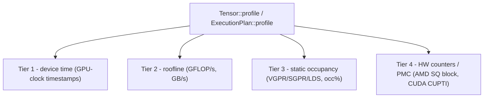

# Profiling and Benchmarking Kernels

[Debugging](./debugging) answers "is this kernel correct, and roughly how fast?" with a single
hardware timestamp. This chapter is about the question after that: *where does the time go, and
what is the bottleneck?* Svod ships a **layered kernel profiler** that answers it in four tiers —
device time, a roofline, static occupancy, and hardware counters — all behind one call.

The profiler lives in the `runtime` crate, not in `tk`, and that placement is the point: it works
on **any** `Tensor` or `ExecutionPlan`, whether the kernels inside came from the graph optimizer
or were hand-authored with `tk`. A graph matmul, a fused feed-forward block, and a hand-written
Flash Attention all show up in the same table, timed and analysed the same way. It is documented
in this section only because hand-kernel authors are the readers most likely to reach for it.

:::note[Framework-wide, not tk-only]
Everything below applies to any realizable `Tensor`. The [one-IR design](./lowering) is what makes
this possible: a `tk` kernel is just more UOps, so it carries its `name` into the device profile
and is measured by the exact same path as an autotuned kernel.
:::

---

## The four tiers

Each tier adds a column group to the report. Lower tiers are cheap and always available; higher
tiers need more (an estimate, a descriptor decode, a stable GPU). You opt into the expensive ones.



| Tier | What it reports | Source | Needs execution? |
|------|-----------------|--------|------------------|
| **1 — device time** | per-kernel GPU execution time | GPU-clock dispatch timestamps | yes |
| **2 — roofline** | derived **GFLOP/s** and **GB/s** | FLOP estimate from the kernel's IR; bytes from the plan's buffers | yes (rates need time) |
| **3 — static occupancy** | VGPR / SGPR / LDS / scratch usage and an **occupancy %** | AMD: decoded from the kernel descriptor. CUDA: `cuFuncGetAttribute` plus `cuOccupancyMaxActiveBlocksPerMultiprocessor` | no dispatch — a static decode on AMD, a driver query on CUDA |
| **4 — hardware counters (PMC)** | AMD: SQ busy cycles, waves, VALU instructions. CUDA: SM cycles, warps, instructions, tensor-pipe cycles, DRAM bytes | AMD: PM4 perf-counter packets summed across the grid. CUDA: the CUPTI range profiler | yes, and the counters must be unlocked |

A few details worth knowing:

- **Tier 2** estimates FLOPs by walking the kernel's IR (AST). For scheduler-built kernels the
  ranges are bounded, so the estimate is a real count and the GFLOP/s column is populated. The
  GB/s figure counts each distinct LOAD/STORE buffer once, so it is available whenever Tier 2 is.
- **Tier 3** decodes AMD resources (VGPR/SGPR/LDS/scratch) straight from the kernel descriptor, with
  no GPU access at all. Its occupancy % is modeled only for gfx11 (RDNA3/3.5, wave32), whose
  register-file geometry is known; on CDNA3 (wave64) the resources are still shown but the occupancy
  column reads `-`. That AMD number is the **VGPR-limited** first-order limiter only — LDS and
  workgroup limits are not folded in. On CUDA the numbers come from the loaded function instead:
  registers-per-thread, static shared memory and local (scratch) bytes from `cuFuncGetAttribute`, and
  an occupancy the *driver* computes (`cuOccupancyMaxActiveBlocksPerMultiprocessor` for the block
  size of the last launch, over the SM's thread capacity), so it does fold in shared memory and block
  shape. There is no SGPR column on CUDA.
- **Tier 4** is per-backend. On AMD it programs the SQ block with PM4 packets and sums across the
  grid: `sqbusy` (busy cycles), `waves` (waves launched) and `valu` (VALU instructions issued),
  which together answer the ILP/occupancy question timing alone cannot. On CUDA it drives the
  CUPTI range profiler: `cycles`, `warps`, `inst`, `tensor` (tensor-pipe active cycles) and `dram`
  (bytes through DRAM) — `tensor` against `cycles` is tensor-core utilization, and `dram` separates
  a bandwidth-bound kernel from an issue-bound one. Counter tokens are unique across backends, so a
  selection naming another backend's counters drops them rather than mis-programming a block.

The report's columns adapt to what was collected: a Tier-1-only run prints just timing, and the
GFLOP/s, resource, and counter columns appear only when their tier ran.

---

## The API: `profile` on a `Tensor` or `ExecutionPlan`

There are two entry points. Both take a `&ProfileOptions` and return a `RunProfile`.

```rust
// tensor/src/realize.rs — realizes the tensor as a side effect, like realize()
pub fn profile(&self, opts: &ProfileOptions) -> Result<RunProfile>

// runtime/src/execution_plan.rs — profile an already-prepared plan
pub fn profile(&self, opts: &ProfileOptions) -> Result<RunProfile>
```

`Tensor::profile` is the convenient one: it prepares the plan, runs the profiled path, and
finalizes the result so the tensor ends up realized exactly as `realize()` would leave it.
`ExecutionPlan::profile` is for when you already hold a prepared plan (it is what the benches and
`Tensor::profile` both call underneath).

```rust
use svod_runtime::ProfileOptions;

// Any Tensor — a tk kernel here, but a pure graph computation works identically.
let out = svod_tk::flash_attention(&q, &k, &v)?;
let report = out.profile(&ProfileOptions::default())?;

// The library NEVER prints. render_table() returns a String; the caller decides.
print!("{}", report.render_table());
```

Or against a plan you prepared yourself:

```rust
let plan = out.prepare()?;
let report = plan.profile(&ProfileOptions::from_env())?;
print!("{}", report.render_table());
```

`RunProfile::render_table()` returns a `String` — a per-kernel table (kernels aggregated by entry
point, sorted by total time) with whichever tier columns were populated. The profiler is a pure
formatter: it never writes to stdout or stderr itself, so logging, files, and stderr echoes are
always the caller's choice.

---

## `ProfileOptions` and `from_env`

```rust
// runtime/src/profiler.rs
pub struct ProfileOptions {
    pub iters: u32,             // replays; the per-kernel minimum device time is kept
    pub static_analysis: bool,  // Tier 2/3 (flops/bytes/resources) — cheap, on by default
    pub counters: PmcSelection, // Tier 4 hardware counters
    pub origin_depth: Option<usize>, // origin rollup depth; None keeps the full path
}
```

`ProfileOptions::default()` is `{ iters: 1, static_analysis: true, counters: PmcSelection::None, origin_depth: None }`
— Tiers 1–3, single pass. Construct it directly for explicit control:

```rust
use svod_runtime::{ProfileOptions, PmcSelection};

let opts = ProfileOptions {
    iters: 50,
    static_analysis: true,
    counters: PmcSelection::Default, // add Tier 4
    origin_depth: Some(3), // roll the origin rows up to three frames
};
```

`PmcSelection` is `None` (Tiers 1–3 only), `Default` (whatever the running backend collects,
resolved through `PlanContext::pmc_default`), or `Custom(Vec<PmcCounter>)` (an explicit list).

`ProfileOptions::from_env()` is the single place profiling env vars are read:

| Env var | Effect |
|---------|--------|
| `SVOD_PROFILE_ITERS` | replay count for the min-merge (clamped to at least 1) |
| `SVOD_PMC` | Tier-4 selection: empty or `0` → off; `1` → the backend's default set; otherwise a comma-separated token list (AMD `sqbusy`, `waves`, `valu`; CUDA `cycles`, `warps`, `inst`, `tensor`, `dram`) |
| `SVOD_ORIGIN` | any value but empty or `0` records the scope every op is built under (module path, call site, ONNX node), see below — read at op-build time in `svod-ir`, not by `from_env` |
| `SVOD_ORIGIN_DEPTH` | path segments the origin rollups keep (`origin_depth`); unset — or `0` — keeps the full path |

```bash
# Profile with 20 replays and the default hardware counters.
SVOD_DEVICE=AMD:0 SVOD_PROFILE_ITERS=20 SVOD_PMC=1 ...

# Only VALU instructions and SQ-busy cycles.
SVOD_DEVICE=AMD:0 SVOD_PMC=valu,sqbusy ...

# Tensor-core utilization and DRAM traffic on CUDA.
SVOD_DEVICE=CUDA:0 SVOD_PMC=tensor,dram ...
```

### Accumulate-and-min

When `iters > 1` (or across criterion's many invocations), the profiler does **not** average. Each
pass produces a `RunProfile`, and passes are merged by `RunProfile::merge_min`: per kernel, the
faster (minimum device-time) sample wins, carrying *that* sample's static analysis.
Minimum is the robust estimator of a kernel's intrinsic cost — it rejects the scheduling jitter,
contention, and clock-ramp outliers that inflate a mean.

Counters are the exception: collecting them perturbs the pass that collects them, so that pass is
never the fastest, and the merge keeps counters from whichever pass captured them rather than
dropping them with the slower sample. Timing and counters in one table can therefore come from
different passes — which is the point, since a counted pass does not time the kernel.

## Attributing kernels to model code

A kernel name like `r_128_3_32_4_2_2_2_4_4_192_2` says what shape the kernel has, not which
layer it serves. With `SVOD_ORIGIN=1` every tensor op records the scope it was built under —
a module path such as `encoder.layers.3.ffn1`, the call site of the public op, or the ONNX
node index — and the scheduler carries the union onto each dispatch. Sixteen identical layers
still compile one program; they dispatch it sixteen times with sixteen attributions.

Models open scopes along their state-dict paths (`OriginScope::module`), the ONNX importer
opens one per node, and stage names (`vad`, `encoder`, `ctc_head`) are labels at the root.
Hand-written `tk` kernels are attributed like any other: the scope active when the kernel is
built becomes its origin.

When a run carries origins, `render_table()` appends two rollups:

- **exclusive** charges each dispatch once, to its primary origin (the scope that produced
  the stored value), so rows partition the total;
- **inclusive** charges each dispatch to every ancestor of every origin fused into it, so a
  parent row contains its children and rows overlap.

Both are cut to `origin_depth` segments; call frames (`@ add tensor/src/arithmetic.rs:31`)
stay as detail on the kernel rows and never form rollup keys. Kernels built outside any
scope land on a `<unattributed>` row. The depth travels on the `RunProfile`, so
`render_table()`, `Display` and `to_json()` cut at the depth the profile was produced with
(`SVOD_ORIGIN_DEPTH` included); `render_table_at(d)` / `to_json_at(d)` override it.

```
origin rollup (depth 3, exclusive; rows sum to the total):
  total ms  count    mean µs      %  origin path
    23.045      2    11522.6    5.3  ctc_head.GigaAmCtcJit.subsampling
     8.231      3     2743.7    1.9  ctc_head.GigaAmCtcJit.layers.6
```

`RunProfile::to_json()` exports the kernel rows — each carrying the raw `origin_id` /
`origin_ids` beside its rendered path — both rollups, and only the arena entries those ids
reach, as `{ id, parent, frame }`, so paths resolve offline without embedding the whole
process arena; `gigaam_infer --profile-json out.json --origin-depth 3` writes one.

Turning capture on changes node identity: two identical subgraphs built under different
scopes no longer merge before the kernel cut. Kernel programs are unaffected, but a helper
that rebuilds the same expression per call site should run under `OriginScope::suspend()`
or hand its inputs over already materialised.

---

## Criterion integration: `--profile-time`

The `tk` benches measure each kernel through its public `Tensor` interface, timed by the same
per-kernel GPU stamps the profiler uses (`tk/benches/common.rs`). Plain `cargo bench` reports only
the GPU device time per benchmark. But criterion has a `--profile-time <seconds>` mode, and the
benches hook the **full layered profiler** into it via criterion's custom `Profiler` trait — the
same extension point flamegraph generation uses.

The hook is `PlanProfiler` in `tk/benches/common.rs`. While a benchmark is being profiled,
`bench_plan` captures the benchmark's plan on every invocation through the process-global
`bench_profiler()`, each capture profiled via `ProfileOptions::from_env()` and merged into the
session accumulator by per-kernel min. On stop, the merged table is rendered with `render_table()`,
written to a file under criterion's output directory, and echoed to stderr:

```
target/criterion/<id>/profile/svod-profile.txt
```

The wiring is one line in each bench's `criterion_group!` — it installs the shared profiler as the
criterion config (from `tk/benches/kmeans.rs`):

```rust
criterion_group! {
    name = benches;
    config = Criterion::default().with_profiler(common::bench_profiler());
    targets = bench_kmeans
}
criterion_main!(benches);
```

Run it like any criterion bench, adding `--profile-time` (and any tier env vars):

```bash
# Plain bench: GPU device time per benchmark, profiler dormant.
SVOD_DEVICE=AMD:0 cargo bench -p svod-tk --bench kmeans

# Drive the layered profiler for ~5s per benchmark, with hardware counters.
SVOD_DEVICE=AMD:0 SVOD_PMC=1 cargo bench -p svod-tk --bench kmeans -- --profile-time 5
```

Because `bench_profiler()` is dormant unless criterion is profiling, plain `cargo bench` is
completely unaffected — same numbers, no extra passes.

---

## Honest limitations

:::caution[Two things the profiler cannot give you]
**Tier 2 GFLOP/s is blank for hand-authored kernels.** The FLOP estimate walks the kernel's IR,
and it only auto-rates **scheduler-built** kernels. It infers which loops an operation sits in from
what its operands depend on, which holds while the scheduler writes the index expressions. A
hand-lowered `tk` kernel does its own addressing, and its loop variables then reach the arithmetic
only through addresses — so the walk can no longer recover the nesting, in either direction. The
profiler declines the estimate rather than printing a garbage roofline (an early version reported a
matmul at tens of times the hardware's peak), so the **GFLOP/s column shows `-`** for those kernels. (GB/s still works, since bytes come from the plan's buffers, not the
IR.) Compute the roofline for hand kernels by hand from the algorithm's known FLOP count and the
Tier-1 device time.

**Tier 4 has to be unlocked, and the requirement differs by vendor.** On AMD the PM4 counters are
only meaningful at a fixed clock, so the GPU must hold the `profile_standard` power state
(`amd-smi set -l stable_std`). On CUDA the driver restricts counter collection to admin users
unless `NVreg_RestrictProfilingToAdminUsers=0` is set, and CUPTI must be loadable
(`SVOD_CUDA_CUPTI=0` disables it deliberately). In neither case does the profiler fail: it reports
timing only and prints a one-line note saying what is missing. See
[Profiling on CUDA](../backends/cuda/profiling.md) for the NVIDIA specifics, including why counter
collection costs an extra pass there.
:::

---

## Which call for which question

| You're asking… | Use |
|----------------|-----|
| "How long does each kernel take on this GPU?" | `Tensor::profile` with `ProfileOptions::default()`, read the device-time column |
| "Is this kernel compute- or bandwidth-bound?" | the Tier-2 GFLOP/s and GB/s columns (graph kernels), or compute the roofline by hand (tk kernels) |
| "Why is occupancy low — registers or LDS?" | the Tier-3 VGPR/SGPR/LDS/occ% columns (no timed run needed) |
| "Is the kernel issuing enough VALU work per busy cycle?" | Tier-4 `SVOD_PMC=1`, on a `profile_standard` GPU |
| "Is the kernel actually using the tensor cores, or bound on DRAM?" | Tier-4 `SVOD_PMC=tensor,dram` on CUDA |
| "How does this compare to the graph-native baseline over many runs?" | `cargo bench --profile-time` — see [Debugging → Timing on real hardware](./debugging) |

For correctness and structural checks rather than performance, stay in [Debugging](./debugging);
for problems *below* the kernel (queues, faults, the driver), see
[AMD Backend → Debugging](../backends/amd/debugging) or
[CUDA Backend → Debugging](../backends/cuda/debugging).
