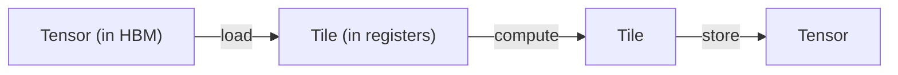
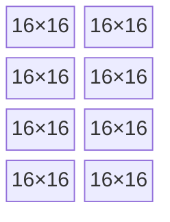

# What Tiling Is

[Where the FLOPS Hide](./where-flops-hide) ended on a problem: between every two matrix
instructions, the hardware burns cycles on addresses, memory, and layout. Tiling is the
abstraction that makes those cycles disappear. It is the single most important idea in `tk`.

---

## Tensors live in memory; tiles live in registers

A **tensor** is the big array you think about at the model level — the `[4096, 4096]` weight
matrix. It lives in global memory (HBM), it's far away and slow to reach, and it persists for
the whole program.

A **tile** is a small, fixed-size chunk of that tensor — say `16×16` — that you pull *into
registers* to compute on. It's tiny, it's right next to the math unit, and it exists only for
a few instructions before it's overwritten.

| | Tensor | Tile |
|--|--------|------|
| **Lives in** | global memory (HBM) | registers (or shared memory) |
| **Size** | huge, often dynamic | small, fixed at compile time |
| **Lifetime** | the whole program | a few instructions |
| **You can** | load / store it | multiply, reduce, transform it |

A kernel is then just a loop that walks a big tensor one tile at a time:

This is the same mental model NVIDIA's CuTile and HazyResearch's ThunderKittens use, and it's
the one `tk` adopts. Pull a tile in, do matrix math on it in registers, write the result back.

---

## A tile is a grid of matrix-core fragments

Why `16×16` and not some round number like `100×100`? Because the matrix core works on a
fixed *fragment* size baked into the hardware — typically `16×16` or `32×32`. A tile is sized
to be a whole number of those fragments:

*A `64×32` register tile is a 4×2 grid of `16×16` matrix-core fragments — the moment its data lands in registers it is already in MMA layout.*

Because the tile is built from fragments, the moment its data is in registers it's *already*
in the layout the matrix instruction wants. No shuffle before the multiply — that's gap 1
from the last chapter, gone.

---

## Three kinds of tile, three memory spaces

`tk` distinguishes tiles by where their data lives, because that's what determines how you move
and access them:

| Tile kind | Memory space | Purpose |
|-----------|--------------|---------|
| **Register tile** | registers (per-lane) | the operands and accumulators the matrix core reads and writes |
| **Shared tile** | shared memory / LDS | a staging area the whole wave (or workgroup) cooperates to fill, conflict-free |
| **Global layout** | global memory (HBM) | a typed *view* over the raw tensor pointer, so loads compute the right address |

A typical kernel uses all three: a **global layout** describes the big tensor, the wave
cooperatively streams blocks of it into a **shared tile** (conflict-free, via a swizzle), and
each lane pulls its piece into a **register tile** to feed the matrix core.

---

## Why tiling is the right abstraction

Tiling isn't just "blocking the loop." It's the abstraction that lets you answer all three of
the memory-side gaps at once:

- **Layout (gap 1):** tiles are fragment-sized, so register data is born in MMA layout.
- **Memory movement (gap 2):** the tile is the unit you stream — load the next tile while
  computing on the current one.
- **Bank conflicts (gap 3):** the shared tile carries its swizzle, so the cooperative fill and
  read are conflict-free by construction.

And it composes upward: the elementwise math, the reductions, the masks — they're all just
operations *on tiles*, with the same layout guarantees. You write `tile_a * tile_b`, not a lane
index calculation.

:::tip[For GPU experts]
`tk` separates the *shape* of a tile from the *buffer* it's bound to.

The pure shape descriptors live in `tk/src/tiles.rs`. The base fragment is
`BaseShape { rows, cols, ept }`, where `ept` (elements-per-thread) is carried **explicitly**
rather than computed as `rows*cols / wave_size`, because on RDNA the matrix instruction
*replicates* operands across lanes — so an operand tile's element count divided by the wave
size is the wrong answer. Register tiles add
a `LaneMap` (`RTBaseShape`) — the closed-form `(lane, j) → (row, col)` map of the fragment — to
encode layouts no plain stride can express: the RDNA accumulator's even/odd row interleave, and
CUDA's `mma.sync` 16×16 tile held as two `m16n8` halves.

The buffer-bound wrappers live in `tk/src/tile.rs`: `GL` (global layout), `ST` (shared / LDS,
optionally double-buffered), `RT` (register tile), `RV` (register vector, for the row/column
reductions softmax needs). Each is a flat `Arc<UOp>` buffer plus a logical shape plus a dtype.

Crucially, kernels never name a fragment constant like `RT_16X16` directly. They request a
**role** — `FragRole::{Accumulator, Operand, AccumulatorT}` — and `ArchCaps::frag(role)` in
`tk/src/arch.rs` resolves it to the right physical shape for the target (CDNA, RDNA, or CUDA's
`mma.sync`). That
indirection is what makes one kernel portable across wave sizes and fragment layouts; see
[Wave32 vs Wave64](./wave-portability). The matrix multiply itself lowers to the `WMMA` op
documented in the [Op Bestiary](../architecture/op-bestiary).
:::

---

## Where this goes

You now have the vocabulary: tensors in memory, tiles in registers, fragments in the matrix
core. [Authoring into the IR](./lowering) shows what happens when you actually *write* a kernel
out of these pieces — how the `Kernel`/`Group` builder turns tile operations into the very same
UOp IR the rest of Svod compiles.
