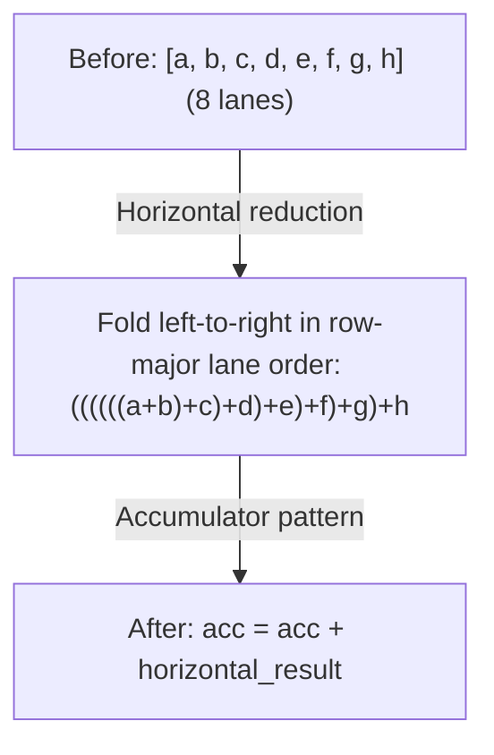

# Phase 3: Devectorizer

**गोल**: हार्डवेयर-agnostic वेक्टर्स को हार्डवेयर-स्पेसिफ़िक इंस्ट्रक्शन में लोअर करें।

---

## Stage 11: Remove Reduce

> **स्टेज एक नज़र में**
>
> **गोल**: Declarative REDUCE को imperative accumulation में बदलें
> **मुख्य Patterns**: Reduce to accumulator, horizontal reduction
> **प्रभाव**: हार्डवेयर reduction इंस्ट्रक्शन से मैप होता है

**यह क्या करता है**: हाई-लेवल REDUCE को accumulator pattern में बदलता है।

**यह क्यों ज़रूरी है**: Declarative "इन वैल्यूज़ को sum करो" को imperative इंस्ट्रक्शन बनाना पड़ता है: accumulator इनिशियलाइज़ करो, लूप चलाओ, हर वैल्यू जोड़ो।

**Pattern**: `movement_cleanup_patterns + pm_reduce_local`

`pm_reduce_local` में WMMA-add fusion, `pm_group_for_reduce`, accumulator व
horizontal-reduce नियम, और group-SINK क्लीनअप — सब बंडल होते हैं।

```text
// Before: declarative reduction
REDUCE(Add, values, range)

// After: imperative accumulation
acc = placeholder(AddrSpace::Reg)   // initialized to the reduce identity
for i in range:
    acc = STORE(acc, ADD(LOAD(acc), values[i]))
```

Accumulator लूप एक AFTER / STORE / END चेन है, जिसे reduce ranges पर लगा `END` बंद
करता है — इस लेवल पर कोई अलग लूप कंस्ट्रक्ट नहीं होता।

**Horizontal reduction**:

Reduction डायमेंशन पर लूप चलाने से पहले, हम पहले किसी shaped वैल्यू की lanes कम्बाइन करते हैं। इससे बड़ी reductions बनती हैं जो हार्डवेयर इंस्ट्रक्शन से बेहतर मैप होती हैं।



**WMMA Tensor Core Fusion**:
```text
// Fuse tensor core accumulation inline
WMMA(a, b, c) + add → WMMA(a, b, c + add)
```
यह pattern tensor cores पर एफ़िशिएंट FMA-स्टाइल accumulation सक्षम करता है। दो अतिरिक्त arms `PERMUTE`, और `PERMUTE(RESHAPE(...))` wrapper के आर-पार भी fuse करते हैं।

**Svod**: `devectorize.rs`

---

## Stage 12: Add GPU Dims

> **स्टेज एक नज़र में**
>
> **गोल**: Abstract ranges को GPU thread indices से मैप करें
> **मुख्य Patterns**: Range को SPECIAL से बदलें
> **प्रभाव**: GPU पर पैरेलल एक्ज़ीक्यूशन सक्षम करता है

**यह क्या करता है**: Ranges को GPU thread indices से बदलता है।

**यह क्यों ज़रूरी है**: GPUs की हार्ड लिमिट्स हैं: max 1024 threads प्रति block, max 48KB shared memory। अगर आपकी कम्प्यूटेशन को 2000 threads चाहिए, तो कम्पाइलर को कई blocks में स्प्लिट करना पड़ता है। Dimension limiting यह ऑटोमैटिकली हैंडल करता है।

**Pattern**: `pm_lower_device_ranges`, फिर `pm_add_gpudims` (केवल तब जब renderer के पास local या thread डायमेंशन हों)

```text
// Before: abstract range
RANGE(end=256, Global)

// After: GPU-specific
SPECIAL(gidx0)  // global thread index
```

**मैपिंग**:

| Range टाइप | GPU इक्विवैलेंट |
|-------------|-----------------|
| Global, Thread | `gidx` (global index) |
| Local, Warp, GroupReduce | `lidx` (local/workgroup index) |
| Device | PARAM वेरिएबल `"_device_num"` (launch पर bind होता है) |
| Reduce | Loop (कोई मैपिंग नहीं) |

Warp ranges को local डायमेंशन के आगे सॉर्ट किया जाता है, ताकि वे thread index के निचले bits ले सकें।

**Dimension Limiting**:

GPUs की हार्डवेयर लिमिट्स होती हैं (जैसे, max 1024 threads प्रति block)। जब ranges इन लिमिट्स से बड़ी हों, कम्पाइलर:

1. Adjacent डायमेंशन **ग्रुप** करता है, जब उनका गुणनफल अब भी फ़िट हो: `[16, 16, 256]` max `[256, 256]` के साथ → `[256, 256]`
2. बड़े डायमेंशन **स्प्लिट** करता है: `[2048]` max `[1024, 1024, 1024]` के साथ → `[1024, 2]`
3. Divmod से indices **रीकंस्ट्रक्ट** करता है

**Store Masking**:

Global stores जो सभी local डायमेंशन इस्तेमाल नहीं करते, उन्हें मास्क किया जाता है:
```text
// If STORE doesn't use lidx1, restrict its index validity:
STORE(INDEX(buf, idx), value) → STORE(INDEX(buf, WHERE(lidx1 == 0, idx, Invalid)), value)
```
यह सुनिश्चित करता है कि stores तभी एक्ज़ीक्यूट हों जब unused local indices 0 हों। मास्क index एक्सप्रेशन में ही रहता है, ताकि RANGE substitution उसे संबंधित हार्डवेयर index तक पहुँचा सके।

**Svod**: `gpudims.rs`

---

## Stage 13: Add Loads

> **स्टेज एक नज़र में**
>
> **गोल**: INDEX ऑपरेशन को एक्सप्लिसिट LOAD में रैप करें
> **मुख्य Patterns**: Value operands में LOAD जोड़ें
> **प्रभाव**: codegen के लिए मेमोरी ऑपरेशन एक्सप्लिसिट बनाता है

**यह क्या करता है**: INDEX ऑपरेशन को एक्सप्लिसिट LOAD में रैप करता है।

**यह क्यों ज़रूरी है**: Index ऑपरेशन addresses कैलकुलेट करते हैं। LOAD वाकई मेमोरी रीड करता है। इसे एक्सप्लिसिट बनाने से कोड जनरेटर समझता है कि कौन से मेमोरी एक्सेस ज़रूरी हैं।

**Pattern**: `symbolic_simple + pm_expand_broadcast + pm_add_loads`

```text
// Before: bare index
INDEX(ptr, i)

// After: explicit load
LOAD(INDEX(ptr, i))
```

STORE के value operand को भी load करता है, जब वह वैल्यू ख़ुद एक address हो।

नोट: केवल वही operands रैप होते हैं जो *वैल्यू* की तरह इस्तेमाल होते हैं — सिर्फ़ address की तरह इस्तेमाल होने वाला INDEX (STORE का target, WMMA fragment address) बिना रैप रहता है।

**Svod**: `devectorize.rs`

---

## Stage 14: Devectorize

> **स्टेज एक नज़र में**
>
> **गोल**: Shaped ऑपरेशन को scalar ऑपरेशन में बदलें
> **मुख्य Phases**: एक कम्बाइंड rewrite
> **प्रभाव**: हर op ऐसा बन जाता है जिसे backend एमिट कर सके

**यह क्या करता है**: Shaped वैल्यूज़ से scalar हार्डवेयर ऑपरेशन का ट्रांज़िशन हैंडल करता है।

**यह क्यों ज़रूरी है**: Devectorize `STACK` और `INDEX` की lane स्ट्रक्चर को प्रति-lane
scalar ऑपरेशन में लोअर करता है, और contiguous मेमोरी एक्सेस बनाए रखता है।

**Scalarization बिना शर्त होती है**: `devectorize_alu` static shape के गुणनफल से lane
count निकालता है, हर coordinate के लिए एक ऑपरेशन एमिट करता है, और फिर नतीजे को
`STACK` (stores के लिए `GROUP`) से दोबारा जोड़ता है। कोई प्रति-डिवाइस fold-length
टेबल नहीं है — दोबारा वेक्टराइज़ करना backend पर छोड़ा जाता है, जहाँ LLVM का SLP
vectorizer फ़ायदेमंद होने पर scalars को फिर चौड़ा कर सकता है।

नोट: Svod हमेशा devectorizer चलाता है; इसे स्किप करने के लिए कोई env var नहीं है।

**Pattern**: `symbolic_simple + devectorize_patterns + bool_storage_patterns + indexing_simplify`

**Shaped ALUs स्प्लिट करें**:
```text
// A shaped add becomes one op per lane
ADD(shaped_a, shaped_b) → STACK(ADD(a[0], b[0]), ADD(a[1], b[1]), ...)
```

**Bool storage**: bool LOAD/STORE `uint8` से होकर जाते हैं, क्योंकि LLVM का `i1` ऊपरी bits में कचरा रख सकता है।

**Index सिम्प्लिफ़िकेशन**: `indexing_simplify` उस addressing arithmetic को फ़ोल्ड करता है जो scalarization खोल देती है।

**Svod**: `devectorize.rs`

---

## Stage 15: Lower Index Dtype

> **स्टेज एक नज़र में**
>
> **गोल**: Weak index type को कॉन्क्रीट integers में बदलें
> **मुख्य Patterns**: वैल्यू bounds पर आधारित ऑपरेशन-स्पेसिफ़िक lowering
> **प्रभाव**: Indices हार्डवेयर-native integer types (i32 या i64) इस्तेमाल करते हैं

**यह क्या करता है**: Abstract weak (`WeakInt`) dtype को कॉन्क्रीट integers में कन्वर्ट करता है।

**यह क्यों ज़रूरी है**: Weak index type abstract है — हार्डवेयर में यह नहीं है। हमें i32 या i64 में कन्वर्ट करना होगा, जो हार्डवेयर वाकई सपोर्ट करता है। (Tinygrad इस dtype को `Index` कहता है; Svod में यह `ScalarDType::WeakInt` है।)

**Pattern**: `lower_index_patterns` = `symbolic_simple + pm_fold_cast_const + pm_lower_index_dtype + indexing_simplify`

```text
// Before: weak index type
idx: WeakInt

// After: concrete type
idx: i32  // or i64, based on bounds
```

**ऑपरेशन-स्पेसिफ़िक Lowering**:

Index type lowering 3-phase cascade अप्रोच इस्तेमाल करता है:

1. Leaf nodes (CONST, VCONST, PARAM) के लिए **कॉन्क्रीट wrappers बनाएँ** — हर एक `concrete.cast(weak)` बन जाता है
2. Wrapped values को **ऊपर की ओर प्रोसेस करें** (Unary, Binary, WHERE, RANGE, STACK, SPECIAL) — tree में कॉन्क्रीट types प्रोपेगेट करें
3. किसी भी non-weak कंज़्यूमर पर **cast अवशोषित करें** — वह अपनी edge पर कॉन्क्रीट dtype ले लेता है

हर ऑपरेशन type के स्पेसिफ़िक patterns हैं:

| ऑपरेशन | पहले | बाद में |
|---------|------|---------|
| Binary ops | `ADD(WeakInt, WeakInt)` | `ADD(i32, i32)` casts के साथ |
| CONST | `CONST(5): WeakInt` | `CONST(5): i32`, `.cast(WeakInt)` में लिपटा हुआ |
| WHERE | `WHERE(c, WeakInt, WeakInt)` | `WHERE(c, i32, i32)` (कंडीशन छोड़ दी जाती है) |
| RANGE | `RANGE(end: WeakInt)` | `RANGE(end: i32)` cast के साथ |
| SPECIAL | `SPECIAL(gidx)` | op के bounds से कॉन्क्रीट integer (व्यवहार में डिफ़ॉल्ट int) |
| PARAM (वेरिएबल) | `PARAM: WeakInt` | bounds फ़िट हों तो i32, वरना i64 |
| STACK | `STACK(WeakInt...)` | STACK पर scalar dtype, हर lane अलग से cast |
| Double weak CAST | `CAST(weak, CAST(weak, x))` | भीतरी cast कॉन्क्रीट dtype पर commit, बाहरी weak cast बरक़रार |

`select_dtype()` फ़ंक्शन vmin/vmax bounds एनालिसिस से i32 बनाम i64 तय करता है:
```text
dtype = default_int if bounds fit in [-2^31, 2^31-1] else i64
```
यह `WeakFloat` को डिफ़ॉल्ट float में भी रिज़ॉल्व करता है, और unsigned व bool bounds के लिए अलग arms रखता है।

**Svod**: `symbolic/index_lowering.rs`

---

## Devectorizer के आस-पास के अतिरिक्त पास

Svod Stage 14 और index lowering के बीच कई पास चलाता है जिन्हें 22-स्टेज नंबरिंग नाम नहीं देती:

| पास | उद्देश्य |
|-----|----------|
| `sym()` (early symbolic) | ग्राफ़ scalar हो जाने के बाद पूरा symbolic सिम्प्लिफ़िकेशन |
| `memory_coalescing` | पड़ोसी accesses को चौड़े accesses में मर्ज करें |
| `pm_simplify_add_image` (bottom-up) | `no_vectorized_alu` के साथ Image dtype की address सिम्प्लिफ़िकेशन |
| `extra_symbolic_patterns` | `sym() + indexing_simplify`, indices को तब तक weak रखते हुए जब तक index-validity नियम चल सकें |
