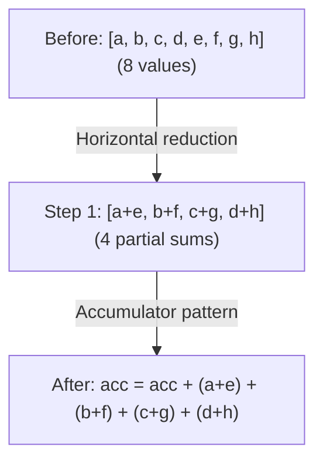

# Phase 3: Devectorizer

**गोल**: हार्डवेयर-agnostic वेक्टर्स को हार्डवेयर-स्पेसिफ़िक इंस्ट्रक्शन में लोअर करें।

---

## Stage 11: Remove Reduce

> **स्टेज एक नज़र में**
>
> **गोल**: Declarative REDUCE को imperative accumulation में बदलें
> **मुख्य Patterns**: Reduce to accumulator, horizontal reduction
> **प्रभाव**: हार्डवेयर reduction इंस्ट्रक्शन से मैप होता है

**यह क्या करता है**: हाई-लेवल REDUCE को accumulator pattern में बदलता है।

**यह क्यों ज़रूरी है**: Declarative "इन वैल्यूज़ को sum करो" को imperative इंस्ट्रक्शन बनाना पड़ता है: accumulator इनिशियलाइज़ करो, लूप चलाओ, हर वैल्यू जोड़ो।

**Pattern**: `pm_reduce + gep_pushing`

```text
// Before: declarative reduction
REDUCE(Add, values, range)

// After: imperative accumulation
acc = DEFINE_REG(0.0)
for i in range:
    acc = ADD(acc, values[i])
```

**Horizontal reduction**:

Reduction डायमेंशन पर लूप चलाने से पहले, हम पहले पड़ोसी वैल्यूज़ कम्बाइन करते हैं। इससे बड़ी reductions बनती हैं जो हार्डवेयर इंस्ट्रक्शन से बेहतर मैप होती हैं।



**GEP pushing** बेहतर वेक्टराइज़ेशन के लिए GEP (get element pointer) ऑपरेशन को ALUs से गुज़ारता है:

```text
GEP(ADD(ptr_a, ptr_b), idx) → ADD(GEP(ptr_a, idx), GEP(ptr_b, idx))
```
*क्यों?* दोनों GEPs पर SIMD सक्षम करता है (पैरेलल में कैलकुलेट हो सकते हैं)।

**WMMA Tensor Core Fusion**:
```text
// Fuse tensor core accumulation inline
WMMA(a, b, c) + add → WMMA(a, b, c + add)
```
यह pattern NVIDIA tensor cores पर एफ़िशिएंट FMA-स्टाइल accumulation सक्षम करता है।

**Svod**: `devectorize.rs`

---

## Stage 12: Add GPU Dims

> **स्टेज एक नज़र में**
>
> **गोल**: Abstract ranges को GPU thread indices से मैप करें
> **मुख्य Patterns**: Range को SPECIAL से बदलें
> **प्रभाव**: GPU पर पैरेलल एक्ज़ीक्यूशन सक्षम करता है

**यह क्या करता है**: Ranges को GPU thread indices से बदलता है।

**यह क्यों ज़रूरी है**: GPUs की हार्ड लिमिट्स हैं: max 1024 threads प्रति block, max 48KB shared memory। अगर आपकी कम्प्यूटेशन को 2000 threads चाहिए, तो कम्पाइलर को कई blocks में स्प्लिट करना पड़ता है। Dimension limiting यह ऑटोमैटिकली हैंडल करता है।

**Pattern**: `pm_add_gpudims`

```text
// Before: abstract range
RANGE(end=256, Global)

// After: GPU-specific
SPECIAL(gidx0)  // global thread index
```

**मैपिंग**:

| Range टाइप | GPU इक्विवैलेंट |
|-------------|-----------------|
| Global, THREAD | `gidx` (global index) |
| Local, WARP, GROUP_REDUCE | `lidx` (local/workgroup index) |
| Reduce | Loop (कोई मैपिंग नहीं) |

**Dimension Limiting**:

GPUs की हार्डवेयर लिमिट्स होती हैं (जैसे, max 1024 threads प्रति block)। जब ranges इन लिमिट्स से बड़ी हों, कम्पाइलर:

1. Adjacent डायमेंशन **ग्रुप** करता है: `[256, 256, 256]` max `[256, 256]` के साथ → `[65536, 256]`
2. बड़े डायमेंशन **स्प्लिट** करता है: `[2048]` max `[1024]` के साथ → `[2, 1024]`
3. Divmod से indices **रीकंस्ट्रक्ट** करता है

**Store Masking**:

Global stores जो सभी local डायमेंशन इस्तेमाल नहीं करते, उन्हें मास्क किया जाता है:
```text
// If STORE doesn't use lidx1, mask it:
STORE(INDEX(...), value) → STORE(INDEX(..., gate=(lidx1 == 0)), value)
```
यह सुनिश्चित करता है कि stores तभी एक्ज़ीक्यूट हों जब unused local indices 0 हों।

**Svod**: `gpudims.rs`

---

## Stage 13: Add Loads

> **स्टेज एक नज़र में**
>
> **गोल**: INDEX ऑपरेशन को एक्सप्लिसिट LOAD में रैप करें
> **मुख्य Patterns**: LOAD जोड़ें, रिडंडेंट loads हटाएँ
> **प्रभाव**: codegen के लिए मेमोरी ऑपरेशन एक्सप्लिसिट बनाता है

**यह क्या करता है**: INDEX ऑपरेशन को एक्सप्लिसिट LOAD में रैप करता है।

**यह क्यों ज़रूरी है**: Index ऑपरेशन addresses कैलकुलेट करते हैं। LOAD वाकई मेमोरी रीड करता है। इसे एक्सप्लिसिट बनाने से कोड जनरेटर समझता है कि कौन से मेमोरी एक्सेस ज़रूरी हैं।

**Pattern**: `pm_add_loads`

```text
// Before: bare index
INDEX(ptr, i)

// After: explicit load
LOAD(INDEX(ptr, i))
```

Stores से रिडंडेंट loads भी हटाता है (write-only एक्सेस)।

नोट: सभी INDEX ऑपरेशन LOAD में रैप नहीं होते। Pointer types (पहले से addresses हैं) और image textures (स्पेशल हार्डवेयर) अलग एक्सेस मेथड इस्तेमाल करते हैं।

**Svod**: `devectorize.rs`

---

## Stage 14: Devectorize

> **स्टेज एक नज़र में**
>
> **गोल**: Abstract वेक्टर्स को हार्डवेयर capabilities से मैच कराएँ
> **मुख्य Phases**: 4 कोऑर्डिनेटेड पास
> **प्रभाव**: वेक्टर्स असल हार्डवेयर width के साथ काम करते हैं

**यह क्या करता है**: Abstract वेक्टर्स से हार्डवेयर ऑपरेशन का ट्रांज़िशन हैंडल करता है।

**यह क्यों ज़रूरी है**: Devectorize 4 conceptual phases को 3 `graph_rewrite` calls में चलाता है (phases 3 और 4 एक call शेयर करते हैं) — PTRCAT groups बनाना, LOAD/STORE से GEPs गुज़ारना, CAT(LOADs) में डिस्ट्रिब्यूट करना, और हार्डवेयर width तक स्प्लिट करना। phase-दर-phase contract `schedule/src/lib.rs` module docstring में रहता है।

**PTRCAT कंस्ट्रक्शन**:

PTRCAT consecutive pointer accesses ग्रुप करता है:
1. हर vector एलिमेंट के लिए individual indexes जनरेट करें
2. (valid, root_src) → [offsets] मैपिंग एक्सट्रैक्ट करें
3. Validity और source के अनुसार consecutive offsets ग्रुप करें
4. ग्रुप्ड pointers से PTRCAT बनाएँ
5. सही एलिमेंट ऑर्डर के लिए GEP permutation रिटर्न करें

इससे मेमोरी bus ट्रांज़ैक्शन कम होते हैं।

**डिवाइस-स्पेसिफ़िक Fold Lengths**:

| डिवाइस | Fold Lengths | नोट्स |
|---------|-------------|-------|
| GPU (standard) | 4, 2, 1 | स्टैंडर्ड GPU वेक्टराइज़ेशन |
| Image | 4, 1 | Image textures के लिए फ़िक्स्ड |
| No-fold | 1 | स्केलर फ़ॉलबैक (forced) |

**Environment Variable** (केवल Tinygrad): `DEVECTORIZE`
- `0`: केवल `devectorize` स्किप करें (`correct_load_store` रखें)
- `1`: पूरा devectorization (डिफ़ॉल्ट)
- `≥2`: `devectorize` और `correct_load_store` दोनों स्किप करें

नोट: Svod हमेशा devectorizer चलाता है और यह env var एक्सपोज़ नहीं करता।

**Pattern**: `devectorize + load_store_folding + correct_load_store + load_store_indexing`

**वेक्टराइज़्ड ALUs स्प्लिट करें**:
```text
// If hardware doesn't support vec4 add
ADD(vec4_a, vec4_b) → [ADD(a[0], b[0]), ADD(a[1], b[1]), ...]
```

**Load/store chunk splitting**: हार्डवेयर मेमोरी width से मैच करें।

**Image fixup**: Image tensor buffers की स्पेशल हैंडलिंग।

**Svod**: `devectorize.rs`

---

## Stage 15: Lower Index Dtype

> **स्टेज एक नज़र में**
>
> **गोल**: Abstract Index type को कॉन्क्रीट integers में बदलें
> **मुख्य Patterns**: वैल्यू bounds पर आधारित ऑपरेशन-स्पेसिफ़िक lowering
> **प्रभाव**: Indices हार्डवेयर-native integer types (i32 या i64) इस्तेमाल करते हैं

**यह क्या करता है**: Abstract `Index` type को कॉन्क्रीट integers में कन्वर्ट करता है।

**यह क्यों ज़रूरी है**: Index type abstract है — हार्डवेयर में यह नहीं है। हमें i32 या i64 में कन्वर्ट करना होगा, जो हार्डवेयर वाकई सपोर्ट करता है।

**Pattern**: `pm_lower_index_dtype`

```text
// Before: abstract index type
idx: Index

// After: concrete type
idx: i32  // or i64, based on bounds
```

**ऑपरेशन-स्पेसिफ़िक Lowering**:

Index type lowering 3-phase cascade अप्रोच इस्तेमाल करता है:

1. Leaf nodes (CONST, DEFINE_VAR) के लिए **कॉन्क्रीट wrappers बनाएँ** — उन्हें कॉन्क्रीट dtype से wrap करें
2. Wrapped values को **ऊपर की ओर प्रोसेस करें** (Binary, WHERE, RANGE, आदि) — tree में कॉन्क्रीट types प्रोपेगेट करें
3. Terminal nodes (INDEX, SINK, END) पर **wrappers हटाएँ** — फ़ाइनल कॉन्क्रीट types प्रोड्यूस करने के लिए wrapping हटाएँ

हर ऑपरेशन type के स्पेसिफ़िक patterns हैं:

| ऑपरेशन | पहले | बाद में |
|---------|------|---------|
| Binary ops | `ADD(Index, Index)` | `ADD(i32, i32)` casts के साथ |
| CONST | `CONST(5): Index` | `CONST(5): i32` |
| WHERE | `WHERE(c, Index, Index)` | `WHERE(c, i32, i32)` |
| RANGE | `RANGE(end: Index)` | `RANGE(end: i32)` cast के साथ |
| SPECIAL | `SPECIAL(gidx)` | हमेशा i32 (GPU indices 32-bit होते हैं) |
| DEFINE_VAR | `DEFINE_VAR: Index` | bounds फ़िट हों तो i32, वरना i64 |
| VECTORIZE | `VECTORIZE(Index...)` | हर एक को कॉन्क्रीट scalar में cast करें |
| CAST cleanup | `CAST(i32, Index)` | बस `i32` (रिडंडेंट cast हटाएँ) |
| BIND | `BIND(var, val)` | `BIND(var.cast(dt), val.cast(dt)).cast(Index)` |

`select_concrete_dtype()` फ़ंक्शन vmin/vmax bounds एनालिसिस से i32 बनाम i64 तय करता है:
```text
dtype = i32 if bounds fit in [-2^31, 2^31-1] else i64
```

**Svod**: `symbolic/index_lowering.rs`

---

## अतिरिक्त Devectorizer पास

Svod Stage 14 और 15 के बीच कई अतिरिक्त पास चलाता है जिनका Tinygrad में सीधा इक्विवैलेंट नहीं है:

| पास | उद्देश्य |
|-----|----------|
| `pm_bool_devectorize` | Boolean वेक्टर patterns हैंडल करें (expand/shrink) |
| `pm_reduce_devectorize` | वेक्टर reductions हैंडल करें (K-vec, bool, horizontal) |
| `bool_storage_patterns` | मेमोरी ऑपरेशन के लिए bool और uint8 के बीच कन्वर्ट करें |
| `linearize_multi_index` | मल्टी-डायमेंशनल indices को लीनियर offsets में फ़्लैटन करें |
| `merge_sibling_ends` | एक ही ranges शेयर करने वाले adjacent END ऑपरेशन मर्ज करें |
