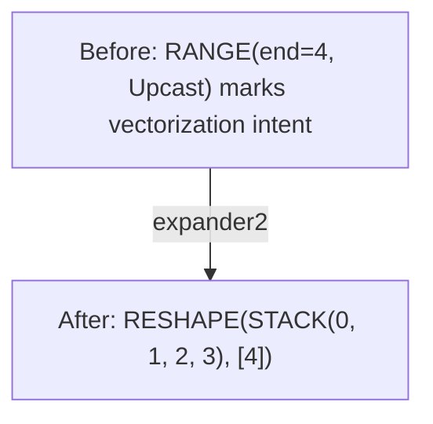
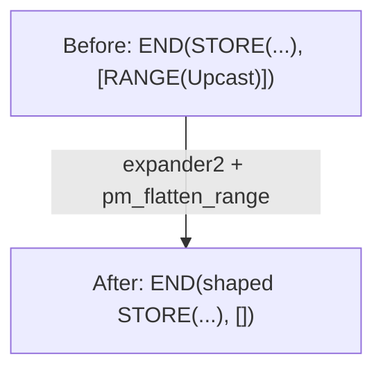
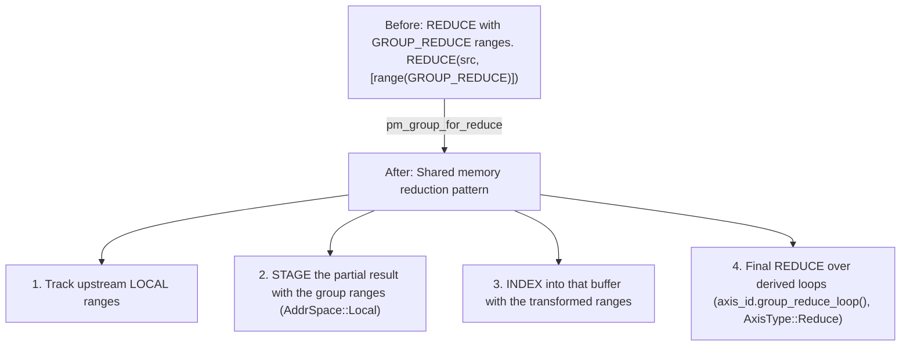

# Phase 2: Expander

**गोल**: ऑप्टिमाइज़ेशन primitives (UPCAST/UNROLL ranges) को एक्सप्लिसिट shaped ऑपरेशन में बदलें।

---

## Stage 8: Post-Opt Symbolic

> **स्टेज एक नज़र में**
>
> **गोल**: ऑप्टिमाइज़ेशन के बाद symbolic सिम्प्लीफ़िकेशन
> **मुख्य Patterns**: WHERE मूवमेंट, constant folding
> **प्रभाव**: बेहतर load combining और वेक्टराइज़ेशन सक्षम करता है

**यह क्या करता है**: ऑप्टिमाइज़ेशन के बाद symbolic सिम्प्लीफ़िकेशन, साथ में WHERE मूवमेंट।

**यह क्यों ज़रूरी है**: WHERE ऑपरेशन `if` स्टेटमेंट जैसे हैं। यह स्टेज `if` चेक को indexed रीड के इर्द-गिर्द से हटाकर ख़ुद index एक्सप्रेशन में ले जाता है। जब कंडीशन false हो, हार्डवेयर loading स्किप कर सकता है — मेमोरी बैंडविड्थ बचती है।

**Pattern**: `sym + pm_move_where_on_load + pm_flatten_range + pm_reduce_unparented` (`POST_OPT_SYM` matcher)

```text
// Before: WHERE guards an indexed read
WHERE(cond, INDEX(buf, idx), 0)

// After: validity moved into INDEX
INDEX(buf, WHERE(cond, idx, Invalid))
```

Validity को INDEX में मूव करने से बेहतर load combining और वेक्टराइज़ेशन मिलता है।

**नोट**: यह pattern तभी मैच होता है जब alternative वैल्यू `0` हो; एक दूसरा arm उलटे रूप `WHERE(cond, 0, INDEX(...))` को negated कंडीशन के साथ हैंडल करता है। ट्रांसफ़ॉर्मेशन में कॉम्प्लेक्स clause एनालिसिस होता है: duplicate डिटेक्शन, range डिपेंडेंसी चेक, और data-dependent load वेरिफ़िकेशन।

**नोट**: Svod validity को index एक्सप्रेशन के अंदर `WHERE(cond, idx, Invalid)` के रूप में रखता है। यह बहुत बाद में, `pm_move_gates_from_index` (`late/gater.rs`) में जाकर LOAD/STORE का `gate` फ़ील्ड बनता है; ख़ुद INDEX में कोई gate फ़ील्ड नहीं है।

**Svod**: `pm_move_where_on_load()` in `symbolic/patterns.rs`

---

## Stage 9: Expander

> **स्टेज एक नज़र में**
>
> **गोल**: UPCAST और UNROLL ranges को shaped STACK coordinates में एक्सपैंड करें
> **मुख्य कॉन्सेप्ट**: range axis types, STACK, INDEX, pattern ऑर्डर
> **प्रभाव**: वेक्टराइज़ेशन एक्सप्लिसिट बनाता है और हार्डवेयर के लिए तैयार करता है

**यह क्या करता है**: UPCAST/UNROLL range क्लासिफ़िकेशन को shaped coordinates में ट्रांसफ़ॉर्म करता है।

**यह क्यों ज़रूरी है**: UPCAST और UNROLL इंटेंट मार्क करते हैं — हम क्या करना चाहते हैं। यह स्टेज उस इंटेंट को एक्सप्लिसिट बनाता है ताकि हार्डवेयर वाकई कर सके।

**Pattern**: `expander2 + pm_flatten_range + mop_cleanup_patterns` (`pre_expand()` एंट्री पॉइंट)

नोट: `pre_expand` के अंदर कोई symbolic matcher नहीं चलता। `sym` Stage 8 पर चल चुका है, और `symbolic_simple` Stage 13 व 14 पर दोबारा चलता है।

⚠️ **ज़रूरी: Pattern Precedence**

Patterns कम्बाइन होकर fixpoint तक चलते हैं। ऑर्डर तय करता है कि कई मैच होने पर कौन सा pattern पहले ट्राई हो:
1. `expander2` पहले (UPCAST/UNROLL ranges, REDUCE और WMMA operands एक्सपैंड करता है)
2. `pm_flatten_range` दूसरा (ranges हटने के बाद END की range लिस्ट दोबारा बनाता है)
3. `mop_cleanup_patterns` आखिर में (expansion से बचे movement ops साफ़ करता है)

गलत precedence से गलत वेक्टराइज़ेशन या reduction scoping हो सकती है।

एक्सपैंड हुई lanes `STACK` से इकट्ठी होती हैं और `INDEX` से चुनी जाती हैं। UPCAST और
UNROLL `RANGE` पर लगे `AxisType` हैं, अलग ऑपरेशन नहीं। (Tinygrad जिसे VECTORIZE
कहता है, Svod में उसका नाम `STACK` है; VECTORIZE नाम का कोई op नहीं है।)

**UPCAST / UNROLL range → shaped coordinate**:


Upcast और unroll ranges एक ही रास्ते से गुज़रते हैं — एक ही नियम दोनों axis types पर
मैच होता है। ख़ुद RANGE नोड की जगह एक shaped constant coordinate आ जाता है, इसलिए
उसे कंज़्यूम करने वाला हर ऑपरेशन बस shaped बन जाता है। प्रति-lane ऑपरेशन बाद में,
Stage 14 पर `devectorize_alu` से बनते हैं।

जब हम "ऑपरेशन डुप्लीकेट होते हैं" कहते हैं, तो ऐसा नहीं है कि कॉपी-पेस्ट होता है। कम्पाइलर एक सिंगल SIMD इंस्ट्रक्शन बनाता है जो सभी N एलिमेंट एक साथ प्रोसेस करती है। SIMD रजिस्टर को 4 नंबर रखने वाला बॉक्स सोचें; दो बॉक्स जोड़ने से सभी 8 नंबर एक साथ जुड़ते हैं।

**एक्सपैंड हुए END का इंटरैक्शन**:


`pm_flatten_range` किसी END की range लिस्ट को उन RANGE नोड्स से दोबारा बनाता है जो
अब भी उसके sources के ज़रिए पहुँच में हैं। Expansion के बाद upcast range बची नहीं
रहती, इसलिए लिस्ट खाली हो जाती है। प्रति-lane stores Stage 14 पर `GROUP` में लिपटकर आते हैं।

**GROUP_REDUCE हैंडलिंग** (`pm_group_for_reduce`):

GROUP_REDUCE tensor core reductions के लिए एक स्पेशल axis type है:



यह shared memory से एफ़िशिएंट tensor core accumulation सक्षम करता है। हालाँकि
`pm_group_for_reduce` `expand.rs` में रहता है, यह `pm_reduce_local` में कम्पोज़ होता है
और इसलिए reduction हटाने के दौरान चलता है, `pre_expand` के अंदर नहीं।

**Svod**: `expand.rs`

---

## Stage 10: Add Local Buffers

> **स्टेज एक नज़र में**
>
> **गोल**: फ़ास्ट मेमोरी (shared / L1) के लिए बफ़र तैयार करें
> **मुख्य Patterns**: लोकल बफ़र एलोकेशन, movement op पुशडाउन
> **प्रभाव**: बार-बार एक्सेस होने वाला डेटा फ़ास्ट मेमोरी में रहता है

**यह क्या करता है**: हर staged इंटरमीडिएट को असली लोकल बफ़र में बदल देता है।

**यह क्यों ज़रूरी है**: **लोकल बफ़र** = कम्प्यूट यूनिट के पास फ़ास्ट मेमोरी:
- GPU: Shared memory (LDS) — global memory से 100x तेज़
- CPU: L1 cache — main memory से 10x तेज़

कम्पाइलर बार-बार एक्सेस होने वाले डेटा को लोकल बफ़र में ले जाता है — ठीक वैसे जैसे ज़रूरी फ़ाइलें नेटवर्क ड्राइव के बजाय डेस्कटॉप पर रखना।

**Pattern**: `pm_add_local_buffers`

| ट्रांसफ़ॉर्म | उद्देश्य |
|-------------|----------|
| `add_local_buffer` | हर STAGE नोड के लिए एक लोकल `placeholder` एलोकेट करें और उसे INDEX / STORE / END / AFTER में बदलें |
| `movement_op_patterns` | Movement ops नीचे धकेलें ताकि नए बफ़र के indices सरल रहें |

**ऑर्डर पर नोट**: reduction हटाना (Stage 11) असल में इस स्टेज से *पहले* चलता है —
`add_local_buffer` उन्हीं STAGE नोड्स को कंज़्यूम करता है जो reduce lowering बनाता है।
Tinygrad भी दोनों passes को इसी क्रम में चलाता है।

**Svod**: `optimizer/mod.rs`, `rangeify/patterns.rs`
