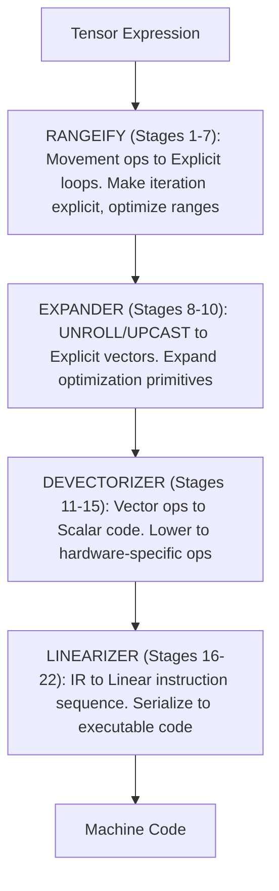

# UOp का सफ़र: 22-स्टेज Codegen पाइपलाइन

एक UOp हाई-लेवल tensor एक्सप्रेशन के रूप में शुरू होता है। जब तक यह हार्डवेयर तक पहुँचता है, 22 अलग-अलग स्टेजों से गुज़रता है — हर एक का अपना उद्देश्य, हर एक पिछले पर बनता है। यह चैप्टर उस सफ़र को ट्रेस करता है।

यह पाइपलाइन tensor कम्पाइलेशन के लिए एक आज़माया हुआ डिज़ाइन है। इसे समझने का मतलब है यह समझना कि tensor एक्सप्रेशन कैसे मशीन कोड बनते हैं।

---

## यह चैप्टर कैसे पढ़ें

अगर आप कम्पाइलर इंजीनियर नहीं हैं, तो यह चैप्टर डरावना लग सकता है। डाइव करने से पहले ये कॉन्सेप्ट समझ लें।

### मुख्य कॉन्सेप्ट

**UOp (Micro-Operation)**
- इसे एक फ़्लोचार्ट में एक नोड समझें जो एक कम्प्यूटेशन दर्शाता है
- उदाहरण: `ADD(a, b)` का मतलब "a और b जोड़ो"

**Pattern**
- कोड स्ट्रक्चर के लिए एक find-and-replace नियम (टेक्स्ट नहीं)
- उदाहरण: "अगर ADD(x, 0) दिखे, तो x से बदल दो"
- Patterns बार-बार चलते हैं जब तक कोई और मैच न हो (fixpoint)

**Range**
- एक लूप इटरेशन: `RANGE(0..10)` का मतलब "i के लिए 0 से 10 तक"

**AxisType**
- यह किस तरह का लूप है?
  - Global: GPU blocks / CPU threads में पैरेलल
  - Local: एक वर्कग्रुप के अंदर पैरेलल
  - Reduce: Accumulator (sum, max, आदि)
  - Loop: सीक्वेंशियल इटरेशन
  - Upcast / Unroll: expander इन्हें lanes में एक्सपैंड कर देता है

**स्टेज**
- कोड पर एक ट्रांसफ़ॉर्मेशन पास
- Patterns fixpoint तक चलते हैं, फिर अगला स्टेज शुरू होता है

### पढ़ने की रणनीति

1. **पहला पास**: बस "What This Does" और "Why This Matters" सेक्शन पढ़ें
2. **दूसरा पास**: डायग्राम और उदाहरण देखें
3. **तीसरा पास** (अगर डिटेल चाहिए): Pattern डिस्क्रिप्शन पढ़ें

### पूछने के लिए सवाल

हर स्टेज के लिए पूछें:
- यह स्टेज क्या accomplish करता है? (हाई-लेवल गोल)
- यह स्टेज क्यों ज़रूरी है? (मोटिवेशन)
- इसके बिना क्या गलत होगा? (परिणाम)

---

## ओवरव्यू

22 स्टेज चार phases में बँटते हैं:

हर स्टेज pattern-based rewrites अप्लाई करता है। Patterns fixpoint तक चलते हैं, फिर अगला स्टेज शुरू होता है।

### अतिरिक्त पास

कई पास नंबर्ड स्टेजों के बीच चलते हैं और उनका अपना स्टेज नंबर नहीं होता:

| पास | कहाँ चलता है | उद्देश्य |
|-----|--------------|----------|
| `bool_storage_patterns` | Stage 14 के अंदर | मेमोरी ऑपरेशन के लिए bool ↔ uint8 कन्वर्ट करें |
| `indexing_simplify` | Stage 14 और 15 के अंदर | scalarization से खुलने वाला addressing arithmetic फ़ोल्ड करें |
| `sym()` (early symbolic) | 14-15 | ग्राफ़ scalar हो जाने के बाद पूरा symbolic सिम्प्लिफ़िकेशन |
| `memory_coalescing` | 14-15 | पड़ोसी accesses को चौड़े accesses में मर्ज करें |
| `pm_simplify_add_image` | 14-15 (bottom-up) | Image dtype की address सिम्प्लिफ़िकेशन |
| `pm_float_decomp` / `pm_long_decomp` | Stage 18 के अंदर | टारगेट में मौजूद न होने वाले dtypes एमुलेट करें (FP8/BF16, 64-बिट ints) |
| `pm_move_gates_from_index` | 18-19 | index validity को LOAD/STORE के `gate` फ़ील्ड पर ले जाएँ |
