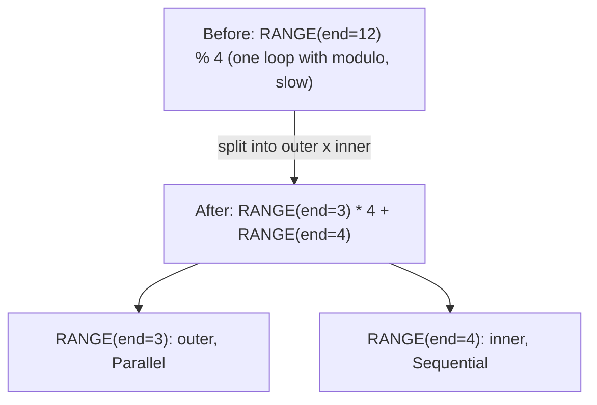
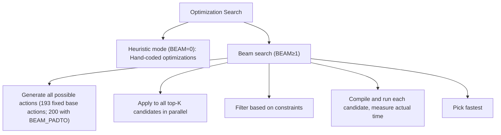

# Phase 1: Rangeify

**गोल**: हाई-लेवल movement ऑपरेशनों को एक्सप्लिसिट लूप स्ट्रक्चर में बदलें और ranges ऑप्टिमाइज़ करें।

---

## Stage 1: Early Movement Ops

> **स्टेज एक नज़र में**
>
> **गोल**: Range असाइनमेंट से पहले movement ऑपरेशन साफ़ करें
> **मुख्य Patterns**: INDEX पर movement, wrappers के ज़रिए movement, nested INDEX सिम्प्लीफ़िकेशन
> **प्रभाव**: बाद में पाइपलाइन में मिस्ड ऑप्टिमाइज़ेशन रोकता है

**यह क्या करता है**: यह स्टेज movement ऑपरेशन को साफ़ करता है — index मैनिपुलेशन को वहाँ पुश करता है जहाँ वाकई ज़रूरत है। इसे ऐसे सोचें जैसे पेपर फ़ाइल करने से पहले डेस्क साफ़ करना — इंस्ट्रक्शन को उस जगह ले जाना जहाँ डेटा इस्तेमाल होता है।

**यह क्यों ज़रूरी है**: Movement ऑपरेशन (RESHAPE, PERMUTE, आदि) सुविधाजनक abstractions हैं, लेकिन हार्डवेयर को कॉन्क्रीट index कैलकुलेशन चाहिए। इन्हें जल्दी साफ़ करने से बाद के स्टेजों में patterns सही से मैच होते हैं।

**Pattern**: `movement_op_patterns()` (bottom-up)

| Pattern | ट्रांसफ़ॉर्मेशन | विज़ुअल | लोकेशन |
|---------|----------------|--------|---------|
| INDEX पर Movement | Index एक्सप्रेशन पर movement अप्लाई करें | `INDEX(PERMUTE(arr), [i, j]) → INDEX(arr, [j, i])` | `movement_op_patterns()` |
| AFTER के ज़रिए Movement | Movement (या INDEX) को टाइमिंग wrapper से गुज़ारें, हर dep बरक़रार रखते हुए | `AFTER(RESHAPE(x, arg), deps) → RESHAPE(AFTER(x, deps), arg)` | `movement_op_patterns()` |
| END के ज़रिए Movement | END wrapper से movement हटाएँ | `END(RESHAPE(x), ranges) → END(x, ranges)` | `movement_op_patterns()` |

**Bottom-up क्यों?** चाइल्ड नोड्स पहले साफ़ होने चाहिए ताकि parents मैच कर सकें। Movement ops गहराई में नेस्ट होते हैं; नीचे से साफ़ करने से मिस्ड patterns नहीं होते।

**नोट**: `is_movement()` में ठीक RESHAPE, PERMUTE, EXPAND, PAD, SHRINK और FLIP आते हैं। Nested INDEX फ़्लैटनिंग (`INDEX(INDEX(ptr, i), j) → INDEX(ptr, i, j)`) इस स्टेज का हिस्सा *नहीं* है; वह `mop_cleanup_patterns()` में रहती है और Stage 9 expander व devectorizer के साथ चलती है।

**Svod**: `movement_op_patterns()` in `rangeify/patterns.rs`

---

## Stage 2: Load Collapse

> **स्टेज एक नज़र में**
>
> **गोल**: Range-independent कम्प्यूटेशन डिटेक्ट करके REDUCE ऑपरेशन एलिमिनेट करें
> **मुख्य Patterns**: Bounded sum, gated load collapse, general reduce elimination
> **प्रभाव**: लूप इटरेशन को अरिथमेटिक ऑपरेशन में बदलता है

**यह क्या करता है**: REDUCE ऑपरेशन को यह पहचान कर एलिमिनेट करता है कि कम्प्यूटेशन इटरेशन के बिना किया जा सकता है। Range-independent कम्प्यूटेशन डिटेक्शन और symbolic सिम्प्लीफ़िकेशन इस्तेमाल करता है।

**यह क्यों ज़रूरी है**: इटरेशन को अरिथमेटिक ऑपरेशन में बदलने से लूप ओवरहेड खत्म होता है। 1000 बार लूप चलाने के बजाय, सीधे जवाब कैलकुलेट करो।

**Pattern**: `pm_load_collapse`

```text
// Before: Sum with bounds check
sum(1 for k in 0..64 if k >= length)

// After: Compute count directly (NO LOOP!)
count = clamp(64 - length, 0, 64)
```

यह मैकेनिज़्म इस तरह काम करता है:
1. ऐसे subexpressions पहचानें जो REDUCE range पर डिपेंड नहीं करते
2. उन external inputs को synthetic scalar PARAM वेरिएबल से बदलें, जो अपने proven vmin/vmax साथ रखते हैं
3. Substituted body को उसी range पर एक synthetic REDUCE में लपेटें और reduce-collapse matcher चलाएँ
4. अगर simplified एक्सप्रेशन में कोई range नहीं बची, तो REDUCE एलिमिनेट हो गया (और अस्थायी PARAMs वापस substitute हो जाते हैं)

**नोट**: INDEX पर WHERE मूवमेंट (`pm_move_where_on_load`) एक अलग ऑप्टिमाइज़ेशन है जो Stage 8 पर चलता है और कंडीशन को `INDEX.indices[0]` में `WHERE(cond, idx, Invalid)` के रूप में एम्बेड करता है। यह REDUCE ऑपरेशन एलिमिनेट नहीं करता।

**Svod**: `pm_load_collapse()` in `rangeify/patterns.rs`

---

## Stage 3: Split Ranges

> **स्टेज एक नज़र में**
>
> **गोल**: Divmod डीकम्पोज़िशन से बेहतर ऑप्टिमाइज़ेशन सक्षम करें
> **मुख्य Patterns**: Modulo के साथ ranges स्प्लिट, ranges फ़्लैटन
> **प्रभाव**: Inner ranges वेक्टराइज़ हो सकती हैं, outer पैरेलाइज़

**यह क्या करता है**: Modulo patterns को हैंडल करता है — एक range को outer और inner कंपोनेंट में स्प्लिट करता है।

**यह क्यों ज़रूरी है**: Ranges स्प्लिट करना ऐसा है जैसे एक बड़ा काम टीम में बाँटना। अगर 12 आइटम हैं और हर व्यक्ति 4 करता है, तो 3 लोग × 4 आइटम मिलता है। Inner loops (एक व्यक्ति के 4 आइटम) फ़ास्ट हो सकते हैं; outer loops (3 लोग) पैरेलल चल सकते हैं।

**Pattern**: `pm_split_ranges + pm_flatten_range`



इससे मिलता है:
- Inner ranges SIMD से वेक्टराइज़ हो सकती हैं
- Outer ranges GPU blocks / CPU threads से पैरेलाइज़ हो सकती हैं

`pm_flatten_range` REDUCE और END नोड्स की range operand लिस्ट को उन RANGE नोड्स से दोबारा बनाता है जो अब भी उनके sources के ज़रिए पहुँच में हैं। (Ranges मर्ज करना Stage 5 का काम है।)

**कॉन्टेक्स्ट**: एक `SplitRangesContext` हर `RANGE % const` जगह को मार्क करता है; divmod substitution एक बार, SINK पर होती है।

**नोट**: स्प्लिट तभी अप्लाई होता है जब `end % mod == 0` (divisibility check)। Warp और Device ranges कभी स्प्लिट नहीं होतीं, और जिन ranges को कोई image STORE index करता है वे स्प्लिटिंग से पिन कर दी जाती हैं।

**Svod**: `pm_split_ranges()` + `pm_flatten_range()` in `rangeify/transforms.rs`

---

## Stage 4: Initial Symbolic

> **स्टेज एक नज़र में**
>
> **गोल**: अलजेब्रा नियमों से एक्सप्रेशन सिम्प्लीफ़ाई करें
> **मुख्य Patterns**: Constant folding, identity removal, div-mod recombine
> **प्रभाव**: महँगे ऑपरेशन एलिमिनेट करता है, कोड साइज़ कम करता है

**यह क्या करता है**: 100+ constant folding और algebraic सिम्प्लीफ़िकेशन नियम अप्लाई करता है।

**यह क्यों ज़रूरी है**: कंप्यूटर सिंपल मैथ में फ़ास्ट हैं। Division और remainder स्लो ऑपरेशन हैं। यह स्टेज अलजेब्रा नियमों से जहाँ भी हो सके स्लो ऑपरेशन एलिमिनेट करता है।

**Pattern**: `sym() + pm_fold_cast_const() + pm_flatten_range()`

नोट: `symbolic()` (tier 2), `sym()` (tier 3) का सख़्त सबसेट है; वही `sym` Stage 8 पर दोबारा चलता है।

**Constant folding**:
```text
ADD(CONST(2), CONST(3)) → CONST(5)
MUL(x, CONST(1)) → x
ADD(x, CONST(0)) → x
```

**Div-mod recombination**:
```text
(x / c) * c + (x % c) → x
```
*क्यों?* `x` जैसी ही वैल्यू कैलकुलेट करता है लेकिन 1 के बजाय 3 ऑपरेशन से। यह pattern रिडंडेंसी पहचान कर हटाता है (stride कैलकुलेशन में आम)।

**Boolean अलजेब्रा**:
```text
x AND x → x
x OR FALSE → x
NOT(NOT(x)) → x
```

**अतिरिक्त कैटेगरी**:
- Identity removal (self-folding, रिडंडेंट ऑपरेशन)
- Comparison सिम्प्लीफ़िकेशन
- Cast ऑप्टिमाइज़ेशन
- ALU/STACK रीऑर्डरिंग (`ALU(STACK, STACK) → STACK(ALU)`)
- Where folding (एक ही condition वाले WHERE कम्बाइन करना)
- Reduce mul chain (reduce से बाहर multiplications ले जाना)

**Svod**: `sym()` in `symbolic/patterns.rs`

---

## Stage 5: Simplify Ranges

> **स्टेज एक नज़र में**
>
> **गोल**: लूप ओवरहेड कम करने के लिए adjacent ranges मर्ज करें
> **मुख्य Patterns**: कॉस्ट एनालिसिस के साथ range मर्जिंग
> **प्रभाव**: कम loops = कम ओवरहेड

**यह क्या करता है**: प्रॉफ़िटेबल होने पर adjacent ranges मर्ज करता है।

**यह क्यों ज़रूरी है**: Ranges मर्ज करना ऐसा है जैसे कई छोटी ट्रिप्स को एक बड़ी में जोड़ना। 4 आइटम के लिए 4 बार स्टोर जाने के बजाय, एक बार जाकर सब ले आओ। शुरू-रुकने का ओवरहेड बचता है।

**Pattern**: `pm_flatten_range() + pm_simplify_ranges()`

```text
// Before: two separate ranges
RANGE(0..4), RANGE(0..8)

// After: merged (if compatible)
RANGE(0..32)
```

`pm_simplify_ranges` उन ranges को भी सँकरा करता है जो हर INDEX validity gate से bounded साबित होती हैं।

मर्ज के मापदंड:
1. Axis types कम्पैटिबल होने चाहिए (दोनों output, दोनों reduce, आदि)
2. REDUCE स्कोप कंसिस्टेंट रहना चाहिए
3. **कॉस्ट-बेस्ड**: तभी स्वीकार करें जब divmod ऑपरेशन काउंट न बढ़े

कम्पाइलर तभी मर्ज करता है जब ऑपरेशन बचते हैं। मर्जिंग के लिए indices recalculate करने में division/modulo लग सकता है। अगर इसकी कॉस्ट बचत से ज़्यादा है, तो मर्ज स्किप होता है।

**Svod**: `simplify_merge_adjacent()` in `rangeify/transforms.rs`

---

## Stage 6: Split Store

> **स्टेज एक नज़र में**
>
> **गोल**: STORE बाउंड्री पर ग्राफ़ को अलग कर्नेल में स्प्लिट करें
> **मुख्य फ़ंक्शन**: `split_all_stores()` + `split_store()`
> **प्रभाव**: प्रति-कर्नेल ऑप्टिमाइज़ेशन सक्षम करता है

**यह क्या करता है**: STORE बाउंड्री पर UOp ग्राफ़ स्प्लिट करता है, हर आउटपुट के लिए अलग कर्नेल बनाता है।

**यह क्यों ज़रूरी है**: Bufferization के बाद, ग्राफ़ में कई STORE ऑपरेशन हो सकते हैं। हर STORE अपना कर्नेल बनता है — अपने बफ़र, ranges, और डिपेंडेंसी के साथ।

**फ़ंक्शन**: `try_get_kernel_graph()` in `schedule/src/rangeify/kernel.rs`

`kernel_graph_pre_cut` के अंदर, STAGE नोड्स के STORE बन जाने के बाद, `pm_flatten_range` pre-pass **पूरे ग्राफ़ पर एक बार** चलता है (bottom-up)। यह सभी kernels की range लिस्ट एक ही traversal में दोबारा बनाता है, overlapping subgraphs पर redundant काम से बचता है। यह pre-pass compilation speed की एक key optimization है — इसके बिना, हर kernel का `split_store` shared subgraphs को independently re-traverse करता।

Pre-pass के बाद, `split_all_stores` STORE boundaries पर split करता है — हर kernel अपने PARAM slots `LocalAddBufferContext::param_slot` से नंबर करता है — और फिर `fix_assign` inter-kernel dependencies जोड़ता है, dependency cycles को रिजेक्ट करते हुए।

---

## Stage 7: Apply Opts

> **स्टेज एक नज़र में**
>
> **गोल**: वेक्टराइज़ेशन, अनरोलिंग, मेमोरी यूज़ का ऑप्टिमल कॉम्बिनेशन ढूँढें
> **मुख्य अल्गोरिदम**: Beam search या heuristics
> **प्रभाव**: परफ़ॉर्मेंस में काफ़ी सुधार ला सकता है

**यह क्या करता है**: ऑप्टिमाइज़ेशन सर्च — beam search या heuristic — ऑप्टिमाइज़ेशन एक्शन के अलग-अलग कॉम्बिनेशन एक्सप्लोर करता है।

**यह क्यों ज़रूरी है**: कम्पाइलर ऑप्टिमाइज़ेशन के अलग-अलग कॉम्बिनेशन (यहाँ vectorize? वहाँ unroll?) ट्राई करता है और सबसे फ़ास्ट चुनता है। सही कॉम्बिनेशन ढूँढने से कोड 10x तेज़ हो सकता है।

**फ़ंक्शन**: `optimize_kernel(ast, renderer)`

**ऑप्टिमाइज़ेशन एक्शन**:

| एक्शन | इफ़ेक्ट | हार्डवेयर टारगेट |
|--------|--------|-----------------|
| TC | Tensor core यूज़ सक्षम करें | NVIDIA, AMD, Apple Metal और Intel GPUs |
| UPCAST | एक डायमेंशन वेक्टराइज़ करें | सभी (SIMD) |
| LOCAL | लोकल/shared मेमोरी इस्तेमाल करें | केवल GPU (`has_local` ज़रूरी) |
| UNROLL | एक लूप डायमेंशन अनरोल करें | सभी (लूप ओवरहेड से बचें) |
| GROUP | Grouped reduce का inner split | GPU (shared memory; TC लगने पर रिजेक्ट) |
| GROUPTOP | Grouped reduce का outer split | GPU (shared memory; TC लगने पर रिजेक्ट) |
| THREAD | Thread-बेस्ड पैरेललिज़्म | CPU |
| NOLOCALS | लोकल मेमोरी यूज़ बंद करें | सभी (constraint, आगे LOCAL एक्शन रोकता है) |
| SWAP | दो Global range असाइनमेंट स्वैप करें | GPU/CPU global axes (अलग tiling ट्राई करें) |
| PADTO | अलाइनमेंट के लिए पैड | सभी (मेमोरी अलाइनमेंट) |

**ऑप्टिमाइज़ेशन सर्च कैसे काम करता है**:

कम्पाइलर सबसे अच्छा कॉम्बिनेशन ढूँढता है:
- **Heuristic मोड** (BEAM=0): फ़ास्ट हैंड-कोडेड ऑप्टिमाइज़ेशन patterns, कोई कम्पाइलेशन नहीं
- **Beam search** (BEAM>=1): कैंडिडेट्स कम्पाइल करके रन करता है ताकि असली परफ़ॉर्मेंस मापी जा सके



**नोट**: NOLOCALS एक constraint है जो `dont_use_locals = true` सेट करता है, जिससे आगे LOCAL एक्शन और shared memory यूज़ डिसीज़न प्रभावित होते हैं। यह base action लिस्ट का हिस्सा नहीं है — enabled होने पर हर candidate के साथ जोड़ा जाता है।

**Svod**: `optimizer/mod.rs`, `optimizer/opts.rs`
