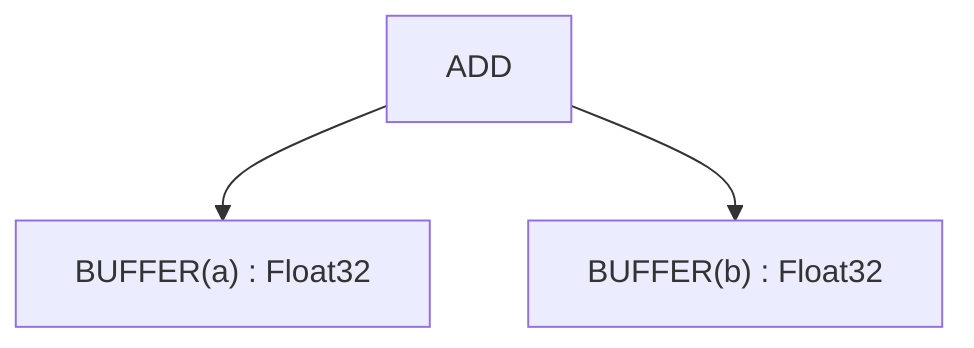
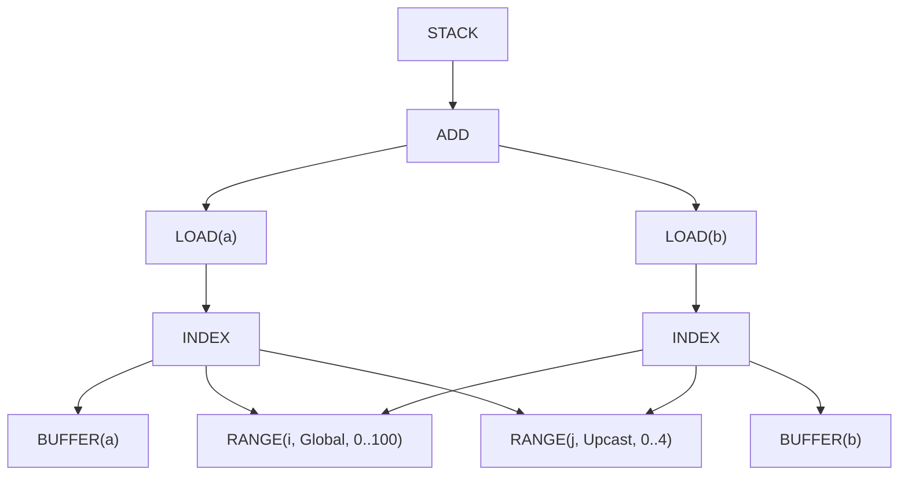
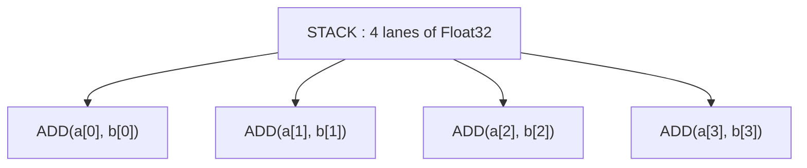

# Worked Example और रेफ़रेंस

---

## Worked Example: सभी 22 स्टेजों में ट्रेसिंग

चलिए `c = a + b` (जहाँ a, b दोनों [100, 100] tensors हैं) को पूरी पाइपलाइन में ट्रेस करते हैं।

### इनिशियल Tensor ग्राफ़


### Stage 1 के बाद: Early Movement Ops
(कोई बदलाव नहीं — इस उदाहरण में कोई movement ops नहीं)

### Stage 2 के बाद: Load Collapse
(कोई बदलाव नहीं — इस उदाहरण में कोई reductions नहीं)

### Stage 3 के बाद: Split Ranges
(कोई बदलाव नहीं — कोई modulo ऑपरेशन नहीं)

### Stage 4 के बाद: Initial Symbolic
(कोई बदलाव नहीं — सिम्प्लीफ़िकेशन की ज़रूरत नहीं)

### Stage 5 के बाद: Simplify Ranges
(कोई बदलाव नहीं — अभी कोई adjacent ranges नहीं)

### Stage 6 के बाद: Split Store
(लागू नहीं — GPU बैकएंड)

### Stage 7 के बाद: Apply Opts
ऑप्टिमाइज़ेशन एक्शन अप्लाई हुए:
- j डायमेंशन को 4 से UPCAST (वेक्टराइज़ेशन)
- इनपुट बफ़र के लिए LOCAL (अगर फ़ायदेमंद हो)

### Stage 8 के बाद: Post-Opt Symbolic
कोई बदलाव नहीं — symbolic पहले से साफ़ है।

### Stage 9 के बाद: Expander
UPCAST expansion सीधे STACK/INDEX स्ट्रक्चर से दिखाई जाती है:


नोट: साझा ranges और index एक्सप्रेशन hash consing से deduplicate हो जाते हैं।

### Stage 10 के बाद: Add Local Buffers
(अगर LOCAL opt चुना गया हो)

### Stage 11 के बाद: Remove Reduce
(कोई बदलाव नहीं — कोई reductions नहीं)

### Stage 12 के बाद: Add GPU Dims
```
[SPECIAL(gidx0)] : WeakInt  // replaces RANGE(i)
```

### Stage 13 के बाद: Add Loads
(कोई बदलाव नहीं — loads पहले से मौजूद हैं)

### Stage 14 के बाद: Devectorize
Devectorize के बाद वेक्टर स्ट्रक्चर (इफ़ेक्ट दिखाता है, exact UOp स्ट्रक्चर नहीं):


### Stage 15 के बाद: Lower Index Dtype
```
[SPECIAL(gidx0)] : i32  // concrete type
```

### Stage 16 के बाद: Post-Index Symbolic
कोई बदलाव नहीं।

### Stage 17 के बाद: Pre-Matcher
(स्टैंडर्ड बैकएंड के लिए कोई patterns नहीं)

### Stage 18 के बाद: Decompositions
कोई decompositions नहीं — सभी ops सपोर्टेड हैं।

### Stage 19 के बाद: Final Rewrite
कोई बदलाव नहीं।

### Stage 20 के बाद: Add Control Flow
डिपेंडेंसी ट्रैक हुई — कोई इश्यू नहीं।

### Stage 21 के बाद: Linearize
लीनियर इंस्ट्रक्शन सीक्वेंस (सिम्प्लीफ़ाइड):
```
1. PARAM(0)  // Output buffer c
2. PARAM(1)  // Input buffer a
3. PARAM(2)  // Input buffer b
4. RANGE(i, 0..100, Global)  // gidx0
5. LOAD(a, i*4+0..i*4+3)  // Vector load (vec4)
6. LOAD(b, i*4+0..i*4+3)  // Vector load (vec4)
7. ADD(vec_a, vec_b)  // Vector add (vec4)
8. STORE(c, i*4+0..i*4+3, result)  // Vector store
9. END(RANGE(i))
```

नोट: UPCAST Stage 9 (expander) में consume हो गया, इसलिए अलग RANGE(j) लूप नहीं है। वेक्टराइज़ेशन vec4 ऑपरेशन में implicit है।

### Stage 22 के बाद: Cleanup IF/ENDIF
कोई बदलाव नहीं — कोई गेटेड stores नहीं।

**रिज़ल्ट**: कोड जनरेशन के लिए तैयार! LLVM/CUDA/अन्य बैकएंड इसे असल मशीन कोड में कम्पाइल करेगा।

---

## Pattern अप्लिकेशन स्ट्रेटेजी

हर स्टेज दो rewrite strategies में से एक इस्तेमाल करता है:

**Top-down** (डिफ़ॉल्ट): Parents को children से पहले प्रोसेस करें। तब इस्तेमाल करें जब ट्रांसफ़ॉर्मेशन नए matchable subterms बनाता है।

**Bottom-up**: Children को parents से पहले प्रोसेस करें। तब इस्तेमाल करें जब child state parent matching को प्रभावित करता है (stages 1, 20)।

दोनों fixpoint तक iterate करते हैं — patterns तब तक चलते हैं जब तक कोई और मैच न हो।

---

## पाइपलाइन डीबगिंग

जब कोई कर्नेल गलत रिज़ल्ट देता है, तो बग इन 22 स्टेजों में से किसी एक में होता है। हर स्टेज अपना UOp ट्री `tracing` से लॉग करता है; `scripts/extract-ir.sh` उन लॉग्स को पढ़ने लायक डंप में बदल देता है:

```bash
# See IR after each transformation
./scripts/extract-ir.sh failing_test -p svod-tensor -o /tmp/ir.txt

# Or dump a single stage straight to stderr (no tracing subscriber needed)
SVOD_PER_STAGE_UOPS=1 SVOD_DUMP_STAGE=09 cargo test failing_test -- --nocapture
```

### क्विक रेफ़रेंस

| लक्षण | संभावित स्टेज | क्या चेक करें |
|-------|-------------|---------------|
| आउटपुट में गलत वैल्यूज़ | 4, 9, 11, 18 | Symbolic सिम्प्लीफ़िकेशन, expansion, devectorization |
| धीमी परफ़ॉर्मेंस | 7, 9, 14, 21 | ऑप्टिमाइज़ेशन, expansion, devectorization, linearization |
| Crashes/panics | 11, 12 | Reduce, GPU dims |
| गलत लूप काउंट | 3, 5, 12 | Split ranges, simplify ranges, GPU dims |
| मिसिंग वेक्टराइज़ेशन | 9, 14 | Expander, devectorizer |

### आम इश्यूज़

1. **Stage 3-4**: Range splitting/symbolic constraints खो सकता है
2. **Stage 9**: Expansion ऑर्डर वेक्टराइज़ेशन correctness को प्रभावित करता है
3. **Stage 11**: Accumulator initialization reduction identity से मैच होनी चाहिए
4. **Stage 14**: हार्डवेयर width mismatch — vector fold length चेक करें
5. **Stage 18**: मिसिंग decomposition — बैकएंड की supported_ops लिस्ट चेक करें
6. **Stage 21**: Priority bugs डेटा races का कारण बनती हैं — डिपेंडेंसी वेरिफ़ाई करें

---

## सारांश

22-स्टेज पाइपलाइन tensor एक्सप्रेशन को systematic refinement से मशीन कोड में बदलती है:

1. **Stages 1-7**: इटरेशन एक्सप्लिसिट बनाएँ, ranges ऑप्टिमाइज़ करें
2. **Stages 8-10**: ऑप्टिमाइज़ेशन primitives एक्सपैंड करें
3. **Stages 11-15**: हार्डवेयर-स्पेसिफ़िक ऑपरेशन में लोअर करें
4. **Stages 16-22**: एक्ज़ीक्यूटेबल इंस्ट्रक्शन में सीरियलाइज़ करें

हर स्टेज की एक ज़िम्मेदारी है। हर एक पिछले पर बनता है। नतीजा: हाई-लेवल tensor कोड विविध हार्डवेयर पर near-optimal स्पीड से चलता है।

---

## Tinygrad बनाम Svod: आर्किटेक्चरल अंतर

यह चैप्टर Tinygrad के इम्प्लीमेंटेशन पर आधारित "ideal" 22-स्टेज पाइपलाइन बताता है। Svod अब इस डिज़ाइन को न्यूनतम अंतर के साथ फ़ॉलो करता है।

### बचे हुए आर्किटेक्चरल अंतर

| स्टेज | Tinygrad | Svod | नोट्स |
|-------|----------|-------|-------|
| 17: Pre-Matcher | बैकएंड hooks एक ही `Renderer` क्लास पर रहते हैं | दो traits में बँटे: `svod_codegen::traits::Renderer` रेंडर करता है, `svod_device::device::Renderer` में `decompositor()`, `extra_matcher()`, `pre_isel_matcher()`, `isel_matcher()` हैं | Hooks वही हैं, मालिकाना अलग है |

### Aligned स्टेज (पहले अलग थे)

इस इम्प्लीमेंटेशन के अनुसार ये स्टेज Tinygrad के साथ align किए गए:

| स्टेज | क्या बदला |
|-------|----------|
| 15: Index Dtype Lowering | Svod में अब `pm_lower_index_dtype()` है पूर्ण pattern coverage के साथ: Binary ops, CONST/VCONST, WHERE, STACK, SPECIAL, PARAM, RANGE, double weak CAST |
| 18: Decompositions | जोड़ा: `fast_division_patterns()`, `pm_div_to_shr()`, `pm_fdiv_to_mul()`, `pm_comparison_negations()`, De Morgan's law |
| 19: Final Rewrite | `renderer.extra_matcher()` और `pm_split_ends()` अब codegen के बजाय schedule पाइपलाइन के final rewrite में जुड़ते हैं |

### केवल Tinygrad के Patterns

Svod जानबूझकर इन Tinygrad-स्पेसिफ़िक patterns को इम्प्लीमेंट नहीं करता:

| Pattern | उद्देश्य | Svod को क्यों नहीं चाहिए |
|---------|----------|---------------------------|
| `pm_regalloc_rewrite` | ISA बैकएंड के लिए linear-scan रजिस्टर एलोकेशन | Svod LLVM IR / सोर्स एमिट करता है, इसलिए रजिस्टर एलोकेशन बैकएंड कम्पाइलर का काम है |

### Svod एनहैंसमेंट

Svod में कुछ patterns/एनहैंसमेंट हैं जो Tinygrad में नहीं:

| एनहैंसमेंट | लोकेशन | उद्देश्य |
|------------|--------|----------|
| `uint8` के ज़रिए bool storage | `bool_storage_patterns()` in `devectorize.rs` | LLVM का `i1` ऊपरी bits में कचरा रख सकता है, इसलिए bool LOAD/STORE `uint8` से होकर जाते हैं |
| Wide-float demotion | `demote_unsupported_floats()` in `late/dtype.rs` | जिन renderers में wide float नहीं (Metal, WebGPU) वे internal f64 को f32 में कम्प्यूट करते हैं |

---

## ग्लॉसरी

| शब्द | सरल परिभाषा | उदाहरण |
|------|-------------|--------|
| **Accumulator** | रनिंग टोटल रखने वाला वेरिएबल | `acc = acc + value` (reduction में) |
| **Axis** | Tensor का एक डायमेंशन | Shape [100, 200] में 2 axes हैं |
| **AxisType** | लूप कैसे एक्ज़ीक्यूट होता है | Global=पैरेलल, Reduce=accumulate |
| **Buffer** | डेटा रखने वाली एलोकेटेड मेमोरी | Tensor का डेटा बफ़र में रहता है |
| **Bufferize** | ऑन-डिमांड कम्प्यूट के बजाय रिज़ल्ट मेमोरी में स्टोर करें | इंटरमीडिएट वैल्यू मटेरियलाइज़ करें |
| **Devectorize** | हार्डवेयर मैच करने के लिए वेक्टर स्प्लिट करें | `vec8 → vec4, vec4` |
| **Divmod** | Division और remainder ऑपरेशन | `x // 7, x % 7` |
| **Fixpoint** | जब patterns अप्लाई करने से कुछ न बदले | Patterns fixpoint तक चलते हैं |
| **STACK** | Lanes को एक shaped वैल्यू में इकट्ठा करें (Tinygrad का VECTORIZE) | `STACK(a, b, c, d)` |
| **Hash consing** | identical एक्सप्रेशन रीयूज़ करें | `ADD(x, 0) + ADD(x, 0)` मेमोरी शेयर करता है |
| **WeakInt** | Indices के लिए abstract integer type, Stage 15 पर लोअर होता है | i32 या i64, proven bounds पर निर्भर |
| **Load** | मेमोरी से रीड | `value = arr[i]` |
| **Pattern** | कोड के लिए find-and-replace नियम | `ADD(x, 0) → x` |
| **Predicated store** | कंडीशनली मेमोरी में लिखें | valid हो तो लिखो वरना स्किप |
| **Range** | लूप इटरेशन स्पेसिफ़िकेशन | `for i in 0..100` |
| **Reduction** | कई वैल्यूज़ को एक में जोड़ें | Sum, max, min |
| **Store** | मेमोरी में लिखें | `arr[i] = value` |
| **Symbolic** | अलजेब्रा नियमों से सिम्प्लीफ़ाई करें | `(x/4)*4 → x` (जब `x%4=0`) |
| **Tensor core** | फ़ास्ट मैट्रिक्स मल्टीप्लाई के लिए हार्डवेयर | NVIDIA, AMD, Apple Metal, Intel Xe |
| **Topological sort** | डिपेंडेंसी respect करते हुए नोड्स ऑर्डर करें | A, B से पहले अगर B को A का रिज़ल्ट चाहिए |
| **UNROLL** | Axis type जो लूप को अनरोल करने का निशान है | `RANGE(0..4, Unroll)` |
| **UPCAST** | Axis type जो वेक्टराइज़ करने का इंटेंट मार्क करता है | `RANGE(0..4, Upcast)` |
| **Vectorize** | कई वैल्यूज़ को एक साथ प्रोसेस करें | SIMD: एक बार में 4 नंबर जोड़ें |
| **WHERE** | कंडीशनल सिलेक्शन | `WHERE(cond, x, y) = x if cond else y` |
