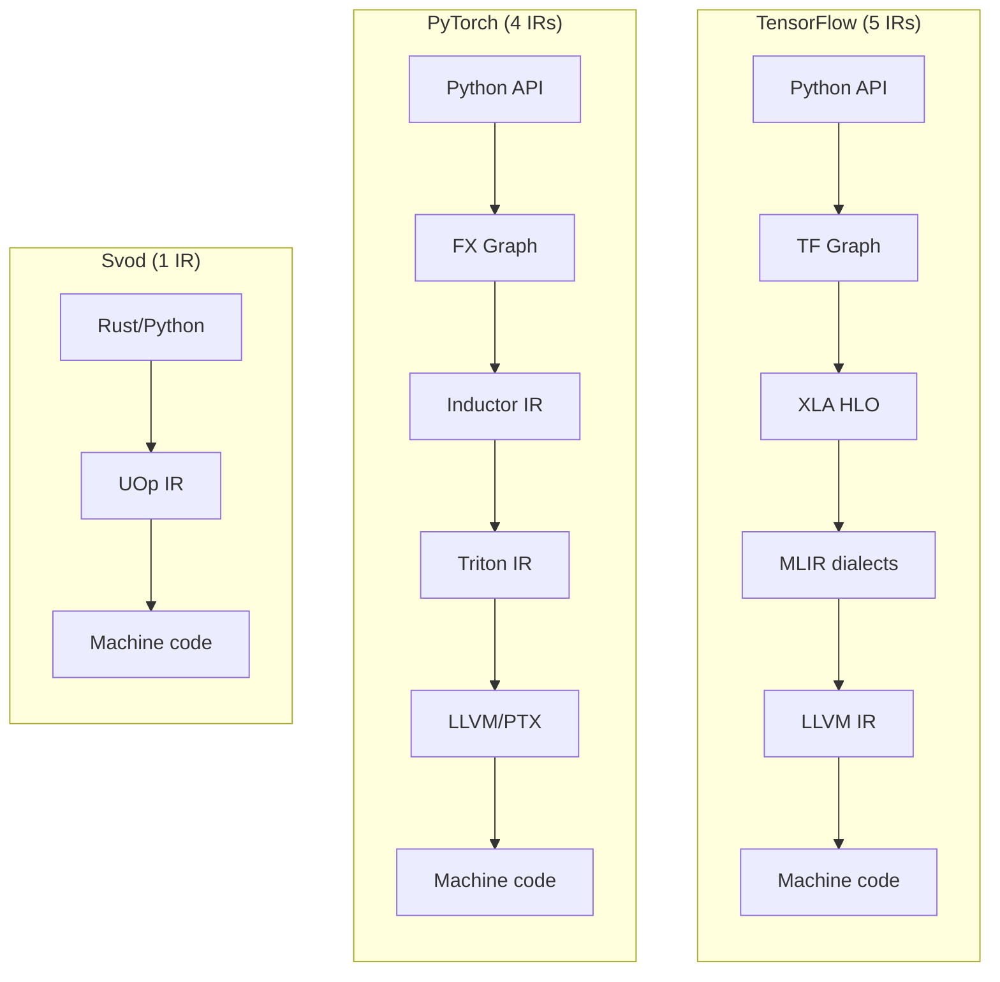
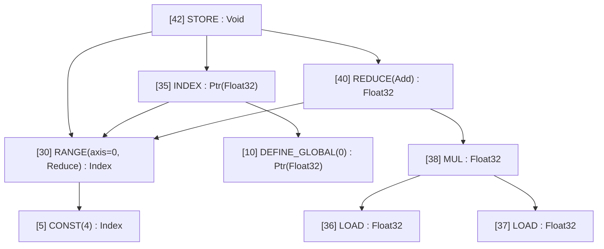
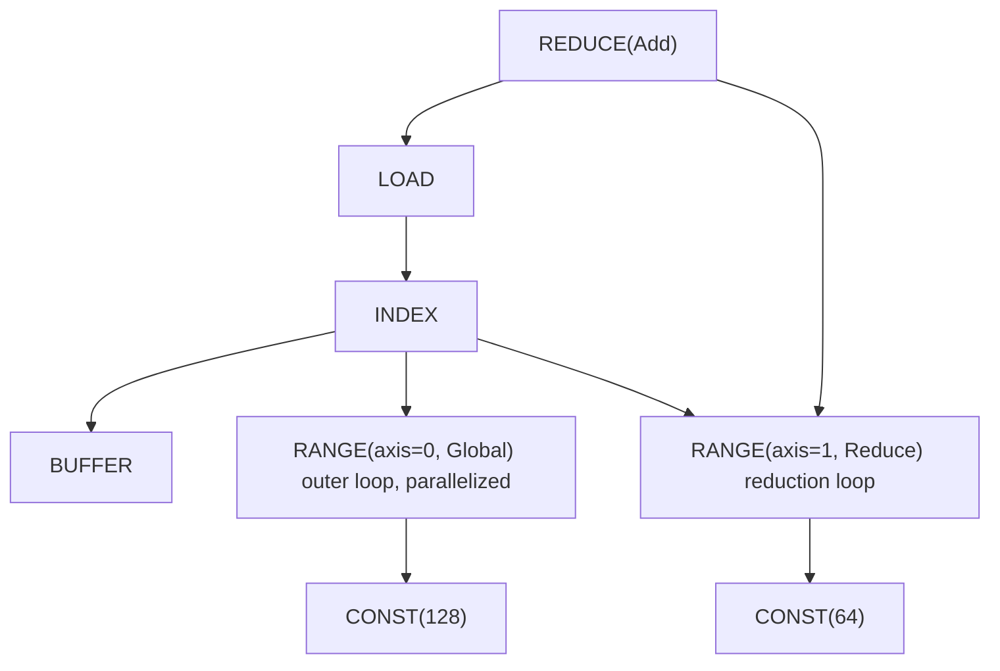
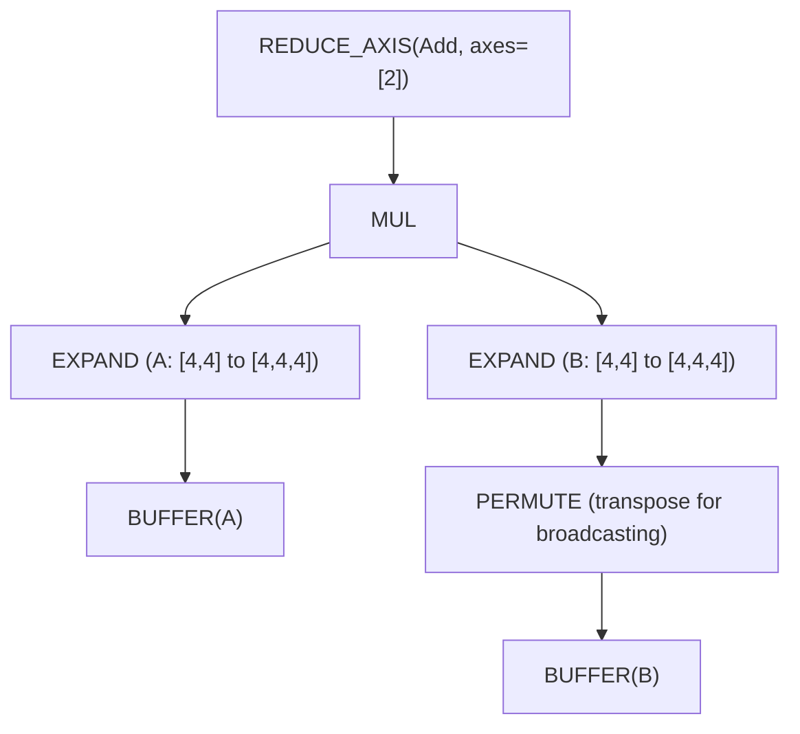
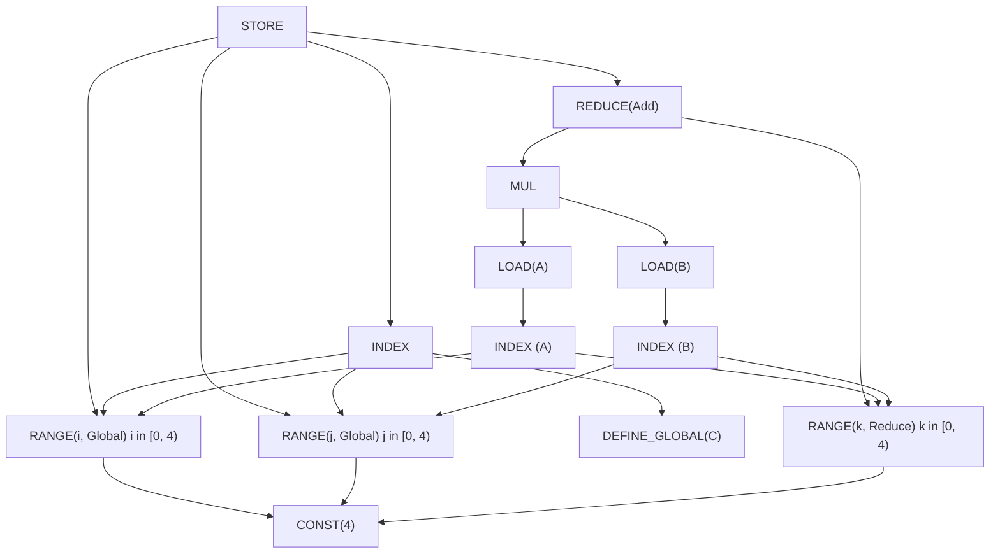

# एक IR सबके लिए

आप एक स्लो मॉडल डीबग कर रहे हैं। प्रोफ़ाइलर कहता है "kernel X 200ms लेता है" लेकिन आपको कोई आइडिया नहीं कि kernel X असल में *करता* क्या है। आप PyTorch के dispatcher से ट्रेस करते हैं, फिर ATen, फिर TorchInductor, फिर Triton IR, और आख़िर में LLVM IR पर लैंड करते हैं। पाँच अलग-अलग रिप्रेज़ेंटेशन, पाँच अलग-अलग मेंटल मॉडल, पाँच अलग-अलग डीबगिंग टूल।

यह मॉडर्न ML कम्पाइलेशन की हक़ीक़त है। TensorFlow के XLA की भी ऐसी ही कहानी है: Python → Graph → XLA HLO → MLIR → LLVM IR। हर लेयर एक असली प्रॉब्लम सॉल्व करने के लिए जोड़ी गई, लेकिन जमा होती कॉम्प्लेक्सिटी बहुत ज़्यादा है।

Svod एक अलग तरीका अपनाता है, [Tinygrad](https://github.com/tinygrad/tinygrad) से उधार लिया हुआ: **tensor से मशीन कोड तक एक ही IR**।



सबसे सिंपल आर्किटेक्चर अक्सर जीतता है। यह चैप्टर बताता है कि कैसे एक सोच-समझकर डिज़ाइन किया गया IR पूरे कम्पाइलर स्टैक की जगह ले सकता है।

---

## UOp: यूनिवर्सल नोड

**UOp** (micro-operation) कम्प्यूटेशन ग्राफ़ में एक नोड है। लेकिन दूसरे IRs के नोड्स से अलग, UOp *किसी भी* ऐब्स्ट्रैक्शन लेवल पर ऑपरेशन रिप्रेज़ेंट कर सकता है — हाई-लेवल tensor reshapes से लेकर इंडिविजुअल CPU इंस्ट्रक्शन तक।

मुख्य इनसाइट यह है: "tensor ऑपरेशन" और "लूप स्ट्रक्चर" और "मेमोरी एक्सेस" के लिए अलग-अलग IR रखने की बजाय, हम सब एक ही enum में डालते हैं:

```rust
pub enum Op {
    // High-level tensor operations
    Reshape { src: Arc<UOp>, new_shape: Arc<UOp> },
    Permute { src: Arc<UOp>, axes: Vec<usize> },
    ReduceAxis { src: Arc<UOp>, reduce_op: ReduceOp, axes: Vec<usize> },

    // Loop-level control flow
    Range { end: Arc<UOp>, axis_id: AxisId, axis_type: AxisType, deps: SmallVec<[Arc<UOp>; 2]> },
    End { computation: Arc<UOp>, ranges: SmallVec<[Arc<UOp>; 4]> },

    // Memory operations
    Load { buffer: Arc<UOp>, index: Arc<UOp>, alt: Option<Arc<UOp>> },
    Store { index: Arc<UOp>, value: Arc<UOp>, ranges: SmallVec<[Arc<UOp>; 4]> },

    // ALU operations (grouped enums with many individual values)
    Binary(BinaryOp, Arc<UOp>, Arc<UOp>),  // Add, Mul, etc.
    Unary(UnaryOp, Arc<UOp>),              // Sqrt, Exp, etc.
    Ternary(TernaryOp, Arc<UOp>, Arc<UOp>, Arc<UOp>),  // Where, MulAcc, etc.
}
```

enum में ~60 Op वैरिएंट हैं जो ऐब्स्ट्रैक्शन लेवल के अनुसार ऑर्गनाइज़ हैं (~80+ इंडिविजुअल UnaryOp/BinaryOp/TernaryOp वैल्यूज़ सहित):

| कैटेगरी | उदाहरण | क्या रिप्रेज़ेंट करता है |
|---------|--------|----------------------|
| **Movement** | `RESHAPE`, `PERMUTE`, `EXPAND`, `PAD` | Tensor shape ट्रांसफ़ॉर्मेशन |
| **Reduction** | `REDUCE_AXIS`, `REDUCE` | मैथमैटिकल एग्रीगेशन |
| **Control** | `RANGE`, `END`, `IF`, `BARRIER` | लूप और ब्रांच स्ट्रक्चर |
| **Memory** | `LOAD`, `STORE`, `INDEX`, `BUFFER` | हार्डवेयर मेमोरी एक्सेस |
| **ALU** | `ADD`, `MUL`, `SQRT`, `EXP`, `WHERE` | CPU/GPU इंस्ट्रक्शन |
| **Advanced** | `WMMA`, `CONTRACT`, `UNROLL` | Tensor cores, वेक्टराइज़ेशन |

जब आप UOp ग्राफ़ प्रिंट करते हैं, आपको उसका tree स्ट्रक्चर दिखता है:



उन arrows पर ध्यान दें जो "(same RANGE as above)" को पॉइंट करते हैं? यह सिर्फ़ pretty-printing नहीं है — यह एक फ़ंडामेंटल प्रॉपर्टी है जिसे **hash consing** कहते हैं।

---

## Hash Consing: स्ट्रक्चरल शेयरिंग

जब आप Svod में एक ही एक्सप्रेशन दो बार बनाते हैं, आपको *वही पॉइंटर* मिलता है। इक्वल वैल्यूज़ नहीं — वही मेमोरी एड्रेस।

```rust
let a = UOp::binary(Add, x.clone(), y.clone());
let b = UOp::binary(Add, x.clone(), y.clone());

assert!(Arc::ptr_eq(&a, &b));  // Same pointer!
```

:::note Origin नोड की आइडेंटिटी का हिस्सा है
`SVOD_ORIGIN=1` के साथ हर नोड वह `OriginScope` भी साथ रखता है जिसके अंदर वह बना था, और यह origin
उसके content hash में घुल जाता है। तब अलग-अलग scopes में बने दो एक जैसे सबग्राफ़ *अलग* नोड होते
हैं और तब तक शेयर नहीं होते जब तक kernel cut origins हटा नहीं देता। लिटरल इसका अपवाद हैं, और
इनके साथ `BUFFER`/`PARAM`/`UNIQUE` भी: एक ही कॉन्स्टेंट दो scopes अपने-अपने तौर पर बनाते हैं,
इसलिए वहाँ origin रखने से वही नोड बँट जाता जिसे cut बाद में फिर से जोड़ देता है। इस ट्रेड-ऑफ़ के लिए
[Profiling और Benchmarking](../tile-kernels/profiling.md#attributing-kernels-to-model-code) में “कर्नेल को model code से जोड़ना”
सेक्शन देखें।
:::

यह एक ग्लोबल lock-free cache (papaya crate इस्तेमाल करके, मेमोरी लीक से बचने के लिए `Weak` रेफ़रेंस के साथ) से काम करता है। UOp बनाते समय, पहले चेक करते हैं कि आइडेंटिकल पहले से मौजूद है या नहीं:

```rust
pub fn new(op: Op, dtype: DType) -> Arc<Self> {
    let key = UOpKey::new(&op, dtype);

    // Check cache first
    if let Some(existing) = CACHE.get(&key) {
        return existing;
    }

    // Create new and cache it
    let uop = Arc::new(UOp { op, dtype, ... });
    CACHE.insert(key, uop.clone());
    uop
}
```

ML इंजीनियरों के लिए यह क्यों ज़रूरी है?

- **पॉइंटर इक्वैलिटी ही सिमैंटिक इक्वैलिटी है।** दो subexpressions आइडेंटिकल हैं या नहीं चेक करने के लिए, बस पॉइंटर कम्पेयर करें: `Arc::ptr_eq(&a, &b)`। कोई tree traversal नहीं चाहिए।

- **पैटर्न मैचिंग O(1) है।** जब ऑप्टिमाइज़र पूछता है "क्या मैंने यह पैटर्न पहले देखा है?", पॉइंटर कम्पेरिज़न तुरंत जवाब देता है।

- **मेमोरी एफ़िशिएंसी।** कॉमन subexpressions (सोचें: attention में शेयर्ड कम्प्यूटेशन, gradient ग्राफ़) एक बार स्टोर होते हैं, डुप्लिकेट नहीं।

- **Thread सेफ़्टी।** अलग-अलग threads से एक ही कम्प्यूटेशन एक ही ऑब्जेक्ट प्रोड्यूस करता है — कोई सिंक्रोनाइज़ेशन बग नहीं।

Tree printout यह दिखाता है: जब आप `[10] → (same as above)` देखते हैं, वो कॉपी नहीं है — वो *वही नोड* है जो मल्टीपल जगहों से रेफ़रेंस होता है।

---

## एक्सप्लिसिट लूप: `RANGE` ऑपरेशन

ज़्यादातर ML IRs लूप्स को ऑपरेशन के अंदर छिपाते हैं। ONNX में, रिडक्शन ऐसा दिखता है:

```python
ReduceSum(data, axes=[1], keepdims=0)
```

लूप कहाँ है? यह implicit है — `ReduceSum` के रनटाइम इम्प्लीमेंटेशन के अंदर कहीं। आप इसे देख नहीं सकते, मॉडिफ़ाई नहीं कर सकते, रीज़न नहीं कर सकते।

Svod `RANGE` ऑपरेशन से लूप्स को *explicit* बनाता है। वही रिडक्शन बनती है:



हर `RANGE` का एक **AxisType** होता है जो code generator को बताता है कि इसे कैसे कम्पाइल करना है:

| AxisType | CPU | CUDA | मतलब |
|----------|-----|------|------|
| **Loop** | `for` loop | `for` loop | सीक्वेंशियल इटरेशन; rangeify का डिफ़ॉल्ट |
| **Global** | Thread pool | `blockIdx` | आउटर पैरेलल डायमेंशन |
| **Thread** | Thread pool | — | CPU पैरेलिज़्म |
| **Warp** | (N/A) | warp/wavefront | सब-ग्रुप पैरेलिज़्म |
| **Local** | (N/A) | `threadIdx` | वर्कग्रुप पैरेलिज़्म |
| **GroupReduce** | (N/A) | Shared memory | टू-स्टेज रिडक्शन |
| **Upcast** | SIMD vector | Register tile | वेक्टराइज़ेशन |
| **Reduce** | Accumulator | Warp reduce | रिडक्शन डायमेंशन |
| **Unroll** | Unrolled | Unrolled | लूप अनरोलिंग |

AxisType हाइरार्की (Loop → Global/Thread → Warp → Local/GroupReduce → Upcast → Reduce → Unroll) हार्डवेयर एक्ज़ीक्यूशन मॉडल से मैप करती है — आउटर लूप्स की प्रायोरिटी कम होती है। `AxisType::Global` वाला `RANGE` CUDA में `blockIdx.x` बनता है। `AxisType::Local` वाला `RANGE` `threadIdx.x` बनता है।

एक्सप्लिसिट लूप्स क्यों ज़रूरी हैं:

- **ऑप्टिमाइज़ेशन विज़िबल है।** आप *देख* सकते हैं कि कौन से लूप पैरेललाइज़ होंगे, कौन से अनरोल होंगे, कौन से SIMD इस्तेमाल करेंगे।

- **शेड्यूलिंग ग्राफ़ रीराइटिंग है।** लूप ऑर्डर बदलना, tiling, या अनरोलिंग बस एक पैटर्न ट्रांसफ़ॉर्मेशन है — कोई स्पेशल "scheduling pass" नहीं।

- **हर स्टेज पर वही IR।** tensor लेवल पर "iterate over batch dimension" रिप्रेज़ेंट करने वाला `RANGE` *वही* `RANGE` है जो जनरेटेड कोड में `for (int i = 0; i < N; i++)` बनता है।

---

## ग्राफ़ रीराइटिंग: एक ट्रांसफ़ॉर्मेशन मैकेनिज़्म

ट्रेडिशनल कम्पाइलरों में दर्जनों स्पेशलाइज़्ड पासेज़ होते हैं: constant folding, dead code elimination, loop unrolling, operator fusion। हर पास का अपना कस्टम लॉजिक, कस्टम डेटा स्ट्रक्चर, कस्टम बग्स।

Svod एक मैकेनिज़्म इस्तेमाल करता है: **पैटर्न-आधारित ग्राफ़ रीराइटिंग**।

```rust
patterns! {
    // Identity folding: x + 0 → x
    Add[x, @zero] => x,

    // Constant folding: 3 + 4 → 7
    Add(a @const(a_val), _b @const(b_val))
        => eval_add(a_val, b_val).map(|r| UOp::const_(a.dtype(), r)),

    // Self-folding: x / x → 1
    Idiv(x, x) => UOp::one(x.dtype()),

    // Dead code: if(true) { x } else { y } → x
    Where(Const(ConstValue::Bool(true)), t, _f) => t,
}
```

DSL बहुत एक्सप्रेसिव है:

- **`[x, y]` — commutative।** दोनों orderings ट्राई करता है (`ADD`, `MUL`, वगैरह के लिए)
- **`(x, y)` — ordered।** बिल्कुल इसी ऑर्डर में मैच करता है।
- **`@zero`, `@one` — सिमैंटिक कॉन्स्टेंट।** किसी भी dtype के लिए काम करता है।
- **`c @const(val)` — वैल्यू एक्सट्रैक्ट करें।** कम्पाइल-टाइम कम्प्यूटेशन के लिए।
- **`x, x` — same operand।** पॉइंटर इक्वैलिटी डिटेक्ट करता है।
- **`=>` — रीराइट।** `Arc<UOp>`, `Option<Arc<UOp>>` (`None` का मतलब स्किप) या `RewriteResult` रिटर्न करता है।

रीराइट इंजन बॉटम-अप पैटर्न अप्लाई करता है जब तक कोई और मैच न हो:

```text
Original:       Add(Mul(x, 1), 0)
After Mul:      Add(x, 0)         # Mul(x, 1) → x
After Add:      x                 # Add(x, 0) → x
```

यह सिंगल मैकेनिज़्म हैंडल करता है:

- **एल्जेब्रिक सिम्प्लिफ़िकेशन** — constant folding, identity removal
- **Rangeify ट्रांसफ़ॉर्मेशन** — movement ops → explicit लूप्स
- **कर्नेल ऑप्टिमाइज़ेशन** — vectorization, unrolling, tensor cores
- **कोड जनरेशन** — हार्डवेयर प्रिमिटिव्स में लोअरिंग

वही पैटर्न, वही इंजन, हर स्टेज के लिए अलग पैटर्न सेट।

---

## वर्क्ड उदाहरण: Matmul की यात्रा

चलिए `C = A @ B` (4×4 मैट्रिक्स मल्टिप्लाई) को पूरी पाइपलाइन से ट्रेस करते हैं।

### स्टेज 1: Tensor कंस्ट्रक्शन

जब आप `A.matmul(&B)` लिखते हैं, Svod एक हाई-लेवल UOp ग्राफ़ बनाता है:



यह प्योर math है: "A और B को expand करो ताकि डायमेंशन अलाइन हों, elementwise मल्टिप्लाई करो, contracted axis पर sum करो।"

### स्टेज 2: Rangeify

Rangeify पास movement ops (`EXPAND`, `PERMUTE`) को `RANGE` लूप्स के साथ एक्सप्लिसिट index कम्प्यूटेशन में बदलता है:



अब हम लूप स्ट्रक्चर देख सकते हैं: `i` और `j` `Global` हैं (parallelized), `k` `Reduce` है (accumulated)।

### स्टेज 3: Symbolic सिम्प्लिफ़िकेशन

पैटर्न रीराइट्स redundant ऑपरेशन हटाते हैं, constants फ़ोल्ड करते हैं, और index अरिथमेटिक सिम्प्लिफ़ाई करते हैं।

### स्टेज 4: कोड जनरेशन

फ़ाइनल IR सीधे लूप्स में ट्रांसलेट होता है:

```c
// GPU kernel (conceptual)
__global__ void matmul(float* C, float* A, float* B) {
    int i = blockIdx.x;   // from RANGE(i, Global)
    int j = blockIdx.y;   // from RANGE(j, Global)
    float acc = 0.0f;
    for (int k = 0; k < 4; k++) {  // from RANGE(k, Reduce)
        acc += A[i*4 + k] * B[k*4 + j];
    }
    C[i*4 + j] = acc;
}
```

मुख्य observation: **स्ट्रक्चर हर स्टेज पर विज़िबल है**। कोई जादुई fusion पास नहीं जो तीन nested लूप्स को कुछ अनरिकॉग्निज़ेबल बना दे। स्टेज 2 में दिखने वाला `RANGE` स्ट्रक्चर बिल्कुल वही है जो स्टेज 4 में लूप्स बनता है।

---

## तुलना: दूसरे IR कैसे अलग हैं

अलग-अलग IR अलग-अलग tradeoffs बनाते हैं। यह रहा तुलनात्मक अवलोकन:

| पहलू | ONNX | XLA HLO | Triton | **Svod** |
|-------|------|---------|--------|-----------|
| **उद्देश्य** | मॉडल इंटरचेंज | बैकएंड ऑप्टिमाइज़ेशन | GPU कर्नेल DSL | पूर्ण कम्पाइलेशन |
| **ऑपरेटर** | ~200 हाई-लेवल | ~100–150 हाई-लेवल | Tile ऑपरेशन | ~80 मल्टी-लेवल |
| **लूप मॉडल** | Implicit | Implicit | Tile-based | **एक्सप्लिसिट `RANGE`** |
| **मेमोरी** | प्योर values | प्योर values → buffers | एक्सप्लिसिट pointers | **एक्सप्लिसिट `LOAD`/`STORE`** |
| **ऑप्टिमाइज़ेशन** | कोई नहीं | स्पेशलाइज़्ड पासेज़ | MLIR पैटर्न | **यूनिफ़ाइड रीराइटिंग** |
| **टारगेट** | रनटाइम इंजन | CPU/GPU/TPU | सिर्फ़ GPU | CPU/GPU |

**ONNX** पोर्टेबिलिटी मैक्सिमाइज़ करता है। `Conv` और `MatMul` जैसे ऑपरेशन सभी इम्प्लीमेंटेशन डिटेल्स छिपाते हैं। मॉडल एक्सचेंज के लिए बढ़िया, लेकिन जो नहीं दिखता उसे ऑप्टिमाइज़ नहीं कर सकते।

**XLA HLO** फ़ंक्शनल और प्योर है — कोई साइड इफ़ेक्ट नहीं, immutable tensor। यह एल्जेब्रिक ऑप्टिमाइज़ेशन सक्षम करता है लेकिन कोड जनरेशन से पहले एक अलग "buffer assignment" फ़ेज़ की ज़रूरत है। HLO से LMHLO (buffer-based) का ट्रांज़िशन एक फ़ंडामेंटल बाउंड्री है।

**Triton** ONNX से ज़्यादा एक्सपोज़ करता है लेकिन Svod से कम। आप "tile-level" कोड लिखते हैं — डेटा के ब्लॉक पर ऑपरेशन — और कम्पाइलर thread-level डिटेल्स हैंडल करता है। एक्सप्लिसिट मेमोरी (`tl.load`, `tl.store`) लेकिन tiles के अंदर implicit पैरेललाइज़ेशन।

**Svod** सब कुछ एक्सपोज़ करता है: लूप्स एक्सप्लिसिट हैं (`RANGE`), मेमोरी एक्सप्लिसिट है (`LOAD`/`STORE`), पैरेललाइज़ेशन एक्सप्लिसिट है (`AxisType`)। इसका मतलब सीखने को ज़्यादा है, लेकिन कुछ भी छिपा नहीं है।

---

## यह क्यों ज़रूरी है: प्रैक्टिकल फ़ायदे

Svod का ट्रांसपैरेंट IR ML इंजीनियरों के लिए प्रैक्टिकल फ़ायदे रखता है:

**डीबगिंग डायरेक्ट है।** किसी भी स्टेज पर ग्राफ़ प्रिंट करें:

```rust
println!("{}", tensor.uop().tree());
```

आपको एक्ज़ैक्टली दिखेगा कि कौन से ऑपरेशन मौजूद हैं, कैसे कनेक्ट हैं, और कम्प्यूटेशन कहाँ होता है। कोई "kernel X" मिस्ट्री नहीं।

**परफ़ॉर्मेंस ट्यूनिंग इन्फ़ॉर्म्ड है।** देखें कौन से लूप पैरेललाइज़ हैं:

```text
[RANGE(batch, Global)]    # parallelized across GPU blocks
[RANGE(channel, Local)]   # parallelized within blocks
[RANGE(pixel, Loop)]      # sequential — might be slow!
```

अगर कुछ पैरेलल होना चाहिए लेकिन नहीं है, आप इसे देख सकते हैं।

**मेंटल मॉडल सिंपल है।** एक IR, एक ट्रांसफ़ॉर्मेशन मैकेनिज़्म, ऑपरेशन का एक सेट। आपको XLA HLO *और* MLIR *और* Triton *और* LLVM सीखने की ज़रूरत नहीं। बस UOps।

**ऑप्टिमाइज़ेशन composable है।** कस्टम रीराइट चाहिए? एक पैटर्न जोड़ें:

```rust
patterns! {
    // Your custom optimization
    MyPattern(x, y) => better_version(x, y),
}
```

यह उसी इंजन के साथ काम करता है जो constant folding, fusion, और बाकी सब कुछ करता है।

---

## गहरी समझ

Svod/Tinygrad साबित करता है कि कम्पाइलर कॉम्प्लेक्सिटी अक्सर *accidental* होती है, essential नहीं। TensorFlow और PyTorch में मल्टी-लेयर IR स्टैक ऑर्गैनिकली जमा हुए — हर लेयर ने एक असली प्रॉब्लम सॉल्व की, लेकिन कंबाइंड सिस्टम किसी भी इंडिविजुअल पार्ट से ज़्यादा मुश्किल है।

एक अच्छी तरह डिज़ाइन किया गया IR, एक ट्रांसफ़ॉर्मेशन मैकेनिज़्म, और principled composition हज़ारों लाइनों के स्पेशलाइज़्ड पासेज़ की जगह ले सकती है। यह Unix philosophy है जो कम्पाइलरों पर लागू है: एक काम अच्छे से करो, और compose करो।

कीमत explicitness है — आप लूप्स, मेमोरी एक्सेसेज़, और पैरेललाइज़ेशन हिंट्स देखते हैं जो दूसरे IR छिपाते हैं। लेकिन visibility एक feature है, bug नहीं। जब आपका मॉडल स्लो हो, आप *क्यों* देखना चाहते हैं, कम्पाइलर पर उम्मीद नहीं करना कि वो ख़ुद समझ ले।

Svod यही दाँव लगाता है: transparent complexity, hidden complexity से बेहतर है।
