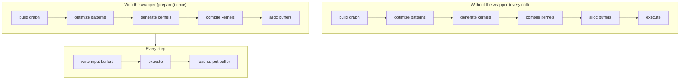

# JIT ग्राफ़

एक streaming ASR pipeline वही encoder सैकड़ों बार call करती है। हर call पर tensor graph बनाना, उसे optimize करना, kernel source generate करना, उसे backend के [JIT loader](../backends/jit-loader.md) के ज़रिए compile करना, और device buffers allocate करना — यह सब वह काम है जो input पर निर्भर नहीं है, और हर बार दोहराना बर्बादी है।

`jit_wrapper!` macro और `model::jit` runtime layer उस build-once / run-many pattern को **एक typed Rust struct** में बदल देते हैं। आप inputs और graph declare करते हैं; macro एक wrapper generate करता है जो `prepare()` के दौरान graph को एक बार compile करता है और हर `execute()` पर device buffers को जगह पर रखते हुए उसे replay करता है।



Wrapper [पैटर्न इंजन](./optimizations/pattern-system.md) (जो `prepare()` के समय चलता है) और [JIT लोडर](../backends/jit-loader.md) (जो optimized kernels को in-memory machine code में बदलता है) के साथ compose होता है। यह पेज उस wrapper layer को कवर करता है जो दोनों के ऊपर बैठती है।

---

## `jit_wrapper!` DSL

एक wrapper declaration struct का नाम देता है, उस model type को जो build closure को मिलता है, वे inputs जो wrapper expose करता है, optional symbolic shape variables, और एक `build` block जो graph बनाता है:

```rust
jit_wrapper! {
    MyModelJit(MyModel) {
        input1: Tensor,
        input2: Tensor,

        vars {
            b: (1, max_batch),
            t: (1, max_time),
        }

        build(input1, input2, b, t) {
            model.forward(input1, input2, &b, &t)
        }
    }
}
```

| Section | मतलब | ज़रूरी |
|---|---|---|
| `WrapperName(ModelType) { ... }` | generated struct का नाम और उस model का type जो build closure को मिलता है | हाँ |
| `input_name: Tensor` lines | wrapper द्वारा expose किए गए हर input के लिए एक; `: Tensor` annotation केवल informational है | optional (आमतौर पर एक या ज़्यादा) |
| `vars { name: (min, max), ... }` | compile-time bounds के साथ symbolic shape variables | optional |
| `outputs { name, ... }` | हर output के लिए एक नामित buffer accessor; तब `build` closure इसी क्रम में उतने ही tensors का tuple return करती है | optional |
| `build(args...) { ... }` | closure जो inputs और vars से output tensor बनाती है; `model` scope में होता है | हाँ |

`build` arguments में हर एक को या तो किसी input का या किसी declared var का नाम होना चाहिए (macro expansion time पर ऐसे नामों को reject कर देता है जो match नहीं होते)। Block के अंदर, हर input एक `&Tensor` होता है (macro `prepare()` चलने पर एक zero-initialized placeholder allocate करता है), हर var एक `svod_tensor::BoundVariable` होता है जो पहले से अपने upper bound से bound होता है — उसे आगे `&name` के रूप में pass करें — और `model` wrapper की owned model value का shared reference होता है। Closure किसी भी `E: std::error::Error + Send + Sync + 'static` के लिए `Result<Tensor, E>` return करती है; failures `JitError::Build` के रूप में सामने आती हैं।

`outputs` block के बिना closure एक अकेला `Tensor` return करती है, जो `output()` के ज़रिए पहुँच में होता है। एक `outputs` block के साथ वह ठीक उतने ही tensors का tuple return करती है और हर एक को declaration order के हिसाब से अपना नामित `&Buffer` accessor मिलता है। अगर scheduler ने उनमें से किसी को fuse या elide कर दिया होता तो positional accessors चुपचाप misalign हो जाते, इसलिए इसके बजाय `prepare()` `JitError::OutputCountMismatch` के साथ fail होता है।

---

## Symbolic variables

एक `vars { ... }` block ऐसे values declare करता है जो graph में shape या index expressions के रूप में भाग लेते हैं, लेकिन जिनकी exact value execute time पर supply की जाती है। ये एक prepared plan को बिना recompile किए input shapes की एक range serve करने देते हैं।

हर entry `name: (min, max)` wrapper पर तीन configuration setters generate करती है:

| Setter | Effect |
|---|---|
| `with_<name>_bound(max)` | केवल upper bound override करें; `max < min` होने पर panic |
| `with_<name>_min_bound(min)` | केवल lower bound override करें; `min > max` होने पर panic |
| `with_<name>_fixed(value)` | दोनों bounds को `value` पर pin करें, var को JIT-time constant में बदल देता है; `value == 0` पर panic |

तीनों `Self` return करते हैं (builder style) और `prepare()` से पहले call किए जाने चाहिए क्योंकि build closure चलते समय bounds capture करती है।

एक wider range एक ज़्यादा general kernel generate करती है जिसे range की हर shape handle करनी पड़ती है; एक tighter range optimizer को specialize करने देती है। जब value कभी नहीं बदलती तब `with_<name>_fixed` से var को pin करें, और जब कोई outer caller model की hard ceiling से छोटा maximum advertise करे तब upper bound को सिकोड़ें।

Execute time पर, actual values `execute_with_vars` के माध्यम से pass करें:

```rust
jit.execute_with_vars(&[("b", batch as i64), ("t", time as i64)])?;
```

हर pair एक var bind करता है; जो vars listed नहीं हैं वे जो भी value रखते हैं उसे बनाए रखते हैं — उनका `prepare()`-time upper bound, या वह value जिस पर पिछला `execute_with_vars` उन्हें छोड़ गया था। Bindings sticky हैं, per-call नहीं। var की declared `[min, max]` से बाहर की value error नहीं बल्कि एक out-of-bounds access है: buffers `max` के हिसाब से allocate होते हैं।

---

## Generated runtime API

Macro wrapper के life cycle के हर phase के लिए एक method group emit करता है:

| Method | Phase | Notes |
|---|---|---|
| `new(model)` | construction | model को by value लेता है; अभी तक कोई kernels compiled नहीं |
| `with_<var>_bound` / `with_<var>_min_bound` / `with_<var>_fixed` | `new` और `prepare` के बीच | shape envelope configure करें |
| `prepare(input1: InputSpec, ...)` | one-time | graph build, patterns चलाएँ, kernels compile, buffers allocate; `PrepareConfig::from_env()` पढ़ता है |
| `prepare_with_config(..., &PrepareConfig)` | one-time | `prepare` की तरह लेकिन explicit config के साथ |
| `<input>_mut() -> Result<&mut Buffer>` | per step | हर declared input के लिए typed accessor |
| `output() -> Result<&Buffer>` | per step | prepared graph का output |
| `execute() -> Result<()>` | per step | मौजूदा input buffers के साथ replay |
| `execute_with_vars(&[(name, value)]) -> Result<()>` | per step | replay और एक या ज़्यादा symbolic variables rebind |
| `execute_profiled` / `execute_with_vars_profiled` | optional | non-profiled variants की तरह लेकिन `Vec<KernelProfile>` return |
| `execute_profiled_static()` | optional | `ExecutionPlan::profile` के ज़रिए एक profiled run, जो last stage के kernels return करता है |
| `copy_output_to_<input>(out_pos, dst_off, src_off, len)` | per step | किसी output region की on-device copy वापस एक input buffer में; कोई host round-trip नहीं |
| `replicate() -> Result<Self>` | optional | concurrent execution के लिए एक prepared JIT की deep-copy: forked buffers, shared model और kernels, अपनी queue |

चार lower-level accessors tooling के लिए plan details expose करते हैं:

| Accessor | Returns |
|---|---|
| `buffers()` | हर वह buffer जो plan owns करता है |
| `output_buffers()` | plan के declared output buffers |
| `input_buffer_ids()` | वे device buffer ids जिनमें wrapper लिखता है |
| `prepared_kernels()` | compiled kernels |

ज़्यादातर callers को इनकी ज़रूरत नहीं होती। `prepare()` से पहले कोई भी per-step method call करना `JitError::NotPrepared` return करता है।

---

## `InputSpec`

`prepare()` हर declared input के लिए एक `InputSpec` लेता है:

```rust
pub struct InputSpec {
    pub shape: Vec<usize>,
    pub dtype: DType,
    /// Allocate the input device-local (no host mapping).
    pub device_local: bool,
}

impl InputSpec {
    pub fn new(shape: &[usize], dtype: DType) -> Self { ... }
    pub fn f32(shape: &[usize]) -> Self { ... }
    pub fn i32(shape: &[usize]) -> Self { ... }
    pub fn i64(shape: &[usize]) -> Self { ... }
    pub fn device_local(mut self) -> Self { ... }
}
```

Macro shape और dtype का उपयोग build closure invoke करने से पहले एक zero-initialized placeholder tensor allocate करने के लिए करता है। Callers ख़ुद `Tensor::zeros(...).realize()` placeholders नहीं बनाते। Shape अधिकतम input size बन जाती है; symbolic variables execute time पर इसे `try_shrink` जैसी operations के माध्यम से सिकोड़ते हैं — यह एक coding pattern है, wrapper द्वारा enforce किया गया runtime contract नहीं। `device_local()` उन inputs के लिए host mapping हटा देता है जिन्हें host केवल `copyin` से लिखता है या on-device refill करता है — वह recurrent state जिसे host को हर step पर देखने की ज़रूरत नहीं होती।

---

## Recurrent execution

Recurrent models calls के बीच एक host-side LSTM state reuse करते हैं। उस pattern के लिए wrapper है `JitRecurrent<J>`। यह एक `jit_wrapper!`-generated JIT लेता है जो `RecurrentJit` trait भी implement करता है, साथ ही एक initial `LstmState` और `f32` elements में head length:

```rust
pub struct LstmState {
    pub h: Vec<f32>,
    pub c: Vec<f32>,
}

pub trait RecurrentJit {
    fn pack_state(&mut self, state: &LstmState) -> Result<()>;
    fn execute_step(&mut self) -> Result<()>;
    fn output_buffer(&self) -> Result<&Buffer>;
}
```

:::tip[Output layout contract]
JIT का output buffer last axis के साथ `[head | h_flat | c_flat]` का एक flat `f32` block होना चाहिए, जहाँ `h_flat` और `c_flat` की length क्रमशः `state.h.len()` और `state.c.len()` होती है। `JitRecurrent::new` construction पर output buffer के size को एक बार declared head plus state size के विरुद्ध check करता है, और math match न हो तो `JitError::OutputLayoutMismatch` return करता है। यह build-closure drift को construction time पर पकड़ लेता है बजाय इसके कि एक silent mis-split downstream values को corrupt करे।
:::

`step(|jit| pack_inputs(jit))` का हर call एक recurrent iteration चलाता है:

1. Closure per-step non-state inputs (audio chunk, token id, encoder frame, ...) JIT के typed `*_mut` accessors के माध्यम से लिखती है।
2. `RecurrentJit::pack_state` मौजूदा host state को JIT के state input buffers में copy करता है।
3. `execute_step` plan replay करता है।
4. Wrapper output buffer को head, नए `h`, नए `c` में split करता है, host state को in place update करता है, और head slice को `&[f32]` के रूप में return करता है।

`reset()` JIT को छुए बिना host state को zero कर देता है, ready for a new sequence। `last_timing` profiling के लिए सबसे recent per-step `pack` / `exec` / `read` durations expose करता है।

---

## उदाहरण: GigaAM encoder

GigaAM Conformer encoder constant shape पर prepare किया जाता है। Batch और mel-frame bounds construction पर एक बार compute होकर plan में bake कर दिए जाते हैं; छोटे chunks उन्हीं buffers में zero-pad कर दिए जाते हैं:

```rust
jit_wrapper! {
    GigaAmEncoderJit(GigaAm) {
        mel: Tensor,
        lengths: Tensor,

        build(mel, lengths) {
            let out = model.encoder.forward_batch(mel, lengths)?;
            // Permute [B, d_model, T_sub] → [B, T_sub, d_model] on-device: the
            // RN-T decoder consumes frame-major rows, and doing it here turns
            // a host-side strided transpose into one contiguous copyout.
            out.cast(svod_dtype::DType::Float32).context(TensorSnafu)?
                .try_permute(&[0, 2, 1]).context(TensorSnafu)
        }
    }
}
```

Wrapper एक mel-spectrogram input और एक per-batch length vector लेता है और `[B, T_sub, d_model]` produce करता है। `GigaAmTranscriber` plan का size एक ही बार तय करता है: mel length को अगली power of two तक round up किया जाता है ताकि codegen को एक साफ़ factorisation दिखे, और उसे `config.max_mel_frames` पर clamp किया जाता है; batch को इतना cap किया जाता है कि live SDPA score tiles `max_scores_mib` के अंदर रहें। फिर हर chunk `execute()` के ज़रिए वही plan replay करता है।

`out.cast(DType::Float32)` encoder और किसी भी downstream head के बीच fp32 boundary है। Encoder speed के लिए fp16 या bf16 में चल सकता है, लेकिन हर consumer (CTC log-softmax, RN-T predictor और joint) को एक uniform fp32 input दिखता है। Cast को JIT के अंदर रखने का मतलब है कि वह encoder के tail kernels में fuse हो जाता है।

---

## उदाहरण: Silero VAD

Silero V5 एक recurrent network है, लेकिन उसकी recurrence इतनी छोटी है कि हर window पर एक launch चुकाना घाटे का सौदा है। इसलिए JIT केवल batched conv front-end और LSTM input projection को cover करता है; scan ख़ुद host पर रहता है:

```rust
jit_wrapper! {
    SileroVadFeatureJit(SileroVad) {
        chunks: Tensor,

        build(chunks) {
            // [FEATURE_BATCH, CHUNK_LEN] -> [FEATURE_BATCH, 4*HIDDEN] LSTM gate
            // pre-activations (conv features + input projection, biases folded).
            model.forward_gates(chunks)
        }
    }
}
```

Leading dimension एक var नहीं बल्कि एक fixed `FEATURE_BATCH` (4096) है: front-end row-independent है, इसलिए एक partial batch बस कम rows भरता है, और एक symbolic leading dim reflect-pad lowering को गड़बड़ा देता है। Preparation एक device-local output माँगती है, क्योंकि 8 MiB का gate readback host mapping के बजाय copy engine पर होना चाहिए:

```rust
let mut jit = SileroVadFeatureJit::new(vad);
let mut config = svod_tensor::PrepareConfig::from_env();
config.device_local_outputs = true;
jit.prepare_with_config(InputSpec::f32(&[FEATURE_BATCH, CHUNK_LEN]), &config)?;
```

फिर `VadInference::probs` waveform को `FEATURE_BATCH`-size के dispatches में चलती है — `chunks_mut()` में pack करें, `execute()`, valid rows को `copyout_prefix` — और gates को `VadHead::scan` को सौंपती है, जो host पर एक 8-lane `f32x8` LSTM plus sigmoid head है। इस split ने उस path की जगह ली जिसमें हर window पर एक tiny dispatch होता था और जिसकी round-trip latency पूरे model पर हावी थी।

---

## Data-independence contract

Wrapper graph को एक बार compile करता है और उसे कई बार replay करता है। यह तभी काम करता है जब graph topology `prepare()` time पर fixed हो। कुछ भी जो execute time पर बदल सकता है उसे या तो input buffers के माध्यम से (`*_mut` से) या symbolic vars के माध्यम से (`execute_with_vars` से) flow करना चाहिए। Build closure के अंदर tensor value पर एक branch graph को उस branch तक specialize कर देता है; यह एक build-time decision है, runtime नहीं।

:::note[Pitfalls]
- Build closure के अंदर एक `Tensor::full(value).realize()` उस value को single prepared plan में bake कर देता है। किसी भी per-call variation के लिए `prepare()` को scratch से दोबारा चलाना पड़ता है — पूरा graph build plus kernel compile। उस per-step setup के लिए जिसे JIT को देखने की ज़रूरत नहीं है, host-side scratch buffers (उदाहरण के लिए `ndarray::Array3`) सही choice हैं।
- JIT के अंदर dynamic shape handle करने का idiomatic तरीक़ा है एक maximum-sized input पर var-bound length के साथ `try_shrink`, साथ में call site पर `execute_with_vars`। ResNet और YOLO दोनों batch dimension को इसी तरह shrink करते हैं।
:::

Contract का उल्लंघन दो failure modes में से एक produce करता है: ग़लत results, क्योंकि cached plan एक ऐसी value पर stale assumption के साथ replay होता है जो असल में vary करती निकली; या silent slowness, क्योंकि हर call recompile path में चली जाती है। इन्हें build closure फिर से पढ़कर diagnose करें; kernel output शायद ही मदद करता है।

---

## Errors

`JitError` वे runtime failures cover करता है जो wrapper raise कर सकता है। ज़्यादातर unrecoverable हैं और किसी transient condition के बजाय usage bug indicate करते हैं।

| Variant | किससे trigger होता है |
|---|---|
| `NotPrepared` | `prepare` से पहले per-step method call की गई, या output buffer उपलब्ध नहीं |
| `InputBufferNotFound` | prepared plan के अंदर input index resolution fail हुआ |
| `DuplicateInputBuffer` | दो declared inputs `prepare` time पर एक ही device buffer पर map हो गए |
| `InputAliased` | एक input किसी foreign plan buffer पर resolve हुआ — एक concurrent `prepare` ने उसकी graph identity corrupt कर दी |
| `Build` | build closure ने `Err` return किया; inner error `Box<dyn Error + Send + Sync>` के रूप में preserved है |
| `Tensor` | `prepare` में या build closure में एक tensor operation fail हुआ |
| `Device` | एक device या buffer operation fail हुआ |
| `OutputLayoutMismatch` | `JitRecurrent::new` ने declared head plus state size से अलग output element count देखा |
| `OutputCountMismatch` | एक multi-output wrapper ने N outputs declare किए लेकिन compiled plan ने अलग संख्या रखी |
| `Runtime` | kernel execution fail हुआ |

Symbolic-variable setters (`with_<var>_*`) पर configuration mistakes error return करने के बजाय call site पर panic करती हैं, क्योंकि वे किसी plan के अस्तित्व में आने से पहले होती हैं।

---

## यह क्यों ज़रूरी है

**Lifecycle explicit है।** `prepare` ही prepared state में जाने का एकमात्र रास्ता है, और हर per-step accessor उसी से होकर गुज़रता है। Wrapper plan को एक `Option` के पीछे रखता है, इसलिए order से बाहर call करना किसी half-built plan को पढ़ने के बजाय तुरंत `JitError::NotPrepared` के साथ fail होता है।

**Replay सस्ता है।** एक graph build, एक kernel compile, allocations का एक set — एक बार चुकाया गया। हर बाद की call buffer writes plus एक `execute` है।

**Contract local है।** Data-independence rule वह single invariant है जो wrapper को per-call dance safely skip करने देता है। बाक़ी हर guarantee इसी से निकलता है।

**Errors explicit हैं।** Runtime failures `JitError` variants के रूप में सामने आती हैं; केवल variable setters पर configuration-time misuse अभी भी panic करती है।

Wrapper कोई नई primitives invent नहीं करता। यह build / prepare / execute cycle को लेता है और उसे एक ऐसा shape देता है जिसे type system hold कर सकता है, ताकि streaming inference one-shot evaluation की speed पर चले, बिना per-call overhead के।
