# Op Bestiary: UOp ऑपरेशनों की फ़ील्ड गाइड

Svod IR डंप डीबग करते समय आपको ऐसे ऑपरेशन मिलेंगे जो नाम से स्पष्ट नहीं होते। यह चैप्टर नॉन-ट्रिवियल ऑपरेशनों को सिग्नेचर, फ़ील्ड एक्सप्लेनेशन और उदाहरणों के साथ डॉक्यूमेंट करता है।

**क्या कवर है:** वे ऑपरेशन जिन्हें एक्सप्लेनेशन चाहिए — लूप कंट्रोल, रिडक्शन, मेमोरी ऑपरेशन, कर्नेल स्ट्रक्चर, वेक्टराइज़ेशन, tensor cores।

**क्या कवर नहीं है:** ट्रिवियल ALU ऑपरेशन (`Add`, `Mul`, `Sqrt`, आदि) जो बिल्कुल वैसे ही काम करते हैं जैसा आप सोचते हैं।

---

## लूप कंट्रोल: RANGE और END

### RANGE — लूप स्कोप ओपनर

```rust
Range {
    end: Arc<UOp>,           // loop bound (exclusive)
    axis_id: AxisId,         // identifier for deduplication
    axis_type: AxisType,     // scheduling behavior
    deps: SmallVec<[Arc<UOp>; 2]>,  // range dependencies
}
```

**फ़ील्ड्स:**

| फ़ील्ड | टाइप | उद्देश्य |
|--------|------|----------|
| `end` | `Arc<UOp>` | अपर बाउंड (exclusive), आमतौर पर एक `CONST` |
| `axis_id` | `AxisId` | कर्नेल स्प्लिटिंग से पहले `Unrenumbered(n)`, बाद में `Renumbered(n)` |
| `axis_type` | `AxisType` | लूप को कैसे शेड्यूल किया जाएगा यह तय करता है (नीचे देखें) |
| `deps` | `SmallVec<[Arc<UOp>; 2]>` | दूसरी ranges जिन पर यह range डिपेंड करती है |

**AxisType हायरार्की:**

| टाइप | प्रायोरिटी | GPU मैपिंग | उद्देश्य |
|------|-----------|------------|----------|
| `Placeholder` | -3 | — | RESHAPE कैशिंग के दौरान इस्तेमाल होने वाला अस्थायी कैनोनिकल range |
| `Loop` | -1 | `for` लूप | rangeify का डिफ़ॉल्ट range; schedule-स्तर के रैपर `END(Call)` पेयर के ज़रिए स्ट्रक्चरली पहचाने जाते हैं |
| `Global` | 0 | `blockIdx` | ग्रिड पैरेललिज़्म |
| `Thread` | 0 | thread pool | CPU पैरेललिज़्म |
| `Warp` | 1 | warp/wavefront | सब-ग्रुप पैरेललिज़्म |
| `Local` | 2 | `threadIdx` | वर्कग्रुप पैरेललिज़्म |
| `GroupReduce` | 2 | shared memory | दो-स्टेज रिडक्शन |
| `Upcast` | 3 | SIMD | वेक्टराइज़ेशन |
| `Reduce` | 4 | accumulator | रिडक्शन डायमेंशन |
| `Unroll` | 5 | unrolled | लूप अनरोलिंग |

प्रायोरिटी लूप नेस्टिंग ऑर्डर तय करती है — कम वैल्यू वाले आउटर लूप होते हैं। कर्नेल बाउंड्री `Call`/`Function` के ज़रिए स्ट्रक्चरली व्यक्त होती है, इसके लिए कोई अलग ऐक्सिस टाइप नहीं है।

**उदाहरण:**
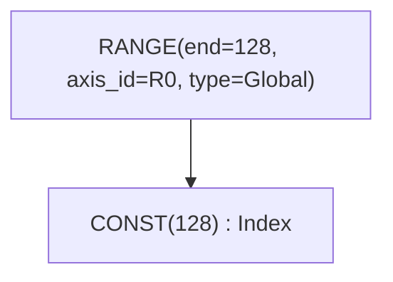

### END — लूप स्कोप क्लोज़र

```rust
End {
    computation: Arc<UOp>,              // value computed inside loop
    ranges: SmallVec<[Arc<UOp>; 4]>,    // ranges being closed
}
```

END एक या ज़्यादा RANGE स्कोप बंद करता है और उन्हें एक्टिव सेट से हटाता है। एक साथ कई ranges बंद की जा सकती हैं।

**उदाहरण:**
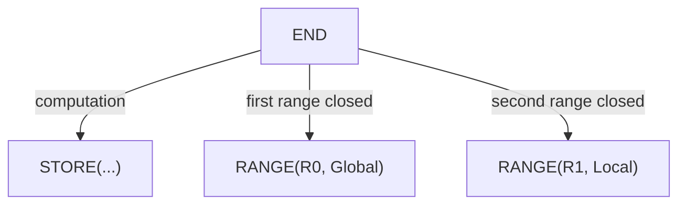

---

## रिडक्शन: REDUCE बनाम REDUCE_AXIS

दो ऑपरेशन जिनके नाम मिलते-जुलते हैं पर काम अलग-अलग है।

### REDUCE_AXIS — Tensor डायमेंशन रिडक्शन (हाई-लेवल)

```rust
ReduceAxis {
    src: Arc<UOp>,           // input tensor
    reduce_op: ReduceOp,     // Add, Mul, Max, Min
    axes: Vec<usize>,        // axes to reduce
}
```

**Rangeify से पहले** इस्तेमाल होता है। NumPy के `.sum(axis=0)` की तरह tensor डायमेंशन पर काम करता है।

**उदाहरण:**
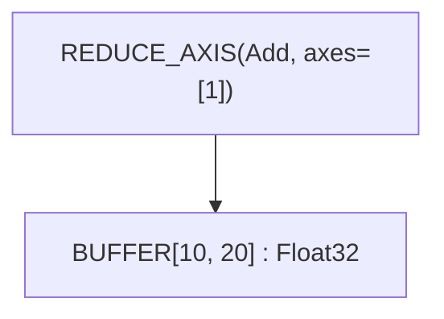

यह `[10, 20]` tensor को axis 1 पर sum करके `[10]` में बदलता है।

### REDUCE — Range इटरेशन रिडक्शन (लो-लेवल)

```rust
Reduce {
    src: Arc<UOp>,                      // value to accumulate
    ranges: SmallVec<[Arc<UOp>; 4]>,    // ranges being reduced
    reduce_op: ReduceOp,                // Add, Mul, Max, Min
}
```

**Rangeify के बाद** इस्तेमाल होता है। RANGE इटरेशन के दौरान वैल्यूज़ accumulate करता है और स्पेसिफ़ाइड ranges बंद करता है।

**ReduceOp वैरिएंट:**

| Op | आइडेंटिटी | ऑपरेशन | Tinygrad |
|----|-----------|---------|----------|
| `Add` | 0 | `acc + value` | ✓ |
| `Mul` | 1 | `acc * value` | ✓ |
| `Max` | -∞ | `max(acc, value)` | ✓ |
| `Min` | +∞ | `min(acc, value)` | केवल Svod |

> **कम्पैटिबिलिटी:** Tinygrad का स्पेक REDUCE_AXIS को `{Add, Mul, Max}` तक सीमित रखता है। Svod इसे `Min` के साथ एक्सटेंड करता है।

**उदाहरण:**
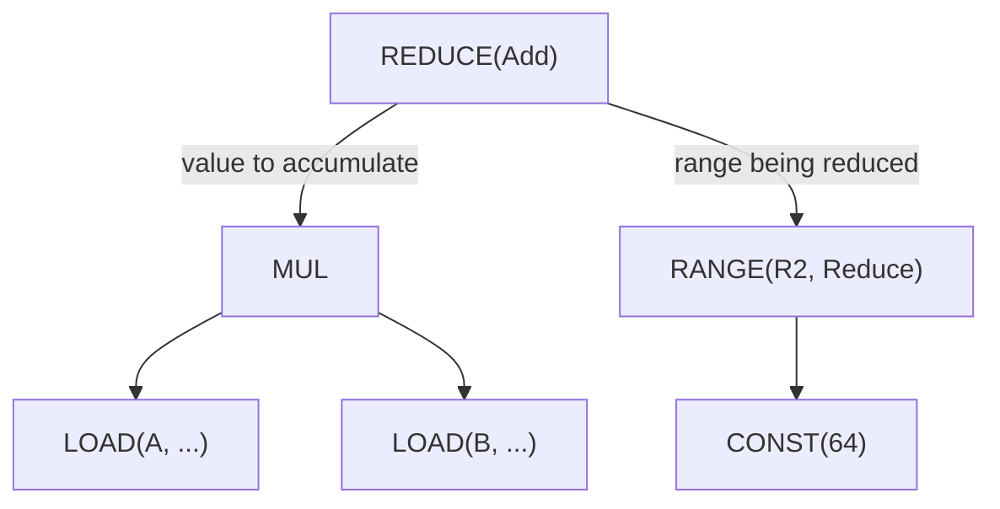

### ALLREDUCE — क्रॉस-डिवाइस रिडक्शन

```rust
AllReduce {
    src: Arc<UOp>,           // local partial result
    device: Arc<UOp>,        // device specification
    reduce_op: ReduceOp,     // reduction operation
}
```

कई डिवाइसों में डिस्ट्रिब्यूटेड रिडक्शन करता है। मल्टी-GPU ट्रेनिंग के लिए इस्तेमाल होता है।

---

## बफ़र ऑपरेशन

### BUFFER — बफ़र डिक्लेरेशन

```rust
Buffer {
    unique: Arc<UOp>,        // UNIQUE op for identity
    device: Arc<UOp>,        // DEVICE op
    size: usize,             // total element count
}
```

Tensor स्टोरेज के लिए बफ़र डिक्लेयर करता है। `unique` फ़ील्ड यह सुनिश्चित करती है कि समान size/device होने पर भी बफ़र अलग रहें।

### BUFFERIZE — मटेरियलाइज़ेशन मार्कर

```rust
Bufferize {
    compute: Arc<UOp>,                  // computation to materialize
    ranges: SmallVec<[Arc<UOp>; 4]>,    // output dimensions
    opts: BufferizeOpts,                // address space, device
}
```

मार्क करता है कि कम्प्यूटेशन को मेमोरी में मटेरियलाइज़ होना चाहिए। कर्नेल स्प्लिटिंग ट्रिगर करता है।

**BufferizeOpts:**

| फ़ील्ड | टाइप | उद्देश्य |
|--------|------|----------|
| `device` | `Option<DeviceSpec>` | टारगेट डिवाइस, लोकल के लिए `None` |
| `addrspace` | `AddrSpace` | `Global` (डिवाइस) या `Local` (shared) |
| `removable` | `bool` | `false` होने पर `buffer_removal` को इस BUFFERIZE को इनलाइन करने की अनुमति नहीं — मल्टी-कंज़्यूमर realize बाउंड्री पर इस्तेमाल होता है ताकि बफ़र मेगा-pass फ़िक्सपॉइंट इटरेशन के बीच टिका रहे |

**उदाहरण:**
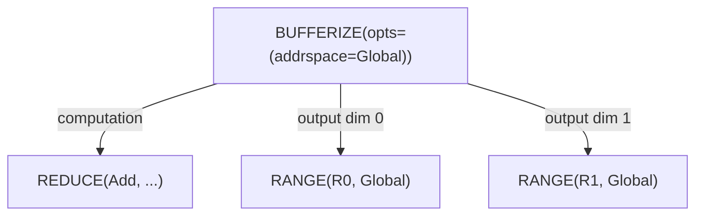

### INDEX — मल्टी-डायमेंशनल बफ़र एक्सेस

```rust
Index {
    buffer: Arc<UOp>,                   // BUFFER or PARAM
    indices: SmallVec<[Arc<UOp>; 4]>,   // index per dimension
    gate: Option<Arc<UOp>>,             // optional predicate
}
```

मल्टी-डायमेंशनल indices से मेमोरी एड्रेस कैलकुलेट करता है। एलिमेंट dtype रिटर्न करता है (पॉइंटर नहीं)।

**उदाहरण:**
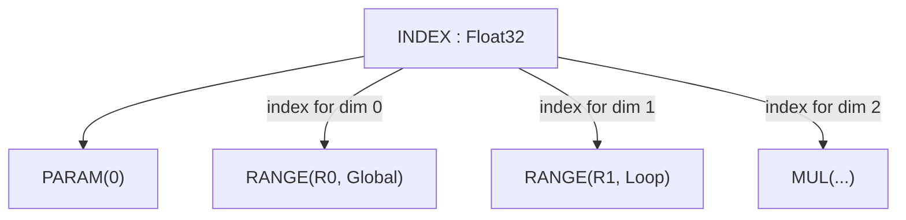

### POINTER_INDEX — लो-लेवल पॉइंटर अरिथमेटिक

```rust
PointerIndex {
    ptr: Arc<UOp>,           // base pointer
    offset: Arc<UOp>,        // byte offset
}
```

डायरेक्ट पॉइंटर अरिथमेटिक। लीनियराइज़ेशन के बाद जब indices फ़्लैटन हो जाते हैं तब इस्तेमाल होता है।

> **कम्पैटिबिलिटी:** Tinygrad अलग ऑपरेशन के बजाय `INDEX` में `ptr=True` फ़्लैग इस्तेमाल करता है।

### LOAD — मेमोरी रीड

```rust
Load {
    buffer: Arc<UOp>,        // buffer or pointer
    index: Arc<UOp>,         // INDEX op
    alt: Option<Arc<UOp>>,   // alternative value for gated loads
}
```

बफ़र से index पर वैल्यू रीड करता है। गेटेड loads के लिए, `alt` फ़ील्ड INDEX की `gate` false होने पर एक वैल्यू प्रदान करती है (मेमोरी एक्सेस पूरी तरह स्किप हो जाती है)।

**उदाहरण:**
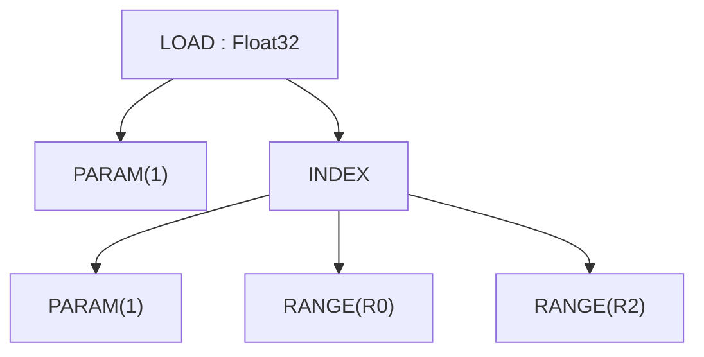

### STORE — मेमोरी राइट

```rust
Store {
    index: Arc<UOp>,                    // INDEX op (buffer accessed via index.src[0])
    value: Arc<UOp>,                    // value to write
    ranges: SmallVec<[Arc<UOp>; 4]>,    // ranges being closed
}
```

बफ़र में वैल्यू लिखता है। बफ़र INDEX नोड के ज़रिए एक्सेस होता है (`index.src[0]` से), अलग फ़ील्ड से नहीं। STORE स्पेसिफ़ाइड ranges बंद करता है, जो आउटपुट इटरेशन डायमेंशन दर्शाती हैं। ranges फ़ील्ड आउटपुट अपकास्टिंग के लिए इस्तेमाल होती है: जब `Range(Upcast)` शामिल हो, तो expansion के दौरान यह `UNROLL` बनती है, फिर `CONTRACT` से कॉन्ट्रैक्ट होती है।

गेटेड stores के लिए, gate वाला INDEX इस्तेमाल करें (INDEX में एक ऑप्शनल `gate` फ़ील्ड होती है)।

> **कम्पैटिबिलिटी:** Svod के STORE में अलग `buffer` फ़ील्ड नहीं है — sources हैं: index=0, value=1, ranges=2+ (range_start=2)। Tinygrad का लेआउट भी ऐसा ही है।

**उदाहरण:**
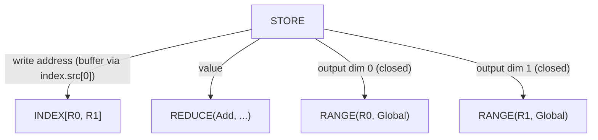

---

## कर्नेल स्ट्रक्चर और कॉलेबल IR

Schedule-स्तर का काम एक कॉलेबल IR के ज़रिए व्यक्त होता है जो tinygrad
के `CALL`/`FUNCTION`/`PROGRAM` मॉडल के अनुरूप है: `Function` एक बॉडी
(आमतौर पर stores का `Sink`) को परिभाषित करता है जिसे आर्ग्युमेंट से
पैरामीट्राइज़ किया जाता है, `Call` कंक्रीट आर्ग्युमेंट के साथ इसे invoke
करता है, और `Program` बॉडी को सख़्त `SINK → LINEAR → SOURCE → BINARY`
स्टेजिंग के ज़रिए कंपाइलेशन तक पहुँचाता है।

### CALL — फ़ंक्शन बॉडी invoke करना

```rust
Call {
    body: Arc<UOp>,                     // FUNCTION (या उसकी बॉडी)
    args: SmallVec<[Arc<UOp>; 4]>,      // कंक्रीट आर्ग्युमेंट वैल्यूज़
    info: CallInfo,                     // ऐनोटेशन (name, origin, …)
}
```

आर्ग्युमेंट के साथ कॉलेबल बॉडी invoke करता है। Range-ending: `args` में
मौजूद किसी भी `Range` को क्लोज़ करता है (range_start_index = 1; `body=0`,
`args=1+`)।

`CallInfo` कैश-कुंजी के लिए सुरक्षित ऐनोटेशन कैरी करता है:

| फ़ील्ड | टाइप | उद्देश्य |
|--------|------|----------|
| `name` | `Option<String>` | इंसान के पढ़ने योग्य कॉलेबल नाम |
| `grad_tag` | `Option<String>` | फ़्यूचर ग्रेडिएंट-कॉलबैक आइडेंटिटी के लिए रिज़र्व |
| `origin` | `Option<OriginId>` | स्टोर की गई वैल्यू के रूट का origin — कर्नेल किसके खाते में जाता है |
| `origins` | `OriginSet` | स्ट्रिप होने से पहले बॉडी से जितने origin पहुँच में थे, वे सब |
| `precompile` / `precompile_backward` | `bool` | प्री-कंपाइल हिंट |

किसी dispatch की जो attribution profiler की rollups पढ़ती हैं, वह कर्नेल के CALL पर ही रहती है;
देखें [Profiling और Benchmarking](../tile-kernels/profiling.md)।

### FUNCTION — री-यूज़ेबल बॉडी

```rust
Function {
    body: Arc<UOp>,                     // कंप्यूटेशन
    args: SmallVec<[Arc<UOp>; 4]>,      // फ़ॉर्मल पैरामीटर
    info: CallInfo,
}
```

री-यूज़ेबल कॉलेबल। इसका dtype हमेशा `Void` होता है; जो बॉडी कई वैल्यू
रिटर्न करती है उसे `Tuple` में रैप किया जाता है ताकि फ़ंक्शन बाउंड्री
Void बनी रहे। Range-ending आकार `Call` जैसा ही है।

### TUPLE / GET_TUPLE — मल्टी-वैल्यू रिटर्न

```rust
Tuple { src: SmallVec<[Arc<UOp>; 4]> }
GetTuple { src: Arc<UOp>, index: usize }
```

`Tuple` विषम वैल्यूज़ को पैक करता है; इसका dtype हमेशा `Void` होता है।
`GetTuple` एक `Tuple` (या जिस `Function` की बॉडी `Tuple` है) से
`index` एलिमेंट निकालता है; इसका dtype अंदरूनी एलिमेंट से मेल खाता है।
Void फ़ंक्शन बाउंड्री से कई आउटपुट गुज़ारने के लिए इस्तेमाल होता है।

### PROGRAM — कंपाइल-पाइपलाइन कंटेनर

```rust
Program {
    sink: Arc<UOp>,                     // रूट SINK
    device: Arc<UOp>,                   // DEVICE
    linear: Option<Arc<UOp>>,           // LINEAR (linearize के बाद)
    source: Option<Arc<UOp>>,           // SOURCE (render के बाद)
    binary: Option<Arc<UOp>>,           // PROGRAM_BINARY (compile के बाद)
}
```

`codegen/src/program_pipeline.rs` के ज़रिए लागू होने वाले `SINK → LINEAR
→ SOURCE → PROGRAM_BINARY` स्टेजिंग (`do_linearize`/`do_render`/
`do_compile`/`get_program`) से कर्नेल को गुज़ारता है। हर स्टेज अगला
फ़ील्ड भरती है। C/LLVM रेंडरर `Op::Linear` इनपुट की उम्मीद रखते हैं
और panic के बजाय per-context `pending_error` के ज़रिए
`Error::InvalidGraph` रिपोर्ट करते हैं; render से पहले मल्टी-इंडेक्स
`INDEX` को `pm_linearize_multi_index` से लो-कर लेना चाहिए।

### LINEAR — लीनियराइज़्ड ऑप स्ट्रीम

```rust
Linear { ops: SmallVec<[Arc<UOp>; 8]> }
```

लीनियराइज़ेशन से उत्पन्न ऑप्स का फ़्लैट क्रम। उपभोक्ता ग्राफ़ को फिर से
ट्रैवर्स किए बिना सीधे `ops` पर इटरेट कर सकते हैं।

### SOURCE / PROGRAM_BINARY — कंपाइलेशन आर्टिफ़ैक्ट्स

```rust
Source { code: String }              // रेंडर्ड सोर्स (C / LLVM-IR)
ProgramBinary { bytes: Vec<u8> }     // कंपाइल्ड आर्टिफ़ैक्ट
```

प्रोग्राम पाइपलाइन की टर्मिनल स्टेजेज़। दोनों लीफ़ हैं (कोई चाइल्ड नहीं)।

### SINK — मल्टीपल रूट कलेक्टर

```rust
Sink {
    sources: SmallVec<[Arc<UOp>; 4]>,
    info: Option<KernelInfo>,           // कर्नेल AST के लिए स्ट्रक्चरल मार्कर
}
```

कई आउटपुट को एक सिंगल रूट में कलेक्ट करता है। `Function` की बॉडी आमतौर
पर stores का `Sink` होती है। `info` फ़ील्ड एक हैश-कॉन्स्ड स्ट्रक्चरल
मार्कर है जो टाइप-इरेज़्ड साइड-चैनल मेटाडेटा पर निर्भर हुए बिना कर्नेल-
AST SINK को बाकी समान-source SINK से अलग करता है।

**उदाहरण:**
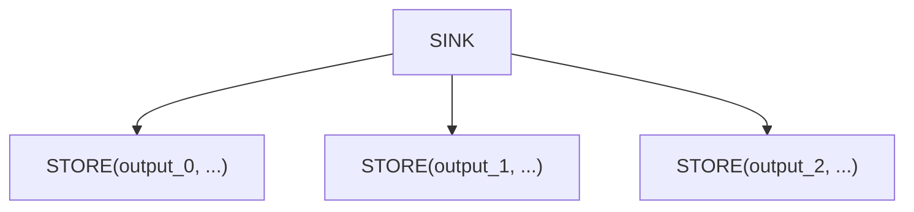

### AFTER — डिपेंडेंसी मार्कर

```rust
After {
    passthrough: Arc<UOp>,              // value that flows through
    deps: SmallVec<[Arc<UOp>; 4]>,      // operations that must complete
}
```

कर्नेल्स के बीच बिना डेटा डिपेंडेंसी के एक्ज़ीक्यूशन डिपेंडेंसी एक्सप्रेस करता है। `passthrough` वैल्यू बिना बदले रिटर्न होती है, लेकिन सभी `deps` पूरे होने के बाद ही।

**उदाहरण:**
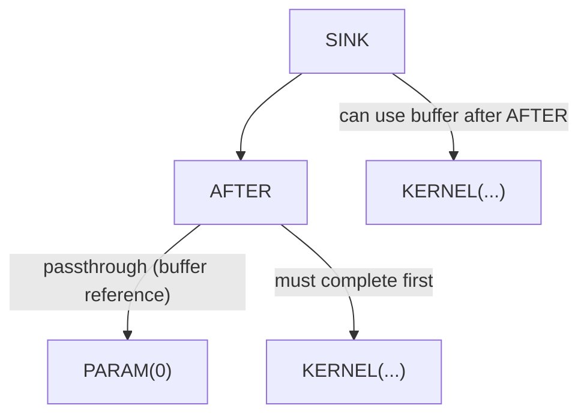

### BARRIER — सिंक्रोनाइज़ेशन फ़ेंस

```rust
Barrier {
    src: Arc<UOp>,                      // value passing through
    deps: SmallVec<[Arc<UOp>; 4]>,      // operations to wait for
}
```

GPU वर्कग्रुप सिंक्रोनाइज़ेशन। यह सुनिश्चित करता है कि वर्कग्रुप के सभी threads आगे बढ़ने से पहले barrier तक पहुँचें।

---

## वेक्टर ऑपरेशन

### VECTORIZE — स्केलर्स से वेक्टर बनाएँ

```rust
Vectorize {
    elements: SmallVec<[Arc<UOp>; 4]>,
}
```

N स्केलर वैल्यूज़ को साइज़ N के वेक्टर में जोड़ता है। सभी एलिमेंट्स का बेस dtype एक ही होना चाहिए।

**उदाहरण:**
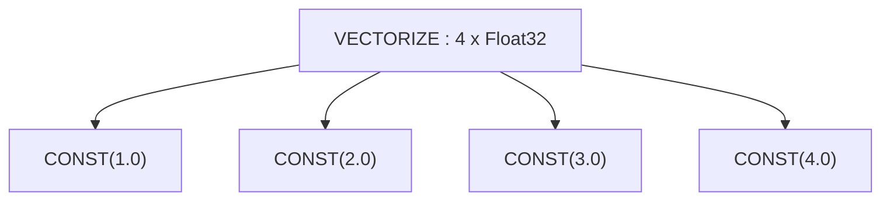

### GEP — Get Element Pointer (वेक्टर एक्सट्रैक्ट)

```rust
Gep {
    vector: Arc<UOp>,        // source vector
    indices: Vec<usize>,     // positions to extract
}
```

वेक्टर से एलिमेंट्स निकालता है:
- सिंगल index → स्केलर
- मल्टीपल indices → छोटा वेक्टर

**उदाहरण:**
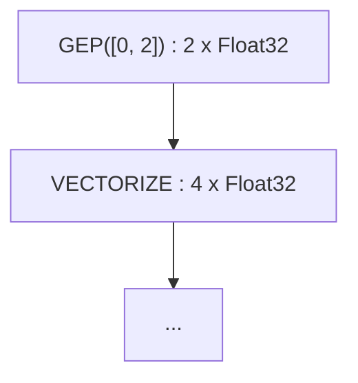

### VConst — वेक्टर कॉन्स्टेंट

```rust
VConst {
    values: Vec<ConstValue>,
}
```

कम्पाइल-टाइम कॉन्स्टेंट्स का वेक्टर। `CONST` नोड्स के `VECTORIZE` से ज़्यादा एफ़िशिएंट।

### CAT — वेक्टर्स को कॉन्कैटनेट करें

```rust
Cat {
    sources: SmallVec<[Arc<UOp>; 4]>,
}
```

वेक्टर्स को एक बड़े वेक्टर में जोड़ता है। आउटपुट `vcount` = इनपुट `vcount` का योग।

**उदाहरण:**
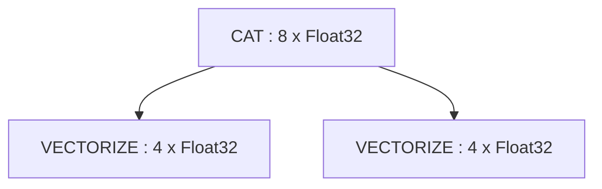

### PtrCat — पॉइंटर्स को कॉन्कैटनेट करें

```rust
PtrCat {
    sources: SmallVec<[Arc<UOp>; 4]>,
}
```

वेक्टराइज़्ड load/store के लिए मेमोरी एक्सेस को ग्रुप करता है। Devectorizer पास द्वारा इस्तेमाल होता है।

---

## Expansion: UNROLL और CONTRACT

### UNROLL — इटरेशन के अनुसार कम्प्यूटेशन एक्सपैंड करें

```rust
Unroll {
    src: Arc<UOp>,                       // computation to expand
    unroll_axes: Vec<(usize, usize)>,    // (axis_index, factor) pairs
}
```

अलग-अलग इटरेशन वैल्यूज़ के लिए कम्प्यूटेशन के कई वर्शन बनाता है। लूप अनरोलिंग ऑप्टिमाइज़ेशन के लिए इस्तेमाल होता है।

**उदाहरण:** `UNROLL(unroll_axes=[(0, 4)])` कम्प्यूटेशन को अलग-अलग index वैल्यूज़ के साथ 4 बार एक्सपैंड करता है।

### CONTRACT — अनरोल्ड वैल्यूज़ को वेक्टर में कॉलैप्स करें

```rust
Contract {
    src: Arc<UOp>,                       // unrolled computation
    upcast_ranges: Vec<(usize, usize)>,  // (axis_index, factor) pairs
}
```

UNROLL का उल्टा — एक्सपैंडेड स्केलर वैल्यूज़ को वेक्टर में कलेक्ट करता है। आउटपुट वेक्टर साइज़ = factors का गुणनफल।

**उदाहरण:**
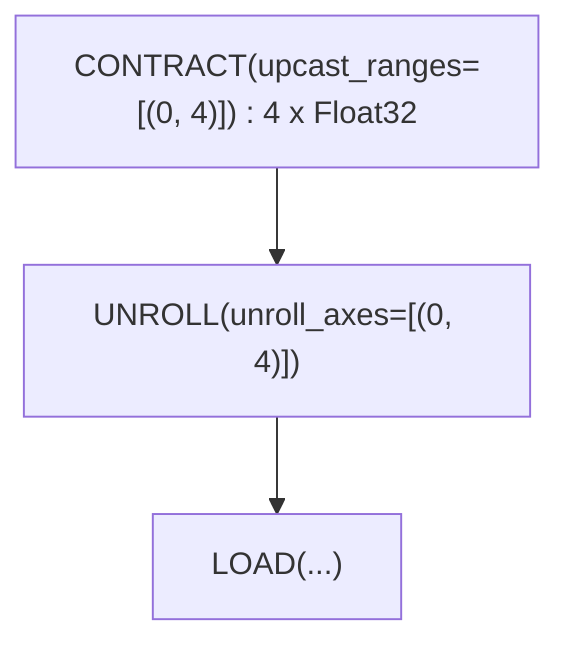

यह पैटर्न एक load को वेक्टराइज़ करता है: 4 इटरेशन एक्सपैंड करो, फिर रिज़ल्ट को 4-एलिमेंट वेक्टर में पैक करो।

---

## Tensor Cores: WMMA

### WMMA — Warp Matrix Multiply-Accumulate

```rust
Wmma {
    a: Arc<UOp>,             // matrix A fragment
    b: Arc<UOp>,             // matrix B fragment
    c: Arc<UOp>,             // accumulator C fragment
    metadata: WmmaMetadata,  // hardware configuration
}
```

हार्डवेयर tensor core ऑपरेशन: `D = A × B + C`। स्पेसिफ़िक मैट्रिक्स शेप और डेटा लेआउट की ज़रूरत होती है।

**WmmaMetadata फ़ील्ड्स:**

| फ़ील्ड | टाइप | उद्देश्य |
|--------|------|----------|
| `name` | `String` | इंस्ट्रक्शन नाम (जैसे, `"__hmma..."`) |
| `dims` | `(N, M, K)` | मैट्रिक्स डायमेंशन (जैसे, `(16, 16, 16)`) |
| `dtype_in` | `DType` | इनपुट मैट्रिक्स प्रिसिज़न (जैसे, `Float16`) |
| `dtype_out` | `DType` | आउटपुट प्रिसिज़न (जैसे, `Float32`) |
| `device` | `RendererDevice` | इस WMMA को उत्पन्न करने वाला रेंडरर / TC बैकएंड |
| `threads` | `usize` | प्रति warp threads (आमतौर पर 32) |
| `upcast_axes` | `WmmaUpcastAxes` | प्रति-ऑपरेंड वेक्टराइज़ेशन (फ़ील्ड्स: `a`, `b`, `c`) |
| `reduce_axes` | `Vec<(usize, usize)>` | कॉन्ट्रैक्शन axes |

**उदाहरण:**
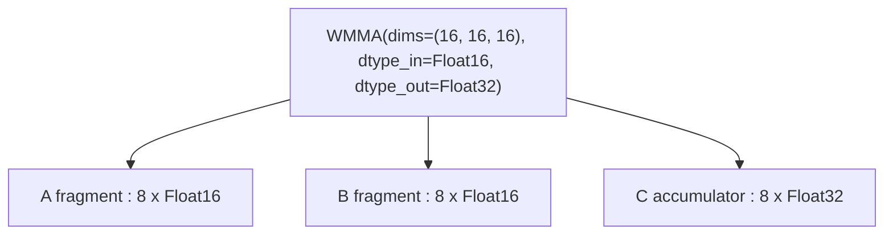

---

## कंट्रोल फ़्लो

### IF / ENDIF — कंडीशनल एक्ज़ीक्यूशन

```rust
If {
    condition: Arc<UOp>,                // boolean predicate
    body: SmallVec<[Arc<UOp>; 4]>,      // operations to execute
}

EndIf {
    if_op: Arc<UOp>,         // corresponding IF op
}
```

कंडीशन true होने पर ही body एक्ज़ीक्यूट करता है। बाउंड्री चेक और sparse ऑपरेशन के लिए इस्तेमाल होता है।

**उदाहरण:**
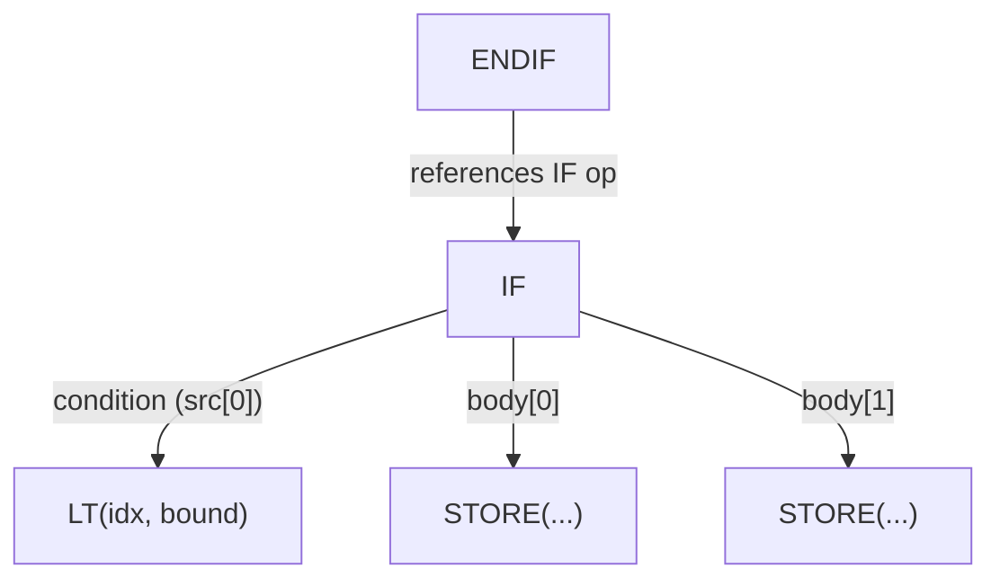

---

## डेफ़िनिशन ऑपरेशन

### PARAM — बफ़र पैरामीटर

```rust
Param { slot: usize, size: usize, device: Option<Arc<UOp>> }
```

नॉर्मलाइज़्ड बफ़र पैरामीटर — इनपुट/आउटपुट बफ़र का पोज़िशनल रेफ़रेंस।
प्री-शेड्यूल नॉर्मलाइज़ेशन (BUFFER→PARAM) द्वारा बनाया जाता है ताकि बफ़र आइडेंटिटी हटाकर
आइडेंटिकल कम्प्यूटेशन का स्ट्रक्चरल डीडुप्लिकेशन हो सके।
`slot` कर्नेल आर्ग्युमेंट लिस्ट में पोज़िशन है, `size` एलिमेंट काउंट है।

### DEFINE_LOCAL — Shared मेमोरी एलोकेशन

```rust
DefineLocal(usize)           // local memory index
```

GPU shared memory (LDS) एलोकेशन। एक वर्कग्रुप के अंदर विज़िबल।

### DEFINE_VAR — सिम्बॉलिक रनटाइम वेरिएबल

```rust
DefineVar {
    name: String,            // variable name
    min_val: i64,            // minimum bound
    max_val: i64,            // maximum bound
}
```

ज्ञात bounds वाला रनटाइम वेरिएबल। डायनामिक shapes के लिए इस्तेमाल होता है जहाँ bounds पता हैं।

**उदाहरण:**
```text
DEFINE_VAR(name="batch_size", min=1, max=128) : Index
```

### DEFINE_REG — रजिस्टर एलोकेशन

```rust
DefineReg {
    size: usize,             // register size
    id: usize,               // unique accumulator ID
}
```

इंटरमीडिएट स्टोरेज के लिए रजिस्टर एलोकेट करता है। `id` फ़ील्ड एक ही dtype के रजिस्टर्स को अलग करती है — इसके बिना, दो same-dtype reduces hash consing से एक DEFINE_REG शेयर करेंगे। कोड जनरेशन में इस्तेमाल होता है।

### BIND — वेरिएबल बाइंडिंग

```rust
Bind {
    var: Arc<UOp>,           // DEFINE_VAR
    value: Arc<UOp>,         // concrete value
}
```

रनटाइम पर एक सिम्बॉलिक वेरिएबल को कॉन्क्रीट वैल्यू से बाइंड करता है।

---

## स्पेशल ऑपरेशन

### SPECIAL — हार्डवेयर-प्रदत्त वैल्यूज़

```rust
Special {
    end: Arc<UOp>,           // upper bound for this dimension
    name: String,            // e.g., "blockIdx.x", "threadIdx.y"
}
```

हार्डवेयर-प्रदत्त वैल्यूज़ (thread/block indices) एक्सेस करता है। यह लूप नहीं है — हार्डवेयर सीधे वैल्यू देता है।

**उदाहरण:**
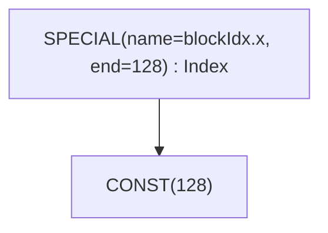

### UNIQUE / LUNIQUE — आइडेंटिटी मार्कर

```rust
Unique(usize)                // ग्लोबल आइडेंटिटी काउंटर
LUnique(usize)               // लोकल-स्कोप आइडेंटिटी काउंटर
```

बफ़र disambiguation के लिए यूनीक आइडेंटिटी बनाता है। अलग `Unique` वैल्यू
वाले दो बफ़र अलग माने जाते हैं, भले ही बाकी सब समान हो। `LUnique` लोकल
स्कोप (जैसे `Function` बॉडी) के अंदर वही disambiguation देता है, बिना
ग्लोबल काउंटर से टकराए — इससे कॉलेबल बॉडीज़ को कॉल साइट से स्वतंत्र
रूप से हैश-कॉन्स किया जा सकता है।

### DEVICE — डिवाइस स्पेसिफ़िकेशन

```rust
Device(DeviceSpec)           // device specification
```

कम्प्यूटेशन के लिए टारगेट डिवाइस स्पेसिफ़ाई करता है।

---

## मूवमेंट ऑपरेशन

हाई-लेवल tensor शेप ट्रांसफ़ॉर्मेशन। Rangeify के दौरान ये एक्सप्लिसिट INDEX ऑपरेशन में बदल जाते हैं।

| ऑपरेशन | सिग्नेचर | उद्देश्य |
|---------|----------|----------|
| `Reshape` | `{ src, new_shape }` | शेप बदलें, एलिमेंट्स वही |
| `Permute` | `{ src, axes: Vec<usize> }` | ट्रांसपोज़/रीऑर्डर axes |
| `Expand` | `{ src, new_shape }` | बड़ी शेप में ब्रॉडकास्ट |
| `Pad` | `{ src, begin_pads, end_pads }` | पैडिंग जोड़ें |
| `Shrink` | `{ src, begins, ends }` | सब-रीजन निकालें |
| `Flip` | `{ src, axes: Vec<bool> }` | axes के अनुसार रिवर्स |

**उदाहरण:** RESHAPE
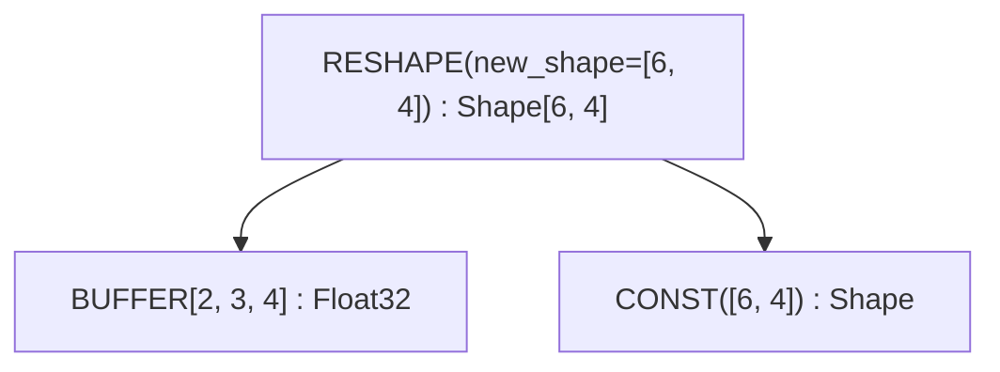

---

## अतिरिक्त ऑपरेशन

ये ऑपरेशन `Op` enum में हैं लेकिन इंटरनल हैं या डीबगिंग में कम दिखते हैं:

| ऑपरेशन | उद्देश्य |
|---------|----------|
| `Copy` | एक वैल्यू की एक्सप्लिसिट कॉपी |
| `Slice` | `{ buffer, offset, size }` — buffer पर contiguous typed slice metadata |
| `MStack` | मेमोरी स्टैक एलोकेशन |
| `MSelect` | मेमोरी सिलेक्ट (कंडीशनल मेमोरी एक्सेस) |
| `Multi` | मल्टी-आउटपुट ऑपरेशन |
| `Group` | शेड्यूलिंग के लिए ऑपरेशन ग्रुप करें |
| `Detach` | ग्राफ़ से डिटैच (ऑप्टिमाइज़ेशन रोकें) |
| `Contiguous` | कॉन्टिग्यूअस डेटा का हिंट |
| `ContiguousBackward` | कॉन्टिग्यूअस हिंट का बैकवर्ड पास |
| `Precast` | टाइप कन्वर्शन के लिए प्री-कास्ट |
| `Custom` / `CustomI` | इनलाइन कस्टम ऑपरेशन एक्सटेंसिबिलिटी (`Custom` केवल C बैकएंड पर) |
| `CustomFunction` | रनटाइम कस्टम-फ़ंक्शन हुक (kinds: `EncDec`, `Graph`) |

---

## क्विक रेफ़रेंस

### कैटेगरी अनुसार

| कैटेगरी | ऑपरेशन |
|---------|--------|
| **लूप कंट्रोल** | `RANGE`, `END` |
| **रिडक्शन** | `REDUCE_AXIS`, `REDUCE`, `ALLREDUCE` |
| **मेमोरी** | `BUFFER`, `SLICE`, `STAGE`, `INDEX`, `LOAD`, `STORE` |
| **कर्नेल और कॉलेबल** | `SINK`, `CALL`, `FUNCTION`, `TUPLE`, `GET_TUPLE`, `PROGRAM`, `LINEAR`, `SOURCE`, `PROGRAM_BINARY`, `AFTER`, `BARRIER` |
| **वेक्टर** | `VECTORIZE`, `GEP`, `VCONST`, `CAT`, `PTRCAT` |
| **Expansion** | `UNROLL`, `CONTRACT` |
| **हार्डवेयर** | `WMMA`, `SPECIAL` |
| **कंट्रोल** | `IF`, `ENDIF` |
| **डेफ़िनिशन** | `PARAM`, `DEFINE_LOCAL`, `DEFINE_VAR`, `DEFINE_REG`, `BIND`, `UNIQUE`, `LUNIQUE`, `DEVICE` |
| **मूवमेंट** | `RESHAPE`, `PERMUTE`, `EXPAND`, `PAD`, `SHRINK`, `FLIP` |
| **ALU** | `Unary(...)`, `Binary(...)`, `Ternary(...)`, `Cast`, `BitCast` |

### Range-Ending ऑपरेशन

वे ऑपरेशन जो RANGE स्कोप बंद करते हैं (ranges को एक्टिव सेट से हटाते हैं):

| ऑपरेशन | Range स्टार्ट Index |
|---------|-------------------|
| `BUFFERIZE` | 1 (compute=0, ranges=1+) |
| `REDUCE` | 1 (src=0, ranges=1+) |
| `STORE` | 2 (index=0, value=1, ranges=2+) |
| `WMMA` | 3 (a=0, b=1, c=2) |
| `END` | 1 (computation=0, ranges=1+) |
| `CALL` / `FUNCTION` | 1 (body=0, args=1+) |

### Expandable ऑपरेशन

वे ऑपरेशन जो UNROLL को कम्प्यूटेशन ग्राफ़ में प्रोपेगेट करते हैं:

- ALU: `Unary`, `Binary`, `Ternary`
- Type: `Cast`, `BitCast`
- Vector: `Gep`, `Vectorize`
- Memory: `Load`, `Store`, `Index`, `PointerIndex`
- Control: `Reduce`, `End`, `After`
- Buffer: `Bufferize`
- Hardware: `Wmma`
