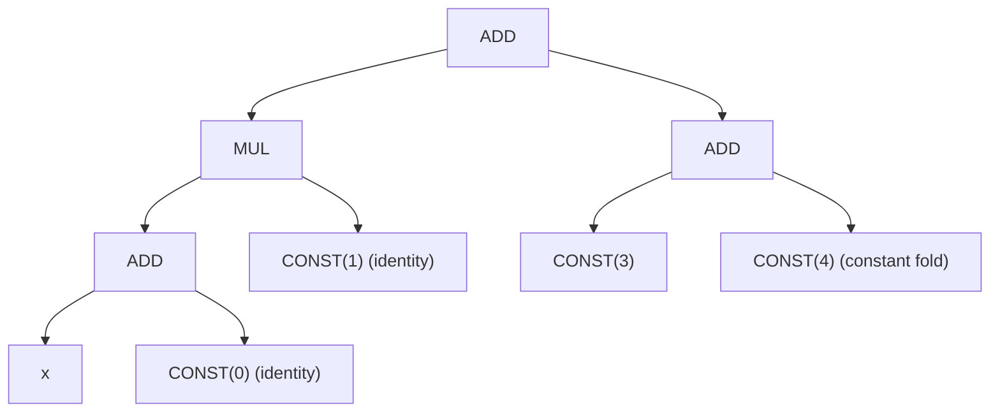
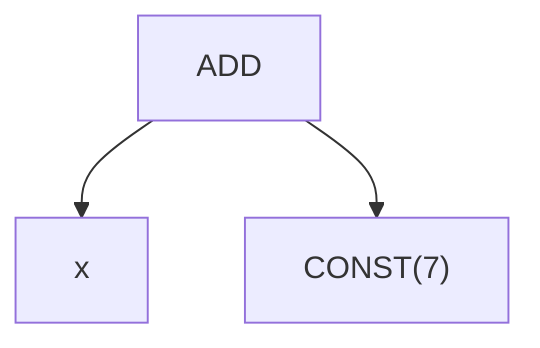

# अल्जेब्रिक सिम्प्लिफ़िकेशन पैटर्न

Svod का symbolic simplifier UOp computation graphs को 140+ अल्जेब्रिक पैटर्न से रीराइट करता है, जो `schedule/src/symbolic/patterns.rs` में डिफ़ाइन हैं। ये पैटर्न पाइपलाइन में कई जगह फ़ायर होते हैं:

| कहाँ | Matcher | Context |
|------|---------|---------|
| Pre-optimization | `sym()` | Rangeify + range splitting के बाद, कर्नेल ऑप्टिमाइज़ेशन से पहले |
| Post-opt (Stage 8) | `sym()` + `pm_move_where_on_load` | ऑप्टिमाइज़ेशन actions के बाद, expansion से पहले |
| Post-index (Stage 16) | `sym()` + `indexing_simplify()` | Index dtype lowering के बाद, फ़ाइनल cleanup |
| Decomp+Render (Stage 18-19) | `symbolic_simple()` | Late rewrites और renderer के अपने matchers के साथ combined |

Matchers तीन tiers में आते हैं: `symbolic_simple()` tier-1 base है (identities, constant folding, size-1 RANGE collapse), `symbolic()` उस पर tier-2 groups जोड़ता है (canonicalization, comparisons, range bounds के ख़िलाफ़ div/mod), और `sym()` tier 3 जोड़ता है (`pm_simplify_valid`, ALU/STACK reordering, opinionated term combining)। सिर्फ़ फ़ाइनल decomp+render पास अकेले tier-1 सेट चलाता है।

**Range analysis**: हर UOp अपनी runtime minimum (`vmin`) और maximum (`vmax`) वैल्यूज़ ट्रैक करता है, जो नोड construction के दौरान inputs के bounds से eagerly कम्प्यूट होती हैं। कई पैटर्न इन bounds का इस्तेमाल करते हैं compile time पर conditions prove करने के लिए (जैसे, "x हमेशा non-negative है" या "x < n सभी values के लिए")।

**Notation**: `OP[a, b]` commutative पैटर्न है (दोनों operand orderings ट्राई होती हैं)। `OP(a, b)` ordered है। `@zero`/`@one`/`c @const(v)` constant values मैच करते हैं। जब एक ही variable name दो बार आए (जैसे, `Idiv(x, x)`), दोनों operands एक ही नोड होने चाहिए (`Arc::ptr_eq` — यानी hash consing से structurally deduplicated)।

**Tinygrad reference**: `tinygrad/uop/symbolic.py`, `tinygrad/uop/divandmod.py`

---

## Worked Example: ऑप्टिमाइज़ेशन कैस्केड

एक सिम्पल एक्सप्रेशन जो दिखाता है कि पैटर्न कैसे compose होते हैं:

पहले:



चरण:

```text
Step 1 (identity):    ADD(x, 0) -> x
Step 2 (identity):    MUL(x, 1) -> x
Step 3 (const fold):  ADD(3, 4) -> CONST(7)
Step 4 (result):      ADD(x, 7)
```

बाद में:



रीराइट इंजन पैटर्न bottom-up अप्लाई करता है: पहले children सिम्प्लिफ़ाई होते हैं, फिर parent री-मैच करता है। यह सिंगल traversal में मल्टी-स्टेप cascades सक्षम करता है।

---

## पैटर्न ऑर्डरिंग

हर matcher पैटर्न ग्रुप्स को एक स्पेसिफ़िक ऑर्डर में compose करता है — ऑर्डर load-bearing है, क्योंकि एक ग्रुप बाद वाले के लिए नए matches खोल सकता है। एक ग्रुप के अंदर, पैटर्न sequentially ट्राई होते हैं जब तक कोई मैच न हो। ग्रुप्स `+` ऑपरेटर से concatenate होते हैं:

```text
symbolic_simple() = symbolic_simple_base() + dead_loop_patterns()

symbolic_simple_base()          -- tier 1
  propagate_invalid             -- MUST be first (before x*0=0)
  fold_invalid_load_store
  constant_folding_dsl_patterns
  vconst_folding_patterns
  bool_arithmetic_patterns
  identity_and_zero_patterns
  self_folding_dsl_patterns
  zero_folding_dsl_patterns
  division_dsl_patterns
  cast_dsl_patterns
  uint_pack_dsl_patterns
  div_mod_recombine_dsl_patterns
  power_dsl_patterns
  boolean_dsl_simple_patterns
  dce_dsl_simple_patterns

symbolic() = symbolic_simple() + tier 2
  commutative_canonicalization
  boolean_dsl_patterns
  term_combining_dsl_patterns
  dce_dsl_patterns
  where_alu_combining_patterns
  vmin_vmax_collapse_patterns
  minmax_dsl_patterns
  alu_folding_dsl_patterns
  comparison_dsl_patterns
  range_based_mod_div_patterns
  advanced_division_dsl_patterns
  range_based_cast_patterns
  long_to_int_narrowing_patterns
  after_simplification_patterns
  where_bound_patterns
```

---

## 1. Constant Folding

Compile-time constants पर ऑपरेशन evaluate करता है dtype-aware arithmetic से। Results type boundaries respect करते हैं (जैसे, Int32 32 bits पर wrap करता है)।

**Tinygrad**: `symbolic.py:40-118`

### Scalar Constants

| कैटेगरी | Ops | पैटर्न |
|---------|-----|--------|
| Unary (7) | Neg, Sqrt, Exp2, Log2, Sin, Reciprocal, Trunc | `op(CONST(c))` -> `CONST(eval(op, c))` |
| Binary (13) | Add, Mul, Sub, Mod, Max, Pow, Idiv, Fdiv, And, Or, Xor, Shl, Shr | `op(CONST(a), CONST(b))` -> `CONST(eval(op, a, b))` |
| Ternary (2) | Where, MulAcc | `op(CONST(a), CONST(b), CONST(c))` -> `CONST(eval(op, a, b, c))` |

### Vector Constants

| पैटर्न | रिज़ल्ट |
|--------|--------|
| `op(VCONST(a), VCONST(b))` | `VCONST(eval(op, a, b))` element-wise |
| `op(CONST(a), VCONST(b))` | `VCONST(eval(op, broadcast(a), b))` |
| `op(VCONST(a), CONST(b))` | `VCONST(eval(op, a, broadcast(b)))` |
| `unary_op(VCONST(v))` | `VCONST(eval(op, v))` element-wise |

VConst folding 11 binary ops कवर करता है (Pow और Fdiv exclude) और सभी 7 unary ops।

---

## 2. Identity और Zero Propagation

| पैटर्न | रिज़ल्ट | नोट्स |
|--------|--------|-------|
| `ADD[x, 0]` | `x` | Commutative |
| `MUL[x, 1]` | `x` | Commutative |
| `OR[x, 0]` | `x` | Commutative |
| `XOR[x, 0]` | `x` | Commutative |
| `SUB(x, 0)` | `x` | Ordered |
| `IDIV(x, 1)` | `x` | Ordered |
| `FDIV(x, 1)` | `x` | Ordered |
| `MOD(x, 1)` | `0` | कुछ भी mod 1 ज़ीरो है |
| `Floor/Ceil/Trunc/Round(x)` | `x` | सिर्फ़ जब `x` integer हो (rounding no-op है) |
| `MUL[x, 0]` | `0` | सिर्फ़ जब float NOT हो |
| `AND[_, 0]` | `0` | Commutative |

:::caution[IEEE 754: MUL by zero]
`MUL[x, 0]` floats के लिए **सिम्प्लिफ़ाई नहीं** होता क्योंकि IEEE 754 require करता है:
- `NaN * 0 = NaN`
- `Inf * 0 = NaN`

गार्ड `!x.dtype().is_float()` floating-point types के लिए यह ऑप्टिमाइज़ेशन रोकता है।
:::

---

## 3. Self-Folding

ऐसे पैटर्न जहाँ एक ही operand दोनों तरफ़ दिखता है। `Arc::ptr_eq` चेक इस्तेमाल करते हैं (hash consing गारंटी देता है कि structurally equal subexpressions एक ही pointer शेयर करते हैं)।

| पैटर्न | रिज़ल्ट | नोट्स |
|--------|--------|-------|
| `IDIV(x, x)` | `1` | |
| `IDIV(x, -1)` | `NEG(x)` | RHS पर constant चेक |
| `MOD(MOD(x, y), y)` | `MOD(x, y)` | Idempotent mod |
| `AND(x, x)` | `x` | |
| `OR(x, x)` | `x` | |

---

## 4. Zero Folding

| पैटर्न | रिज़ल्ट | नोट्स |
|--------|--------|-------|
| `MOD(x, x)` | `0` | |
| `LT(x, x)` | `false` | Floats के लिए NOT (NaN < NaN false है, लेकिन soundness के लिए गार्ड ज़रूरी) |
| `NE(x, x)` | `false` | सिर्फ़ ints — IEEE 754 में `NaN != NaN` `true` है |

---

## 5. Division सिम्प्लिफ़िकेशन

| पैटर्न | रिज़ल्ट | नोट्स |
|--------|--------|-------|
| `FDIV(0.0, 0.0)` | `NaN` | IEEE 754 indeterminate form |
| `FDIV(MUL[_, 0], 0)` | `NaN` | कोई भी zero-expression / zero |
| `FDIV(x, x)` | `1.0` | Float self-division |
| `FDIV(MUL(x, y), y)` | `x` | Cancellation (float) |
| `IDIV(MUL(x, y), y)` | `x` | Cancellation (integer) |

:::caution[पैटर्न प्रायोरिटी]
`FDIV(0, 0) -> NaN` matcher में `FDIV(x, x) -> 1` से पहले होना ज़रूरी ताकि priority ले सके। `division_dsl_patterns()` के अंदर ऑर्डरिंग यह ensure करता है।
:::

---

## 6. Cast ऑप्टिमाइज़ेशन

| पैटर्न | रिज़ल्ट | नोट्स |
|--------|--------|-------|
| `CAST(CONST(c), dtype)` | `CONST(c.cast(dtype))` | Compile-time cast folding |
| `CAST(x, dtype)` | `x` | जब `x.dtype() == dtype` (noop) |
| `CAST(CAST(x, a), b)` | `x` | जब `x.dtype() == b` और `a` `b` की सभी values preserve करे |
| `CAST(CAST(x, a), b)` | `CAST(x, b)` | जब `a` `x` को narrow न करे (widening chain) |
| `CAST(WHERE(s, a, b), dtype)` | `WHERE(s, CAST(a, dtype), CAST(b, dtype))` | Cast को branches से push करे |

`can_safe_cast(to, from)` फ़ंक्शन determine करता है कि intermediate type सभी values hold कर सकता है या नहीं। यह bit widths, signedness, और float/int categories चेक करता है।

:::caution[Truncation kills round-trips]
`CAST(CAST(x, i8), i64)` जब `x` `i64` हो तो `x` में collapse **नहीं** होता। Intermediate `i8` values truncate करता है — `can_safe_cast(i64, i8)` `false` रिटर्न करता है क्योंकि `i8` सभी `i64` values hold नहीं कर सकता।

सेफ़ example: `CAST(CAST(x, i32), bool)` -> `CAST(x, bool)` जब `x` `bool` हो, क्योंकि `i32` `true` और `false` दोनों represent कर सकता है।
:::

---

## 7. Term Combining

| पैटर्न | रिज़ल्ट |
|--------|--------|
| `ADD(x, x)` | `MUL(2, x)` |
| `ADD(MUL(c1, x), MUL(c2, x))` | `MUL(c1+c2, x)` |
| `ADD(MUL(x, c1), MUL(x, c2))` | `MUL(x, c1+c2)` |

दोनों ordered variants मैच होते हैं (MUL में constant left या right पर)।

---

## 8. ALU Chain Folding

Associative ऑपरेशन chains में constants fold करता है और canonical form के लिए constants बाहर push करता है।

### Constant Folding

| पैटर्न | रिज़ल्ट | नोट्स |
|--------|--------|-------|
| `ADD[ADD[x, c1], c2]` | `ADD(x, c1+c2)` | Commutative outer Add |
| `MUL[MUL[x, c1], c2]` | `MUL(x, c1*c2)` | Commutative outer Mul |
| `ADD[SUB(x, c1), c2]` | `ADD(x, c2-c1)` या `SUB(x, c1-c2)` | Sign-normalized |
| `SUB(ADD(x, c1), c2)` | `ADD(x, c1-c2)` या `SUB(x, c2-c1)` | Sign-normalized |
| `SUB(SUB(x, c1), c2)` | `SUB(x, c1+c2)` | |

### Constant Pushing

| पैटर्न | रिज़ल्ट | नोट्स |
|--------|--------|-------|
| `ADD[ADD[x, c], y]` | `ADD(ADD(x, y), c)` | Constant बाहर push करे; `y` const नहीं होना चाहिए |

Constant pushing index extraction के लिए ज़रूरी है। यह ensure करता है कि constants outermost level पर bubble हों, जिससे downstream पैटर्न (जैसे div-mod simplification) clean `variable + offset` forms देख सकें।

### Sub Canonicalization

| पैटर्न | रिज़ल्ट | नोट्स |
|--------|--------|-------|
| `SUB(a, SUB(b, x))` | `ADD(x, SUB(a, b))` | Inner variable expose करे |

Svod `SUB` को first-class IR op रखता है (Tinygrad से अलग जो `a-b` को `ADD(a, NEG(b))` में canonicalize करता है)। यह पैटर्न ensure करता है कि nested `SUB` आगे की simplification ब्लॉक न करें।

---

## 9. Boolean Logic

| पैटर्न | रिज़ल्ट | नोट्स |
|--------|--------|-------|
| `NOT(NOT(x))` | `x` | Double negation elimination |
| `XOR(x, x)` | `0` | Self-cancellation |
| `OR[x, NOT(x)]` | `true` | Tautology (सिर्फ़ bool) |
| `AND[x, NOT(x)]` | `false` | Contradiction (सिर्फ़ bool) |
| `OR[true, x]` | `true` | Absorbing element |
| `AND[false, x]` | `false` | Absorbing element |
| `AND[true, x]` | `x` | Identity |
| `OR[false, x]` | `x` | Identity |
| `AND[NOT(x), NOT(y)]` | `NOT(OR(x, y))` | De Morgan |
| `OR[NOT(x), NOT(y)]` | `NOT(AND(x, y))` | De Morgan |

`[]` वाले सभी पैटर्न commutative हैं (दोनों operand orderings ट्राई होती हैं)।

---

## 10. Comparison सिम्प्लिफ़िकेशन

### Self-Comparison (non-float, ptr_eq)

| Op | रिज़ल्ट |
|----|--------|
| `LT(x, x)`, `GT(x, x)`, `NE(x, x)` | `false` |
| `LE(x, x)`, `GE(x, x)`, `EQ(x, x)` | `true` |

:::caution[Float self-comparison]
Self-comparison पैटर्न `!x.dtype().is_float()` से guarded हैं। Floats में, `NaN != NaN` `true` है और `NaN == NaN` `false` है, तो ये identities hold नहीं करतीं।
:::

### Constant और Range-Based

| पैटर्न | रिज़ल्ट | नोट्स |
|--------|--------|-------|
| `op(CONST(a), CONST(b))` | `CONST(eval(op, a, b))` | Direct constant fold |
| `op(x, y)` जब bounds prove करें | `true` या `false` | `ComparisonAnalyzer` vmin/vmax इस्तेमाल करता है |

`ComparisonAnalyzer` चेक करता है: अगर `x.vmax < y.vmin` तो `LT(x, y)` provably `true` है।

### Algebraic Transforms

| पैटर्न | रिज़ल्ट | नोट्स |
|--------|--------|-------|
| `LT(ADD[c0, x], c1)` | `LT(x, c1-c0)` | Offset elimination |
| `LT(NEG(x), NEG(y))` | `LT(y, x)` | Negation flip |
| `LT(IDIV(x, d), c)` | `LT(x, c*d)` | Division lift (d > 0) |

`LT(x//d, c)` के लिए division lifting positive और non-positive `c` दोनों handle करता है:
- `c > 0`: equivalent to `x < c*d`
- `c <= 0`: equivalent to `x < c*d - (d-1)`

---

## 11. Min/Max Elimination

| पैटर्न | रिज़ल्ट | नोट्स |
|--------|--------|-------|
| `MAX(x, x)` | `x` | Self-max identity है |
| `MAX(x, y)` | `x` | जब `x.vmin >= y.vmax` (bounds dominance prove करते हैं) |
| `MAX(x, y)` | `y` | जब `y.vmin >= x.vmax` |

Range analysis के लिए `VminVmaxProperty` इस्तेमाल करता है। अलग `MIN` पैटर्न नहीं — Svod `MIN(a,b)` को `NEG(MAX(NEG(a), NEG(b)))` में lower करता है इन पैटर्न से पहले।

---

## 12. WHERE ऑप्टिमाइज़ेशन

### Condition Elimination

| पैटर्न | रिज़ल्ट | नोट्स |
|--------|--------|-------|
| `WHERE(cond, t, f)` | `t` | जब `cond.vmin == cond.vmax == true` |
| `WHERE(cond, t, f)` | `f` | जब `cond.vmin == cond.vmax == false` |
| `WHERE(LT(x, c), t, f)` | `t` | जब `x.vmax < c.vmin` (हमेशा true) |
| `WHERE(LT(x, c), t, f)` | `f` | जब `x.vmin >= c.vmax` (हमेशा false) |

### Branch सिम्प्लिफ़िकेशन

| पैटर्न | रिज़ल्ट | नोट्स |
|--------|--------|-------|
| `WHERE(_, t, t)` | `t` | Same branches |
| `WHERE(x, true, false)` | `x` | Bool identity |
| `WHERE(x, false, true)` | `NOT(x)` | Bool negation |
| `WHERE(NOT(cond), t, f)` | `WHERE(cond, f, t)` | Condition flip |
| `WHERE(a, WHERE(b, c, d), d)` | `WHERE(AND(a, b), c, d)` | Branch merging (`d` पर ptr_eq) |

:::caution[Condition flip पर Invalid गार्ड]
`WHERE(NOT(cond), t, f) -> WHERE(cond, f, t)` जब `f` में `Invalid` हो तब **अप्लाई नहीं** होता। Padding `WHERE(valid, idx, Invalid)` structures बनाता है, और swap करने से `Invalid` true branch में चला जाएगा जहाँ downstream पैटर्न उसे मैच नहीं कर सकते। Scalar `Invalid` और vectorized `VECTORIZE(Invalid, ...)` दोनों चेक होते हैं।

Tinygrad में भी यही गार्ड है: `symbolic.py:201-202`।
:::

---

## 13. Invalid Propagation

Invalid Svod का sentinel है out-of-bounds tensor regions के लिए जो padding operations बनाती हैं। ये पैटर्न identity पैटर्न जैसे `x*0=0` से **पहले** चलने चाहिए, वरना validity markers destroy हो जाते हैं।

### पैटर्न प्रायोरिटी Example

```text
Without ordering:  MUL(0, WHERE(cond, x, Invalid)) -> 0    (x*0=0 fires, loses Invalid)
With ordering:     MUL(0, WHERE(cond, x, Invalid))
                 -> WHERE(cond, MUL(0, x), Invalid)         (Invalid propagation fires first)
                 -> WHERE(cond, 0, Invalid)                  (then x*0=0 is safe)
```

### WHERE-Invalid Merging

| पैटर्न | रिज़ल्ट |
|--------|--------|
| `WHERE(c1, WHERE(c2, x, Inv), Inv)` | `WHERE(AND(c1, c2), x, Inv)` |
| `WHERE(c1, WHERE(c2, x, Inv), y)` | `WHERE(AND(c1, c2), x, y)` |

Multi-dimensional padding linearized index arithmetic से propagation के बाद nested WHERE-Invalid बनाता है। Single level में merge करने से `pm_lower_index_dtype` एक step में consume कर सकता है।

### WHERE-Invalid से ऑपरेशन Push करना

| पैटर्न | रिज़ल्ट | Ops |
|--------|--------|-----|
| `CAST(WHERE(c, x, Inv))` | `WHERE(c, CAST(x), Inv)` | |
| `op(WHERE(c, x, Inv), y)` | `WHERE(c, op(x, y), Inv)` | 13 binary ops (non-comparison) |
| `op(y, WHERE(c, x, Inv))` | `WHERE(c, op(y, x), Inv)` | 13 binary ops (non-comparison) |
| `cmp(WHERE(c, x, Inv), y)` | `cmp(x, y)` | Lt, Le, Eq, Ne, Gt, Ge |
| `cmp(y, WHERE(c, x, Inv))` | `cmp(y, x)` | Lt, Le, Eq, Ne, Gt, Ge |

Comparisons के लिए, WHERE-Invalid strip होता है — Invalid region पहले से downstream gated है।

### Bare Invalid Propagation

| पैटर्न | रिज़ल्ट | गार्ड |
|--------|--------|------|
| `op(Invalid, y)` | `Invalid` | `y.dtype() == DType::Index`, सिर्फ़ left position |

Tinygrad alignment: `symbolic.py:37`। Right-position bare Invalid propagate **नहीं** होता ताकि non-index computations contaminate न हों।

### Invalid Indices से Dead Loads/Stores

| पैटर्न | रिज़ल्ट |
|--------|--------|
| `LOAD(INDEX(buf, Invalid))` | `CONST(0)` |
| `LOAD(CAST(INDEX(buf, Invalid)))` | `CONST(0)` |
| `STORE(INDEX(buf, Invalid), val)` | `NOOP` |
| `STORE(CAST(INDEX(buf, Invalid)), val)` | `NOOP` |

---

## 14. Dead Code Elimination

### Dead Ranges

| पैटर्न | रिज़ल्ट | नोट्स |
|--------|--------|-------|
| `RANGE(end)` जहाँ `vmax < 0` | `CONST(0)` | Empty range (कभी execute नहीं होती) |
| `RANGE(CONST)` जहाँ `vmin == vmax` | `CONST(vmin)` | Trivial range (single value) |
| `END(computation, ranges)` | `END(computation, live_ranges)` | Dead ranges END से filter |
| `END(computation, [])` | `computation` | सभी ranges dead — unwrap |

### Dead Reduces

| Reduce Op | Identity Element |
|-----------|-----------------|
| Add | `0` |
| Mul | `1` |
| Max | `-inf` (dtype minimum) |
| Min | `+inf` (dtype maximum) |

जब REDUCE की सभी ranges dead (empty) हों, REDUCE अपने identity element से replace होता है।

### Dependency सिम्प्लिफ़िकेशन

| पैटर्न | रिज़ल्ट |
|--------|--------|
| `AFTER(x, [])` | `x` |

कोई dependencies नहीं मतलब कोई ordering constraint नहीं।

---

## 15. Power और Negation

| पैटर्न | रिज़ल्ट |
|--------|--------|
| `POW(x, 0)` | `1` |
| `POW(x, 1)` | `x` |
| `NEG(NEG(x))` | `x` |

---

## 16. Lane Folds — STACK के ऊपर INDEX

Svod में GEP op नहीं है: shaped value दरअसल lanes का एक `STACK` है, और `INDEX` उसमें से lane उसी तरह चुनता है जैसे वह buffer से address चुनता है। इसलिए Tinygrad के `gep_pushing` का यहाँ कोई सीधा counterpart नहीं है। Svod के पास इसकी जगह ऐसे folds हैं जो `INDEX`/`STACK` structure को collapse कर देते हैं ताकि devectorizer को scalars दिखें।

इनमें से ज़्यादातर folds structural हैं और devectorizer की movement cleanup में रहते हैं (`schedule/src/devectorize.rs`), `symbolic_simple()` में नहीं। symbolic tier का इकलौता rule `alu_vectorize_reorder_patterns` है, जो tier-3 `sym()` का हिस्सा है।

### Lane चुनना और Collapse करना

| पैटर्न | रिज़ल्ट | नोट्स |
|--------|---------|-------|
| `INDEX(STACK([a, b, c]), 2)` | `c` | Constant lane index सीधे stacked source में fold हो जाता है |
| `INDEX(STACK([...]), c0, rest...)` | `INDEX(sources[c0], rest...)` | अग्रणी constant recursively एक STACK level छीलता है |
| `STACK([INDEX(b, 0), INDEX(b, 1), ...])` | `b` | क्रमिक lane reads source को वापस बना देते हैं |
| `INDEX(INDEX(b, i), j)` | `INDEX(b, i, j)` | Scalar index chains को compose करता है |
| `INDEX(AFTER(STACK([...]), deps), c)` | चुनी हुई lane, `deps` दोबारा जुड़े हुए | Register-stack lane selection ordering बनाए रखता है |

`const_index_into_stack` recursive है: index list के जितने अग्रणी entries constants हैं, हर एक पर `STACK` की एक level छिलती है।

### STACK पर ALU

| पैटर्न | रिज़ल्ट | गार्ड |
|--------|---------|-------|
| `op(STACK(x,x,x,x), STACK(y,y,y,y))` | `STACK(op(x,y), op(x,y), ...)` | दोनों operands broadcast हों (सभी lanes `ptr_eq`), बराबर लंबाई > 1 |

यह अठारह binary ops पर लागू होता है — Add, Mul, Sub, FloorMod, Max, FloorDiv, Fdiv, Pow, And, Or, Xor, Shl, Shr और छह comparisons। एक ही scalar operation के `STACK` में collapse होने से operands constant folding और scalar simplification के सामने आ जाते हैं।

:::caution[सिर्फ़ Tier-3]
`alu_vectorize_reorder_patterns` `sym()` का हिस्सा है, `symbolic()` या `symbolic_simple()` का नहीं। यह उन्हीं stages पर fire करता है जहाँ `sym()` चलता है — pre-optimization, Stage 8 और devectorizer — इसलिए फ़ाइनल decomp+render पास तक reordering हो चुकी होती है।
:::

### STACK के इर्द-गिर्द Movement Cleanup

| पैटर्न | रिज़ल्ट |
|--------|---------|
| `RESHAPE(STACK([x]))` | `x` — जब shapes पहले से मेल खाती हों |
| अग्रणी 1-dims जोड़ने वाला `RESHAPE(x)` | हर जोड़े गए dimension पर एक `STACK([x])` wrapper |
| `EXPAND(STACK([x]))` | `STACK([x, x, ..., x])` — broadcast को materialize करता है |
| `PERMUTE(PERMUTE(x, a), b)` | `PERMUTE(x, a∘b)`; identity permutes हट जाते हैं |

ये `movement_cleanup_patterns()` / `mop_cleanup_patterns()` में रहते हैं, जिन्हें devectorizer scalarization से पहले लगाता है। WMMA lanes भी वहीं हैंडल होती हैं — `stack_wmma_sources` और `broadcast_and_devec_wmma` से, किसी symbolic पैटर्न से नहीं।

## 17. WHERE on LOAD (सिर्फ़ Stage 8)

**Function**: `pm_move_where_on_load()`

Masked loads को transform करता है condition को INDEX ऑपरेशन में embed करके:

```text
Before:  WHERE(cond, INDEX(buf, idx), 0)
After:   INDEX(buf, WHERE(combined_cond, idx, Invalid))
```

यह hardware predication सक्षम करता है masked loads के लिए और WHERE overhead eliminate करता है।

### कैसे काम करता है

1. Condition को AND clauses में **split** करें
2. Clauses को moveable vs. remaining में **partition** करें:
   - Moveable: सभी RANGE dependencies INDEX scope में, कोई external INDEX dependencies नहीं
   - Remaining: बाकी सब
3. Moveable clauses को `WHERE(cond, idx, Invalid)` के रूप में `indices[0]` में **embed** करें
4. Remaining clauses हों तो outer WHERE में **wrap** करें

Partial clause movement सपोर्ट करता है — सिर्फ़ वो clauses move होते हैं जिनकी ranges index scope में हैं। `indices[0]` में existing validity clauses deduplicate होते हैं।

Inverted पैटर्न `WHERE(cond, 0, INDEX(buf, idx))` भी condition negate करके handle होता है।

---

## 18. Commutative Canonicalization

Commutative binary ops पर Index dtype के लिए, operands UOp id से sort होते हैं (smaller id left पर):

| Ops | गार्ड |
|-----|------|
| Add, Mul, Max, Eq, Ne, And, Or, Xor | `dtype == DType::Index && b.id < a.id` |

इसके बिना, mathematically equivalent expressions जैसे `R1*8000 + R2*16` और `R2*16 + R1*8000` hash consing से deduplicate नहीं होते, जो `expand_vector_index` में grouping तोड़ता है।

सिर्फ़ Index dtype पर apply ताकि vector math merging न टूटे। Tinygrad: `symbolic.py:178-182`।

---

## 19. Div-Mod सिम्प्लिफ़िकेशन

### Range-Based Fast Paths

| पैटर्न | रिज़ल्ट | Condition |
|--------|--------|-----------|
| `MOD(x, n)` | `x` | `0 <= vmin(x)` और `vmax(x) < n` |
| `IDIV(x, n)` | `k` | Range में सभी values एक ही `k` को divide करती हैं |
| `MOD(ADD[MUL[a, m], b], n)` | `MOD(b, n)` | `m == n` (multiples factor out) |
| `IDIV(ADD[MUL[a, m], b], n)` | `a + IDIV(b, n)` | `m == n` |
| `IDIV(ADD[MUL[a, m], b], n)` | `a` | `m == n` और `0 <= b < n` |

### Unified Div-Mod Engine (`fold_divmod_general`)

Index dtype पर IDIV और MOD के लिए, एक unified engine priority order में simplification rules ट्राई करता है। Tinygrad के `fold_divmod_general` (`divandmod.py:8-96`) पर based।

| प्रायोरिटी | Rule | Description |
|-----------|------|-------------|
| 1 | cancel_divmod | Range single denominator interval में |
| 2 | nested_div | `(a % (k*c)) // c -> (a // c) % k` |
| 3 | remove_nested_mod | `(a%4 + b)%2 -> (a+b)%2` जब `2 | 4` |
| 4 | fold_divmod_congruence | Factor congruence modular arithmetic |
| 5 | gcd_with_remainder | Numerator से common GCD factor out |
| 6 | nest_div_by_smallest_factor | सबसे छोटे common factor से recursive split |
| 7 | divide_by_gcd | किसी भी denominator के लिए GCD factoring |
| 8 | factor_remainder | `(d*x+y)//d -> x + y//d` (last resort) |

### Div-Mod Recombination

Separated div और mod operations को वापस original expression में recombine करने वाले पैटर्न:

| पैटर्न | रिज़ल्ट | गार्ड |
|--------|--------|------|
| `ADD[MOD(x, n), MUL[IDIV(x, n), n]]` | `x` | x, n पर ptr_eq |
| `ADD[MOD(IDIV(x, a), c), MUL[IDIV(x, b), c]]` | `IDIV(x, a)` | `a * c == b` |
| `ADD[MUL[MOD(x, c1), c2], MUL[IDIV(x, c1), c3]]` | `MUL(x, c2)` | `c1 * c2 == c3` |
| `ADD[ADD[y, MOD(x, n)], MUL[IDIV(x, n), n]]` | `ADD(y, x)` | x, n पर ptr_eq |
| `IDIV(ADD[IDIV(a, c1), c2], c3)` | `IDIV(ADD(a, c1*c2), c1*c3)` | Nested division |

### Advanced Division

| पैटर्न | रिज़ल्ट | नोट्स |
|--------|--------|-------|
| `IDIV(IDIV(a, b), c)` | `IDIV(a, b*c)` | Nested division compose |
| `IDIV(expr, d)` | `expr.divides(d)` | Generic exact division |
| `IDIV(ADD(a, b), c)` | `IDIV(a, c) + IDIV(b, c)` | जब दोनों evenly divide हों |
| `IDIV(SUB(a, b), c)` | `IDIV(a, c) - IDIV(b, c)` | जब दोनों evenly divide हों |
| `MUL(c, ADD(a, b))` | `ADD(MUL(c, a), MUL(c, b))` | Multiplication distribute |

---

## Cross-References

- [Execution Pipeline](../pipeline.md) -- stages जहाँ ये पैटर्न चलते हैं
- [Pattern Engine](./pattern-system) — पैटर्न मैचिंग इंजन कैसे काम करता है
- [Rangeify](../codegen/rangeify.md) -- Stage 4 context (movement op lowering के बाद पैटर्न चलते हैं)
- [Expander](../codegen/expander.md) -- Stage 8 context (optimization actions के बाद पैटर्न चलते हैं)
- [Linearizer](../codegen/linearizer.md) -- Stage 16 context (फ़ाइनल cleanup)
