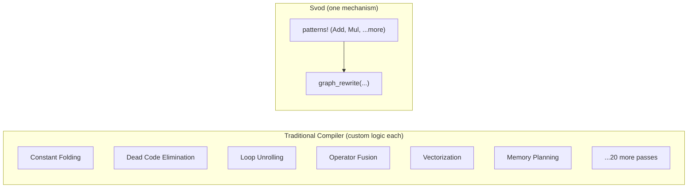
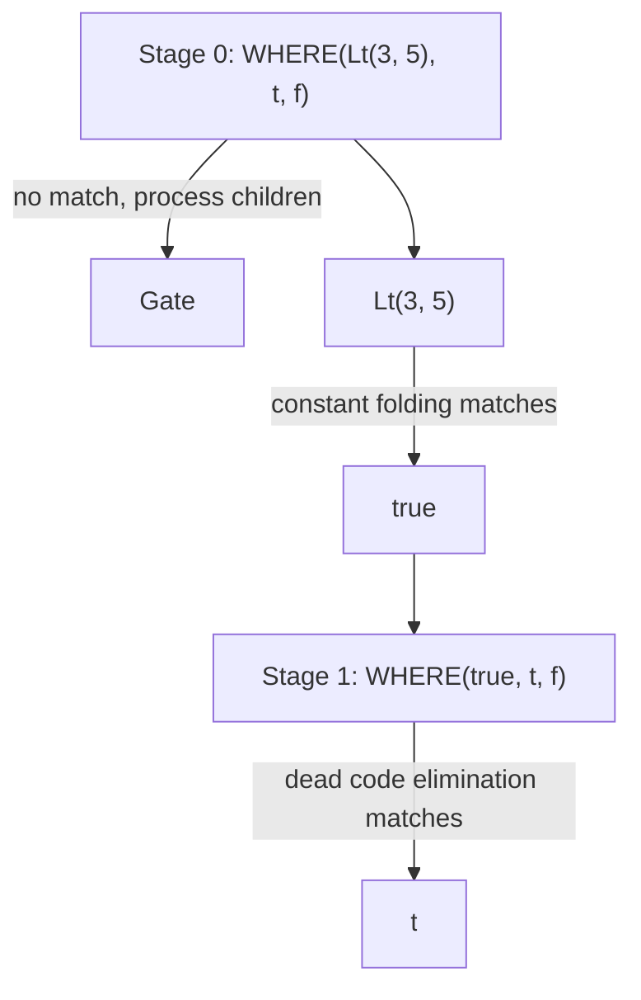

# पैटर्न इंजन

कोई भी प्रोडक्शन ML कम्पाइलर खोलिए और आपको दर्जनों ऑप्टिमाइज़ेशन पासेज़ मिलेंगे: constant folding, dead code elimination, operator fusion, loop tiling, vectorization, memory layout optimization। हर पास के अपने डेटा स्ट्रक्चर, अपना traversal लॉजिक, अपने बग्स।

Svod एक अलग तरीका अपनाता है: **हर चीज़ के लिए एक मैकेनिज़्म**।



Svod में हर ऑप्टिमाइज़ेशन एक **पैटर्न** के रूप में एक्सप्रेस होता है: "जब यह स्ट्रक्चर दिखे, उसे इस स्ट्रक्चर से बदल दो।" वही `graph_rewrite()` फ़ंक्शन [अल्जेब्रिक सिम्प्लिफ़िकेशन](./algebraic-simplification.md), [इंडेक्स अरिथमेटिक](./index-arithmetic.md), [strength reduction](./strength-reduction.md), और [range ऑप्टिमाइज़ेशन](./range-optimization.md) अप्लाई करता है।

---

## `patterns!` DSL

Svod ऑप्टिमाइज़ेशन पैटर्न लिखने के लिए एक domain-specific language प्रदान करता है:

```rust
patterns! {
    // Identity folding: x + 0 → x
    Add[x, @zero] => x,

    // Constant folding: 3 + 4 → 7
    Add(a @const(a_val), _b @const(b_val))
        => eval_add(a_val, b_val).map(|r| UOp::const_(a.dtype(), r)),

    // Self-folding: x / x → 1
    Idiv(x, x) => UOp::one(x.dtype()),

    // Dead code elimination: if(true) { t } else { f } → t
    Where(Const(ConstValue::Bool(true)), t, _f) => t,
}
```

मैक्रो इन पैटर्न को एफ़िशिएंट Rust कोड में कम्पाइल करता है:

| सिंटैक्स | मतलब | उदाहरण |
|----------|------|--------|
| `(x, y)` | **Ordered।** एक्ज़ैक्ट ऑर्डर में मैच। | `Sub(x, @zero) => x` |
| `[x, y]` | **Commutative।** दोनों orderings ट्राई करे। | `Add[x, @zero] => x` |
| `@zero` | **ज़ीरो कॉन्स्टेंट।** 0 या 0.0 मैच करे। | `Mul[_, z @ @zero] => z` |
| `@one` | **वन कॉन्स्टेंट।** 1 या 1.0 मैच करे। | `Mul[x, @one] => x` |
| `c @const(val)` | **कॉन्स्टेंट एक्सट्रैक्ट।** वैल्यू बाइंड करे। | `Add(a @const(av), _b @const(bv))` |
| `x, x` | **Same operand।** ptr_eq चेक ऑटो-जनरेट। | `Idiv(x, x) => UOp::one(...)` |
| `=>` | **रीराइट।** `Arc<UOp>`, `Option<Arc<UOp>>` (`None` का मतलब स्किप) या `RewriteResult` रिटर्न। | `=> eval(...).map(...)` |
| `for op in binary [...]` | **Template।** मल्टीपल ops के लिए पैटर्न जनरेट। | नीचे देखें |
| `@context Type` | **Stateful।** पैटर्न में mutable context एक्सेस। | नीचे देखें |

### Template एक्सपैंशन

हर binary ऑपरेशन के लिए एक ही पैटर्न लिखने की बजाय, for-loop इस्तेमाल करें:

```rust
patterns! {
    for op in binary [Add, Mul, Sub, Idiv, Fdiv, Max] {
        op(a @const(a_val), _b @const(b_val))
            => eval_binary(op, a_val, b_val)
                .map(|r| UOp::const_(a.dtype(), r))
    }
}
```

यह कम्पाइल टाइम पर छह अलग-अलग पैटर्न में एक्सपैंड होता है — हर ऑपरेशन के लिए एक।

### Stateful पैटर्न

कुछ ऑप्टिमाइज़ेशन को context चाहिए (जैसे, हम किस कर्नेल में हैं, कौन सी ranges एक्टिव हैं):

```rust
patterns! {
    @context KernelContext;

    reduce @ ReduceAxis { src, .. } => {
        ctx.record_reduction(reduce);
        transform_reduce(reduce, src, ctx)
    }
}
```

Context पैटर्न closures को लास्ट आर्ग्युमेंट के रूप में पास होता है।

### Context Lifting

अलग-अलग context types वाले matchers को combine करते समय, `.with_context()` इस्तेमाल करें:

```rust
let pm_add_images = symbolic_simple().clone().with_context::<AddImageContext>()
    + no_vectorized_alu().clone().with_context()
    + pm_simplify_add_image();
```

---

## पैटर्न मैचिंग कैसे काम करता है

`patterns!` मैक्रो एक ब्लॉक को एक फ़ंक्शन में कम्पाइल करता है जो रूट के operation kind पर `match` से डिस्पैच करता है, फिर उस kind के पैटर्न source order में ट्राई करता है।

### OpKey इंडेक्स

हर UOp का एक ऑपरेशन टाइप होता है (Add, Mul, Load, वगैरह)। मैक्रो एक `OpKey` enum जनरेट करता है जो ऑपरेशन को hashable keys में मैप करता है:

```rust
match OpKey::from_op(tree.op()).index() {
    KEY_ADD => { /* rules rooted at Add, in source order */ }
    KEY_MUL => { /* rules rooted at Mul */ }
    _ => {}
}
// wildcard rules (`x if cond`) run as sequential steps between the matches
```

UOp मैच करते समय:
1. UOp के ऑपरेशन से **OpKey एक्सट्रैक्ट** करें
2. उस kind के `match` arm पर **जंप** करें
3. हर closure **ट्राई** करें जब तक कोई मैच न हो
4. कोई indexed पैटर्न मैच न हो तो **wildcards पर फ़ॉलबैक**

### Commutative हैंडलिंग

`Add[x, @zero]` जैसे पैटर्न के लिए, मैक्रो ऐसा कोड जनरेट करता है जो दोनों orderings ट्राई करे:

```rust
// Try (x, @zero)
if let Some(result) = try_match_ordered(&children[0], &children[1]) {
    return result;
}
// Try (@zero, x)
if let Some(result) = try_match_ordered(&children[1], &children[0]) {
    return result;
}
```

### डुप्लिकेट डिटेक्शन

जब आप `Idiv(x, x)` लिखते हैं, पैटर्न सिर्फ़ तभी मैच होता है जब दोनों operands *एक ही* UOp हों (pointer equality via `Arc::ptr_eq`, structural equality नहीं)। यह hash consing का फ़ायदा उठाता है — आइडेंटिकल subexpressions एक ही पॉइंटर शेयर करते हैं।

---

## रीराइट इंजन

सिर्फ़ पैटर्न मैचिंग काफ़ी नहीं है। यह एक्सप्रेशन देखें:

```text
WHERE(Lt(3, 5), t, f)
```

इसे सिम्प्लिफ़ाई करने के लिए, दो स्टेप चाहिए:
1. `Lt(3, 5)` → `true` (constant folding)
2. `WHERE(true, t, f)` → `t` (dead code elimination)

लेकिन `WHERE` पैटर्न तब तक मैच नहीं करेगा जब तक उसका child सिम्प्लिफ़ाई न हो। रीराइट इंजन इसे **टू-स्टेज एल्गोरिदम** से सॉल्व करता है।

### स्टेज 0: पैटर्न अप्लिकेशन

हर नोड पर पैटर्न अप्लाई करें। कोई पैटर्न मैच न हो तो children को पहले प्रोसेस करने का सिग्नल दें।

### स्टेज 1: सोर्स रीकंस्ट्रक्शन

Children रीराइट होने के बाद, नए children के साथ नोड रीबिल्ड करें और पैटर्न फिर ट्राई करें:



रीकंस्ट्रक्शन स्टेज पैटर्न री-अप्लाई करता है, जो सिंगल traversal में मल्टी-स्टेप ऑप्टिमाइज़ेशन सक्षम करता है।

### रीराइट स्ट्रैटेजीज़

तीन रीराइट फ़ंक्शन, Tinygrad के `graph_rewrite` से मैच करते हुए:

| स्ट्रैटेजी | पैटर्न क्या देखते हैं | कब इस्तेमाल करें |
|------------|----------------------|------------------|
| `graph_rewrite(pm)` (डिफ़ॉल्ट) | OPTIMIZED children | अल्जेब्रिक सिम्प्लिफ़िकेशन, expansion |
| `graph_rewrite_bottom_up(bpm)` | ORIGINAL children | Nested structure matching, buffer removal |
| `graph_rewrite_with_bpm(pm, bpm)` | दोनों (bpm: original, pm: optimized) | कर्नेल splitting (gate + transform एक पास में) |

इंजन हमेशा bottom-up traverse करता है; फ़र्क यह है कि पैटर्न *कब* फ़ायर होते हैं: Stage 0 में (children प्रोसेस होने से पहले — originals देखते हैं) या Stage 1 में (children के बाद — optimized results देखते हैं)। Matchers को `+` ऑपरेटर से combine किया जाता है: `matcher_a() + matcher_b()` उनके पैटर्न सेट्स को एक में मर्ज करता है।

### सेफ़्टी लिमिट्स

इन्फ़िनिट लूप रोकने के लिए:
- अधिकतम **500,000 rewrite-stack entries** (`REWRITE_STACK_LIMIT`)
- लिमिट पार होने पर डायग्नोस्टिक इन्फ़ो के साथ panic

प्रैक्टिस में, ठीक से बने पैटर्न जल्दी converge करते हैं।

---

## यह क्यों ज़रूरी है

**डीबगिंग डायरेक्ट है।** पैटर्न पढ़ने योग्य कोड हैं। किसी भी पैटर्न में `println!` जोड़ें ताकि पता चले कब फ़ायर होता है।

**एक्सटेंसिबिलिटी आसान है।** कस्टम ऑप्टिमाइज़ेशन जोड़ना दो लाइन है — कम्पाइलर इंटरनल्स समझने, visitors लिखने, या pass managers मॉडिफ़ाई करने की ज़रूरत नहीं।

**करेक्टनेस लोकल है।** हर पैटर्न एक छोटा theorem है: "अगर यह स्ट्रक्चर दिखे, उसे इससे बदलने से सिमैंटिक्स preserve होते हैं।" हर पैटर्न को इंडिपेंडेंटली वेरिफ़ाई करें। करेक्ट पैटर्न का composition करेक्ट प्रोग्राम देता है।

**परफ़ॉर्मेंस ट्यूनेबल है।** O(1) पैटर्न dispatch डिफ़ॉल्ट से तेज़ है। प्रोडक्शन वर्कलोड के लिए [beam search](./kernel-search.md) से combine करें।

---

## गहरी समझ

पैटर्न मैचिंग generality को composability से ट्रेड करता है।

एक general-purpose ऑप्टिमाइज़ेशन पास कुछ भी कर सकता है — लेकिन यही प्रॉब्लम है। इसे वेरिफ़ाई करना मुश्किल, extend करना मुश्किल, दूसरे passes के साथ compose करना मुश्किल। ऑर्डरिंग मैटर करती है। इंटरैक्शन सटल हैं।

पैटर्न constrained है: यह एक स्पेसिफ़िक स्ट्रक्चर मैच करता है और स्पेसिफ़िक replacement प्रोड्यूस करता है। लेकिन constraints composition सक्षम करते हैं। ठीक से डिज़ाइन किए गए पैटर्न सेट्स के लिए, पैटर्न को fixed point तक चलाने से deterministic रिज़ल्ट मिलता है। नए पैटर्न localized impact के साथ जोड़े जा सकते हैं, और cascading failures के बिना हटाए जा सकते हैं — हालाँकि प्रैक्टिस में, convergence सुनिश्चित करने के लिए पैटर्न इंटरैक्शन टेस्ट करने चाहिए।

हर पैटर्न semantic equivalence का एक theorem है। रीराइट इंजन एक theorem prover है, जो इनपुट से ऑप्टिमाइज़्ड आउटपुट तक derivations ढूँढता है। करेक्टनेस individual steps की करेक्टनेस से आती है।

यह Unix philosophy है जो कम्पाइलरों पर लागू है: छोटे, focused टूल जो compose करें।
