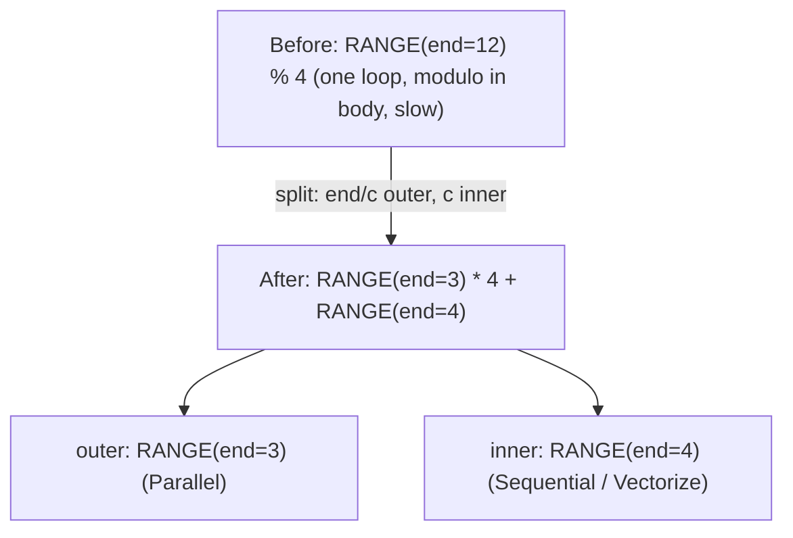
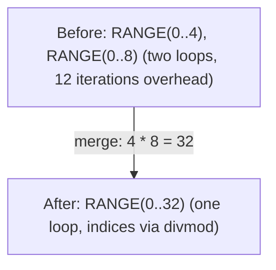
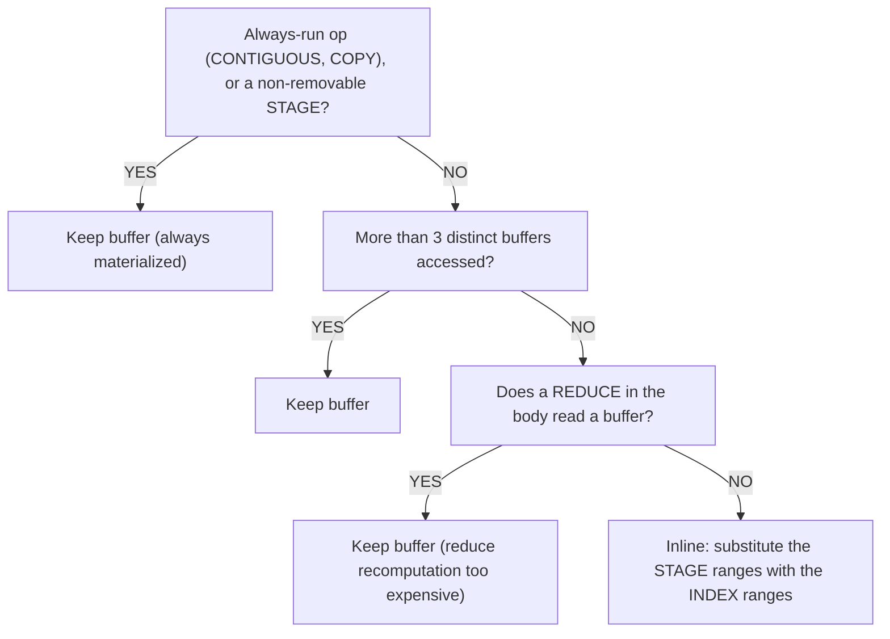

# Range और Reduce ऑप्टिमाइज़ेशन

Loop structures tensor compilers में ऑप्टिमाइज़ेशन का primary target हैं। दो `[1024, 1024]` tensors का naive element-wise addition 1M elements पर single loop generate करता है। ऑप्टिमाइज़ेशन के बाद, यह 1024 parallel threads बन जाता है जो 1024 elements vectorized loads/stores से process करते हैं। Range optimization से हम वहाँ पहुँचते हैं।

ये पैटर्न `schedule/src/rangeify/` में हैं और [codegen pipeline](../codegen/overview.md) के Stages 1-5 में चलते हैं।

Tinygrad source: `tinygrad/codegen/simplify.py`।

---

## Range Splitting

**क्या**: एक single range को divmod से outer और inner components में decompose करना।

**कब**: Range variable modulo के साथ इस्तेमाल होता है: `RANGE(end) % c` जहाँ `end % c == 0`।



**क्यों**: Splitting के बाद, inner range vectorize हो सकता है (UPCAST to SIMD width) जबकि outer range parallelize हो सकता है (GPU blocks, CPU threads)। Splitting के बिना, modulo दोनों optimizations रोकता है।

**Mechanism**: `pm_split_ranges` pattern matcher ranges collect करता है जिनमें modulo usage है लेकिन तुरंत transform **नहीं** करता। SINK node देखने तक wait करता है, फिर सभी substitutions एक साथ करता है (inconsistent partial rewrites से बचता है)। Outer और inner ranges मूल axis path के आगे `0` और `1` जोड़ते हैं — Tinygrad की तरह, बिना कोई global range ID allocate किए।

**गार्ड**: सिर्फ़ तब fire करता है जब `end % c == 0` (exact divisibility)। Non-divisible cases जैसे हैं वैसे रहते हैं।

Tinygrad: `simplify.py:60-64`। Svod: `pm_split_ranges()` in `rangeify/transforms.rs`।

---

## Range Merging

**क्या**: दो adjacent ranges को एक में merge करना, loop overhead कम करना।



**क्यों**: Loop overhead (branch prediction, counter increment) per-iteration है। Merging loops की संख्या कम करता है divmod operations की cost पर original indices reconstruct करने के लिए।

**Decision criterion**: Merge तभी accept करें जब total divmod operation count increase न हो। Compiler before और after divmod operations count करता है — अगर merging loop overhead से ज़्यादा divisions introduce करता है, तो merge reject होता है।

**Constraints**:
- दोनों ranges के compatible axis types होने चाहिए (दोनों output, दोनों reduce, वगैरह)
- REDUCE scope consistent रहना चाहिए
- दोनों ranges same REDUCE scopes में दिखनी चाहिए

Tinygrad: `simplify.py:39-41` (`simplify_merge_adjacent`)। Svod: `pm_simplify_ranges()`।

---

## Range Flattening

**क्या**: Nested END/REDUCE/STORE chains को flat range lists में flatten करना।

```text
Before:  END(END(END(comp, [r0]), [r1]), [r2])
After:   END(comp, [r0, r1, r2])
```

**क्यों**: Nested END chains successive transformations से arise होते हैं। Flattening structure normalize करता है ताकि दूसरे पैटर्न (merging, splitting) clean range list पर operate कर सकें।

Tinygrad: `simplify.py:14-17`। Svod: `pm_flatten_range()`।

---

## Load Collapse

**क्या**: REDUCE loop पूरी तरह eliminate करना जब computation closed-form arithmetic में express हो सके।

```text
Before:  sum(1 for k in 0..64 if k >= length)    // Loop: 64 iterations
After:   clamp(64 - length, 0, 64)                // Arithmetic: 3 ops
```

**कैसे काम करता है**:
1. REDUCE range से independent subexpressions identify करें
2. उन subexpressions के लिए `DEFINE_VAR` बनाएँ (loop-invariant treat करें)
3. Range को `DEFINE_VAR` से substitute करें और symbolic simplification चलाएँ
4. अगर simplified expression में कोई remaining ranges नहीं, REDUCE eliminate

यह सबसे powerful single optimization है — यह पूरे reduction loops eliminate कर सकता है, O(N) computation को O(1) में convert करके।

Tinygrad: `simplify.py:145-149`। Svod: `pm_load_collapse()`।

---

## Reduce Collapse

ADD reductions का analytical elimination। Load collapse से ज़्यादा sophisticated — reduce body के अंदर algebraic transformations apply करता है।

### Bound Patterns

ये gated reductions handle करते हैं जहाँ comparison limit करता है कौन सी iterations contribute करें:

| पैटर्न | Before | After |
|--------|--------|-------|
| Lower bound | `sum(r < cut ? 0 : val, r=0..N)` | `max(0, N - cut) * val` |
| Upper bound | `sum(r < cut ? val : 0, r=0..N)` | `max(0, min(N, cut)) * val` |
| Two-sided | `sum(r >= lo & r < hi ? val : 0, r=0..N)` | `max(0, min(N,hi) - max(0,lo)) * val` |
| NE-gated (gather) | `sum(idx != r ? 0 : expr, r=0..N)` | `in_bounds ? expr[r:=idx] : 0` |

NE-gated पैटर्न gather operations के लिए particularly important है — यह recognize करता है कि सभी indices पर sum जहाँ `idx == r` है, single indexed access के equivalent है।

### Lifting Transforms

Comparisons को reduce scope के बाहर move करते हैं bound patterns expose करने के लिए:

| Transform | Before | After |
|-----------|--------|-------|
| Lt lifting | `(x + y) < c` | `x < (c - y)` |
| Ge lifting | `(x + y) >= c` | `x >= (c - y)` |
| EQ lifting | `(x + y) == c` | `x == (c - y)` |

### Distributive Law

`sum(x + y) → sum(x) + sum(y)` — addition पर reduce split। यह हर half को bound patterns से independently collapse होने देता है।

### MUL-casted-bool

`x * bool.cast() → WHERE(bool, x, 0)` — boolean cast से multiplication को WHERE में convert करता है, जिसे फिर bound patterns analyze कर सकते हैं।

Tinygrad: `simplify.py:82-142`। Svod: `pm_reduce_simplify()` + `reduce_collapse_inner_patterns()`।

---

## Buffer Removal (Partial Contiguous)

**क्या**: बफ़र की गई ranges की जगह वे ranges रखकर — जिनसे reader index करता है — decide करना कि intermediate result को buffer में materialize करें या computation inline करें।

जब rangeify pass `STAGE` node बनाता है ("इसे buffer चाहिए" mark करता है), buffer removal pass evaluate करता है कि actually memory allocate करना worth है या नहीं। `STAGE` Svod का intermediate representation है "इसे buffer चाहिए" और final `STORE`+`BUFFER`+`AFTER` के बीच — यह इस pass को decide करने देता है कि materialization actually ज़रूरी है या नहीं। अगर computation काफ़ी cheap है, तो range variables substitute करके expression directly inline कर देता है।

### Decision Tree



:::caution[Reduce के अंदर Buffer Reads]
Reduce गार्ड इस बात पर नहीं है कि operation कितनी सस्ती है — यह तब fire करता है जब body का कोई भी REDUCE किसी buffer (`Param`, `Buffer` या `Stage`) को पढ़ता है। कारण: अगर `argmax(-x)` negation inline करे, तो हर reduction iteration पर `-x` recompute होता है — एक buffer read की जगह N extra loads और negations। जो reduce किसी buffer को छूता ही नहीं, वह अब भी inline हो सकता है।
:::

### Related Patterns

| पैटर्न | क्या |
|--------|-----|
| STAGE folding | `STAGE(CONST) → CONST` — constant का stage बस constant है |
| Index folding | `INDEX(CONST) → CONST` — constant में indexing बस constant है |
| COPY folding | `COPY(CONST) → CONST` — constant की copy बस constant है |
| MSTACK folding | `INDEX(MSTACK([CONST, ...])) → CONST` — constants का multi-device stack |
| Identity fold | `INDEX(STAGE(compute, ranges), ranges) → compute` — same ranges cancel |

Svod: `rangeify/patterns.rs` में `pm_remove_bufferize()` और `buffer_folding()`।

---

## Dead Axis Removal

**क्या**: STAGE operations से unused dimensions remove करना।

एक dimension "dead" है जब:
- Size 1 हो (कुछ contribute नहीं करता)
- Index में constant के रूप में दिखे (variable नहीं)
- Compute expression reference न करे

Dead axes STAGE से remove होते हैं, फिर shape RESHAPE (size-1 dims insert) और EXPAND (original size में broadcast) से restore होता है। यह buffer allocation की dimensionality कम करता है।

:::caution[Scalar Case]
जब सभी ranges dead हों (scalar output), STAGE empty ranges के साथ रखना ज़रूरी — इसे पूरी तरह remove करने से `NoKernelsFound` होता है क्योंकि kernel splitting के दौरान कोई STORE नहीं बनता।
:::

Svod: `dead_axis_removal()` in `rangeify/patterns.rs`।

---

## Reduce Unparented

**क्या**: REDUCE से वो ranges remove करना जो reduce body reference नहीं करता।

| Reduce Op | Unreferenced range size N | Transform |
|-----------|--------------------------|-----------|
| ADD | Range body में use नहीं | Result को N से multiply |
| MUL | Range body में use नहीं | Result को N-th power में raise |
| MAX / MIN | Range body में use नहीं | बस range remove |

Example: `sum(x, r=0..N)` जहाँ `x` `r` पर depend नहीं करता → `x * N`। N iterations पर constant का sum, constant times N है।

Tinygrad: `simplify.py:82-86`। Svod: `pm_reduce_simplify()`।

---

## Split ReduceOp

**क्या**: Better parallelism के लिए large reductions को two stages में split करना।

**कब**: Input/output ratio 32768 exceed करे।

```text
Before:  REDUCE(data, axes=[0])       // shape [65536] → scalar
After:   REDUCE(                       // shape [256] → scalar (second stage)
           CONTIGUOUS(
             REDUCE(                   // shape [65536] → [256] (first stage)
               RESHAPE(data, [256, 256]),
               axes=[1]
             )
           ),
           axes=[0]
         )
```

**क्यों**: Single huge reduction parallelize नहीं हो सकता। Two stages में split करने से first stage parallel चल सकता है (256 threads हर एक 256 elements reduce करता है), फिर second stage 256 partial results reduce करता है।

**गार्ड**: सिर्फ़ तब apply होता है जब reduction dimension factor हो सके और input/output ratio threshold exceed करे। Non-factorizable dimensions skip होती हैं।

Svod: `split_reduceop()` in `rangeify/kernel.rs`।
