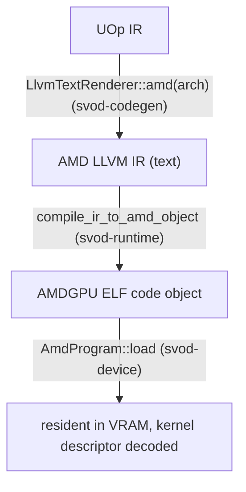

# Compile और Graph

यह पेज एक kernel का अनुसरण करता है, rendered LLVM IR से एक चलते हुए dispatch तक, फिर कवर
करता है कि kernels की एक पूरी chain को एक single replayable command stream में कैसे capture
किया जाता है। जिस dispatch machinery पर यह बना है — rings, compute lanes, timeline — उसका
वर्णन [Queues और Dispatch](./queues-and-dispatch.md) में है।

---

## IR से एक loaded program तक

compile path है **AMD LLVM IR text → `clang` → ELF code object → in-VRAM load**। तीन crates
मिलकर काम करते हैं, जिन्हें `runtime/src/devices/amd.rs` में एक साथ wire किया गया है:



### Rendering

`AmdRendererWrapper::render` AMD LLVM IR emit करने के लिए `LlvmTextRenderer::amd(arch)` का
उपयोग करता है। यह एक AMD-specific decomposition pass (`amd_decomposition_patterns`) भी
install करता है जो `exp`, `log`, `cos`, `tan`, और `pow` को SLEEF polynomials के माध्यम से
route करता है। `exp2`, `log2`, `sin`, और `sqrt` जान-बूझकर अनुपस्थित हैं, ताकि
approximation-selection का ठीक एक ही path रहे; केवल `f16`/`f32`/`f64` polynomials लेते हैं,
बाक़ी सब अपनी native lowering ही रखते हैं।

### Compiling

`compile_ir_to_amd_object` (`runtime/src/amd/compile.rs`) `clang` को shell out करता है, IR
को stdin पर pipe करते हुए और ELF को वापस stdout पर पढ़ते हुए — कोई temp files नहीं, वही
in-memory style जो [CPU JIT लोडर](../jit-loader.md) का है:

```text
clang -x ir -c -O3 --target=amdgcn-amd-amdhsa -mcpu=<arch> \
      -mcumode -nogpuinc -Wno-override-module -fno-math-errno [-nogpulib] - -o -
```

`-nogpulib` केवल तभी जोड़ा जाता है जब IR किसी `@__ocml_*` entry point को reference न करता हो:
renderer हर उस float unary के लिए `@llvm.*` intrinsics emit करता है जिसे AMDGPU backend select
कर सकता है, इसलिए ROCm device libraries केवल f64 fallbacks के लिए चाहिए। IR ख़ुद object-cache
key का हिस्सा है, इसलिए उससे एक flag को key करना sound बना रहता है।

`clang` एक single translation unit के लिए internally `lld` invoke करता है, इसलिए output एक
directly-loadable AMDGPU ELF है — कोई अलग link step नहीं। एक per-process memoized
`ClangToolchain::has_target("amdgcn")` probe (`clang --print-targets`) AMDGPU target के बिना एक
clang को एक crash के बजाय एक साफ़ `JitCompilation` error में बदल देता है।
`SVOD_DUMP_AMD_IR=<dir>` सेट करना हर kernel का `.ll` inspection के लिए dump करता है।

### Loading और descriptor parsing

`AmdProgram::load` (`device/src/amd/program.rs`) ELF को `object` crate से parse करता है और
image को उसी तरह lay out करता है जैसे tinygrad का `elf_loader` करता है: non-zero address
वाले `SHF_ALLOC` sections अपने address पर जाते हैं; address-0 sections aligned append किए
जाते हैं। यह ELF64-LE + `EM_AMDGPU` validate करता है, clang द्वारा emit की गई
`R_AMDGPU_ABS64` / `R_AMDGPU_REL64` / `R_AMDGPU_REL32` relocations apply करता है (और कुछ भी
एक साफ़ error है, कभी एक silent zero-write नहीं), और kernel-descriptor symbol **`<name>.kd`**
को resolve करता है।

64-byte `AmdHsaKernelDescriptor` से यह वह सब कुछ derive करता है जो dispatch को चाहिए:

| Derived | किससे |
|---|---|
| `aql_prog_addr` | `code_gpu + kd_offset` (AQL `kernel_object`) |
| `pm4_prog_addr` | `aql_prog_addr + kernel_code_entry_byte_offset` (shader entry; LO/HI registers `>> 8` carry करते हैं) |
| `rsrc1 / rsrc2 / rsrc3` | `compute_pgm_rsrc{1,2,3}`, gfx11 cwsr-priv bit और LDS-size field के साथ patched |
| `wave32` | `kernel_code_properties & 0x400` (RDNA3/4 default) |
| `target_major` | 9 / 11 / 12, device arch से |
| kernarg / scratch / group sizes | `kernarg_size`, `private_segment_fixed_size`, `group_segment_fixed_size` |

load पर दो safety checks होती हैं: एक over-large group (LDS) segment `GroupSegmentTooLarge`
के साथ fail-fast होता है, और एक kernel जो `ENABLE_SGPR_DISPATCH_PTR` सेट करता है (जिसे
kernargs के साथ एक HSA dispatch packet चाहिए होगा — अभी तक wired नहीं) reject कर दिया जाता
है। code object को एक host-visible, `nolru` VRAM buffer में copy किया जाता है जो program के
जीवनकाल के लिए रखा जाता है।

---

## एक kernel dispatch करना

`AmdProgram::execute_on(owner, pool, buffers, vals, global_size, local_size, wait, profile)`
वह lane-scoped dispatch path है जिसका plans और graphs उपयोग करते हैं — `owner` वह `OwnerCtx`
है जो logical plan state रखता है, और `pool` वह exclusively leased `PoolQueue` है।
(`Program::execute` trait method एक throwaway `OwnerCtx` बनाता है, जो एक lane lease करता है,
और यहाँ delegate करता है।) यह:

1. kernel के विरुद्ध buffer और scalar counts को **validate** करता है, और जाँचता है कि
   kernarg layout फ़िट होता है: `buf_count*8 + var_count*4 ≤ kernarg_size`।
2. lane की arena को bump करके एक **kernarg slot भरता है**, हर buffer VA को 8 bytes और
   हर scalar को एक 4-byte `i32` के रूप में लिखते हुए। `i32` packing जान-बूझकर है — renderer
   `Index → i32` lower करता है, इसलिए descriptor का `kernarg_size` 4-byte vars को reflect
   करता है; 8 bytes pack करना अगले slot में overflow कर जाता।
3. एक **submission बनाता है** — `MemoryBarrier` और फिर `Compute` का एक `hcq::Submission`, जो
   kernarg VA, `rsrc` triple, और PM4 program address साथ ले जाता है।
4. `queue.submit_hcq_dispatch(pool, &submission, …)` के माध्यम से **dispatch करता है**, जो उस
   submission को queue kind के अनुसार raw PM4 dwords (`build_exec_pm4`) या एक 64-byte AQL
   packet (`build_dispatch_packet`) में lower करता है। PM4 side पर optional 4-dword scratch
   descriptor को `COMPUTE_USER_DATA_0` में उसी `scratch_address` snapshot से prepend किया जाता
   है जो `COMPUTE_DISPATCH_SCRATCH_BASE` में लिखा जाता है — ताकि एक concurrent scratch realloc
   descriptor और register को असहमत न बना सके।
5. यदि `wait`, तो owner के `synchronize()` के माध्यम से drain करता है।

---

## Graph capture और replay: `AmdGraph`

जब वही kernel chain बार-बार चलती है (streaming inference), तो per-kernel
`wait → barrier → exec → signal → doorbell` round-trip N बार चुकाना बर्बादी है। `AmdGraph`
(`device/src/amd/graph.rs`) — tinygrad के `HCQGraph` का 1:1 port — पूरी chain को **एक command
stream** (PM4 या AQL, जो भी queue उपयोग करती हो) में capture करता है, उसे एक host-visible page
में bind करता है, और उसे **एक doorbell** के साथ replay करता है।

### Structure

graph एक device-timeline step है:

```text
preamble:   Wait(timeline signal, timeline value)
            MemoryBarrier          ← one per graph, after the wait
per kernel: Compute(...)           ← no inter-kernel signal/wait; same-queue
                                     ordering is the acquire_mem +
                                     CS_PARTIAL_FLUSH that exec already emits
final:      Store(timeline signal, next timeline value)
```

उस stream का हर address और value एक **placeholder** है जो किसी `PatchSource` से bound है —
timeline सिरों के लिए `System(SystemField::TimelineSignal/TimelineValue)`, PM4 scratch के लिए
`System(ScratchAddress)`/`System(ScratchTmpring)`, और program तथा kernarg pointers के लिए
`LinkAddress` entries — ये सब replay पर leased lane के विरुद्ध resolve होते हैं, इसलिए graph
सामान्य per-call dispatch और `synchronize` के साथ compose होता है। Capture प्रति kernel एक
fixed kernarg slot को एक dedicated `AllocTag::Kernarg` page में lay out करता है — उस page का
मालिक होना (न कि rolling kernarg arena को साझा करना, जिसमें concurrent per-call dispatch stale
VAs में lap कर सकता है) ही replay को safe बनाता है।

Replay (`Graph::replay`) graph-owned mutable storage को serialize करता है, अपने पिछले
finalizer का wait करता है, एक exclusive compute lane acquire करता है, lane scratch सुनिश्चित
करता है, मौजूदा kernargs और system fields को patch करता है, फिर resident PM4 IB या AQL
submission program publish करता है। एक-जैसे arguments होने पर kernarg pack पूरी तरह skip हो
जाता है। यह asynchronously return करता है; अगला replay उस storage को दोबारा उपयोग करने से
पहले wait करता है।

### Capture कब होता है

Capture कई तरीक़ों से gated है, और यदि कोई fail होता है तो per-call dispatch (`Ok(None)`) पर
fall back करता है:

- chain में **बिना runtime vars वाले सभी compiled kernels** होने चाहिए — copies, views, और
  dynamic launch dims host को loop में बनाए रखते हैं।
- chain को **single-device** होना चाहिए और हर current replay buffer को ठीक उसी physical
  allocation owner से backed होना चाहिए। `AmdGraph::capture` इसे नीचे फिर से जाँचता है: हर
  kernel को उसी device core पर एक `AmdProgram` होना चाहिए (`Arc::ptr_eq`)।
- AQL graph capture supported है। PM4 graph capture `SVOD_PM4_GRAPH=1` के माध्यम से opt-in है,
  क्योंकि यह हर gfx11/12 GPU पर performance win नहीं है।

:::note[Queue ownership]
Graphs किसी hardware queue को retain नहीं करते। Capture immutable templates और graph-owned
resident/control memory रखता है; हर replay bounded pool की एक lane lease करता है।
:::

---

## यह क्यों ज़रूरी है

Compilation एक `clang` subprocess और एक in-process ELF load है — कोई ROCm नहीं, कोई temp
files नहीं, वही minimalism जो CPU path का है। Dispatch [Queues और Dispatch](./queues-and-dispatch.md)
से पूरी lane/timeline machinery को reuse करता है, इसलिए [JIT ग्राफ़](../../architecture/jit-graphs.md)
layer का compile-once / replay-many वादा AMD पर प्रति replay एक doorbell के साथ उतरता है:
AQL hardware पर by default, और PM4 hardware पर तब जब `SVOD_PM4_GRAPH=1` opt in करे।
