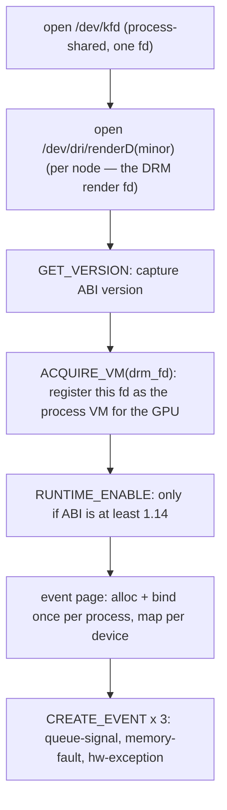

# KFD Bindings

बैकएंड kernel से `/dev/kfd` पर `ioctl` calls के एक छोटे, निश्चित set के माध्यम से बात करता
है। यह पेज कवर करता है कि वे calls Rust में कैसे bind होती हैं, बैकएंड असल में किनका उपयोग
करता है, GPU nodes कैसे खोजे जाते हैं, और वह allocation flow जो एक `ioctl` को एक mapped GPU
buffer में बदल देता है। बैकएंड HIP-based के बजाय KFD-direct *क्यों* है, इसके लिए
[अवलोकन](./overview.md) देखें।

---

## Bindings कैसे जनरेट होती हैं

KFD का ABI एक C header है, `kfd_ioctl.h`, जिसे kernel से verbatim
`device/include/kfd_ioctl.h` में vendor किया गया है (upstream AMD फ़ाइल, अपने ABI version
history के साथ पूरी)। उससे build time पर `bindgen` द्वारा Rust bindings जनरेट होती हैं:

- `device/build.rs` `bindgen` को **हर host पर unconditionally** चलाता है — कोई platform
  gate नहीं और कोई empty-stub branch नहीं। यह **hermetic** है: इसे किसी system kernel headers
  की ज़रूरत नहीं। वे दो headers जिन्हें `kfd_ioctl.h` transitively खींचता है
  (`_IOC`/`_IO*` macros के लिए `<linux/ioctl.h>`, `__uNN`/`__sNN` aliases के लिए
  `<linux/types.h>`) plus एक stub `<drm/drm.h>` (vestigial — body केवल `__u32 drm_fd` fields
  का उपयोग करता है) — ये ख़ुद `device/include/` के अंतर्गत vendored हैं, और `build.rs`
  `-Iinclude` pass करता है ताकि bindgen इन्हें `/usr/include` के बजाय resolve करे। vendored
  headers की ओर इस switch को byte-equivalent रूप में verify किया गया: regenerated bindings system-header
  baseline से केवल 8 fixed-width type-alias spellings में भिन्न हैं (`__u32 = u32` बनाम
  `c_uint`, identically sized) — सभी 60 structs और 34 constants identical हैं। (bindgen को
  `libclang` चाहिए, जो macOS पर Xcode CLT के साथ आता है।)

  यह ठीक-ठीक उन KFD types और constants को allow-list करता है जिनकी बैकएंड को ज़रूरत है:

  ```text
  allowlist_type:  kfd_ioctl_.*_args, kfd_process_device_apertures,
                   kfd_event_data, kfd_hsa_signal_event_data,
                   kfd_hsa_memory_exception_data, kfd_hsa_hw_exception_data,
                   kfd_memory_exception_failure, __u\d+, __s\d+
  allowlist_var:   KFD_IOC_.*, KFD_MMAP_TYPE.*, KFD_MAX_QUEUE_PERCENTAGE,
                   AMDKFD_IOC_.*
  ```

  (`AMDKFD_IOC_*` request codes allow-listed हैं पर कभी materialize नहीं होते: bindgen उनके
  `_IOWR(...)` macro expansions को const-fold नहीं कर सकता, जो ठीक वही वजह है कि ioctl
  numbers Rust-side compute किए जाते हैं — नीचे का note देखें।)

  `.derive_default(true).layout_tests(false).generate_comments(false)` के साथ। output
  `$OUT_DIR/kfd_sys.rs` में लिखा जाता है।

- `device/src/amd/sys/kfd.rs` एक one-liner है जो जनरेट की गई फ़ाइल को `include!` करता है।

- एक **दूसरा bindgen pass** AQL/HSA side को cover करता है: `include/amd_hsa_wrapper.h`
  vendored ROCm `hsa/` headers खींचता है और `$OUT_DIR/hsa_sys.rs` देता है
  (`hsa_kernel_dispatch_packet_t`, `hsa_queue_t`, `amd_queue_t`, `amd_signal_t` और उनके
  साथी), जिसे `device/src/amd/sys/hsa.rs` `include!` करता है। यहाँ `layout_tests` जान-बूझकर
  **on** छोड़ा गया है: 256-byte `amd_queue_t` और 64-byte AQL packet layout-critical हैं,
  इसलिए एक mis-sized struct को build fail करनी ही चाहिए।

bindings को हर जगह compile करना ही वह चीज़ है जो AMD बैकएंड को एक compile-time feature के
बजाय एक [runtime-detected execution provider](./overview.md) बनाती है: bindings हर जगह
generate होती हैं, हर Unix `cargo check` उनके ऊपर के KFD call sites को type-check करता है
(`nix` ioctl wrappers ही एकमात्र `cfg(unix)` हिस्सा हैं), और बिना GPU वाला host बस कभी factory
register नहीं करता।

:::note[hand-written ioctl macros क्यों]
`bindgen` argument *structs* emit करता है लेकिन `_IOWR` ioctl-number macros नहीं। वे
`device/src/amd/sys/ioctl.rs` में `nix::ioctl_readwrite!` का उपयोग करते हुए हाथ से declare
किए जाते हैं, type code `KFD_IOCTL_BASE = b'K'` के साथ। हर ioctl `readwrite` declare होता है,
यहाँ तक कि जहाँ header `_IOR`/`_IOW` कहता है — KFD argument struct को in/out मानता है, और
kernel दोनों दिशाओं को सहन कर लेता है।
:::

---

## बैकएंड जो ioctls उपयोग करता है

`(group, opcode, args)` triples सीधे `kfd_ioctl.h` से आते हैं। ये वही हैं जिनके live call
sites हैं:

| Wrapper | Op | किसके लिए उपयोग होता है |
|---|---|---|
| `kfd_get_version` | `0x01` | KFD ABI version पढ़ें (`RUNTIME_ENABLE` को gate करता है) |
| `kfd_create_queue` | `0x02` | `setup_ring` — एक compute/SDMA queue बनाएँ |
| `kfd_destroy_queue` | `0x03` | `teardown_ring` |
| `kfd_update_queue` | `0x07` | एक AQL queue को unmap/remap करें ताकि CP firmware उसका `amd_queue_t` scratch descriptor दोबारा पढ़े |
| `kfd_create_event` | `0x08` | queue-signal, memory-fault, और hw-exception events; event page bind करना |
| `kfd_destroy_event` | `0x09` | `Drop` पर तीनों events को tear down करें |
| `kfd_wait_events` | `0x0C` | `wait_events` — completion / fault events पर block करें |
| `kfd_acquire_vm` | `0x15` | GPU के लिए DRM render fd को इस process के VM के रूप में register करें |
| `kfd_alloc_memory_of_gpu` | `0x16` | `alloc_raw` — VRAM/GTT allocate करें |
| `kfd_free_memory_of_gpu` | `0x17` | `free_raw` |
| `kfd_map_memory_to_gpu` | `0x18` | एक allocation को GPU page table में bind करें |
| `kfd_unmap_memory_from_gpu` | `0x19` | `free_raw` |
| `kfd_runtime_enable` | `0x25` | runtime enable करें (केवल KFD ABI ≥ 1.14) |

पाँच और (`set_memory_policy`, `get_clock_counters`, `get_process_apertures`,
`set_event`, `reset_event`) completeness के लिए declare किए गए हैं लेकिन फ़िलहाल call नहीं
होते।

### Device bring-up sequence

`KfdIface::open` (`device/src/amd/iface.rs`) इन्हें क्रम में जारी करता है, tinygrad के
`ops_amd.py` को mirror करते हुए:



यह chain सख़्ती से ordered है: `ACQUIRE_VM` को किसी भी allocation से पहले आना ही होगा, और
event page को पहले `CREATE_QUEUE` से पहले bind होना ही होगा।

DRM render fd दिलचस्प है: यहाँ **कोई DRM ioctls नहीं** हैं। `drm_fd` को केवल दो तरीक़ों से
उपयोग किया जाता है — `ACQUIRE_VM` में *by number* pass किया जाता है, और host-visible
mappings के लिए `mmap` fd के रूप में। doorbell, इसके विपरीत, KFD fd से `mmap` किया जाता है।

---

## Topology: GPU ढूँढना

GPU nodes को sysfs से enumerate किया जाता है, किसी ioctl के माध्यम से नहीं।
`device/src/amd/topology.rs`
`/sys/devices/virtual/kfd/kfd/topology/nodes/<N>/properties` पढ़ता है — प्रति line एक
`key value` pair — साथ ही sibling `<N>/gpu_id`, और एक `Vec<AmdNode>` return करता है,
CPU nodes (`gpu_id == 0`) को छोड़ते हुए। यह कभी panic नहीं करता: बिना `/dev/kfd` वाला host एक empty vector देता है।

यही enumeration वह चीज़ है जो runtime पर पूरे बैकएंड को gate करती है।
`topology::has_devices()` — "कोई भी ऐसा node जिसका `gfx_target_version` एक supported
`AmdArch` में resolve होता है" — वह side-effect-free probe है जिसे runtime यह तय करने के लिए
call करता है कि `"AMD"` device factory को register करना है या नहीं
([provider model](./overview.md))। कोई supported node नहीं ⇒ कोई `"AMD"` device type नहीं;
और यदि किसी ऐसे node के लिए factory माँगी जाए जो वहाँ नहीं है, तो वह एक स्पष्ट `Err(NoAmdGpu)`
return करती है।

हर `AmdNode` वे fields रखता है जिनकी बाक़ी बैकएंड को ज़रूरत होती है:
`gpu_id`, `drm_render_minor`, `gfx_target_version` (जैसे `110000` → gfx1100),
`simd_count`, `simd_per_cu`, `max_waves_per_simd`, `num_xcc`, `lds_size_in_kb`,
`max_slots_scratch_cu`, और उनके साथी — ये scratch sizing और PM4-बनाम-AQL decision को
feed करते हैं।

:::tip[बिना hardware के testing]
sysfs root को **`SVOD_KFD_TOPOLOGY`** से override किया जा सकता है, इसलिए parser को बिना
किसी GPU की मौजूदगी के एक fabricated nodes directory का उपयोग करके unit-test किया जाता है।
:::

---

## Allocation flow

हर buffer वही चार-चरणीय path follow करता है, जो `KfdIface::alloc_raw` में एक बार
implement है:

```text
1. reserve_va(size)                     mmap(PROT_NONE, …) — reserve host VA
2. ALLOC_MEMORY_OF_GPU(va, size, flags) → returns handle + mmap_offset
3. if host-visible:                     mmap(va, …, MAP_FIXED, drm_fd, offset)
4. MAP_MEMORY_TO_GPU(handle)            bind into the GPU page table
```

host VA पहले एक anonymous `PROT_NONE` mapping से reserve किया जाता है ताकि step 3 का
host-visible `mmap` ठीक उसी address पर land कर सके (`MAP_FIXED`)। Free करना इसे उलट देता है:
`UNMAP_MEMORY_FROM_GPU` → `munmap` → `FREE_MEMORY_OF_GPU`।

### Allocation flavors

`alloc_raw` एक `AllocKind` लेता है जो KFD flag set चुनता है — वह एकमात्र जगह जहाँ वे flags
compose होते हैं:

| `AllocKind` | Flags | किसके लिए उपयोग होता है |
|---|---|---|
| `DeviceVram { executable }` | `VRAM \| WRITABLE \| NO_SUBSTITUTE` (+ code के लिए `EXECUTABLE`, + host-visible होने पर `PUBLIC`) | Tensor data, code objects, scratch |
| `UncachedGtt` | `GTT \| WRITABLE \| EXECUTABLE \| NO_SUBSTITUTE \| PUBLIC \| COHERENT \| UNCACHED` | Command rings, GART pages, signal slots, event page |

`UNCACHED | COHERENT` GTT flavor मायने रखता है: command ring और signal slots CPU और GPU के
बीच तुरंत visible होने चाहिए, वरना host एक ऐसे completion value पर हमेशा के लिए spin करता
रहता है जो GPU L2 में अटका रह जाता है। KFD एक plain-VRAM ring पर `CREATE_QUEUE` को `EINVAL`
के साथ reject कर देता है।

### `cpu_access` copy queue का अनुसरण करता है

allocator (`device/src/amd/allocator.rs`)
`cpu_access = options.cpu_access || !self.dev.has_sdma_queue()` compute करता है। जब एक SDMA
copy queue install होती है (CDNA पर default — देखें [अवलोकन](./overview.md)), एक intermediate
**device-only** VRAM हो सकता है और copies DMA के माध्यम से जाती हैं: `_copyin`/`_copyout`
copy queue के माध्यम से stage होती हैं, `_transfer` एक direct device→device copy है। जब कोई
copy queue मौजूद न हो, `has_sdma_queue()` `false` होता है, इसलिए हर buffer को ज़बरन
host-visible बना दिया जाता है और copies scoped `wait_storage` के बाद एक सादे host `memmove` पर
वापस आ जाती हैं। generic `LruAllocator` (`device/src/allocator.rs`) freed buffers को `(size,
BufferSpec)` के अनुसार pool करता है; `nolru` spec code objects और EOP / CWSR context-save
buffers के लिए pool को bypass करता है, जबकि rings, GART pages, signal slots और scratch pooled
allocator को पूरी तरह छोड़कर `alloc_uncached_tagged` / `alloc_host_visible_tagged` /
`alloc_scratch` के माध्यम से सीधे seam तक जाते हैं।

:::note[Process-shared state]
`/dev/kfd` प्रति process एक बार खोला जाता है और सभी devices द्वारा साझा होता है (events को
उस fd के विरुद्ध id से address किया जाता है)। 0x8000-byte KFD **event page** भी इसी तरह
प्रति process एक बार allocate और bind होता है; बाद के devices उसे केवल अपने अपने `gpu_id`
में `MAP_MEMORY_TO_GPU` करते हैं। दोनों tinygrad के per-process model को mirror करते हैं।
:::

---

## यह क्यों ज़रूरी है

पूरी kernel-facing surface है **मुट्ठी भर vendored headers, तेरह ioctls, और एक sysfs parser**।
यही पूरी वजह है कि बैकएंड ROCm userspace stack से बच सकता है: kernel ABI छोटा और stable है,
इसलिए उसे सीधे bind करना HIP को integrate करने से कम code है — और यह
[backend seam](./overview.md) को इस तरह खुला छोड़ देता है कि उसके ऊपर किसी चीज़ को छुए बिना
KFD को userspace [AM driver](./am-driver.md) से swap किया जा सके।
