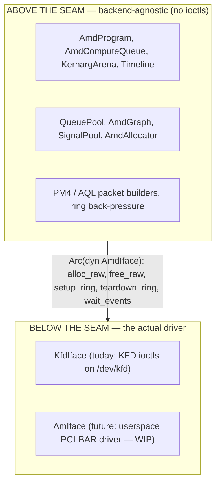
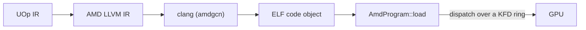

# AMD बैकएंड

Svod AMD GPUs पर kernel driver से सीधे बात करके चलता है। कोई HIP नहीं,
कोई ROCr/HSA runtime नहीं, कोई `libamdhip64.so` नहीं — एकमात्र external dependency
`clang` है (compilation के लिए, ठीक वैसे ही जैसे [CPU JIT लोडर](../jit-loader.md)
उसका उपयोग करता है)। बाक़ी सब कुछ — VRAM allocate करना, command rings बनाना, kernels
dispatch करना, completion पर wait करना — `/dev/kfd` के विरुद्ध raw `ioctl` calls से किया
जाता है, यानी Linux **KFD** (Kernel Fusion Driver) interface जो `amdgpu` kernel module
के अंदर ही आता है।

यह [tinygrad](https://github.com/tinygrad/tinygrad) के `ops_amd.py` का एक faithful port
है, जो ख़ुद KFD-direct है। बैकएंड का लगभग हर function एक `ops_amd.py:NNN` / `hcq.py:NNN`
citation रखता है ताकि design को उसके reference के विरुद्ध जाँचा जा सके।

कोड `svod-device` crate में `device/src/amd/` के अंतर्गत रहता है।

---

## एक runtime-detected execution provider

AMD बैकएंड **हमेशा compile होता है** (हर Unix host पर — `cfg(unix)`, चूँकि `nix` केवल Unix
है), कभी किसी cargo feature के पीछे gated नहीं। उपलब्धता **runtime पर तय होती है, compile
time पर नहीं**, ORT-शैली में: device registry `svod_device::amd::has_devices()` से hardware
को probe करती है — KFD topology का एक sysfs-only, side-effect-free read — और `"AMD"` device
factory को *केवल* तब register करती है जब एक supported GPU मौजूद हो। बिना `/dev/kfd` वाले host
पर स्वाभाविक रूप से कोई `"AMD"` device type नहीं होता।

मुद्दा robustness है: चूँकि बैकएंड हर build के type-check में है, generic core में एक API
change (मान लें एक `Program` या `PlanContext` trait) हर dev box पर `cargo check` पर पकड़ा
जाता है, केवल GPU host पर नहीं। लागत compile time है, जिसे स्वीकार किया जाता है। bindgen step
तदनुसार **hermetic** है — यह सभी platforms पर vendored headers पर चलता है, बिना किसी
system kernel headers की ज़रूरत के (देखें [KFD Bindings](./kfd-bindings.md))।

---

## HIP के बजाय KFD-direct क्यों

AMD बैकएंड लिखने वाला कोई "समझदार व्यक्ति" HIP (CUDA जैसा runtime) या उसके नीचे के HSA
runtime की ओर हाथ बढ़ाता है। Svod जान-बूझकर ऐसा नहीं करता। तर्क यह है:

- **कोई userspace runtime dependency नहीं।** HIP/ROCr सैकड़ों मेगाबाइट की shared libraries
  हैं जिन्हें kernel driver version से match करना ज़रूरी है। KFD एक stable kernel `ioctl`
  ABI है; एक Svod binary `libc` + `nix` लिंक करता है और `clang` को shell out करता है, और
  कुछ नहीं। बैकएंड किसी भी ऐसे host पर काम करता है जिसमें पर्याप्त नया `amdgpu` और `clang`
  का `amdgcn` target हो — कोई ROCm install नहीं।
- **Deterministic control।** हम command ring, doorbell, timeline signal,
  page-table-visible allocations और scratch buffer के मालिक हैं। हमारे और hardware के बीच
  कोई runtime नहीं है जो submissions को reorder करे या state छिपाए, जो उस lock-free
  multi-owner dispatch के लिए मायने रखता है जिसके इर्द-गिर्द बैकएंड बना है (देखें
  [Queues और Dispatch](./queues-and-dispatch.md))।
- **एक सिद्ध reference।** tinygrad का HCQ (Hardware Command Queue) model KFD-direct है और
  युद्ध-परीक्षित है। उसे port करने का मतलब है कि हम अपनी ख़ुद की चीज़ें reverse-engineer
  करने के बजाय उसके exact packet layouts और bring-up sequence को विरासत में लेते हैं।

HIP और ROCr दोनों KFD के *ऊपर* बैठते हैं — वे वही `/dev/kfd` खोलते हैं और वही ioctls जारी
करते हैं जो हम करते हैं। सीधे जाना बीच की layers हटाता है, कोई capability नहीं।

:::note
KFD-direct AMD के लिए वही है जो [CPU JIT लोडर](../jit-loader.md) x86/ARM के लिए करता है:
भारी-भरकम vendor toolchain को छोड़कर bare mechanism को in-process चलाना। CPU loader `clang`
के माध्यम से pipe करता है और परिणाम को `mmap` करता है; AMD बैकएंड `clang` के माध्यम से pipe
करता है और परिणाम को KFD ring पर dispatch करता है।
:::

---

## बैकएंड seam

बैकएंड **`AmdIface`** trait (`device/src/amd/iface.rs`) द्वारा दो हिस्सों में बँटा है:



जो कुछ भी kernel call *नहीं* है — 16 MiB command ring, PM4/AQL packet construction,
kernarg bump arena, timeline counter, program loader — वह seam के ऊपर रहता है और हर बैकएंड
द्वारा साझा होता है। यह trait जान-बूझकर बहुत छोटा है: **पाँच required methods**
(`alloc_raw`, `free_raw`, `setup_ring`, `teardown_ring`, `wait_events`) और साथ में तीन
hooks जिनका default एक no-op है (`queue_event_mailbox`, `publication_checkpoint`,
`update_queue_percentage`)। जो key insight इसे छोटा रखती है
वह यह है कि ring, GART page, EOP buffer और MQD *बस GPU memory* हैं — वे seam के ऊपर
`alloc_raw` के माध्यम से allocate होते हैं, और एक driver को असल में अलग तरीक़े से करने की
एकमात्र चीज़ है **queue को activate करना** (doorbell map करना, scheduler को बताना कि ring
मौजूद है): वही `setup_ring` है।

Implementor को device-open समय पर `SVOD_AMD_BACKEND` environment variable से चुना जाता है:

| `SVOD_AMD_BACKEND` | बैकएंड | स्थिति |
|---|---|---|
| `kfd` (default) | `KfdIface` — KFD-direct | Production |
| `am` | `AmIface` — userspace AM driver | अभी selectable नहीं — नीचे देखें |

:::caution[AM अभी चलने योग्य नहीं है]
`SVOD_AMD_BACKEND=am` सेट करना फ़िलहाल एक error देता है (`device.rs` केवल `kfd` स्वीकार
करता है) — अभी तक कोई AM type seam को implement नहीं करता। userspace **AM** driver का target
है एक **CDNA3 SR-IOV VF** (gfx9.4.3) और यह एक work in progress है: discovery, VF↔GIM
mailbox, indirect register access, GMMU, और GMC bring-up implement किए जा चुके हैं और **live
VF पर validated** हैं, लेकिन अभी तक कोई GPU engine work consume नहीं करता (doorbell aperture
host-owned है)। आज ठीक-ठीक क्या मौजूद है और boundary कहाँ है इसके लिए
[AM Driver](./am-driver.md) देखें।
:::

---

## Device-local memory और SDMA copy queue

बैकएंड CDNA parts पर device-open पर एक **SDMA copy queue** (`AmdCopyQueue`) install करता है
— RDNA host-visible path पर ही रहता है, और `AMD_DISABLE_SDMA` इस प्रयास को पूरी तरह बंद कर
देता है — जो `has_sdma_queue` को true कर देता है। इसके साथ, intermediates **device-only VRAM**
(`cpu_access = false`) में रह सकते हैं और host↔device copies asynchronous DMA के माध्यम से
जाती हैं: `_copyin`/`_copyout` SDMA queue के माध्यम से stage होती हैं, `_transfer` एक direct
device→device copy करता है। जब कोई copy queue मौजूद न हो तो allocator सरल model पर वापस आ जाता
है — हर buffer को ज़बरन host-visible (CPU-mappable VRAM या GTT) बना दिया जाता है और copies एक
`synchronize()` के बाद सादे `memmove` होती हैं। Allocation और copies को
[KFD Bindings](./kfd-bindings.md) में कवर किया गया है।

---

## AMD पर चलाना

AMD GPU को `SVOD_DEVICE` environment variable से चुनें — `AMD:0`
[KFD topology](./kfd-bindings.md) में पहला AMD node है। उदाहरण के लिए, एक model को
end-to-end चलाना:

```bash
SVOD_DEVICE=AMD:0 cargo run --release -p svod-model --example gigaam_infer -- ./audio.wav
```

एक supported AMD GPU के अलावा एकमात्र host requirement है `PATH` पर `amdgcn` target वाला
`clang` (kernels compile करने के लिए — देखें [Compile और Graph](./compile-and-graph.md));
कोई ROCm/HIP install नहीं। [Queues और Dispatch](./queues-and-dispatch.md) पेज हर
environment knob की सूची देता है।

---

## यह pipeline में कहाँ बैठता है

AMD बैकएंड compiler का device हिस्सा है। Frontend tensors को एक single UOp IR में lower
करता है; codegen उस IR को GPU thread indices पर map करता है (["Add GPU Dims"](../../architecture/codegen/devectorizer.md)
stage ranges को `gidxN`/`lidxN` SPECIAL indices में बदलता है, जैसा [IR Design](../../architecture/ir-design.md)
में बताया गया है); renderer AMD LLVM IR emit करता है; और यह बैकएंड उसे compile और run करता है:



[JIT ग्राफ़](../../architecture/jit-graphs.md) layer इसे wrap करती है ताकि एक model graph
एक बार compile हो और कई बार replay हो।

---

## पठन गाइड

| पेज | यह क्या कवर करता है |
|---|---|
| [KFD Bindings](./kfd-bindings.md) | kernel ABI कैसे bind होता है (एक vendored header पर bindgen), ठीक-ठीक उपयोग होने वाले ioctls, sysfs topology, और allocation flow |
| [Queues और Dispatch](./queues-and-dispatch.md) | command ring, PM4 बनाम AQL, bounded compute-lane pool, publication और device-wide drains, timeline, और हर configuration env var |
| [Compile और Graph](./compile-and-graph.md) | एक kernel LLVM IR से loaded program तक कैसे जाता है, यह कैसे dispatch होता है, और graph capture/replay कैसे काम करता है (AQL by default, PM4 opt-in) |
| [AM Driver](./am-driver.md) | प्रगति-में userspace driver: क्या बना है, क्या स्थगित है, और यह seam में कैसे plug होता है |
| [Debugging](./debugging.md) | fault triage के लिए VA→allocation registry, poison latch, और dispatch/tracing diagnostics |
