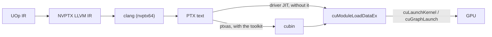

# CUDA बैकएंड

Svod NVIDIA GPUs पर **CUDA driver API** (`libcuda.so.1`) के माध्यम से चलता है और CUDA
stack से और कुछ नहीं: कोई toolkit नहीं, कोई `nvcc` नहीं, कोई NVRTC नहीं, कोई `libcudart`
नहीं। Kernels NVPTX LLVM IR के रूप में render होते हैं, host `clang` द्वारा PTX text में
lower किए जाते हैं, CUDA toolkit installed होने पर `ptxas` द्वारा cubin में assemble किए
जाते हैं, और अन्यथा module load पर driver द्वारा SASS में JIT-compile होते हैं। यह
design tinygrad के `ops_cuda.py` का अनुसरण करता है; कोड `device/src/cuda/` (driver,
memory, programs, graphs), `runtime/src/cuda/` और `runtime/src/devices/cuda.rs` (compile
और device factory), और `codegen/src/llvm/nvptx/` (renderer) में रहता है।

---

## आवश्यकताएँ

| Requirement | क्यों |
|---|---|
| एक NVIDIA driver जो `libcuda.so.1` उजागर करता हो | हर driver call उसी से runtime पर `libloading` के साथ resolve होती है |
| Driver **CUDA 12.0 (R525) या नया** | CUDA graph के entry points अपने versioned नामों (`cuGraphAddKernelNode_v2`, `cuGraphExecKernelNodeSetParams_v2`) से bind होते हैं, जो 12.0 से हैं। PTX ISA का pin compute capability का अनुसरण करता है: sm_88 तक **7.8**, sm_89 और sm_90 पर **8.4** (उनके fp8 `mma.sync` shapes; CUDA 12.4 / R550), sm_100 से sm_102 पर **8.6** (CUDA 12.7), sm_120 पर **8.7** (CUDA 12.8), और sm_103, sm_121 तथा उससे नए पर **8.8** (CUDA 12.9) — किसी Blackwell part को उसी ISA वाला driver चाहिए जिसने उसे पेश किया |
| **NVPTX** target के साथ बना `clang` | `clang -x ir --target=nvptx64-nvidia-cuda` rendered IR को PTX में बदल देता है |

किसी host पर इनकी जाँच करें:

```bash
ldconfig -p | grep libcuda.so.1          # the driver library
nvidia-smi | grep 'CUDA Version'         # the driver's CUDA level (>= 12.0)
clang --print-targets | grep nvptx64     # the NVPTX backend
```

NVPTX के बिना एक clang एक साफ़ `JitCompilation` error देता है जो fix का नाम बताता है
(`-DLLVM_TARGETS_TO_BUILD='X86;AArch64;NVPTX'`)। चलाने के लिए किसी CUDA toolkit की ज़रूरत
नहीं है: path पर मौजूद `ptxas` का उपयोग kernels को पहले से assemble करने के लिए तब होता
है जब वह संयोग से वहाँ हो (`SVOD_CUDA_PTXAS=0` से इससे बाहर निकला जा सकता है), और
`compute-sanitizer` [debugging](./debugging.md) के लिए उपयोगी है, पर इनमें से कोई भी
आवश्यक नहीं है।

---

## एक runtime-detected execution provider

बैकएंड **हमेशा compile होता है**, हर host पर, किसी cargo feature के पीछे नहीं (पुराना
`cudarc`-आधारित `cuda` feature हटा दिया गया है)। उपलब्धता runtime पर तय होती है:
`svod_device::cuda::has_devices()` `libcuda.so.1` load करता है, हर bound entry point
resolve करता है, `cuInit(0)` और `cuDeviceGetCount` call करता है, और उत्तर को memoize करता
है। Runtime की device registry `"CUDA"` factory को केवल तभी register करती है जब वह `true`
हो; बिना driver वाले host पर स्वाभाविक रूप से कोई `CUDA` device type नहीं होता और hardware
tests ख़ुद को skip कर देते हैं।

यह वही contract है जो [AMD बैकएंड](../amd/overview.md) का है: driver call sites हर
`cargo check` में type-check होते हैं, इसलिए generic `Program` / `PlanContext` / `Graph`
traits में एक API change बिना GPU के भी पकड़ा जाता है।

---

## CUDA पर चलाना

GPU को `SVOD_DEVICE` से चुनें (`CUDA:N`; `GPU` एक स्वीकृत alias है, अकेला `CUDA` का अर्थ
है device 0)। `NV` जान-बूझकर **स्वीकार नहीं** किया जाता — यह नाम भविष्य के एक userspace
driver बैकएंड के लिए सुरक्षित रखा गया है:

```bash
SVOD_DEVICE=CUDA:0 cargo run --release -p svod-model --example gigaam_infer -- ./audio.wav
```

एक device खोलना उसके name, `sm_XY`, SM count, managed-memory support, driver version और
इस बात के साथ एक `info` line log करता है कि scoped synchronization चालू है या नहीं
(`RUST_LOG=svod_device=info`)।

Compute capability को open पर driver से पढ़ा जाता है और एक open-ended
`CudaArch { major, minor }` (`sm_86`, `sm_120`, ...) के रूप में रखा जाता है। यह
`clang -march` चुनती है, object cache को key करती है, और optimizer profile चुनती है
(`OptimizerRenderer::for_cuda_arch`):

| Capability | profile में tensor cores |
|---|---|
| `sm_75` से नीचे | कोई नहीं |
| `sm_75` | f16 `m16n8k8` |
| `sm_80`+ | f16 और bf16 `m16n8k16`, f16 `m16n8k8`, i32 में accumulate होने वाला int8 `m16n8k32`; bf16 storage। tf32 opt-in ही रहता है (`cuda_sm80(true)`) |
| `sm_89`+ | sm_80 वाला set अपरिवर्तित: fp8 `m16n8k32` cores मौजूद तो हैं (`sm89_tensor_cores`), पर जब तक renderer fp8 casts को lower नहीं कर सकता तब तक `for_cuda_arch` उन्हें रोके रखता है (देखें [Limitations](./limitations.md)) |

---

## यह pipeline में कहाँ बैठता है



Compiled object को साझा object cache द्वारा disk पर cache किया जाता है — `ptxas` installed
होने पर एक cubin, अन्यथा PTX text, और ये दोनों formats कभी एक ही entry साझा नहीं करते।
PTX वाले रास्ते पर driver अपना ख़ुद का SASS cache (`~/.nv/ComputeCache`) रखता है, इसलिए एक
warm start clang को और आमतौर पर JIT को भी छोड़ देता है।

---

## टेस्ट

Host-only tests (symbol table, struct layouts, kernarg packing, timeline logic, PTX
validation, golden NVPTX IR) हर जगह चलते हैं। Hardware tests कोई device मौजूद न होने पर
`cuda_device_or_skip()` के माध्यम से जल्दी return कर जाते हैं, इसलिए एक CUDA host उन्हें
default रूप से चलाता है:

```bash
cargo test -p svod-device cuda
cargo test -p svod-codegen nvptx
SVOD_DEVICE=CUDA:0 cargo test -p svod-tensor            # codegen_tests! `cuda` variants
SVOD_DEVICE=CUDA:0 cargo test -p svod-onnx              # the ONNX suite's `cuda` variants
```

---

## पठन गाइड

| पेज | यह क्या कवर करता है |
|---|---|
| [Architecture](./architecture.md) | driver bindings, context और streams, memory kinds, program loading और launch, timelines, CUDA graphs, object cache identity |
| [Codegen](./codegen.md) | NVPTX renderer: intrinsics, barriers, transcendentals, `mma.sync` tensor cores, launch bounds, clang invocation और PTX validation |
| [Profiling](./profiling.md) | Event-आधारित GPU timestamps, `cuFuncGetAttribute` resources, CUDA पर कौन-से profiler tiers मौजूद हैं |
| [Limitations](./limitations.md) | अभी तक क्या नहीं है और roadmap |
| [Debugging](./debugging.md) | Environment variables, IR dumps, driver और JIT errors पढ़ना, offline `ptxas` checks |
