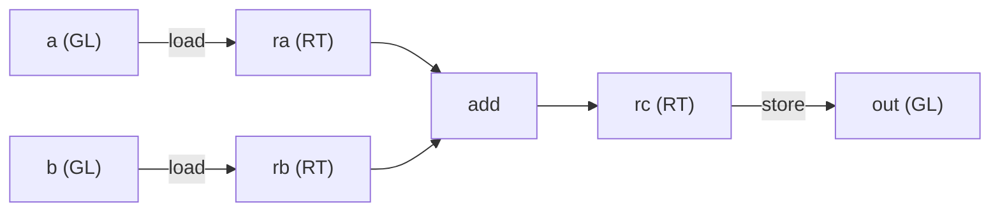

# अपना पहला कर्नेल लिखना

[IR में authoring](./lowering) ने builder को theory में समझाया था: `Kernel` आपको कच्चा माल देता है,
`Group` compute वाली शब्दावली साथ रखता है, और `finish` सब कुछ एक `SINK` में wrap कर देता है। यह chapter
इसे ठोस बनाता है — सबसे छोटा कर्नेल लिखकर जो असल में कुछ काम करता है (**दो `16×16` tiles load करो, उन्हें
add करो, नतीजा store करो**), और फिर उसे run करके।

यह जान-बूझकर सबसे सरल चीज़ है जो फिर भी एक कर्नेल के पूरे shape को छू लेती है: [Tiling क्या है](./tiling)
वाला load → compute → store का सफ़र, code में ढला हुआ। न कोई matrix multiply, न shared memory, न कोई loop —
बस इतना कि हर step नज़र आ जाए। matmul और Flash Attention कर्नेल इसी skeleton पर बने हैं, बस ऊपर और सामान
चढ़ा हुआ है।



---

## पूरा कर्नेल

यह रहा end to end — buffers declare करो, body बनाओ, run करो, और नतीजा वापस पढ़ो:

```rust
use svod_dtype::DType;
use svod_tensor::Tensor;
use svod_tk::arch::FragRole;
use svod_tk::tiles::TileLayout;
use svod_tk::{run_kernel, MoveIdx};

// Two 16×16 inputs and an output, as flat f32 buffers.
let a: Vec<f32> = (0..256).map(|i| i as f32).collect();
let b: Vec<f32> = (0..256).map(|i| (2 * i) as f32).collect();
let ta = Tensor::from_slice(&a);
let tb = Tensor::from_slice(&b);
let mut out = Tensor::empty(&[1, 1, 16, 16], DType::Float32);

// One wave covers the tile; its width is 64 on CDNA, 32 on RDNA and CUDA.
let arch = svod_tk::target::resolve_arch(&ta.device()).expect("a GPU device");
let w = svod_tk::ArchCaps::for_arch(arch).wave_size as i64;

run_kernel("tile_add", [1, 1, 1], w, &mut [&mut out], &[&ta, &tb], |ker| {
    let warp = ker.warp();

    // Globals, in launch order: output first, then the two inputs.
    let o = ker.gl(&[1, 1, 16, 16], DType::Float32);
    let ga = ker.gl(&[1, 1, 16, 16], DType::Float32);
    let gb = ker.gl(&[1, 1, 16, 16], DType::Float32);

    // Ask for the 16×16 f32 fragment by role — arch-correct on wave32 and wave64.
    let frag = ker.frag(FragRole::Accumulator);

    // global → register
    let ra = warp.load(ker.rt((16, 16), DType::Float32, TileLayout::Row, frag), ga, MoveIdx::block((0, 0, 0, 0), 2));
    let rb = warp.load(ker.rt((16, 16), DType::Float32, TileLayout::Row, frag), gb, MoveIdx::block((0, 0, 0, 0), 2));

    // the one compute op
    let rc = warp.add(ra, &rb);

    // register → global, then close the kernel around its single store
    let _ = warp.store(o, rc, MoveIdx::block((0, 0, 0, 0), 2));
    ker.finish(1)
})
.expect("tile_add launch");

let result = out.as_vec::<f32>().expect("read out"); // result[i] == 3 * i
```

बस यही पूरा कर्नेल है। बाक़ी का chapter इसकी एक-एक line पर चलता है।

---

## Step by step

### 1. Launch declare करें

`run_kernel` DEBUG चेहरे से direct-dispatch वाली entry है: यह inputs realize करता है, outputs allocate
करता है, आपके लिए एक `Kernel` बनाता है, `SINK` पाने के लिए आपका closure run करता है, फिर compile और
dispatch करता है — और outputs को सीधे जगह पर लिख देता है।

```rust
run_kernel("tile_add", [1, 1, 1], w, &mut [&mut out], &[&ta, &tb], |ker| { /* body */ })
```

`[1, 1, 1]` grid और `w` block — यही launch geometry है। हम **एक wave का एक workgroup** इस्तेमाल करते हैं:
पूरा `16×16` tile एक ही wave के registers में समा जाता है, इसलिए blocks भर में फैलाने को कुछ है ही नहीं।
block size `w` है, यानी **wave width** — जिसे हमने पहले ही device से query कर लिया था
(`ArchCaps::for_arch(resolve_arch(&ta.device())).wave_size`), क्योंकि एक wave CDNA पर 64 lanes की होती है पर
RDNA और NVIDIA पर 32, और block dimension *वही* lane count है। output slice पहले आता है, inputs बाद में — और **यही order वह contract
है** जिस पर अगला step टिका है।

### 2. काम के लिए एक wave लें

```rust
let warp = ker.warp();
```

`Group` ही वह एक साथ काम करने वाली wave है (`warp` उसी चीज़ के लिए NVIDIA का शब्द है)। हर compute op —
loads, add, store — इसी पर एक method है। `ker.warp()` single-wave group देता है; `ker.group(n)` किसी बड़े
tile के लिए आपको `n` waves दे देता।

### 3. Globals declare करें

```rust
let o  = ker.gl(&[1, 1, 16, 16], DType::Float32);
let ga = ker.gl(&[1, 1, 16, 16], DType::Float32);
let gb = ker.gl(&[1, 1, 16, 16], DType::Float32);
```

एक **global layout** (`GL`) किसी एक buffer पर एक typed view है — यह logical shape जानता है, इसलिए loads
सही address compute कर पाते हैं। हर `gl()` call declaration order में *अगला* buffer bind करता है, और वह
order launch से मेल खाना चाहिए: हमने `&mut [&mut out]` फिर `&[&ta, &tb]` पास किया था, इसलिए हम `o`, फिर
`ga`, फिर `gb` declare करते हैं। इस order में चूक हुई, तो कर्नेल ग़लत buffers पढ़ता और लिखता है।

`[1, 1, 16, 16]` shape वही 4-D addressing convention है जो tk कर्नेल इस्तेमाल करते हैं; दो शुरुआती `1`s
batch/head dimensions हैं, जिन्हें असली कर्नेल iterate करता, पर यहाँ trivial छोड़ दी गई हैं। (input *tensors*
ख़ुद flat 256-element buffers हो सकते हैं — logical shape तो `GL` view देता है; अपना shape सिर्फ़ output
tensor साथ रखता है, allocation के लिए।)

### 4. role से tile माँगें

```rust
let frag = ker.frag(FragRole::Accumulator);
```

यह [Wave32 बनाम Wave64](./wave-portability) वाली portability की चाल है, और यह उस कर्नेल में भी मायने रखती है
जिसमें कोई matrix multiply है ही नहीं: वही logical `16×16` f32 tile हर supported architecture पर एक *अलग
physical lane layout* रखता है, इसलिए किसी hardcoded fragment के बजाय एक **role** का नाम लेने से एक ही body
उन सबके लिए compile हो जाती है। हम कर्नेल से `Accumulator` role माँगते हैं — यानी बस एक
full-precision result tile का role, जो एक add भी produce करता है, सिर्फ़ MMA ही नहीं — और `Kernel::frag`
इसे `ArchCaps::frag` को आगे सौंप देता है ताकि target के लिए physical fragment resolve हो सके: CDNA पर
wave64, RDNA पर even/odd wave32 layout, और CUDA पर two-half `mma.sync` layout।

### 5. Load: global → register

```rust
let ra = warp.load(ker.rt((16, 16), DType::Float32, TileLayout::Row, frag), ga, MoveIdx::block((0, 0, 0, 0), 2));
let rb = warp.load(ker.rt((16, 16), DType::Float32, TileLayout::Row, frag), gb, MoveIdx::block((0, 0, 0, 0), 2));
```

`ker.rt(...)` अभी resolve हुई fragment layout में एक register tile allocate करता है; `warp.load` इसे global
से भर देता है। `MoveIdx::block((0, 0, 0, 0), 2)` बताता है कि global का *कौन-सा* tile पढ़ना है: यह tuple चारों
dimensions में से हर एक पर tile का coordinate है — सब zero, क्योंकि एक अकेले `16×16` tile की बस `(0, 0)`
position होती है — और `2` वह axis है जिसके साथ ये tiles stacked हैं: dimension 2, यानी `[1, 1, 16, 16]`
view का row dimension। (एक `[1, 1, 32, 16]` global में दो row-tiles होते; दूसरे को पढ़ने पर वह coordinate
`1` हो जाता।) wave मिलकर 256 elements को सीधे registers में खींच लेती है, पहले से ही उस layout में
जो compute चाहता है।

यह *सीधा* `global → register` path है — बीच में कोई shared-memory रुकावट नहीं। जो कर्नेल बड़े tensors stream
करता, वह पहले एक shared tile से होकर stage करता (coalescing और एक conflict-free swizzle के लिए, यानी
[FLOPS कहाँ छिपते हैं](./where-flops-hide) वाले gaps); हम इसे छोड़ देते हैं क्योंकि एक अकेले resident tile को
इनमें से किसी की ज़रूरत नहीं।

### 6. Compute: इकलौता op

```rust
let rc = warp.add(ra, &rb);
```

कर्नेल में इकलौती arithmetic। `add` tile पर elementwise है — न कोई lane indexing, न address math, बस "इन
दो tiles को add कर दो।" (यह पहला operand by value और दूसरा by reference लेता है, और result tile लौटाता
है।) यहीं, असली कर्नेल में, `mma`, reductions, और elementwise maps आते; उनके इर्द-गिर्द की mechanics ठीक
वही है जो आप यहाँ देख रहे हैं।

### 7. Store और finish

```rust
let _ = warp.store(o, rc, MoveIdx::block((0, 0, 0, 0), 2));
ker.finish(1)
```

`warp.store` result tile को वापस output global में लिख देता है — वही indexing, बस उलटे क्रम में।
`ker.finish(1)` कर्नेल को इसके **इकलौते** store के इर्द-गिर्द बंद करता है और `SINK` produce करता है (stamped
`opts_to_apply: Some(vec![])`, ताकि optimizer hand-lowered body को अकेला छोड़ दे, जैसा
[IR में authoring](./lowering) ने बताया था)। `finish` को आप जो number पास करते हैं वह यह है कि कितने output
stores को `SINK` में collect करना है — हमारे पास एक output है, इसलिए `1`।

### 8. इसे run करें और वापस पढ़ें

closure जैसे ही return करता है, `run_kernel` उसी पल compile और dispatch कर देता है। output सीधे जगह पर
bound था, इसलिए हम इसे tensor से सीधे पढ़ लेते हैं:

```rust
let result = out.as_vec::<f32>().expect("read out"); // result[i] == 3 * i
```

`a[i] = i` और `b[i] = 2i` के साथ, हर element `3i` बनकर वापस आता है।

---

## वे नियम जिन्हें आप तोड़ नहीं सकते

कुछ constraints load-bearing हैं — एक में भी चूक हुई तो आपको compile error, एक panic, या एक ग़लत जवाब
मिलता है:

| नियम | क्यों |
|------|-----|
| **Tile dims `16` के गुणक हों** | एक tile `16×16` matrix-core fragments की पूरी संख्या है; `ker.rt` इसे assert करता है। |
| **`gl()` order = launch buffer order** | पहले outputs, फिर inputs। bind positional है; एक mismatch चुपचाप buffers swap कर देता है — ग़लत numbers, कोई error नहीं, इसलिए compiler इसे पकड़ नहीं पाता। |
| **fragments role से माँगें, constant से नहीं** | `ker.frag(role)` ही वह चीज़ है जो एक body को wave32 पर, wave64 पर, *और* NVIDIA के warp32 पर चलाती है। |
| **यह एक GPU कर्नेल है** | builder असली lane indices (`Op::Special`) mint करता है, इसलिए execution एक GPU को target करता है — AMD या CUDA — CPU को नहीं। |

---

:::tip[GPU विशेषज्ञों के लिए]
body बिल्कुल [IR में authoring](./lowering) वाले `RANGE` / `INDEX` / `LOAD` / `STORE` shape में lower होता
है — कोई नए node types नहीं। कर्नेल एक lane-index `Op::Special` mint करता है जिस पर wave के loads सवार होते
हैं; हर `warp.load` उस lane के तहत एक global `LOAD` बनता है, `warp.add` एक अकेला `Op::Binary(Add)` है, और
store एक `STORE` है जिस पर `SINK` close होता है। यहाँ **न** कोई `Wmma` है **न** `Local` address space वाला कोई `BUFFER`: यह
एक register-only round-trip है, सबसे compact कर्नेल जिसे IR express कर सकता है।

चूँकि कर्नेल `Special` ops emit करता है, यह एक पूरी तरह hand-lowered GPU कर्नेल *है* — optimizer और
workgroup-dimension passes एक `Special`-bearing graph को already-lowered मानकर उसे pass through कर देते हैं
(वही gate जिसे `opts_to_apply: Some(vec![])` enforce करता है)। इसीलिए यह सिर्फ़ किसी GPU backend — AMD या NVPTX — पर render
होता है: lane index का scalar CPU path पर कोई मतलब नहीं। हालाँकि `SINK` *बनाना* तो विशुद्ध UOp construction
है — इसके लिए किसी GPU की ज़रूरत नहीं; ज़रूरत सिर्फ़ इसे execute करने में पड़ती है। यही बँटवारा एक कर्नेल को
हर build पर एक host-side shape check से guarded रहने देता है, और on-device numbers के लिए एक अलग gated test रखता है।
:::

---

## यह क्यों ज़रूरी है

यह नन्हा कर्नेल वही template है जिसमें हर tk कर्नेल ढाला जाता है। matmul कर्नेल इसमें एक `mma` और एक K-loop
जोड़ता है, और worked [Flash Attention](./flash-attention) example matrix core को एक online-softmax
recurrence, double-buffered streaming, और एक wave-size branch के साथ काम पर लगाता है। पर बुनियादी ढाँचा
ठीक वही है जो आपने अभी लिखा: globals को launch order में declare करो, tiles को role से माँगो, memory spaces
के बीच data move करो, tiles पर compute करो, और `finish`। इस skeleton को सीख लीजिए, फिर मुश्किल कर्नेल इसे
बदलते नहीं, बस इसमें और जोड़ते जाते हैं।

और यह सब एक ही UOp IR है। जो `SINK` आपने बनाया, वह उसी तरह की object है जो compiler एक autotuned कर्नेल के
लिए produce करता है — और यही इस पूरे section का असल मक़सद है।

आगे वह बारीकी है जो हाथ से authoring को सचमुच मुश्किल बना देती है — एक कर्नेल को wave sizes और fragment
layouts भर में correct रखना: [Wave32 बनाम Wave64](./wave-portability)।
