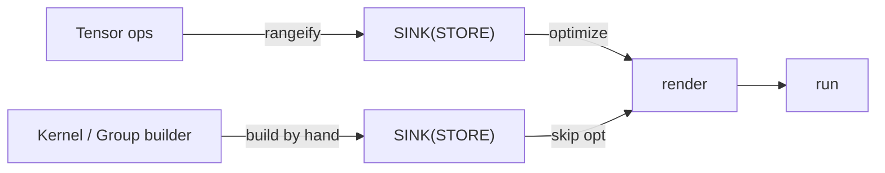
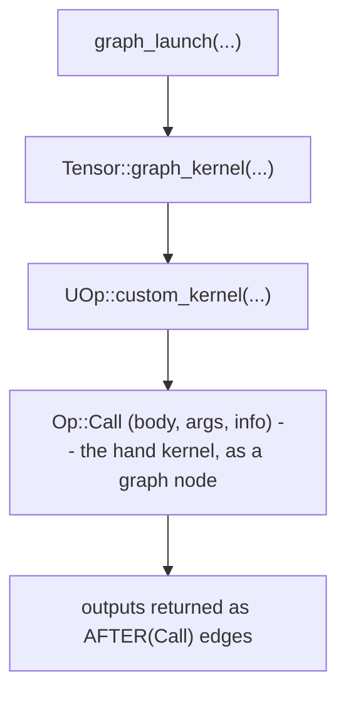
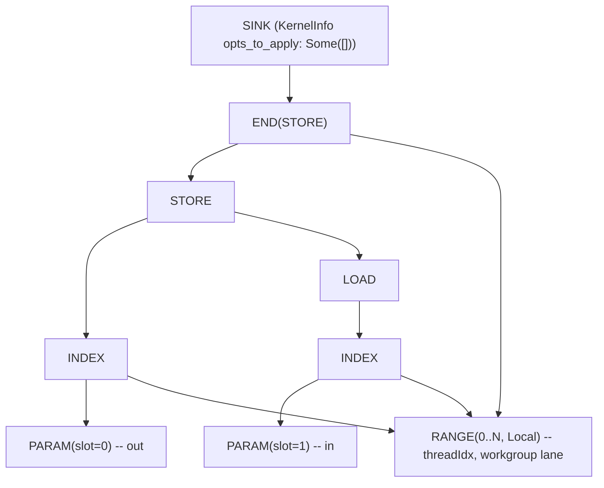

# एक ही IR में authoring

"users को कर्नेल हाथ से लिखने कैसे दें?" — ज़्यादातर tile frameworks इसका जवाब एक *layer* जोड़कर देते हैं।
वह layer एक नया DSL होता है, जिसका अपना compiler, अपना debugger, और अपना profiler framework के साथ
जोड़ दिया जाता है। `tk` की सबसे ख़ास बात यही है कि यह **कोई layer जोड़ता ही नहीं**। हाथ से लिखा कर्नेल बाक़ी
हर चीज़ जैसा *उसी* UOp IR में lower होता है, इसलिए यह एक ही rendering path, एक ही debugger, और एक ही
profiler साझा करता है — और ML application बनाने वाले developer के पास सीखने को ठीक **एक ही IR होता है**,
एक `Tensor` add से लेकर नीचे एक hand-tuned attention कर्नेल तक।

यह chapter दिखाता है कि यह कैसे काम करता है। यह मानकर चलता है कि आप
[IR डिज़ाइन फ़िलॉसफ़ी](../architecture/ir-design) और
[एक्ज़ीक्यूशन पाइपलाइन](../architecture/pipeline) पढ़ चुके हैं — आपको पता होना चाहिए कि UOp क्या है और कैसे एक
lazy `Tensor` compiled कर्नेल बनता है। वह philosophy हम दोबारा नहीं समझाएँगे; हम बस यह दिखाएँगे कि एक
हाथ से लिखा कर्नेल उसमें कैसे *slot* हो जाता है।

---

## कोई नई layer नहीं: कर्नेल बस एक subgraph है

[अवलोकन](./overview) वाला दावा याद करें: `tk` एक builder है, backend नहीं। यह assembly emit नहीं करता,
और न ही अपना कोई IR define करता है। यह *बिल्कुल वही* lowered IR emit करता है जो सामान्य codegen path पहले से
consume करता है — `RANGE` loops, `INDEX`/`LOAD`/`STORE` memory ops, `WMMA` matrix instructions (और जहाँ
ज़रूरत हो, `Op::Custom` के रूप में raw LLVM/ASM)।

तो कर्नेल author करना दरअसल बस *एक UOp DAG हाथ से construct करना* है, बजाय इसके कि `rangeify` इसे आपके लिए
construct करे। output एक `SINK` UOp होता है — ठीक वही चीज़ जो scheduler एक autotuned कर्नेल के लिए produce
करता है। हाथ से लिखे और compiler-generated कर्नेल दो अलग तरह की objects नहीं हैं; वे एक ही तरह के हैं, बस
दो अलग तरीक़ों से बने:



---

## एक ही IR में रहने का फ़ायदा क्या है

यही इस chapter का पूरा मुद्दा है, इसलिए इसे ठोस बना लेना ज़रूरी है। चूँकि हाथ से लिखा कर्नेल दरअसल बस और
UOps *ही है*, इसलिए compiler का सारा infrastructure इसे अपने-आप मिल जाता है — कुछ भी tk-specific न बनाना
पड़ता है, न सीखना:

- **एक ही renderer।** जो `svod-codegen` path graph कर्नेल को LLVM IR में — और वहाँ से एक AMD binary या PTX में — lower करता है,
  वही आपके `tk` कर्नेल को render करता है। न कोई दूसरा backend लिखना है, न port करना, न sync में रखना।
- **एक ही debugger।** आप एक `tk` कर्नेल को बाक़ी किसी भी computation की तरह ही inspect करते हैं: UOp tree
  print कर लीजिए। हाथ से लिखा Flash Attention और एक autotuned matmul, दोनों *एक ही* textual रूप में, एक ही
  op names के साथ दिखते हैं — न कोई अलग dump format, न "यह kernel X आख़िर है क्या" वाली पहेली।
- **एक ही profiler।** चूँकि एक `tk` कर्नेल अपना `name` IR से होकर साथ ले जाता है, यह device profile में
  *उसी name से* दिखता है — किसी anonymous blob के रूप में नहीं — और बाक़ी हर कर्नेल जैसे उसी
  hardware-timestamp path से timed होता है। हाथ से लिखे और graph कर्नेल को profile करना एक ही workflow है।
- **सीखने को एक ही IR।** यही developer के लिए असली फ़ायदा है। Svod पर एक ML application को build, optimize,
  debug, और profile करने के लिए — एक `Tensor` add से लेकर नीचे एक hand-tuned attention कर्नेल तक — आप ठीक
  *एक* ही representation सीखते हैं। दिमाग़ में "tensor IR बनाम kernel DSL बनाम backend IR" वाली कोई उलझन
  रखने की ज़रूरत नहीं, क्योंकि यहाँ बस एक ही UOp graph है।

आम तौर पर इंतज़ाम इसके उलट होता है: एक tile DSL अपने compiler, अपने debugger, और अपने profiler view के
साथ एक *अलग* भाषा होती है, जो framework के साथ जोड़ दी जाती है। इनमें से हर एक एक layer है जिसे framework
को बनाना पड़ता है और एक चीज़ जिसे user को सीखनी पड़ती है। `tk` इनमें से कुछ नहीं जोड़ता — यही वह कीमत है जिसे
यह चुकाने से इनकार करता है।

---

## Builder: `Kernel` और `Group`

आप दो types से author करते हैं (`tk/src/lib.rs` में AUTHOR चेहरे से):

- **`Kernel`** (`tk/src/kernel.rs`) eager builder है। यह आपको कच्चा माल देता है — grid/block dimensions
  (जो `SPECIAL` ops बनते हैं), loop ranges (`RANGE`), shared-memory और register buffers (दोनों ही
  `BUFFER`, जो `addrspace = Local` / `Reg` से अलग होते हैं), और global parameters (`PARAM`)। आप इससे
  tensors bind करते हैं और tiles माँगते हैं।
- **`Group`** (`tk/src/group/`, हर concern के लिए एक submodule — `movement`, `mma`, `reduce`,
  `shuffle`, `elementwise`) एक साथ काम करने वाली wave (या waves का समूह) है। यह *compute* वाली
  शब्दावली साथ रखता है: memory spaces के बीच loads और stores, `mma` matrix multiply, reductions, shuffles,
  और elementwise maps।

हर `Group` operation सीधे UOp nodes बनाता है। एक load ज़रूरी `RANGE`s खोलता है, एक `STORE` emit करता है
जो उन्हें बंद करता है, और destination tile को एक dependency edge के साथ दोबारा wrap करके लौटाता है, ताकि
अगला operation इसके बाद ही order हो। आप दरअसल eagerly एक graph लिख रहे होते हैं, एक बार में एक tile op।

जब काम पूरा हो जाए, आप `Kernel::finish(...)` कॉल करते हैं, जो खुली ranges को बंद करता है और सब कुछ एक
terminal `SINK` में wrap कर देता है।

---

## वह एक marker जो सब कुछ बदल देता है

यह रहा वह field जिसके दम पर हाथ से authoring चलती है। जो `SINK` `finish` produce करता है वह एक
`KernelInfo` साथ रखता है, और `tk` इस पर यह stamp लगाता है:

```rust
KernelInfo { opts_to_apply: Some(vec![]), name: Some(...), .. }
```

इसी एक चीज़ — `opts_to_apply: Some(vec![])` — पर सब टिका है। जब optimizer किसी कर्नेल से सामना करता है,
तो यह इसी field को चेक करता है (`schedule/src/optimizer/` में):

| `opts_to_apply` | मतलब |
|-----------------|---------|
| `None` | "तुम तय करो।" heuristics चलाओ, या [beam search](../architecture/optimizations/kernel-search) अगर enabled हो। |
| `Some(vec![])` | "यह body **पहले से lowered** है। *शून्य* और optimizations apply करो।" |
| `Some(non-empty)` | "बिल्कुल यही optimizations, इसी क्रम में apply करो।" |

एक `tk` कर्नेल `Some(vec![])` इस्तेमाल करता है: schedule आपने हाथ से लिखा है, इसलिए optimizer कोई भी
schedule opt apply नहीं करता। वे साझा rewrites जो हर कर्नेल को codegen से पहले चाहिए (algebraic
simplification, index-dtype lowering), body पर फिर भी चलती हैं; जो कभी नहीं होता वह है इसे दोबारा tile
करना, दोबारा vectorize करना, या reorder करना। और graph level पर scheduler के rewrites *calls-preserving*
हैं — वे किसी hand कर्नेल की body में उतरते ही नहीं। आपका hand-tuned loop जैसा लिखा गया, ठीक वैसे ही codegen
तक बच जाता है — पर तब भी यह एक आम UOp graph ही रहता है, जिसे *वही* renderer LLVM IR में बदलता है और *वही*
runtime execute करता है।

और यह सिर्फ़ सुविधा भर नहीं है ("तुमने इसे पहले ही optimize कर दिया, तो माथापच्ची मत करो")। यह एक
**safety contract** है, क्योंकि optimizer किसी हाथ से लिखी body को safely छू *नहीं सकता*। उस body में
`Op::Custom` के रूप में raw LLVM/ASM intrinsics हो सकते हैं — [FLOPS कहाँ छिपते हैं](./where-flops-hide) के
machine-scheduler primitives ठीक यही हैं। optimizer के पास **कोई model ही नहीं है कि वे opaque ops करते
क्या हैं**, इसलिए उनके आर-पार re-tiling, reordering, या fusing करने से कर्नेल के results चुपचाप बदल सकते हैं —
या आपकी हाथ से बनाई performance चुपचाप तबाह हो सकती है। तो `Some(vec![])` optimizer को बता देता है कि जिस
body को यह पूरी तरह समझता नहीं, उसके साथ इकलौती safe चीज़ यही है: उसे अकेला छोड़ देना।

---

## अंदर जाने के दो रास्ते: direct launch और graph node

एक finished `Kernel` से चलते हुए code तक पहुँचने के दो रास्ते हैं, दो अलग audiences के लिए।

:::tip[GPU विशेषज्ञों के लिए]
scheduler कर्नेल के `Op::Call` को बाक़ी किसी भी graph node जैसा ही बरतता है — यह kernel boundaries ढूँढने के लिए `AFTER`/`Call` dependency chains पर चलता है और इसे एक scheduled कर्नेल के रूप में emit करता है, जबकि rewrite passes एक *calls-preserving* traversal में चलती हैं जो body में नहीं उतरती। तो आपका hand-lowered `SINK` बिल्कुल एक autotuned कर्नेल की तरह scheduled और dependency-tracked होता है, पर इसका interior कभी rewrite नहीं होता।
:::

### Direct launch (DEBUG चेहरा)

`compile` / `launch` / `run_kernel` (`tk/src/launch.rs`) एक finished `SINK` लेते हैं, इसे concrete device
buffers से bind करते हैं, और फिर render, compile, और dispatch करते हैं — tensor scheduler को पूरी तरह
bypass करते हुए। एक कर्नेल को isolation में test और benchmark आप इसी तरह करते हैं; देखें [डीबगिंग](./debugging)।

### Graph node (USE चेहरा)

Production में आप अलग से launch नहीं चाहते — आप चाहते हैं कि कर्नेल lazy graph का हिस्सा बने, ताकि यह बाक़ी
हर चीज़ की तरह scheduling और dependency tracking में fuse हो जाए। वह path यह है:



finished `SINK` एक `Op::Call` node की `body` बन जाता है (देखें
[Op Bestiary](../architecture/op-bestiary) में `Op::Call`)। हर output tensor एक `AFTER(Call)` के रूप में
लौटाया जाता है — यानी एक आम dependency edge। scheduler की नज़र में आपका कर्नेल बस inputs और outputs वाला
DAG का एक और node है। यह scheduled होता है, इसके buffers allocate होते हैं, इसकी dependencies track होती
हैं — और वह भी उसी machinery से जिसका वर्णन [एक्ज़ीक्यूशन पाइपलाइन](../architecture/pipeline) में है।

यही "एक IR" का फ़ायदा है: हाथ से लिखा कर्नेल और autotuned कर्नेल बराबर के *peers* हैं।

---

## कोई silent fallbacks नहीं

कर्नेल libraries में एक बारीक failure mode होता है: आप fast path कॉल करते हैं, यह चुपचाप तय कर लेता है कि
आपके input को handle नहीं कर सकता, और आपको बिना किसी warning के slow path मिल जाता है — या उससे भी बुरा,
एक ग़लत जवाब। `tk` के public कर्नेल (`tk/src/kernels/` — single-output वाले `tk/src/launch.rs` के
`launch_custom` के ज़रिए, और multi-output k-means तथा k-NN वही policy inline करके) इसी को नामुमकिन बनाने
के लिए बने हैं। हर entry point तीन में से एक result लौटाता है:

| Result | मतलब | आप क्या करें |
|--------|---------|-------------|
| `Ok(Some(tensor))` | कर्नेल चल गया। | tensor इस्तेमाल करें। |
| `Ok(None)` | "यहाँ लागू नहीं होता" — unsupported arch, या shape साफ़-सुथरे tile नहीं होता। | जान-बूझकर, एक graph implementation पर fall back करें। |
| `Err(...)` | *request* ही ग़लत है — ग़लत dtype, dimensions divisible नहीं, non-square operands। | call ठीक करें। यह एक bug है, जिसे ज़ोर-शोर से उठाया जाता है। |

`Ok(None)` (एक जायज़ "मैं नहीं") और `Err` (caller की ग़लती) के बीच का यही फ़र्क़ असल मुद्दा है। Unsupported
hardware एक fallback की ओर चला जाता है; पर जिस dtype को कर्नेल स्वीकार ही नहीं कर सकता, वह एक error है जो
आपको तुरंत दिखता है — न कि slow path की ओर एक चुपचाप किया गया चक्कर।

---

## यह IR के रूप में कैसा दिखता है

इस सबका इनाम यह है कि एक हाथ से लिखा कर्नेल बाक़ी किसी भी UOp graph की तरह print होता है। एक मामूली tile
store — एक tile load करो, वापस लिख दो — परिचित `RANGE` / `INDEX` / `STORE` shape में lower होता है:



न कोई नए node types, न कोई अलग dialect — वही operations जिन पर
[IR chapter में matmul की यात्रा](../architecture/ir-design) ख़त्म होती है। एक असली कर्नेल `WMMA` और
`Local` (LDS) तथा `Reg` (registers) address spaces वाले `BUFFER` nodes जोड़ता है, पर shape वही रहता है:
ranges से scoped एक STORE पर एक SINK।

---

## यह क्यों ज़रूरी है

Svod *दोनों* चीज़ें — "compiler को schedule ढूँढने दो" और "मैं schedule ख़ुद लिखूँगा" — बिना दो compilers
के इसलिए दे पाता है, क्योंकि दोनों एक ही artifact produce करते हैं: UOps का एक `SINK`। optimizer का
`opts_to_apply` field ही दोनों के बीच की जोड़ है, और यह `None` से बस एक enum की दूरी पर है।
[tk बनाम HipKittens बनाम CuTile](./comparison) इस ओर लौटता है कि यह आख़िर असामान्य क्यों है।

आगे, builder को end to end काम पर लगाते हैं: [एक कर्नेल लिखना](./first-kernel) सबसे सरल असली कर्नेल को
author और run करते हुए, line by line चलता है।
