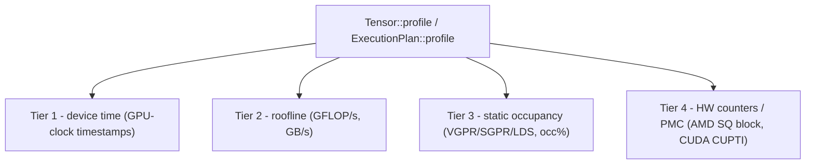

# कर्नेल को Profile और Benchmark करना

[Debugging](./debugging) एक ही hardware timestamp से इस सवाल का जवाब देता है कि "क्या यह कर्नेल correct
है, और मोटे तौर पर कितना तेज़?" यह chapter उसके बाद वाले सवाल के बारे में है: *समय कहाँ जाता है, और
bottleneck क्या है?* Svod एक **layered kernel profiler** ship करता है जो इसका जवाब चार tiers में देता है —
device time, एक roofline, static occupancy, और hardware counters — और वह भी एक ही call के पीछे।

profiler `runtime` crate में रहता है, `tk` में नहीं, और यही placement असल बात है: यह **किसी भी** `Tensor`
या `ExecutionPlan` पर काम करता है, चाहे उसके अंदर के कर्नेल graph optimizer से आए हों या `tk` से हाथ से
authored हों। एक graph matmul, एक fused feed-forward block, और एक हाथ से लिखा Flash Attention — सब एक ही
table में दिखते हैं, एक ही तरीक़े से timed और analysed। इसे इसी section में document करने की वजह बस इतनी है
कि इसकी ओर सबसे ज़्यादा हाथ बढ़ाने वाले पाठक हाथ से कर्नेल लिखने वाले ही होते हैं।

:::note पूरे framework के लिए, सिर्फ़ tk के लिए नहीं
नीचे लिखी हर बात किसी भी realizable `Tensor` पर लागू होती है। [एक ही IR का design](./lowering) ही इसे मुमकिन
बनाता है: एक `tk` कर्नेल बस और UOps ही है, इसलिए यह अपना `name` device profile तक साथ ले जाता है और बिल्कुल
उसी path से measure होता है जिससे एक autotuned कर्नेल।
:::

---

## चार tiers

हर tier report में एक column group जोड़ता है। नीचे वाले tiers सस्ते हैं और हमेशा उपलब्ध; ऊपर वाले tiers को
ज़्यादा चाहिए (एक estimate, एक descriptor decode, एक stable GPU)। महँगे वालों में आप जान-बूझकर opt-in करते हैं।



| Tier | यह क्या report करता है | Source | Execution चाहिए? |
|------|-----------------|--------|------------------|
| **1 — device time** | हर कर्नेल का GPU execution time | GPU-clock dispatch timestamps | हाँ |
| **2 — roofline** | derived **GFLOP/s** और **GB/s** | कर्नेल के IR से FLOP estimate; bytes plan के buffers से | हाँ (rates के लिए time चाहिए) |
| **3 — static occupancy** | VGPR / SGPR / LDS / scratch usage और VGPR-limited **occupancy %** | AMD kernel descriptor से decoded | नहीं — pure static decode |
| **4 — hardware counters (PMC)** | AMD: SQ busy cycles, waves, VALU instructions. CUDA: SM cycles, warps, instructions, tensor-pipe cycles, DRAM bytes | AMD: PM4 packets, grid भर में summed. CUDA: CUPTI range profiler | हाँ, और counters unlocked होने चाहिए |

कुछ बातें जानने लायक़:

- **Tier 2** कर्नेल के IR (AST) पर चलकर FLOPs का estimate लगाता है। scheduler-built कर्नेल के लिए ranges
  bounded होती हैं, इसलिए estimate एक असली count होता है और GFLOP/s column भर जाता है। GB/s का आँकड़ा हर
  distinct LOAD/STORE buffer को एक बार गिनता है, इसलिए जब भी Tier 2 उपलब्ध हो, यह भी उपलब्ध रहता है।
- **Tier 3** RDNA3.5 (wave32) के लिए modeled है, जिसकी register-file geometry जानी-पहचानी है, इसलिए यह एक
  occupancy % report करता है। CDNA3 (wave64) पर resources (VGPR/SGPR/LDS/scratch) फिर भी decode होकर दिखते
  हैं, पर occupancy column `-` दिखाता है क्योंकि वह geometry modeled नहीं है। यहाँ occupancy सिर्फ़
  **VGPR-limited** first-order limiter है — LDS और workgroup limits इसमें fold नहीं किए गए।
- **Tier 4** backend के हिसाब से अलग है। AMD पर यह SQ block को PM4 packets से program करता है और grid
  भर में sum करता है: `sqbusy` (busy cycles), `waves` (launch हुई waves), और `valu` (issue हुए VALU
  instructions) — मिलकर ये वह ILP/occupancy सवाल जवाब देते हैं जिसे अकेला timing नहीं दे सकता। CUDA पर
  यह CUPTI range profiler चलाता है: `cycles`, `warps`, `inst`, `tensor` (tensor pipe के active cycles)
  और `dram` (DRAM से गुज़रे bytes) — `cycles` के सापेक्ष `tensor` tensor-core utilization है, और `dram`
  bandwidth-bound kernel को issue-bound से अलग करता है। Counter tokens सभी backends में unique हैं,
  इसलिए दूसरे backend के counters नाम लेने वाला selection उन्हें गिरा देता है, किसी और block को गलत
  program नहीं करता।

report के columns इस हिसाब से ढलते हैं कि क्या collect हुआ: सिर्फ़ Tier-1 वाला run केवल timing print करता
है, और GFLOP/s, resource, और counter columns तभी दिखते हैं जब उनका tier चला हो।

---

## API: एक `Tensor` या `ExecutionPlan` पर `profile`

दो entry points हैं। दोनों एक `&ProfileOptions` लेते हैं और एक `RunProfile` लौटाते हैं।

```rust
// tensor/src/realize.rs — realizes the tensor as a side effect, like realize()
pub fn profile(&mut self, opts: &ProfileOptions) -> Result<RunProfile>

// runtime/src/execution_plan.rs — profile an already-prepared plan
pub fn profile(&self, opts: &ProfileOptions) -> Result<RunProfile>
```

`Tensor::profile` सुविधाजनक वाला है: यह plan तैयार करता है, profiled path चलाता है, और नतीजे को finalize
करता है ताकि tensor ठीक वैसे ही realized हो जाए जैसे उसे `realize()` छोड़ता है। `ExecutionPlan::profile` तब के लिए
है जब आपके पास पहले से एक तैयार plan हो (यह वही है जिसे benches और `Tensor::profile` दोनों अंदर-ही-अंदर call
करते हैं)।

```rust
use svod_runtime::ProfileOptions;

// Any Tensor — a tk kernel here, but a pure graph computation works identically.
let mut out = svod_tk::flash_attention(&q, &k, &v)?;
let report = out.profile(&ProfileOptions::default())?;

// The library NEVER prints. render_table() returns a String; the caller decides.
print!("{}", report.render_table());
```

या किसी ऐसे plan पर जो आपने ख़ुद तैयार किया हो:

```rust
let plan = out.prepare()?;
let report = plan.profile(&ProfileOptions::from_env())?;
print!("{}", report.render_table());
```

`RunProfile::render_table()` एक `String` लौटाता है — एक per-kernel table (कर्नेल entry point के हिसाब से
aggregate किए गए, total time से sorted) जिसमें वे ही tier columns होते हैं जो भरे गए। profiler एक pure formatter
है: यह ख़ुद कभी stdout या stderr पर नहीं लिखता, इसलिए logging, files, और stderr echoes हमेशा caller की मर्ज़ी
हैं।

---

## `ProfileOptions` और `from_env`

```rust
// runtime/src/profiler.rs
pub struct ProfileOptions {
    pub iters: u32,             // replays; the per-kernel minimum device time is kept
    pub static_analysis: bool,  // Tier 2/3 (flops/bytes/resources) — cheap, on by default
    pub counters: PmcSelection, // Tier 4 hardware counters
    pub origin_depth: Option<usize>, // origin rollup depth; None keeps the full path
}
```

`ProfileOptions::default()` है `{ iters: 1, static_analysis: true, counters: PmcSelection::None, origin_depth: None }` —
Tiers 1–3, single pass। explicit control के लिए इसे सीधे construct करें:

```rust
use svod_runtime::{ProfileOptions, PmcSelection};

let opts = ProfileOptions {
    iters: 50,
    static_analysis: true,
    counters: PmcSelection::Default, // add Tier 4
    origin_depth: Some(3), // roll the origin rows up to three frames
};
```

`PmcSelection` है `None` (सिर्फ़ Tiers 1–3), `Default` (जो भी चल रहा backend इकट्ठा करता है, `PlanContext::pmc_default` से resolve होकर), या
`Custom(Vec<PmcCounter>)` (एक explicit list)।

`ProfileOptions::from_env()` वह इकलौती जगह है जहाँ profiling env vars पढ़े जाते हैं:

| Env var | असर |
|---------|--------|
| `SVOD_PROFILE_ITERS` | min-merge के लिए replay count (कम से कम 1 तक clamp किया गया) |
| `SVOD_PMC` | Tier-4 selection: empty या `0` → off; `1` → backend का default set; वरना एक comma-separated token list (AMD: `sqbusy`, `waves`, `valu`; CUDA: `cycles`, `warps`, `inst`, `tensor`, `dram`) |
| `SVOD_ORIGIN` | `1` हर op का scope दर्ज करता है — module path, call site, ONNX node; नीचे देखें |
| `SVOD_ORIGIN_DEPTH` | origin rollups path के कितने segments रखें (`origin_depth`); unset या `0` = पूरा path |

```bash
# Profile with 20 replays and the default hardware counters.
SVOD_DEVICE=AMD:0 SVOD_PROFILE_ITERS=20 SVOD_PMC=1 ...

# Only VALU instructions and SQ-busy cycles.
SVOD_DEVICE=AMD:0 SVOD_PMC=valu,sqbusy ...

# CUDA पर tensor-core utilization और DRAM traffic।
SVOD_DEVICE=CUDA:0 SVOD_PMC=tensor,dram ...
```

### Accumulate-and-min

जब `iters > 1` हो (या criterion के कई invocations भर में), profiler **average नहीं** करता। हर pass एक
`RunProfile` produce करता है, और passes को `RunProfile::merge_min` से merge किया जाता है: हर कर्नेल के लिए,
तेज़ (minimum device-time) वाला sample जीतता है, और *उसी* sample का static analysis साथ ले
जाता है। एक कर्नेल की intrinsic cost का robust estimator minimum ही है — यह scheduling jitter, contention,
और clock-ramp outliers को reject कर देता है जो किसी mean को फुला देते हैं।

Counters इसका अपवाद हैं: उन्हें इकट्ठा करना उसी pass को विचलित कर देता है जो उन्हें इकट्ठा कर रहा है,
इसलिए वह pass कभी सबसे तेज़ नहीं होता; merge उन्हीं counters को रखता है जिस pass ने उन्हें capture किया,
धीमे sample के साथ उन्हें फेंकता नहीं। इसलिए एक ही table में timing और counters अलग-अलग passes से आ
सकते हैं — और यही ठीक है, क्योंकि counted pass कर्नेल की timing नहीं नापता।

## कर्नेल को model code से जोड़ना {#attributing-kernels-to-model-code}

`r_128_3_32_4_2_2_2_4_4_192_2` जैसा कर्नेल नाम उसकी shape बताता है, यह नहीं कि वह किस layer का
काम करता है। `SVOD_ORIGIN=1` के साथ हर tensor op वह scope दर्ज करता है जिसके अंदर वह बना —
`encoder.layers.3.ffn1` जैसा module path, public op की call site, या ONNX node index — और
scheduler उस union को हर dispatch तक पहुँचाता है। सोलह एक जैसी layers अब भी एक ही program compile
करती हैं; वह program सोलह बार dispatch होता है, हर बार अलग attribution के साथ।

Models अपने state-dict paths के हिसाब से scopes खोलते हैं (`OriginScope::module`), ONNX importer
हर node के लिए एक खोलता है, और stage नाम (`vad`, `encoder`, `ctc_head`) root पर labels हैं।
हाथ से लिखे `tk` कर्नेल भी बाक़ी सबकी तरह ही attribute होते हैं: कर्नेल बनाते समय जो scope सक्रिय
होता है, वही उसका origin बन जाता है।

जब किसी run में origins हों, `render_table()` दो rollups जोड़ता है:

- **exclusive** हर dispatch को एक ही बार, उसके primary origin के खाते में डालता है — यानी उस
  scope के, जिसने stored value बनाई — इसलिए rows मिलकर पूरा कुल बनाती हैं;
- **inclusive** हर dispatch को उसमें fuse हुए हर origin के हर ancestor के खाते में डालता है,
  इसलिए parent row अपने children को समेट लेती है और rows overlap करती हैं।

दोनों rollups `origin_depth` segments पर काट दिए जाते हैं; call frames
(`@ add tensor/src/arithmetic.rs:31`) कर्नेल rows में detail की तरह रहते हैं और कभी rollup key
नहीं बनते। किसी भी scope के बाहर बने कर्नेल `<unattributed>` row में जा गिरते हैं। यह depth
`RunProfile` के साथ ही चलती है, इसलिए `render_table()`, `Display` और `to_json()` उसी depth पर
काटते हैं जिस पर profile बना था (`SVOD_ORIGIN_DEPTH` समेत); `render_table_at(d)` /
`to_json_at(d)` उसे override कर देते हैं।

```
origin rollup (depth 3, exclusive; rows sum to the total):
  total ms  count    mean µs      %  origin path
    23.045      2    11522.6    5.3  ctc_head.GigaAmCtcJit.subsampling
     8.231      3     2743.7    1.9  ctc_head.GigaAmCtcJit.layers.6
```

`RunProfile::to_json()` तीन चीज़ें export करता है: कर्नेल rows — हर row अपने rendered path के साथ
raw `origin_id` / `origin_ids` भी रखती है — दोनों rollups, और arena की सिर्फ़ वही entries जहाँ तक
वे ids पहुँचती हैं, `{ id, parent, frame }` के रूप में। इससे paths offline resolve हो जाते हैं
और पूरी process arena फ़ाइल में embed नहीं होती;
`gigaam_infer --profile-json out.json --origin-depth 3` ऐसी ही एक फ़ाइल लिखता है।

Capture चालू करने से node identity बदल जाती है: अलग-अलग scopes में बने दो एक जैसे subgraphs अब
kernel cut से पहले merge नहीं होते। कर्नेल programs पर इसका असर नहीं पड़ता, लेकिन जो helper हर
call site पर वही expression दोबारा बनाता है, उसे `OriginScope::suspend()` के अंदर चलाएँ, या उसके
inputs पहले से materialise करके दें।

---

## Criterion के साथ integration: `--profile-time`

`tk` benches हर कर्नेल को उसके public `Tensor` interface से होकर measure करते हैं, और इनकी timing उन्हीं per-kernel
GPU stamps से होती है जिन्हें profiler इस्तेमाल करता है (`tk/benches/common.rs`)। सादा `cargo bench` हर benchmark का
सिर्फ़ GPU device time report करता है। पर criterion में एक `--profile-time <seconds>` mode है, और benches
criterion के custom `Profiler` trait के ज़रिए इसमें **पूरा layered profiler** hook कर देते हैं — वही
extension point जिसे flamegraph generation इस्तेमाल करता है।

वह hook `tk/benches/common.rs` का `PlanProfiler` है। जब किसी benchmark को profile किया जा रहा होता है,
`bench_plan` हर invocation पर process-global `bench_profiler()` के ज़रिए benchmark का plan capture करता है,
हर capture को `ProfileOptions::from_env()` से profile किया जाता है और per-kernel min से session accumulator
में merge किया जाता है। stop पर, merged table को `render_table()` से render किया जाता है, criterion की output
directory के नीचे एक file में लिखा जाता है, और stderr पर echo किया जाता है:

```
target/criterion/<id>/profile/svod-profile.txt
```

wiring हर bench के `criterion_group!` में बस एक line है — यह shared profiler को criterion config के रूप में
install करती है (`tk/benches/kmeans.rs` से):

```rust
criterion_group! {
    name = benches;
    config = Criterion::default().with_profiler(common::bench_profiler());
    targets = bench_kmeans
}
criterion_main!(benches);
```

इसे किसी भी criterion bench की तरह चलाएँ, बस `--profile-time` जोड़कर (और कोई भी tier env vars):

```bash
# Plain bench: GPU device time per benchmark, profiler dormant.
SVOD_DEVICE=AMD:0 cargo bench -p svod-tk --bench kmeans

# Drive the layered profiler for ~5s per benchmark, with hardware counters.
SVOD_DEVICE=AMD:0 SVOD_PMC=1 cargo bench -p svod-tk --bench kmeans -- --profile-time 5
```

चूँकि `bench_profiler()` तब तक dormant रहता है जब तक criterion profile न कर रहा हो, सादा `cargo bench` पूरी
तरह unaffected रहता है — वही numbers, कोई extra passes नहीं।

---

## साफ़-साफ़ कुछ सीमाएँ

:::caution दो चीज़ें जो profiler आपको नहीं दे सकता
**Tier 2 GFLOP/s हाथ से authored कर्नेल के लिए blank रहता है।** FLOP estimate कर्नेल के IR पर चलता है, और
यह सिर्फ़ **scheduler-built** कर्नेल को ही auto-rate करता है। कोई operation किन loops के भीतर बैठा है, यह
वह उसके operands की निर्भरता से निकालता है — और यह तब तक सही है जब तक index expressions scheduler
लिखता है। हाथ से lower किया गया `tk` कर्नेल अपनी addressing ख़ुद करता है, और तब उसके loop variables
arithmetic तक सिर्फ़ addresses के रास्ते पहुँचते हैं, इसलिए यह walk nesting को दोबारा नहीं निकाल पाता — किसी भी
दिशा में नहीं। profiler garbage roofline print करने के बजाय estimate देने से इनकार कर देता है (एक शुरुआती
version एक matmul को hardware peak से आठ गुना बताता था), इसलिए उन कर्नेल के लिए **GFLOP/s column `-`
दिखाता है**। (GB/s फिर भी काम करता है, क्योंकि bytes plan के buffers से आते हैं,
IR से नहीं।) हाथ से लिखे कर्नेल के लिए roofline को algorithm की जानी-पहचानी FLOP count और Tier-1 device time
से ख़ुद हाथ से compute करें।

**Tier 4 को एक stable power state चाहिए।** PM4 hardware counters तभी अर्थपूर्ण होते हैं जब GPU एक fixed clock
पकड़े रखे। default `auto` power state पर profiler *fail नहीं होता* — यह degrade होता है: यह सिर्फ़ timing
report करता है और एक one-line note print करता है कि counters के लिए `profile_standard` state चाहिए। पहले GPU
को उस state में डालें (जैसे `amd-smi set -l stable_std`), फिर `SVOD_PMC` के साथ दोबारा चलाएँ। CUDA पर
शर्त अलग है: जब तक `NVreg_RestrictProfilingToAdminUsers=0` सेट न हो, driver counter collection सिर्फ़
admin users को देता है, और CUPTI load होने लायक़ होनी चाहिए (`SVOD_CUDA_CUPTI=0` उसे जानबूझकर बंद कर
देता है)। NVIDIA की बारीक़ियाँ
[CUDA पर Profiling](../backends/cuda/profiling.md) में हैं, यह भी कि वहाँ counters इकट्ठा करने में एक
अतिरिक्त pass क्यों लगता है।
:::

---

## किस सवाल के लिए कौन-सी call

| आप क्या पूछ रहे हैं… | इस्तेमाल करें |
|----------------|-----|
| "इस GPU पर हर कर्नेल कितना समय लेता है?" | `Tensor::profile` के साथ `ProfileOptions::default()`, device-time column पढ़ें |
| "क्या यह कर्नेल compute- या bandwidth-bound है?" | Tier-2 GFLOP/s और GB/s columns (graph कर्नेल), या roofline हाथ से compute करें (tk कर्नेल) |
| "occupancy कम क्यों है — registers या LDS?" | Tier-3 VGPR/SGPR/LDS/occ% columns (कोई run ज़रूरी नहीं) |
| "क्या कर्नेल हर busy cycle में काफ़ी VALU work issue कर रहा है?" | Tier-4 `SVOD_PMC=1`, एक `profile_standard` GPU पर |
| "कर्नेल tensor cores सचमुच इस्तेमाल कर रहा है, या DRAM पर अटका है?" | CUDA पर Tier-4 `SVOD_PMC=tensor,dram` |
| "कई runs भर में यह graph-native baseline से कैसे तुलना करता है?" | `cargo bench --profile-time` — देखें [Debugging → असली hardware पर timing](./debugging) |

performance के बजाय correctness और structural checks के लिए, [Debugging](./debugging) में ही रहें; कर्नेल से
*नीचे* की समस्याओं के लिए (queues, faults, driver), देखें
[AMD Backend → Debugging](../backends/amd/debugging)।
