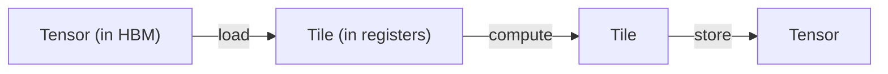
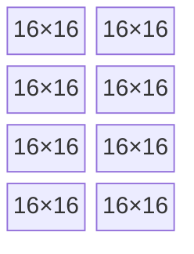

# Tiling क्या है

[FLOPS कहाँ छिपते हैं](./where-flops-hide) एक समस्या पर ख़त्म हुआ था: हर दो matrix instructions के बीच
hardware addresses, memory, और layout पर cycles फूँक देता है। Tiling वही abstraction है जो उन cycles को
ग़ायब कर देता है। `tk` में यही इकलौता सबसे अहम विचार है।

---

## Tensors memory में रहते हैं; tiles registers में

एक **tensor** वह बड़ा array है जिसके बारे में आप model level पर सोचते हैं — मसलन `[4096, 4096]` वाली weight
matrix। यह global memory (HBM) में रहता है, दूर पड़ा है और वहाँ तक पहुँचना slow है, और यह पूरे program तक
बना रहता है।

एक **tile** उसी tensor का एक छोटा, fixed-size टुकड़ा है — मान लीजिए `16×16` — जिसे आप compute करने के लिए
*registers में* खींच लाते हैं। यह नन्हा होता है, math unit के बिल्कुल बग़ल में रहता है, और overwrite होने
से पहले बस चंद instructions तक ही टिकता है।

| | Tensor | Tile |
|--|--------|------|
| **कहाँ रहता है** | global memory (HBM) | registers (या shared memory) |
| **Size** | विशाल, अक्सर dynamic | छोटा, compile time पर fixed |
| **Lifetime** | पूरा program | चंद instructions |
| **आप क्या कर सकते हैं** | इसे load / store | इसे multiply, reduce, transform |

तो एक कर्नेल दरअसल बस एक loop है जो एक बड़े tensor पर एक बार में एक tile चलता है:

यही वह mental model है जो NVIDIA का CuTile और HazyResearch का ThunderKittens इस्तेमाल करते हैं, और इसे ही
`tk` अपनाता है। एक tile अंदर खींचो, registers में उस पर matrix math करो, और नतीजा वापस लिख दो।

---

## एक tile दरअसल matrix-core fragments का एक grid है

`16×16` ही क्यों, `100×100` जैसा कोई गोल-सा number क्यों नहीं? क्योंकि matrix core एक fixed *fragment* size
पर काम करता है, जो hardware में ही baked होता है — आम तौर पर `16×16` या `32×32`। एक tile को इतना बड़ा रखा
जाता है कि वह उन fragments की पूरी संख्या बन सके:

*एक `64×32` register tile दरअसल `16×16` matrix-core fragments का एक 4×2 grid है — जिस पल इसका data registers में land होता है, यह पहले से MMA layout में होता है।*

चूँकि tile fragments से बना है, इसलिए जिस पल इसका data registers में आता है, यह *पहले से ही* उस layout में
होता है जो matrix instruction चाहता है। multiply से पहले कोई shuffle नहीं — यानी पिछले chapter वाला gap 1
ग़ायब।

---

## तीन तरह के tile, तीन memory spaces

`tk` tiles को इस आधार पर अलग करता है कि उनका data कहाँ रहता है, क्योंकि वही तय करता है कि आप उन्हें कैसे
move और access करेंगे:

| Tile kind | Memory space | किस काम के लिए |
|-----------|--------------|---------|
| **Register tile** | registers (per-lane) | वे operands और accumulators जिन्हें matrix core पढ़ता और लिखता है |
| **Shared tile** | shared memory / LDS | एक staging area, जिसे पूरी wave (या workgroup) मिलकर conflict-free भरती है |
| **Global layout** | global memory (HBM) | raw tensor pointer पर एक typed *view*, ताकि loads सही address compute करें |

एक आम कर्नेल तीनों का इस्तेमाल करता है: एक **global layout** बड़े tensor का वर्णन करता है, wave इसके blocks
को मिलकर एक **shared tile** में stream करती है (conflict-free, एक swizzle के ज़रिए), और हर lane अपना हिस्सा
एक **register tile** में खींचकर matrix core को feed करती है।

---

## Tiling ही सही abstraction क्यों है

Tiling बस "loop को blocking करना" नहीं है। यह वह abstraction है जो आपको memory-side के तीनों gaps का जवाब
एक साथ देने देता है:

- **Layout (gap 1):** tiles fragment-sized होते हैं, इसलिए register data सीधे MMA layout में ही जन्म लेता है।
- **Memory movement (gap 2):** tile ही वह इकाई है जिसे आप stream करते हैं — मौजूदा पर compute करते हुए
  अगला tile load करते जाओ।
- **Bank conflicts (gap 3):** shared tile अपना swizzle साथ रखता है, इसलिए cooperative fill और read
  बनावट से ही conflict-free होते हैं।

और यह ऊपर की ओर compose भी होता है: elementwise math, reductions, masks — ये सब बस tiles *पर* operations
हैं, उन्हीं layout guarantees के साथ। आप `tile_a * tile_b` लिखते हैं, कोई lane index calculation नहीं।

:::tip[GPU विशेषज्ञों के लिए]
`tk` एक tile के *shape* को उस *buffer* से अलग रखता है जिससे यह bound होता है।

विशुद्ध shape descriptors `tk/src/tiles.rs` में रहते हैं। base fragment है
`BaseShape { rows, cols, ept }`, जहाँ `ept` (elements-per-thread) को `rows*cols / wave_size` के रूप में
compute करने के बजाय **explicitly** साथ रखा जाता है, क्योंकि RDNA पर matrix instruction operands को lanes
भर में *replicate* करता है — इसलिए एक operand tile की element count को wave size से भाग देना ग़लत जवाब देता
है। Register tiles एक `LaneMap` (`RTBaseShape`) जोड़ते हैं — fragment का closed-form `(lane, j) → (row, col)`
map — ताकि वे layouts encode हो सकें जिन्हें कोई plain stride express नहीं कर सकता: RDNA accumulator का
even/odd row interleave, और CUDA का `mma.sync` 16×16 tile जो दो `m16n8` halves के रूप में रखा जाता है।

buffer-bound wrappers `tk/src/tile.rs` में रहते हैं: `GL` (global layout), `ST` (shared / LDS,
optionally double-buffered), `RT` (register tile), और `RV` (register vector, उन row/column reductions के
लिए जो softmax को चाहिए होती हैं)। हर एक एक flat `Arc<UOp>` buffer, साथ में एक logical shape और एक dtype है।

सबसे अहम बात, कर्नेल कभी `RT_16X16` जैसे किसी fragment constant को सीधे नाम नहीं देते। वे एक **role** माँगते
हैं — `FragRole::{Accumulator, Operand, AccumulatorT}` — और `tk/src/arch.rs` में `ArchCaps::frag(role)` इसे
target (CDNA, RDNA, या CUDA का `mma.sync`) के लिए सही physical shape में resolve करता है। यही indirection एक कर्नेल को wave
sizes और fragment layouts भर में portable बनाती है; देखें [Wave32 बनाम Wave64](./wave-portability)। matrix multiply ख़ुद उस
`WMMA` op में lower होता है जो [Op Bestiary](../architecture/op-bestiary) में documented है।
:::

---

## यह आगे कहाँ जाता है

अब आपके पास शब्दावली है: memory में tensors, registers में tiles, matrix core में fragments।
[IR में authoring](./lowering) दिखाता है कि जब आप असल में इन टुकड़ों से एक कर्नेल *लिखते* हैं तो क्या होता है —
कैसे `Kernel`/`Group` builder tile operations को उसी UOp IR में बदल देता है जिसे बाक़ी Svod compile करता है।
