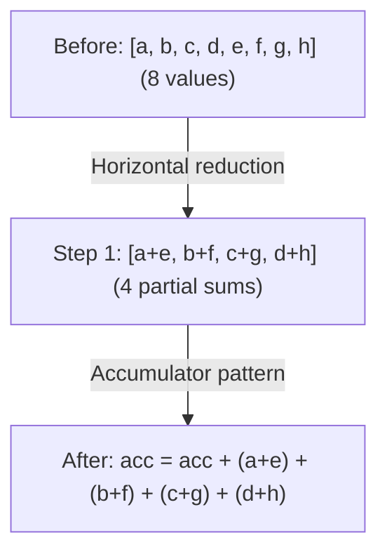

# Фаза 3: Devectorizer

**Цель**: Опустить аппаратно-независимые векторы до аппаратно-специфичных инструкций.

---

## Стадия 11: Удаление Reduce

> **Стадия кратко**
>
> **Цель**: Преобразовать декларативный REDUCE в императивную аккумуляцию
> **Ключевые паттерны**: Reduce в аккумулятор, горизонтальная редукция
> **Эффект**: Маппинг на аппаратные инструкции редукции

**Что делает**: Преобразует высокоуровневый REDUCE в паттерн с аккумулятором.

**Зачем это нужно**: Декларативное «просуммируй эти значения» должно стать императивными инструкциями: инициализировать аккумулятор, цикл, прибавить каждое значение.

**Паттерн**: `pm_reduce + gep_pushing`

```text
// Before: declarative reduction
REDUCE(Add, values, range)

// After: imperative accumulation
acc = DEFINE_REG(0.0)
for i in range:
    acc = ADD(acc, values[i])
```

**Горизонтальная редукция**:

Перед тем как итерировать по измерению редукции, мы сначала объединяем соседние значения. Это создаёт более крупные редукции, которые лучше ложатся на аппаратные инструкции.



**GEP pushing** проталкивает GEP (get element pointer) через ALU для лучшей векторизации:

```text
GEP(ADD(ptr_a, ptr_b), idx) → ADD(GEP(ptr_a, idx), GEP(ptr_b, idx))
```
*Зачем?* Позволяет применить SIMD к двум GEP (можно вычислить параллельно).

**Фьюзинг тензорных ядер WMMA**:
```text
// Fuse tensor core accumulation inline
WMMA(a, b, c) + add → WMMA(a, b, c + add)
```
Этот паттерн обеспечивает эффективную FMA-аккумуляцию на тензорных ядрах NVIDIA.

**Svod**: `devectorize.rs`

---

## Стадия 12: Добавление GPU-измерений

> **Стадия кратко**
>
> **Цель**: Замапить абстрактные RANGE на индексы GPU-потоков
> **Ключевые паттерны**: Замена RANGE на SPECIAL
> **Эффект**: Параллельное выполнение на GPU

**Что делает**: Заменяет RANGE на индексы GPU-потоков.

**Зачем это нужно**: У GPU жёсткие лимиты: максимум 1024 потока на блок, максимум 48KB shared-памяти. Если вычисление требует 2000 потоков, компилятор должен разбить его на несколько блоков. Ограничение размерностей делает это автоматически.

**Паттерн**: `pm_add_gpudims`

```text
// Before: abstract range
RANGE(end=256, Global)

// After: GPU-specific
SPECIAL(gidx0)  // global thread index
```

**Маппинг**:

| Тип RANGE | GPU-эквивалент |
|-----------|----------------|
| Global, THREAD | `gidx` (глобальный индекс) |
| Local, WARP, GROUP_REDUCE | `lidx` (локальный/воркгрупповой индекс) |
| Reduce | Цикл (без маппинга) |

**Ограничение размерностей**:

У GPU есть аппаратные лимиты (например, максимум 1024 потока на блок). Когда RANGE превышают эти лимиты, компилятор:

1. **Группирует** соседние измерения: `[256, 256, 256]` с максимумом `[256, 256]` → `[65536, 256]`
2. **Разделяет** большие измерения: `[2048]` с максимумом `[1024]` → `[2, 1024]`
3. **Реконструирует** индексы через divmod

**Маскировка STORE**:

Глобальные STORE, которые не используют все локальные измерения, маскируются:
```text
// If STORE doesn't use lidx1, mask it:
STORE(INDEX(...), value) → STORE(INDEX(..., gate=(lidx1 == 0)), value)
```
Это гарантирует, что STORE выполняется только при нулевых неиспользуемых локальных индексах.

**Svod**: `gpudims.rs`

---

## Стадия 13: Добавление LOAD

> **Стадия кратко**
>
> **Цель**: Обернуть INDEX-операции в явный LOAD
> **Ключевые паттерны**: Добавление LOAD, удаление избыточных загрузок
> **Эффект**: Делает операции с памятью явными для кодогенерации

**Что делает**: Оборачивает INDEX-операции в явный LOAD.

**Зачем это нужно**: INDEX-операции вычисляют адреса. LOAD реально читает из памяти. Явное разделение помогает кодогенератору понять, какие обращения к памяти нужны.

**Паттерн**: `pm_add_loads`

```text
// Before: bare index
INDEX(ptr, i)

// After: explicit load
LOAD(INDEX(ptr, i))
```

Также удаляет избыточные загрузки из STORE (write-only доступ).

Примечание: Не все INDEX-операции оборачиваются в LOAD. Указательные типы (уже адреса) и текстуры изображений (специальное железо) используют другие методы доступа.

**Svod**: `devectorize.rs`

---

## Стадия 14: Devectorize

> **Стадия кратко**
>
> **Цель**: Преобразовать абстрактные векторы под аппаратные возможности
> **Ключевые фазы**: 4 скоординированных прохода
> **Эффект**: Векторы соответствуют реальной аппаратной ширине

**Что делает**: Обрабатывает переход от абстрактных векторов к аппаратным операциям.

**Зачем это нужно**: Devectorize прогоняет 4 концептуальные фазы через 3 вызова `graph_rewrite` (фазы 3 и 4 в одном вызове) — построение групп PTRCAT, проталкивание GEP через LOAD/STORE, распределение в CAT(LOADs) и разделение под аппаратную ширину. Пофазный контракт описан в docstring модуля `schedule/src/lib.rs`.

**Конструирование PTRCAT**:

PTRCAT группирует последовательные обращения к указателям:
1. Генерация индивидуальных индексов для каждого элемента вектора
2. Извлечение маппинга (valid, root_src) → [offsets]
3. Группировка последовательных смещений по валидности и источнику
4. Создание PTRCAT из сгруппированных указателей
5. Возврат с GEP-пермутацией для правильного порядка элементов

Это уменьшает количество транзакций по шине памяти.

**Fold-длины для разных устройств**:

| Устройство | Fold-длины | Примечания |
|------------|------------|------------|
| GPU (стандартный) | 4, 2, 1 | Стандартная GPU-векторизация |
| Image | 4, 1 | Фиксировано для текстур изображений |
| No-fold | 1 | Скалярный фоллбэк (принудительный) |

**Переменная окружения** (только Tinygrad): `DEVECTORIZE`
- `0`: Пропустить только `devectorize` (оставить `correct_load_store`)
- `1`: Полная девекторизация (по умолчанию)
- `>=2`: Пропустить и `devectorize`, и `correct_load_store`

Примечание: Svod всегда запускает devectorizer и не предоставляет эту переменную окружения.

**Паттерн**: `devectorize + load_store_folding + correct_load_store + load_store_indexing`

**Разделение векторизованных ALU**:
```text
// If hardware doesn't support vec4 add
ADD(vec4_a, vec4_b) → [ADD(a[0], b[0]), ADD(a[1], b[1]), ...]
```

**Разделение чанков загрузки/записи**: Подгонка под аппаратную ширину памяти.

**Фиксация Image**: Специальная обработка для image-тензорных буферов.

**Svod**: `devectorize.rs`

---

## Стадия 15: Понижение типа Index

> **Стадия кратко**
>
> **Цель**: Преобразовать абстрактный тип Index в конкретные целые числа
> **Ключевые паттерны**: Понижение для каждого типа операции на основе анализа границ значений
> **Эффект**: Индексы используют нативные целочисленные типы железа (i32 или i64)

**Что делает**: Преобразует абстрактный тип `Index` в конкретные целые числа.

**Зачем это нужно**: Тип Index абстрактный — на железе его нет. Нужно преобразовать в i32 или i64, которые железо реально поддерживает.

**Паттерн**: `pm_lower_index_dtype`

```text
// Before: abstract index type
idx: Index

// After: concrete type
idx: i32  // or i64, based on bounds
```

**Понижение для каждого типа операции**:

Понижение типа Index использует каскадный подход из 3 фаз:

1. **Создание конкретных обёрток** для листовых узлов (CONST, DEFINE_VAR) — оборачивает их конкретным DType
2. **Обработка обёрнутых значений вверх** (Binary, WHERE, RANGE и т.д.) — пропагирует конкретные типы по дереву
3. **Снятие обёрток** на терминальных узлах (INDEX, SINK, END) — удаляет обёртки для получения итоговых конкретных типов

Для каждого типа операции — свои паттерны:

| Операция | До | После |
|----------|-----|-------|
| Binary ops | `ADD(Index, Index)` | `ADD(i32, i32)` с кастами |
| CONST | `CONST(5): Index` | `CONST(5): i32` |
| WHERE | `WHERE(c, Index, Index)` | `WHERE(c, i32, i32)` |
| RANGE | `RANGE(end: Index)` | `RANGE(end: i32)` с кастом |
| SPECIAL | `SPECIAL(gidx)` | Всегда i32 (GPU-индексы 32-битные) |
| DEFINE_VAR | `DEFINE_VAR: Index` | i32 если границы помещаются, иначе i64 |
| VECTORIZE | `VECTORIZE(Index...)` | Каст каждого в конкретный скаляр |
| CAST cleanup | `CAST(i32, Index)` | Просто `i32` (убрать избыточный каст) |
| BIND | `BIND(var, val)` | `BIND(var.cast(dt), val.cast(dt)).cast(Index)` |

Функция `select_concrete_dtype()` определяет i32 vs i64 через анализ границ vmin/vmax:
```text
dtype = i32 if bounds fit in [-2^31, 2^31-1] else i64
```

**Svod**: `symbolic/index_lowering.rs`

---

## Дополнительные проходы Devectorizer

Svod выполняет несколько дополнительных проходов между стадиями 14 и 15, не имеющих прямых аналогов в Tinygrad:

| Проход | Назначение |
|--------|------------|
| `pm_bool_devectorize` | Обработка паттернов булевых векторов (expand/shrink) |
| `pm_reduce_devectorize` | Обработка векторных редукций (K-vec, bool, горизонтальные) |
| `bool_storage_patterns` | Конвертация между bool и uint8 для операций с памятью |
| `linearize_multi_index` | Свёртка многомерных индексов в линейные смещения |
| `merge_sibling_ends` | Слияние соседних END-операций, разделяющих одни и те же RANGE |
