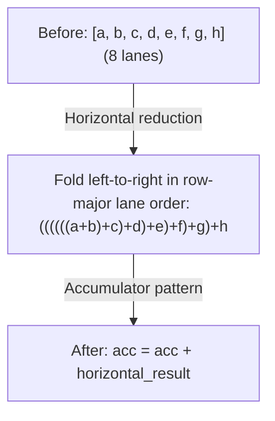

# Фаза 3: Devectorizer

**Цель**: Опустить аппаратно-независимые векторы до аппаратно-специфичных инструкций.

---

## Стадия 11: Удаление Reduce

> **Стадия кратко**
>
> **Цель**: Преобразовать декларативный REDUCE в императивную аккумуляцию
> **Ключевые паттерны**: Reduce в аккумулятор, горизонтальная редукция
> **Эффект**: Маппинг на аппаратные инструкции редукции

**Что делает**: Преобразует высокоуровневый REDUCE в паттерн с аккумулятором.

**Зачем это нужно**: Декларативное «просуммируй эти значения» должно стать императивными инструкциями: инициализировать аккумулятор, цикл, прибавить каждое значение.

**Паттерн**: `movement_cleanup_patterns + pm_reduce_local`

`pm_reduce_local` объединяет фьюзинг WMMA-add, `pm_group_for_reduce`, правила
аккумулятора и горизонтальной редукции, а также чистку group-SINK.

```text
// Before: declarative reduction
REDUCE(Add, values, range)

// After: imperative accumulation
acc = placeholder(AddrSpace::Reg)   // initialized to the reduce identity
for i in range:
    acc = STORE(acc, ADD(LOAD(acc), values[i]))
```

Цикл аккумулятора — это цепочка AFTER / STORE / END, закрываемая узлом `END` по
RANGE редукции; отдельной конструкции цикла на этом уровне нет.

**Горизонтальная редукция**:

Перед тем как итерировать по измерению редукции, мы сначала объединяем линии (lanes) значения с формой. Это создаёт более крупные редукции, которые лучше ложатся на аппаратные инструкции.



**Фьюзинг тензорных ядер WMMA**:
```text
// Fuse tensor core accumulation inline
WMMA(a, b, c) + add → WMMA(a, b, c + add)
```
Этот паттерн обеспечивает эффективную FMA-аккумуляцию на тензорных ядрах. Ещё два плеча выполняют фьюзинг через обёртку `PERMUTE` и через обёртку `PERMUTE(RESHAPE(...))`.

**Svod**: `devectorize.rs`

---

## Стадия 12: Добавление GPU-измерений

> **Стадия кратко**
>
> **Цель**: Замапить абстрактные RANGE на индексы GPU-потоков
> **Ключевые паттерны**: Замена RANGE на SPECIAL
> **Эффект**: Параллельное выполнение на GPU

**Что делает**: Заменяет RANGE на индексы GPU-потоков.

**Зачем это нужно**: У GPU жёсткие лимиты: максимум 1024 потока на блок, максимум 48KB shared-памяти. Если вычисление требует 2000 потоков, компилятор должен разбить его на несколько блоков. Ограничение размерностей делает это автоматически.

**Паттерн**: `pm_lower_device_ranges`, затем `pm_add_gpudims` (только когда у рендерера есть локальные или потоковые измерения)

```text
// Before: abstract range
RANGE(end=256, Global)

// After: GPU-specific
SPECIAL(gidx0)  // global thread index
```

**Маппинг**:

| Тип RANGE | GPU-эквивалент |
|------------|----------------|
| Global, Thread | `gidx` (глобальный индекс) |
| Local, Warp, GroupReduce | `lidx` (локальный/воркгрупповой индекс) |
| Device | PARAM-переменная `"_device_num"` (привязывается при запуске) |
| Reduce | Цикл (без маппинга) |

RANGE типа Warp сортируются в начало локальных измерений, поэтому им достаются младшие биты индекса потока.

**Ограничение размерностей**:

У GPU есть аппаратные лимиты (например, максимум 1024 потока на блок). Когда RANGE превышают эти лимиты, компилятор:

1. **Группирует** соседние измерения, когда их произведение ещё помещается: `[16, 16, 256]` с максимумом `[256, 256]` → `[256, 256]`
2. **Разделяет** большие измерения: `[2048]` с максимумом `[1024, 1024, 1024]` → `[1024, 2]`
3. **Реконструирует** индексы через divmod

**Маскировка STORE**:

Глобальные STORE, которые не используют все локальные измерения, маскируются:
```text
// If STORE doesn't use lidx1, restrict its index validity:
STORE(INDEX(buf, idx), value) → STORE(INDEX(buf, WHERE(lidx1 == 0, idx, Invalid)), value)
```
Это гарантирует, что STORE выполняется только при нулевых неиспользуемых локальных индексах. Маска остаётся в выражении индекса, чтобы подстановка RANGE перенесла её на соответствующий аппаратный индекс.

**Svod**: `gpudims.rs`

---

## Стадия 13: Добавление LOAD

> **Стадия кратко**
>
> **Цель**: Обернуть INDEX-операции в явный LOAD
> **Ключевые паттерны**: Добавление LOAD к операндам-значениям
> **Эффект**: Делает операции с памятью явными для кодогенерации

**Что делает**: Оборачивает INDEX-операции в явный LOAD.

**Зачем это нужно**: INDEX-операции вычисляют адреса. LOAD реально читает из памяти. Явное разделение помогает кодогенератору понять, какие обращения к памяти нужны.

**Паттерн**: `symbolic_simple + pm_expand_broadcast + pm_add_loads`

```text
// Before: bare index
INDEX(ptr, i)

// After: explicit load
LOAD(INDEX(ptr, i))
```

Также загружает операнд-значение у STORE, когда это значение само является адресом.

Примечание: оборачиваются только операнды, потребляемые *как значения*, — INDEX, используемый исключительно как адрес (цель STORE, адрес WMMA-фрагмента), остаётся необёрнутым.

**Svod**: `devectorize.rs`

---

## Стадия 14: Devectorize

> **Стадия кратко**
>
> **Цель**: Превратить операции с формой в скалярные
> **Ключевые фазы**: Одна объединённая перезапись
> **Эффект**: Каждая операция становится тем, что бэкенд может выдать

**Что делает**: Обрабатывает переход от значений с формой к скалярным аппаратным операциям.

**Зачем это нужно**: Devectorize понижает структуру линий `STACK` и `INDEX` до
скалярных операций по линиям, сохраняя при этом непрерывные обращения к памяти.

**Скаляризация безусловна**: `devectorize_alu` вычисляет количество линий как
произведение статической формы и выдаёт по одной операции на координату, после чего
собирает результат обратно через `STACK` (или `GROUP` — для store). Никакой таблицы
fold-длин по устройствам нет — ре-векторизация оставлена бэкенду, где
SLP-векторизатор LLVM может снова расширить скаляры, когда это выгодно.

Примечание: Svod всегда запускает devectorizer; переменной окружения для его пропуска нет.

**Паттерн**: `symbolic_simple + devectorize_patterns + bool_storage_patterns + indexing_simplify`

**Разделение ALU с формой**:
```text
// A shaped add becomes one op per lane
ADD(shaped_a, shaped_b) → STACK(ADD(a[0], b[0]), ADD(a[1], b[1]), ...)
```

**Хранение bool**: bool LOAD/STORE идут через `uint8`, потому что `i1` в LLVM может нести мусор в старших битах.

**Упрощение индексов**: `indexing_simplify` сворачивает адресную арифметику, которую вскрывает скаляризация.

**Svod**: `devectorize.rs`

---

## Стадия 15: Понижение типа Index

> **Стадия кратко**
>
> **Цель**: Преобразовать слабый тип индекса в конкретные целые числа
> **Ключевые паттерны**: Понижение для каждого типа операции на основе границ значений
> **Эффект**: Индексы используют нативные целочисленные типы железа (i32 или i64)

**Что делает**: Преобразует абстрактный слабый dtype (`WeakInt`) в конкретные целые числа.

**Зачем это нужно**: Слабый тип индекса абстрактный — на железе его нет. Нужно преобразовать в i32 или i64, которые железо реально поддерживает. (Tinygrad называет этот dtype `Index`; в Svod это `ScalarDType::WeakInt`.)

**Паттерн**: `lower_index_patterns` = `symbolic_simple + pm_fold_cast_const + pm_lower_index_dtype + indexing_simplify`

```text
// Before: weak index type
idx: WeakInt

// After: concrete type
idx: i32  // or i64, based on bounds
```

**Понижение для каждого типа операции**:

Понижение типа индекса использует каскадный подход из 3 фаз:

1. **Создание конкретных обёрток** для листовых узлов (CONST, VCONST, PARAM) — каждый становится `concrete.cast(weak)`
2. **Обработка обёрнутых значений вверх** (Unary, Binary, WHERE, RANGE, STACK, SPECIAL) — пропагирует конкретные типы по дереву
3. **Поглощение кастов** у любого не-слабого потребителя, который берёт конкретный dtype на своём ребре

Для каждого типа операции — свои паттерны:

| Операция | До | После |
|-----------|--------|-------|
| Binary ops | `ADD(WeakInt, WeakInt)` | `ADD(i32, i32)` с кастами |
| CONST | `CONST(5): WeakInt` | `CONST(5): i32`, обёрнутый в `.cast(WeakInt)` |
| WHERE | `WHERE(c, WeakInt, WeakInt)` | `WHERE(c, i32, i32)` (условие пропускается) |
| RANGE | `RANGE(end: WeakInt)` | `RANGE(end: i32)` с кастом |
| SPECIAL | `SPECIAL(gidx)` | Конкретное целое из границ операции (на практике целый тип по умолчанию) |
| PARAM (переменная) | `PARAM: WeakInt` | i32 если границы помещаются, иначе i64 |
| STACK | `STACK(WeakInt...)` | Скалярный dtype на STACK, каждая линия кастуется отдельно |
| Двойной слабый CAST | `CAST(weak, CAST(weak, x))` | Внутренний каст фиксируется в конкретный dtype, внешний слабый каст сохраняется |

Функция `select_dtype()` определяет i32 vs i64 через анализ границ vmin/vmax:
```text
dtype = default_int if bounds fit in [-2^31, 2^31-1] else i64
```
Она также разрешает `WeakFloat` в float по умолчанию и имеет отдельные плечи для беззнаковых и булевых границ.

**Svod**: `symbolic/index_lowering.rs`

---

## Дополнительные проходы вокруг Devectorizer

Svod выполняет несколько проходов между стадией 14 и понижением индексов, которым нумерация из 22 стадий не даёт имён:

| Проход | Назначение |
|------|---------|
| `sym()` (ранняя символика) | Полное символическое упрощение, когда граф уже скалярный |
| `memory_coalescing` | Слияние соседних обращений в более широкие |
| `pm_simplify_add_image` (bottom-up) | Упрощение адресов для image-dtype, вместе с `no_vectorized_alu` |
| `extra_symbolic_patterns` | `sym() + indexing_simplify`, сохраняет индексы слабыми, пока правила валидности индексов ещё могут срабатывать |
