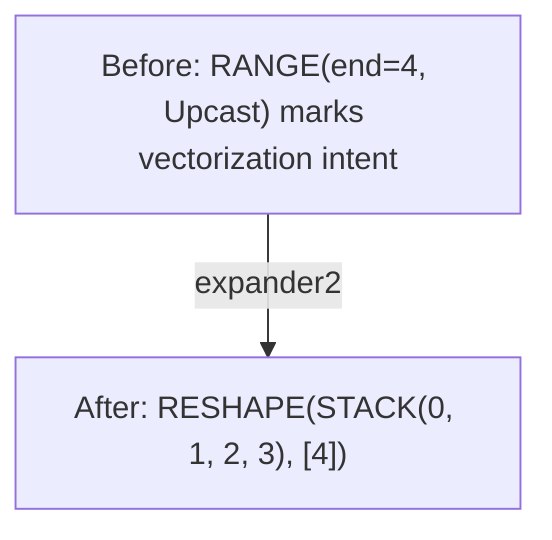
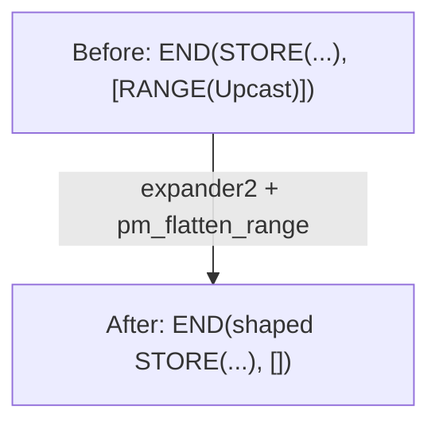
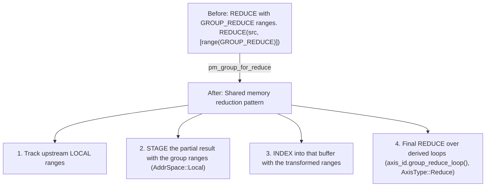

# Фаза 2: Expander

**Цель**: Трансформировать оптимизационные примитивы (RANGE типов UPCAST/UNROLL) в явные операции с формой.

---

## Стадия 8: Пост-оптимизационная символика

> **Стадия кратко**
>
> **Цель**: Символическое упрощение после оптимизации
> **Ключевые паттерны**: Перемещение WHERE, свёртка констант
> **Эффект**: Улучшает комбинирование загрузок и векторизацию

**Что делает**: Символическое упрощение после оптимизации, плюс перемещение WHERE.

**Зачем это нужно**: WHERE-операции — это аналог `if`-выражений. Эта стадия переносит `if`-проверки, окружающие индексированное чтение, внутрь самого выражения индекса. Железо может пропустить загрузку, когда условие ложно — экономия пропускной способности памяти.

**Паттерн**: `sym + pm_move_where_on_load + pm_flatten_range + pm_reduce_unparented` (матчер `POST_OPT_SYM`)

```text
// Before: WHERE guards an indexed read
WHERE(cond, INDEX(buf, idx), 0)

// After: validity moved into INDEX
INDEX(buf, WHERE(cond, idx, Invalid))
```

Перенос валидности в INDEX улучшает комбинирование загрузок и векторизацию.

**Примечание**: Этот паттерн срабатывает только когда альтернативное значение равно `0`; второе плечо обрабатывает инвертированную форму `WHERE(cond, 0, INDEX(...))` с отрицанием условия. Трансформация включает сложный анализ клауз: обнаружение дубликатов, проверки зависимостей от RANGE, верификацию data-dependent загрузок.

**Примечание**: Svod держит валидность внутри выражения индекса, как `WHERE(cond, idx, Invalid)`. Полем `gate` у LOAD/STORE она становится значительно позже, в `pm_move_gates_from_index` (`late/gater.rs`); у самого INDEX поля gate нет.

**Svod**: `pm_move_where_on_load()` в `symbolic/patterns.rs`

---

## Стадия 9: Expander

> **Стадия кратко**
>
> **Цель**: Развернуть RANGE типов UPCAST и UNROLL в координаты STACK с формой
> **Ключевые концепции**: типы осей RANGE, STACK, INDEX, порядок паттернов
> **Эффект**: Делает векторизацию явной и готовой для железа

**Что делает**: Трансформирует классификации RANGE типов UPCAST/UNROLL в координаты с формой.

**Зачем это нужно**: UPCAST и UNROLL помечают намерение — что мы хотим сделать. Эта стадия делает это намерение явным, чтобы железо могло его реально выполнить.

**Паттерн**: `expander2 + pm_flatten_range + mop_cleanup_patterns` (точка входа `pre_expand()`)

Примечание: внутри `pre_expand` символический матчер не запускается. `sym` уже отработал на стадии 8, а `symbolic_simple` запускается снова на стадиях 13 и 14.

⚠️ **Важно: приоритет паттернов**

Паттерны объединяются и выполняются до fixpoint. Порядок влияет на то, какой паттерн пробуется первым, когда подходят несколько:
1. `expander2` первым (разворачивает RANGE типов UPCAST/UNROLL, операнды REDUCE и WMMA)
2. `pm_flatten_range` вторым (перестраивает списки RANGE у END, когда RANGE исчезают)
3. `mop_cleanup_patterns` последним (вычищает movement ops, оставшиеся после разворачивания)

Неправильный приоритет может привести к некорректной векторизации или скоупингу редукций.

Развёрнутые линии (lanes) собираются через `STACK` и выбираются через `INDEX`. UPCAST и
UNROLL — это значения `AxisType` у `RANGE`, а не самостоятельные операции. (`STACK` — это
название Svod для того, что Tinygrad называет VECTORIZE; операции VECTORIZE не существует.)

**RANGE типа UPCAST / UNROLL → координата с формой**:


RANGE типов upcast и unroll идут одним и тем же путём — одно правило подходит для обоих типов осей.
Сам узел RANGE заменяется на константную координату с формой, поэтому каждая операция,
которая его потребляла, просто получает форму. Операции по отдельным линиям материализуются
позже, через `devectorize_alu` на стадии 14.

Когда мы говорим «операции дублируются», это звучит как copy-paste. Но на самом деле всё не так. Компилятор создаёт одну SIMD-инструкцию, которая обрабатывает все N элементов одновременно. Представьте SIMD-регистр как коробку, вмещающую 4 числа; сложение двух коробок складывает все 8 чисел за раз.

**Взаимодействие с развёрнутым END**:


`pm_flatten_range` перестраивает список RANGE у END из тех RANGE-узлов, что всё ещё
достижимы через его источники. После разворачивания upcast-RANGE исчезает, поэтому
список пустеет. Отдельные store по линиям появляются на стадии 14, обёрнутые в `GROUP`.

**Обработка GROUP_REDUCE** (`pm_group_for_reduce`):

GROUP_REDUCE — специальный тип оси для редукций на тензорных ядрах:



Это обеспечивает эффективную аккумуляцию на тензорных ядрах через shared-память. Хотя
`pm_group_for_reduce` живёт в `expand.rs`, он скомпонован в `pm_reduce_local`
и потому срабатывает во время удаления редукций, а не внутри `pre_expand`.

**Svod**: `expand.rs`

---

## Стадия 10: Добавление локальных буферов

> **Стадия кратко**
>
> **Цель**: Подготовить буферы для быстрой памяти (shared / L1)
> **Ключевые паттерны**: Выделение локальных буферов, проталкивание movement ops
> **Эффект**: Часто используемые данные остаются в быстрой памяти

**Что делает**: Превращает каждый промежуточный STAGE в настоящий локальный буфер.

**Зачем это нужно**: **Локальные буферы** = быстрая память рядом с вычислительным блоком:
- GPU: Shared memory (LDS) — в 100 раз быстрее глобальной памяти
- CPU: L1-кэш — в 10 раз быстрее основной памяти

Компилятор перемещает часто используемые данные в локальные буферы — аналогично тому, как важные файлы хранятся на рабочем столе, а не на сетевом диске.

**Паттерн**: `pm_add_local_buffers`

| Трансформация | Назначение |
|-----------|---------|
| `add_local_buffer` | Выделить локальный `placeholder` для каждого узла STAGE и переписать его в INDEX / STORE / END / AFTER |
| `movement_op_patterns` | Протолкнуть movement ops вниз, чтобы индексы нового буфера оставались простыми |

**Примечание о порядке**: удаление редукций (стадия 11) на самом деле выполняется *до* этой
стадии — `add_local_buffer` потребляет узлы STAGE, которые порождает понижение редукций.
Tinygrad упорядочивает эти два прохода так же.

**Svod**: `optimizer/mod.rs`, `rangeify/patterns.rs`
