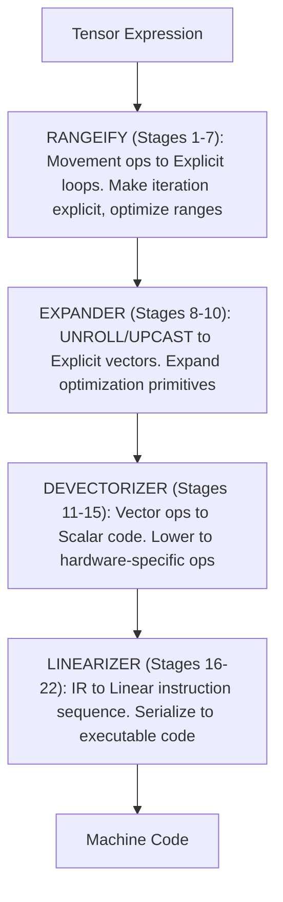

# Путь UOp: 22-стадийный пайплайн кодогенерации

UOp начинает жизнь как высокоуровневое тензорное выражение. К моменту, когда он добирается до железа, он прошёл через 22 различные стадии — каждая со своей задачей, каждая строится на предыдущей. Эта глава прослеживает этот путь.

Пайплайн — проверенный дизайн для тензорной компиляции. Понять его — значит понять, как тензорные выражения превращаются в машинный код.

---

## Как читать эту главу

Если вы не компиляторный инженер, глава может показаться пугающей. Вот что нужно понять перед тем, как нырять вглубь.

### Ключевые концепции

**UOp (Micro-Operation)**
- Думайте об этом как об узле в блок-схеме, представляющем одно вычисление
- Пример: `ADD(a, b)` означает «сложить a и b»

**Паттерн**
- Правило «найти и заменить» для структур кода (не текста)
- Пример: «Если видишь ADD(x, 0), замени на x»
- Паттерны срабатывают повторно, пока не перестанут находить совпадения (fixpoint)

**Range**
- Итерация цикла: `RANGE(0..10)` означает «for i from 0 to 10»

**AxisType**
- Какого типа этот цикл?
  - Global: параллельный по GPU-блокам / CPU-потокам
  - Local: параллельный внутри воркгруппы
  - Reduce: аккумулятор (сумма, макс. и т.д.)
  - Loop: последовательная итерация
  - Upcast / Unroll: разворачиваются экспандером в отдельные линии (lanes)

**Стадия**
- Один проход трансформации по коду
- Паттерны срабатывают до fixpoint, затем начинается следующая стадия

### Стратегия чтения

1. **Первый проход**: прочитайте только секции «Что делает» и «Зачем это нужно»
2. **Второй проход**: посмотрите диаграммы и примеры
3. **Третий проход** (если хотите деталей): прочитайте описания паттернов

### Вопросы, которые стоит задавать

По каждой стадии спросите:
- Что эта стадия делает? (Высокоуровневая цель)
- Зачем она нужна? (Мотивация)
- Что сломается без неё? (Последствия)

---

## Обзор

22 стадии разбиты на четыре фазы:

Каждая стадия применяет перезаписи на основе паттернов. Паттерны срабатывают до fixpoint, затем начинается следующая стадия.

### Дополнительные проходы

Несколько проходов выполняются между пронумерованными стадиями и не имеют собственного номера стадии:

| Проход | Где выполняется | Назначение |
|------|---------------|---------|
| `bool_storage_patterns` | Внутри стадии 14 | Конвертация bool ↔ uint8 для операций с памятью |
| `indexing_simplify` | Внутри стадий 14 и 15 | Свёртка адресной арифметики, вскрытой скаляризацией |
| `sym()` (ранняя символика) | 14–15 | Полное символическое упрощение, когда граф уже скалярный |
| `memory_coalescing` | 14–15 | Слияние соседних обращений в более широкие |
| `pm_simplify_add_image` | 14–15 (bottom-up) | Упрощение адресов для image-dtype |
| `pm_float_decomp` / `pm_long_decomp` | Внутри стадии 18 | Эмуляция dtype, отсутствующих на целевом железе (FP8/BF16, 64-битные целые) |
| `pm_move_gates_from_index` | 18–19 | Перенос валидности индекса в поле `gate` у LOAD/STORE |
