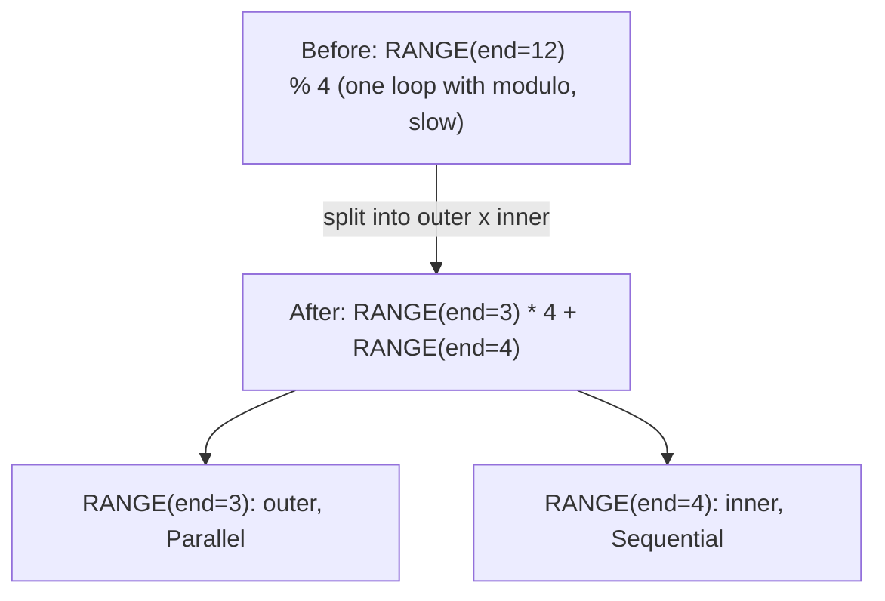
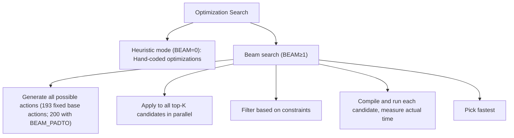

# Фаза 1: Rangeify

**Цель**: Преобразовать высокоуровневые операции перемещения (movement ops) в явные циклические структуры и оптимизировать RANGE.

---

## Стадия 1: Ранние Movement Ops

> **Стадия кратко**
>
> **Цель**: Вычистить movement ops перед назначением RANGE
> **Ключевые паттерны**: Movement на INDEX, movement через обёртки, упрощение вложенных INDEX
> **Эффект**: Предотвращает пропущенные оптимизации далее по пайплайну

**Что делает**: Эта стадия вычищает movement ops, перемещая манипуляции с индексами туда, где они реально используются. Считайте, что это наведение порядка на столе перед сортировкой документов — инструкции сдвигаются ближе к месту использования данных.

**Зачем это нужно**: Movement ops (RESHAPE, PERMUTE и т.д.) — удобные абстракции, но железо требует конкретных вычислений индексов. Вычищая их рано, мы обеспечиваем корректное срабатывание паттернов на последующих стадиях.

**Паттерн**: `movement_op_patterns()` (bottom-up)

| Паттерн | Трансформация | Визуально | Расположение |
|----------|---------------|--------|----------|
| Movement на INDEX | Применить movement к выражениям индексов | `INDEX(PERMUTE(arr), [i, j]) → INDEX(arr, [j, i])` | `movement_op_patterns()` |
| Movement через AFTER | Протянуть movement (или INDEX) через timing-обёртку, сохраняя все зависимости | `AFTER(RESHAPE(x, arg), deps) → RESHAPE(AFTER(x, deps), arg)` | `movement_op_patterns()` |
| Movement через END | Развернуть movement из END-обёртки | `END(RESHAPE(x), ranges) → END(x, ranges)` | `movement_op_patterns()` |

**Почему bottom-up?** Дочерние узлы должны быть вычищены до обработки родительских. Movement ops глубоко вложены; очистка снизу предотвращает пропущенные паттерны.

**Примечание**: `is_movement()` покрывает ровно RESHAPE, PERMUTE, EXPAND, PAD, SHRINK и FLIP. Уплощение вложенных INDEX (`INDEX(INDEX(ptr, i), j) → INDEX(ptr, i, j)`) *не* входит в эту стадию; оно живёт в `mop_cleanup_patterns()` и выполняется вместе с экспандером стадии 9 и девекторизатором.

**Svod**: `movement_op_patterns()` в `rangeify/patterns.rs`

---

## Стадия 2: Свёртка нагрузок (Load Collapse)

> **Стадия кратко**
>
> **Цель**: Устранить REDUCE-операции, обнаруживая вычисления, независимые от RANGE
> **Ключевые паттерны**: Ограниченная сумма, свёртка gated load, общее устранение reduce
> **Эффект**: Замена итераций цикла на арифметические операции

**Что делает**: Устраняет REDUCE-операции, распознавая случаи, когда вычисление можно выполнить без итерации. Использует обнаружение вычислений, независимых от RANGE, и символическое упрощение.

**Зачем это нужно**: Замена итераций на арифметику убирает оверхед цикла. Вместо того чтобы прогонять цикл 1000 раз, вычислить ответ напрямую.

**Паттерн**: `pm_load_collapse`

```text
// Before: Sum with bounds check
sum(1 for k in 0..64 if k >= length)

// After: Compute count directly (NO LOOP!)
count = clamp(64 - length, 0, 64)
```

Механизм работает так:
1. Находит подвыражения, не зависящие от RANGE у REDUCE
2. Заменяет эти внешние входы синтетическими скалярными переменными PARAM, несущими доказанные vmin/vmax
3. Оборачивает подставленное тело в синтетический REDUCE по тому же RANGE и запускает матчер свёртки reduce
4. Если в упрощённом выражении больше нет RANGE, REDUCE устраняется (а временные PARAM подставляются обратно)

**Примечание**: Перемещение WHERE через INDEX (`pm_move_where_on_load`) — отдельная оптимизация, которая выполняется на стадии 8 и встраивает условие в `INDEX.indices[0]` как `WHERE(cond, idx, Invalid)`. Она не устраняет REDUCE-операции.

**Svod**: `pm_load_collapse()` в `rangeify/patterns.rs`

---

## Стадия 3: Разделение RANGE

> **Стадия кратко**
>
> **Цель**: Улучшить оптимизацию через декомпозицию divmod
> **Ключевые паттерны**: Разделение RANGE по модулю, свёртка RANGE
> **Эффект**: Внутренние RANGE можно векторизовать, внешние — распараллелить

**Что делает**: Обрабатывает паттерны с модулем, разделяя RANGE на внешнюю и внутреннюю компоненты.

**Зачем это нужно**: Разделение RANGE — как распределение большой задачи между членами команды. Если у вас 12 элементов и каждый делает 4, получается 3 человека x 4 элемента. Внутренние циклы (4 элемента одного человека) могут быть быстрыми; внешние (3 человека) могут работать параллельно.

**Паттерн**: `pm_split_ranges + pm_flatten_range`



Это позволяет:
- Внутренние RANGE могут векторизоваться (SIMD)
- Внешние RANGE могут параллелиться (GPU-блоки / CPU-потоки)

`pm_flatten_range` заново выводит список RANGE-операндов у узлов REDUCE и END из тех RANGE-узлов, что всё ещё достижимы через их источники. (Слияние RANGE — задача стадии 5.)

**Контекст**: `SplitRangesContext` помечает каждое место `RANGE % const`; подстановка divmod выполняется один раз, на SINK.

**Примечание**: Разделение применяется только когда `end % mod == 0` (проверка делимости). RANGE типов Warp и Device никогда не разделяются, а каждый RANGE, по которому индексируется image-STORE, закрепляется от разделения.

**Svod**: `pm_split_ranges()` + `pm_flatten_range()` в `rangeify/transforms.rs`

---

## Стадия 4: Начальная символика

> **Стадия кратко**
>
> **Цель**: Упростить выражения, используя правила алгебры
> **Ключевые паттерны**: Свёртка констант, удаление тождеств, рекомбинация div-mod
> **Эффект**: Устранение дорогих операций, уменьшение объёма кода

**Что делает**: Применяет 100+ правил свёртки констант и алгебраических упрощений.

**Зачем это нужно**: Компьютеры быстры в простой арифметике. Деление и остаток — медленные операции. Эта стадия использует правила алгебры, чтобы убрать медленные операции где возможно.

**Паттерн**: `sym() + pm_fold_cast_const() + pm_flatten_range()`

Примечание: `symbolic()` (уровень 2) — строгое подмножество `sym()` (уровень 3); тот же `sym` запускается снова на стадии 8.

**Свёртка констант**:
```text
ADD(CONST(2), CONST(3)) → CONST(5)
MUL(x, CONST(1)) → x
ADD(x, CONST(0)) → x
```

**Рекомбинация div-mod**:
```text
(x / c) * c + (x % c) → x
```
*Зачем?* Вычисляет то же значение, что и `x`, но за 3 операции вместо 1. Этот паттерн находит и устраняет избыточность (часто встречается в вычислениях страйдов).

**Булева алгебра**:
```text
x AND x → x
x OR FALSE → x
NOT(NOT(x)) → x
```

**Дополнительные категории**:
- Удаление тождеств (самосвёртка, избыточные операции)
- Упрощение сравнений
- Оптимизация Cast
- Переупорядочивание ALU/STACK (`ALU(STACK, STACK) → STACK(ALU)`)
- Свёртка WHERE (объединение WHERE с одинаковыми условиями)
- Цепочка reduce mul (вынос умножений за reduce)

**Svod**: `sym()` в `symbolic/patterns.rs`

---

## Стадия 5: Упрощение RANGE

> **Стадия кратко**
>
> **Цель**: Объединить соседние RANGE для снижения оверхеда циклов
> **Ключевые паттерны**: Слияние RANGE с анализом стоимости
> **Эффект**: Меньше циклов = меньше оверхеда

**Что делает**: Объединяет соседние RANGE, когда это выгодно.

**Зачем это нужно**: Объединение RANGE — как объединение нескольких мелких поездок в одну большую. Вместо 4 походов в магазин за 4 вещами — один поход за всем. Экономит затраты на запуск и завершение.

**Паттерн**: `pm_flatten_range() + pm_simplify_ranges()`

```text
// Before: two separate ranges
RANGE(0..4), RANGE(0..8)

// After: merged (if compatible)
RANGE(0..32)
```

`pm_simplify_ranges` также сужает RANGE, ограниченность которых доказана каждым гейтом валидности INDEX.

Критерии слияния:
1. Типы осей должны быть совместимы (оба выходные, оба reduce и т.д.)
2. Скоуп REDUCE должен остаться консистентным
3. **На основе стоимости**: принимать, только если количество divmod-операций не увеличивается

Компилятор объединяет, только если это экономит операции. Слияние может потребовать деления/остатка для пересчёта индексов. Если это обходится дороже, чем экономит, слияние пропускается.

**Svod**: `simplify_merge_adjacent()` в `rangeify/transforms.rs`

---

## Стадия 6: Разделение STORE

> **Стадия кратко**
>
> **Цель**: Разделить граф на границах STORE в отдельные ядра
> **Ключевая функция**: `split_all_stores()` + `split_store()`
> **Эффект**: Даёт возможность оптимизировать каждое ядро отдельно

**Что делает**: Разделяет UOp-граф на границах STORE, создавая отдельные ядра для каждого выхода.

**Зачем это нужно**: После буферизации граф может содержать несколько STORE-операций. Каждый STORE становится отдельным ядром со своим набором буферов, RANGE и зависимостей.

**Функция**: `try_get_kernel_graph()` в `schedule/src/rangeify/kernel.rs`

Внутри `kernel_graph_pre_cut`, после того как узлы STAGE стали STORE, на **всём графе целиком** один раз выполняется пре-проход `pm_flatten_range` (bottom-up). Он заново выводит списки RANGE по всем ядрам за один обход, избегая избыточной работы на перекрывающихся подграфах для каждого ядра. Этот пре-проход — ключевая оптимизация скорости компиляции: без него `split_store` каждого ядра повторно обходил бы общие подграфы независимо.

После пре-прохода `split_all_stores` выполняет разделение на границах STORE — каждое ядро нумерует собственные слоты PARAM через `LocalAddBufferContext::param_slot` — а затем `fix_assign` связывает межъядерные зависимости, отвергая циклы зависимостей.

---

## Стадия 7: Применение оптимизаций

> **Стадия кратко**
>
> **Цель**: Найти оптимальную комбинацию векторизации, развёртки, использования памяти
> **Ключевой алгоритм**: Beam search или эвристики
> **Эффект**: Может значительно улучшить производительность

**Что делает**: Оптимизационный поиск — beam search или эвристика — исследует разные комбинации оптимизационных действий.

**Зачем это нужно**: Компилятор пробует разные комбинации оптимизаций (векторизовать тут? развернуть там?) и выбирает самую быструю. Правильная комбинация может ускорить код в 10 раз.

**Функция**: `optimize_kernel(ast, renderer)`

**Оптимизационные действия**:

| Действие | Эффект | Целевое железо |
|--------|--------|-----------------|
| TC | Задействовать тензорные ядра | NVIDIA, AMD, Apple Metal и Intel GPU |
| UPCAST | Векторизовать измерение | Все (SIMD) |
| LOCAL | Использовать локальную/shared-память | Только GPU (требует `has_local`) |
| UNROLL | Развернуть измерение цикла | Все (избежать оверхеда цикла) |
| GROUP | Внутреннее разделение сгруппированного reduce | GPU (shared-память; отвергается после применения TC) |
| GROUPTOP | Внешнее разделение сгруппированного reduce | GPU (shared-память; отвергается после применения TC) |
| THREAD | Параллелизм на потоках | CPU |
| NOLOCALS | Отключить использование локальной памяти | Все (ограничение, запрещает дальнейшие LOCAL-действия) |
| SWAP | Поменять местами два назначения Global-RANGE | Глобальные оси GPU/CPU (попробовать другой тайлинг) |
| PADTO | Паддинг для выравнивания | Все (выравнивание памяти) |

**Как устроен поиск оптимизаций**:

Компилятор ищет лучшую комбинацию:
- **Эвристический режим** (BEAM=0): Быстрые захардкоженные паттерны оптимизации, без компиляции
- **Beam search** (BEAM≥1): Компилирует и запускает кандидатов, чтобы замерить реальную производительность



**Примечание**: NOLOCALS — ограничение, которое устанавливает `dont_use_locals = true`, запрещая дальнейшие LOCAL-действия и влияя на решения по использованию shared-памяти. Оно не входит в базовый список действий — оно добавляется к каждому кандидату, когда включено.

**Svod**: `optimizer/mod.rs`, `optimizer/opts.rs`
