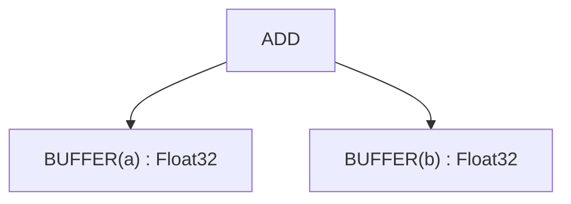
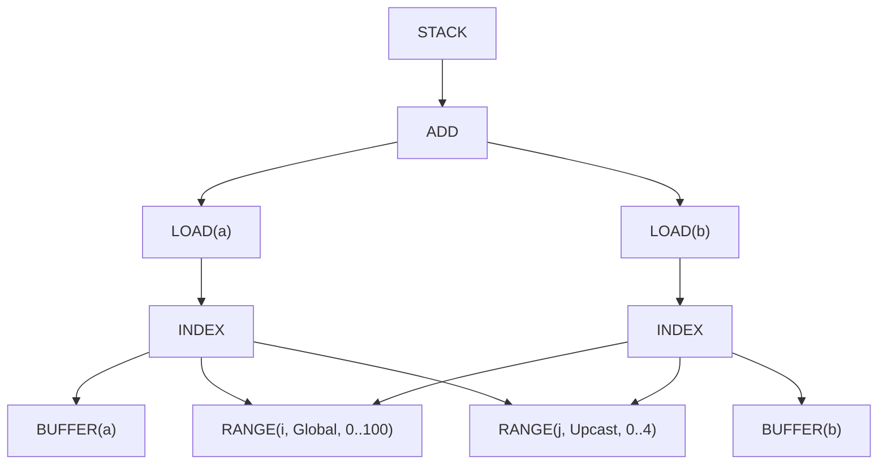
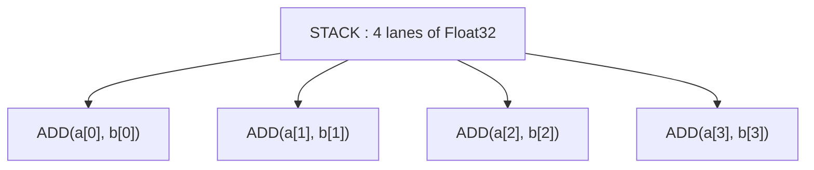

# Сквозной пример и справочник

---

## Сквозной пример: прослеживаем все 22 стадии

Проследим путь `c = a + b` (где a, b — тензоры [100, 100]) через весь пайплайн.

### Начальный граф тензоров


### После стадии 1: Ранние Movement Ops
(Без изменений — в этом примере нет movement ops)

### После стадии 2: Свёртка нагрузок
(Без изменений — в этом примере нет редукций)

### После стадии 3: Разделение RANGE
(Без изменений — нет операций с модулем)

### После стадии 4: Начальная символика
(Без изменений — упрощение не требуется)

### После стадии 5: Упрощение RANGE
(Без изменений — соседних RANGE ещё нет)

### После стадии 6: Разделение STORE
(Неприменимо — GPU-бэкенд)

### После стадии 7: Применение оптимизаций
Применённые оптимизации:
- UPCAST измерения j на 4 (векторизация)
- LOCAL для входных буферов (если выгодно)

### После стадии 8: Пост-оптимизационная символика
Без изменений — символика уже чистая.

### После стадии 9: Expander
Разворачивание UPCAST представлено напрямую структурой STACK/INDEX:


Примечание: общие RANGE и выражения индексов дедуплицируются через hash consing.

### После стадии 10: Добавление локальных буферов
(Если была выбрана оптимизация LOCAL)

### После стадии 11: Удаление Reduce
(Без изменений — нет редукций)

### После стадии 12: Добавление GPU-измерений
```
[SPECIAL(gidx0)] : WeakInt  // replaces RANGE(i)
```

### После стадии 13: Добавление LOAD
(Без изменений — загрузки уже на месте)

### После стадии 14: Devectorize
Векторная структура после devectorize (показан эффект, а не точная структура UOp):


### После стадии 15: Понижение типа Index
```
[SPECIAL(gidx0)] : i32  // concrete type
```

### После стадии 16: Пост-индексная символика
Изменений не требуется.

### После стадии 17: Pre-Matcher
(Нет паттернов для стандартных бэкендов)

### После стадии 18: Декомпозиции
Декомпозиции не требуются — все операции поддерживаются.

### После стадии 19: Финальная перезапись
Изменений не требуется.

### После стадии 20: Добавление управления потоком
Зависимости отслежены — проблем нет.

### После стадии 21: Линеаризация
Линейная последовательность инструкций (упрощённо):
```
1. PARAM(0)  // Output buffer c
2. PARAM(1)  // Input buffer a
3. PARAM(2)  // Input buffer b
4. RANGE(i, 0..100, Global)  // gidx0
5. LOAD(a, i*4+0..i*4+3)  // Vector load (vec4)
6. LOAD(b, i*4+0..i*4+3)  // Vector load (vec4)
7. ADD(vec_a, vec_b)  // Vector add (vec4)
8. STORE(c, i*4+0..i*4+3, result)  // Vector store
9. END(RANGE(i))
```

Примечание: UPCAST был поглощён стадией 9 (expander), поэтому отдельного цикла RANGE(j) нет. Векторизация неявно заложена в vec4-операциях.

### После стадии 22: Чистка IF/ENDIF
Изменений не требуется — gated stores отсутствуют.

**Результат**: Готово к кодогенерации! LLVM/CUDA/другой бэкенд скомпилирует это в реальный машинный код.

---

## Стратегия применения паттернов

Каждая стадия использует одну из двух стратегий перезаписи:

**Top-down** (по умолчанию): Обработка родителей до потомков. Используется, когда трансформации создают новые подтермы для сопоставления.

**Bottom-up**: Обработка потомков до родителей. Используется, когда состояние потомков влияет на сопоставление родителей (стадии 1, 20).

Обе стратегии итерируют до fixpoint — паттерны срабатывают, пока не перестанут находить совпадения.

---

## Отладка пайплайна

Когда ядро выдаёт неверные результаты, баг живёт на одной из этих 22 стадий. Каждая стадия логирует своё дерево UOp через `tracing`; `scripts/extract-ir.sh` превращает эти логи в читаемый дамп:

```bash
# See IR after each transformation
./scripts/extract-ir.sh failing_test -p svod-tensor -o /tmp/ir.txt

# Or dump a single stage straight to stderr (no tracing subscriber needed)
SVOD_PER_STAGE_UOPS=1 SVOD_DUMP_STAGE=09 cargo test failing_test -- --nocapture
```

### Краткий справочник

| Симптом | Вероятные стадии | Что проверять |
|---------|---------------|---------------|
| Неверные значения на выходе | 4, 9, 11, 18 | Символическое упрощение, расширение, девекторизация |
| Медленная производительность | 7, 9, 14, 21 | Оптимизация, расширение, девекторизация, линеаризация |
| Краши/паники | 11, 12 | Reduce, GPU-измерения |
| Неверное число итераций | 3, 5, 12 | Разделение RANGE, упрощение RANGE, GPU-измерения |
| Отсутствие векторизации | 9, 14 | Expander, devectorizer |

### Частые проблемы

1. **Стадии 3-4**: Разделение RANGE / символика могут потерять ограничения
2. **Стадия 9**: Порядок расширения влияет на корректность векторизации
3. **Стадия 11**: Инициализация аккумулятора должна совпадать с нейтральным элементом редукции
4. **Стадия 14**: Несоответствие аппаратной ширине — проверьте vector fold length
5. **Стадия 18**: Отсутствующая декомпозиция — проверьте список supported_ops бэкенда
6. **Стадия 21**: Баги приоритетов вызывают гонки данных — верифицируйте зависимости

---

## Итого

22-стадийный пайплайн трансформирует тензорные выражения в машинный код через систематическое уточнение:

1. **Стадии 1-7**: Сделать итерацию явной, оптимизировать RANGE
2. **Стадии 8-10**: Расширить оптимизационные примитивы
3. **Стадии 11-15**: Опустить до аппаратно-специфичных операций
4. **Стадии 16-22**: Сериализовать в исполняемые инструкции

У каждой стадии — одна ответственность. Каждая строится на предыдущей. Результат: высокоуровневый тензорный код работает с близкой к оптимальной скоростью на разном железе.

---

## Tinygrad vs Svod: архитектурные различия

Эта глава описывает «идеальный» 22-стадийный пайплайн, основанный на реализации Tinygrad. Svod сейчас близко следует этому дизайну с минимальными отличиями.

### Оставшиеся архитектурные различия

| Стадия | Tinygrad | Svod | Примечания |
|--------|-----------|-------|--------|
| 17: Pre-Matcher | Бэкенд-хуки находятся в одном классе `Renderer` | Разделены между двумя трейтами: `svod_codegen::traits::Renderer` рендерит, `svod_device::device::Renderer` несёт `decompositor()`, `extra_matcher()`, `pre_isel_matcher()`, `isel_matcher()` | Те же хуки, другое владение |

### Выровненные стадии (ранее различались)

Следующие стадии были выровнены с Tinygrad в рамках данной реализации:

| Стадия | Что изменилось |
|-------|--------------|
| 15: Понижение типа Index | Svod теперь имеет `pm_lower_index_dtype()` с полным покрытием паттернов: Binary ops, CONST/VCONST, WHERE, STACK, SPECIAL, PARAM, RANGE, двойной слабый CAST |
| 18: Декомпозиции | Добавлены: `fast_division_patterns()`, `pm_div_to_shr()`, `pm_fdiv_to_mul()`, `pm_comparison_negations()`, законы Де Моргана |
| 19: Финальная перезапись | `renderer.extra_matcher()` и `pm_split_ends()` суммируются в финальную перезапись пайплайна schedule вместо выполнения в кодогенерации |

### Паттерны только Tinygrad

Svod намеренно не реализует эти Tinygrad-специфичные паттерны:

| Паттерн | Назначение | Почему Svod это не нужно |
|----------|-----------|-----------------------------|
| `pm_regalloc_rewrite` | Линейно-сканирующее распределение регистров для ISA-бэкендов | Svod выдаёт LLVM IR / исходный код, поэтому распределение регистров — задача бэкенд-компилятора |

### Расширения Svod

У Svod есть паттерны/расширения, отсутствующие в Tinygrad:

| Расширение | Расположение | Назначение |
|-------------|---------|---------|
| Хранение bool через `uint8` | `bool_storage_patterns()` в `devectorize.rs` | `i1` в LLVM может нести мусор в старших битах, поэтому bool LOAD/STORE идут через `uint8` |
| Понижение широких float | `demote_unsupported_floats()` в `late/dtype.rs` | Рендереры без широкого float (Metal, WebGPU) вычисляют внутренний f64 в f32 |

---

## Глоссарий

| Термин | Определение | Пример |
|------|------------------|---------|
| **Accumulator** | Переменная с текущей суммой | `acc = acc + value` (в редукции) |
| **Axis** | Одно измерение тензора | Форма [100, 200] имеет 2 оси |
| **AxisType** | Как выполняется цикл | Global=параллельно, Reduce=аккумуляция |
| **Buffer** | Выделенная память с данными | Данные тензора хранятся в буфере |
| **Bufferize** | Записать результат в память вместо вычисления по требованию | Материализация промежуточного значения |
| **Devectorize** | Разбить векторы под железо | `vec8 → vec4, vec4` |
| **Divmod** | Операции деления и остатка | `x // 7, x % 7` |
| **Fixpoint** | Когда применение паттернов перестаёт менять что-либо | Паттерны срабатывают до fixpoint |
| **STACK** | Собрать линии (lanes) в одно значение с формой (VECTORIZE в Tinygrad) | `STACK(a, b, c, d)` |
| **Hash consing** | Переиспользование идентичных выражений | `ADD(x, 0) + ADD(x, 0)` разделяют память |
| **WeakInt** | Абстрактный целочисленный тип для индексов, понижаемый на стадии 15 | i32 или i64, в зависимости от доказанных границ |
| **Load** | Чтение из памяти | `value = arr[i]` |
| **Pattern** | Правило «найти и заменить» для кода | `ADD(x, 0) → x` |
| **Predicated store** | Условная запись в память | Записать если валидно, иначе пропустить |
| **Range** | Спецификация итерации цикла | `for i in 0..100` |
| **Reduction** | Свёртка множества значений в одно | Сумма, максимум, минимум |
| **Store** | Запись в память | `arr[i] = value` |
| **Symbolic** | Упрощение по правилам алгебры | `(x/4)*4 → x` (когда `x%4=0`) |
| **Tensor core** | Аппаратура для быстрого матричного умножения | NVIDIA, AMD, Apple Metal, Intel Xe |
| **Topological sort** | Упорядочение узлов с учётом зависимостей | A до B, если B использует результат A |
| **UNROLL** | Тип оси, помечающий цикл к развёртке | `RANGE(0..4, Unroll)` |
| **UPCAST** | Тип оси, помечающий намерение векторизовать | `RANGE(0..4, Upcast)` |
| **Vectorize** | Обработка нескольких значений одновременно | SIMD: сложить 4 числа за раз |
| **WHERE** | Условный выбор | `WHERE(cond, x, y) = x if cond else y` |
