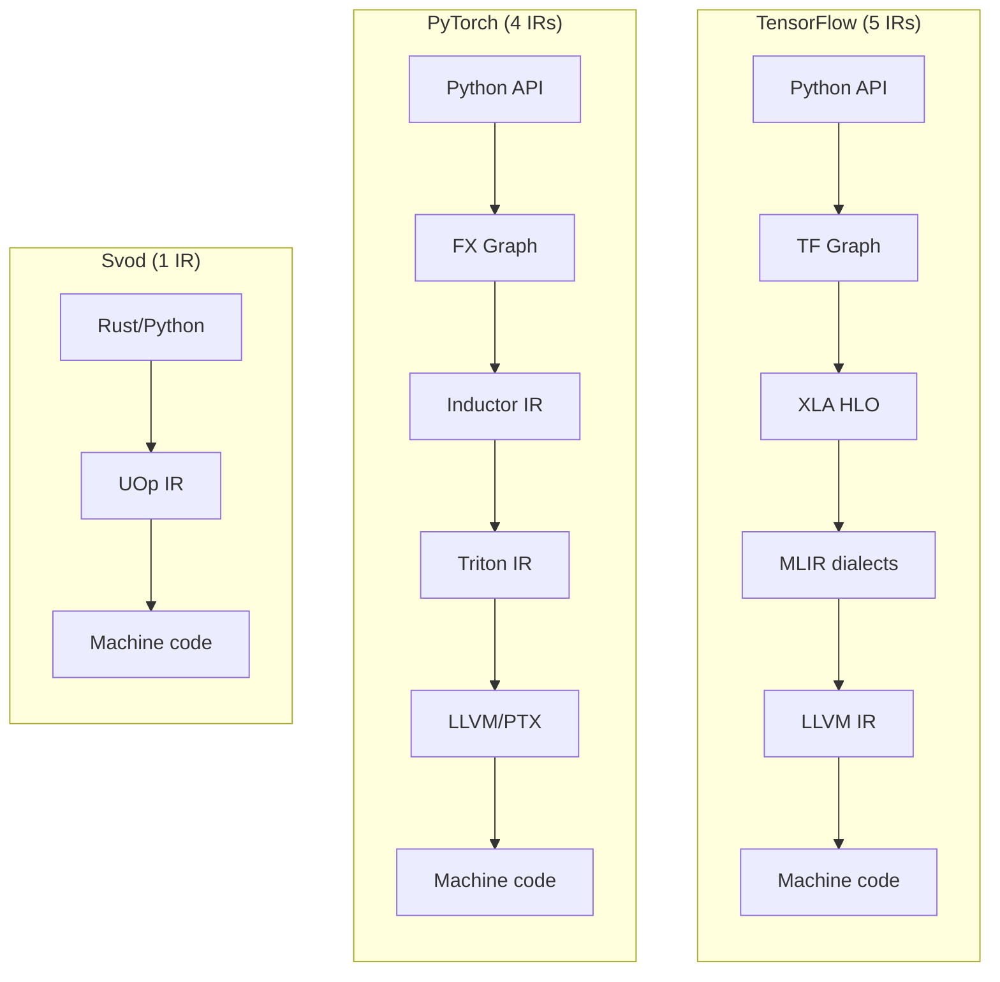
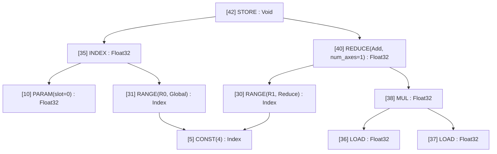
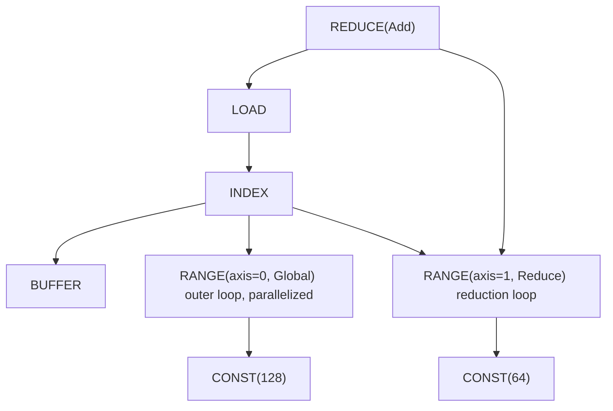
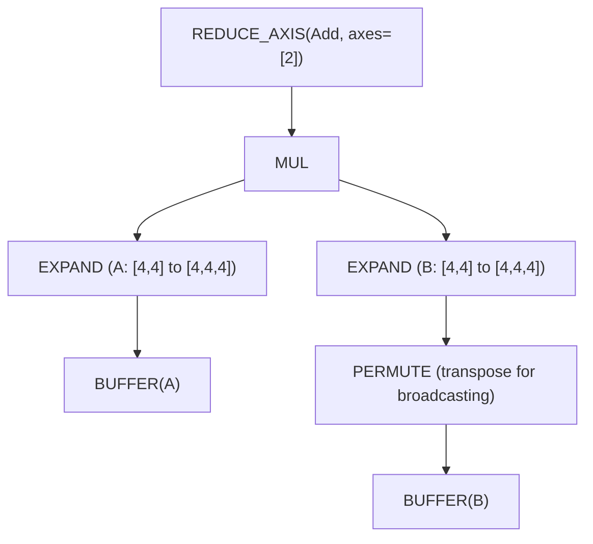
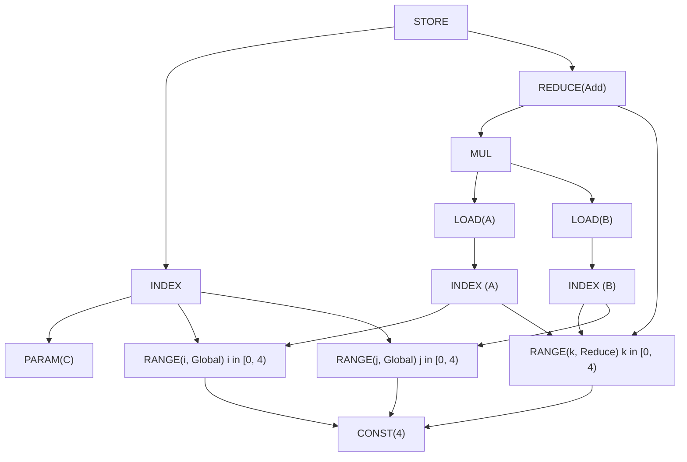

# Один IR, чтобы править всеми

Вы отлаживаете медленную модель. Профайлер говорит: «kernel X занимает 200ms», но вы понятия не имеете, что kernel X на самом деле *делает*. Вы пробираетесь через диспатчер PyTorch, потом ATen, потом TorchInductor, потом Triton IR и наконец попадаете в LLVM IR. Пять разных представлений, пять разных ментальных моделей, пять разных инструментов отладки.

Такова реальность современной ML-компиляции. У TensorFlow XLA похожая история: Python → Graph → XLA HLO → MLIR → LLVM IR. Каждый слой появился для решения реальной задачи, но накопленная сложность — запредельная.

Svod использует другой подход, заимствованный у [Tinygrad](https://github.com/tinygrad/tinygrad): **один IR от тензоров до машинного кода**.



Простейшая архитектура часто выигрывает. Эта глава объясняет, как один хорошо спроектированный IR может заменить целый стек компилятора.

---

## UOp: универсальный узел

**UOp** (micro-operation) — узел графа вычислений. Но в отличие от узлов в других IR, UOp может представлять операции на *любом* уровне абстракции — от высокоуровневых reshape тензоров до отдельных инструкций CPU.

Ключевая идея: вместо отдельных IR для «тензорных операций», «структур циклов» и «доступа к памяти» мы складываем всё в один enum:

```rust
pub enum Op {
    // High-level tensor operations
    Reshape { src: Arc<UOp>, new_shape: Arc<UOp> },
    Permute { src: Arc<UOp>, axes: Vec<usize> },
    ReduceAxis { src: Arc<UOp>, reduce_op: ReduceOp, axes: Vec<usize> },

    // Loop-level control flow
    Range { end: Arc<UOp>, axis_id: AxisId, axis_type: AxisType, deps: SmallVec<[Arc<UOp>; 2]> },
    End { computation: Arc<UOp>, ranges: SmallVec<[Arc<UOp>; 4]> },

    // Memory operations (the buffer is reached through the INDEX, not a field)
    Load { index: Arc<UOp>, alt: Option<Arc<UOp>>, gate: Option<Arc<UOp>> },
    Store { index: Arc<UOp>, value: Arc<UOp>, gate: Option<Arc<UOp>> },

    // ALU operations (grouped enums with many individual values)
    Binary(BinaryOp, Arc<UOp>, Arc<UOp>),  // Add, Mul, etc.
    Unary(UnaryOp, Arc<UOp>),              // Sqrt, Exp, etc.
    Ternary(TernaryOp, Arc<UOp>, Arc<UOp>, Arc<UOp>),  // Where, MulAcc, etc.
}
```

Enum содержит ~60 вариантов Op, организованных по уровню абстракции (~80+ включая отдельные значения UnaryOp/BinaryOp/TernaryOp):

| Категория | Примеры | Что представляет |
|-----------|---------|-----------------|
| **Movement** | `RESHAPE`, `PERMUTE`, `EXPAND`, `PAD` | Преобразования формы тензора |
| **Reduction** | `REDUCE_AXIS`, `REDUCE` | Математические агрегации |
| **Control** | `RANGE`, `END`, `IF`, `BARRIER` | Структуры циклов и ветвлений |
| **Memory** | `LOAD`, `STORE`, `INDEX`, `BUFFER` | Доступ к аппаратной памяти |
| **ALU** | `ADD`, `MUL`, `SQRT`, `EXP`, `WHERE` | Инструкции CPU/GPU |
| **Advanced** | `WMMA` | Tensor cores и метаданные их расширения |

При печати UOp-графа видна его древовидная структура:



Обратите внимание на стрелки «(same RANGE as above)»? Это не просто красивый вывод — это фундаментальное свойство, называемое **hash consing**.

---

## Hash consing: структурное разделение

Когда вы создаёте одно и то же выражение дважды в Svod, вы получаете *тот же указатель*. Не равные значения — один и тот же адрес в памяти.

```rust
let a = x.try_add(&y)?;
let b = x.try_add(&y)?;

assert!(Arc::ptr_eq(&a, &b));  // Same pointer!
```

:::note[Происхождение — часть идентичности узла]
При `SVOD_ORIGIN=1` узел дополнительно несёт `OriginScope`, в котором его построили, и это
происхождение входит в его content-хеш. Два идентичных подграфа, построенных в разных
скоупах, оказываются *разными* узлами и не склеиваются, пока разрез на ядра не снимет
происхождение. Исключение — литералы, а вместе с ними `BUFFER`/`PARAM`/`UNIQUE`: одну и ту
же константу два скоупа строят независимо, поэтому происхождение на ней лишь расщепило бы
узел, который разрез снова склеивает. О компромиссе см. раздел «Привязка ядер к коду модели»
на странице [Профилирование и бенчмаркинг ядер](../tile-kernels/profiling.md#attributing-kernels-to-model-code).
:::

Это работает через глобальный lock-free кэш (крейт `papaya` с `Weak`-ссылками для избежания утечек памяти). При конструировании UOp сначала проверяем, существует ли идентичный:

```rust
pub fn new(op: Op, dtype: DType) -> Arc<Self> {
    let key = UOpKey::new(&op, dtype);

    // Check cache first
    if let Some(existing) = CACHE.get(&key) {
        return existing;
    }

    // Create new and cache it
    let uop = Arc::new(UOp { op, dtype, ... });
    CACHE.insert(key, uop.clone());
    uop
}
```

Почему это важно для ML-инженеров?

- **Равенство указателей — это семантическое равенство.** Чтобы проверить, идентичны ли два подвыражения, достаточно сравнить указатели: `Arc::ptr_eq(&a, &b)`. Обход дерева не нужен.

- **Сопоставление паттернов за O(1).** Когда оптимизатор спрашивает «видел ли я этот паттерн раньше?», сравнение указателей даёт мгновенный ответ.

- **Экономия памяти.** Общие подвыражения (вспомните: общие вычисления в attention, графы градиентов) хранятся один раз, а не дублируются.

- **Потокобезопасность.** Одно и то же вычисление из разных потоков порождает один и тот же объект — никаких багов синхронизации.

Древовидный вывод это показывает: когда вы видите `[10] → (same as above)`, это не копия — это *тот же узел*, на который ссылаются из нескольких мест.

---

## Явные циклы: операция `RANGE`

Большинство ML IR скрывают циклы внутри операций. В ONNX редукция выглядит так:

```python
ReduceSum(data, axes=[1], keepdims=0)
```

Где цикл? Он неявный — где-то внутри рантайм-реализации `ReduceSum`. Его нельзя увидеть, изменить, проанализировать.

Svod делает циклы *явными* через операции `RANGE`. Та же редукция становится:



Каждый `RANGE` имеет **AxisType**, который говорит кодогенератору, как его компилировать:

| AxisType | CPU | CUDA | Смысл |
|----------|-----|------|-------|
| **Weak** | `for`-цикл | `for`-цикл | Непараллелизованный range; default после rangeify |
| **Loop** | `for`-цикл | `for`-цикл | Явный обычный цикл |
| **Global** | Thread pool | `blockIdx` | Внешняя параллельная размерность |
| **Thread** | Thread pool | — | CPU-параллелизм |
| **Warp** | (N/A) | warp/wavefront | Субгрупповой параллелизм |
| **Local** | (N/A) | `threadIdx` | Параллелизм рабочей группы |
| **GroupReduce** | (N/A) | Shared memory | Двухстадийная редукция |
| **Upcast** | SIMD-вектор | Register tile | Векторизация |
| **Reduce** | Аккумулятор | Warp reduce | Размерность редукции |
| **Unroll** | Развёрнутый | Развёрнутый | Развёртка цикла |

Иерархия AxisType (Weak/Loop → Global/Thread → Warp → Local/GroupReduce → Upcast → Reduce → Unroll) отображается на аппаратные модели выполнения — у внешних циклов меньший приоритет. `RANGE` с `AxisType::Global` становится `blockIdx.x` в CUDA. `RANGE` с `AxisType::Local` становится `threadIdx.x`.

Почему явные циклы важны:

- **Оптимизация видна.** Можно *увидеть*, какие циклы будут параллелизованы, какие развёрнуты, какие используют SIMD.

- **Планирование — это перезапись графа.** Изменение порядка циклов, тайлинг или развёртка — это паттерн-преобразование, никакого специального «прохода планирования».

- **Один IR на всех стадиях.** `RANGE`, который представляет «итерацию по размерности батча» на тензорном уровне — это *тот же* `RANGE`, который становится `for (int i = 0; i < N; i++)` в сгенерированном коде.

---

## Перезапись графа: один механизм преобразований

Традиционные компиляторы имеют десятки специализированных проходов: свёртка констант, удаление мёртвого кода, развёртка циклов, фьюзинг операторов. У каждого прохода своя логика, свои структуры данных, свои баги.

Svod использует один механизм: **перезапись графа на основе паттернов**.

```rust
patterns! {
    // Identity folding: x + 0 → x
    Add[x, @zero] => x,

    // Constant folding: 3 + 4 → 7
    Add(a @const(a_val), _b @const(b_val))
        => eval_add(a_val, b_val).map(|r| UOp::const_(a.dtype(), r)),

    // Self-folding: x // x → 1
    FloorDiv(x, x) => 1.into_uop(x.dtype()),

    // Dead code: if(true) { x } else { y } → x
    Where(Const(ConstValue::Bool(true)), t, _f) => t,
}
```

DSL выразителен:

- **`[x, y]` — коммутативно.** Пробуем оба порядка (для `ADD`, `MUL` и т.д.)
- **`(x, y)` — упорядочено.** Сопоставляется ровно в этом порядке.
- **`@zero`, `@one` — семантические константы.** Работают для любого DType.
- **`c @const(val)` — извлечение значения.** Для вычислений во время компиляции.
- **`x, x` — один и тот же операнд.** Определяется через равенство указателей.
- **`=>` — перезапись.** Возвращает `Arc<UOp>`, `Option<Arc<UOp>>` (`None` — отказ) или `RewriteResult`.

Движок перезаписи применяет паттерны снизу вверх, пока не останется совпадений:

```text
Original:       Add(Mul(x, 1), 0)
After Mul:      Add(x, 0)         # Mul(x, 1) → x
After Add:      x                 # Add(x, 0) → x
```

Этот единственный механизм обеспечивает:

- **Алгебраическое упрощение** — свёртка констант, удаление тождеств
- **Преобразование rangeify** — movement-операции → явные циклы
- **Оптимизацию ядер** — векторизация, развёртка, tensor cores
- **Кодогенерацию** — снижение до аппаратных примитивов

Одни паттерны, один движок, разные наборы паттернов для каждой стадии.

---

## Разбор на примере: путь matmul

Проследим `C = A @ B` (матричное умножение 4x4) через весь пайплайн.

### Стадия 1: Построение тензоров

Когда вы пишете `A.matmul(&B)`, Svod строит высокоуровневый UOp-граф:



Это чистая математика: «расширяем A и B для выравнивания размерностей, поэлементно умножаем, суммируем по свёрнутой оси».

### Стадия 2: Rangeify

Проход rangeify конвертирует movement-операции (`EXPAND`, `PERMUTE`) в явные вычисления индексов с `RANGE`-циклами:



Теперь видна структура циклов: `i` и `j` — `Global` (параллелизованы), `k` — `Reduce` (аккумулируется).

### Стадия 3: Символьное упрощение

Паттерн-перезаписи убирают избыточные операции, сворачивают константы и упрощают индексную арифметику.

### Стадия 4: Кодогенерация

Финальный IR напрямую транслируется в циклы:

```c
// GPU kernel (conceptual)
__global__ void matmul(float* C, float* A, float* B) {
    int i = blockIdx.x;   // from RANGE(i, Global)
    int j = blockIdx.y;   // from RANGE(j, Global)
    float acc = 0.0f;
    for (int k = 0; k < 4; k++) {  // from RANGE(k, Reduce)
        acc += A[i*4 + k] * B[k*4 + j];
    }
    C[i*4 + j] = acc;
}
```

Ключевое наблюдение: **структура видна на каждой стадии**. Нет магического прохода фьюзинга, который превращает три вложенных цикла в нечто неузнаваемое. Структура `RANGE`, которую вы видите на стадии 2 — это ровно то, что становится циклами на стадии 4.

---

## Сравнение: чем отличаются другие IR

Разные IR делают разные компромиссы. Вот как они соотносятся:

| Аспект | ONNX | XLA HLO | Triton | **Svod** |
|--------|------|---------|--------|-----------|
| **Назначение** | Обмен моделями | Оптимизация бэкенда | DSL для GPU-ядер | Полная компиляция |
| **Операторы** | ~200 высокоуровневых | ~100–150 высокоуровневых | Tile-операции | ~80 многоуровневых |
| **Модель циклов** | Неявная | Неявная | Tile-based | **Явные `RANGE`** |
| **Память** | Чистые значения | Чистые значения → буферы | Явные указатели | **Явные `LOAD`/`STORE`** |
| **Оптимизация** | Нет | Специализированные проходы | MLIR-паттерны | **Единая перезапись** |
| **Целевые платформы** | Рантайм-движки | CPU/GPU/TPU | Только GPU | CPU/GPU |

**ONNX** максимизирует переносимость. Операции вроде `Conv` и `MatMul` скрывают все детали реализации. Отлично для обмена моделями, но нельзя оптимизировать то, что не видишь.

**XLA HLO** функционален и чист — нет побочных эффектов, иммутабельные тензоры. Это позволяет алгебраическую оптимизацию, но требует отдельной фазы «назначения буферов» перед кодогенерацией. Переход от HLO к LMHLO (buffer-based) — фундаментальная граница.

**Triton** раскрывает больше, чем ONNX, но меньше, чем Svod. Вы пишете «tile-level» код — операции над блоками данных — а компилятор разбирается с деталями на уровне потоков. Явная память (`tl.load`, `tl.store`), но неявная параллелизация внутри тайлов.

**Svod** раскрывает всё: циклы явные (`RANGE`), память явная (`LOAD`/`STORE`), параллелизация явная (`AxisType`). Значит, больше нужно изучить, но ничего не скрыто.

---

## Почему это важно: практическая польза

Прозрачный IR Svod даёт практические преимущества для ML-инженеров:

**Отладка прямая.** Напечатайте граф на любой стадии:

```rust
println!("{}", tensor.uop().tree());
```

Вы увидите ровно какие операции есть, как они связаны и где происходит вычисление. Никаких загадок «kernel X».

**Тюнинг производительности — осознанный.** Видно, какие циклы параллелизованы:

```text
[RANGE(batch, Global)]    # parallelized across GPU blocks
[RANGE(channel, Local)]   # parallelized within blocks
[RANGE(pixel, Loop)]      # sequential — might be slow!
```

Если что-то должно быть параллельным, но не является — вы это увидите.

**Ментальная модель проста.** Один IR, один механизм преобразований, один набор операций. Не нужно учить XLA HLO *и* MLIR *и* Triton *и* LLVM. Только UOp.

**Оптимизации компонуемы.** Хотите свою перезапись? Добавьте паттерн:

```rust
patterns! {
    // Your custom optimization
    MyPattern(x, y) => better_version(x, y),
}
```

Работает с тем же движком, что свёртка констант, фьюзинг и всё остальное.

---

## Глубинная идея

Svod/Tinygrad доказывает, что сложность компиляторов часто *случайна*, а не неизбежна. Многослойные стеки IR в TensorFlow и PyTorch наросли органически — каждый слой решал реальную задачу, но совокупная система сложнее для понимания, чем любая отдельная часть.

Один хорошо спроектированный IR, один механизм преобразований и продуманная композиция могут заменить тысячи строк специализированных проходов. Это философия Unix, применённая к компиляторам: делай одну вещь хорошо и компонуй.

Цена — явность: вы видите циклы, обращения к памяти и подсказки параллелизации, которые другие IR скрывают. Но видимость — это фича, а не баг. Когда модель тормозит, вы хотите видеть *почему*, а не надеяться, что компилятор сам разберётся.

Это ставка Svod: прозрачная сложность побеждает скрытую сложность.
