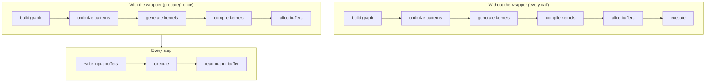

# JIT-графы

Стриминговый ASR-пайплайн вызывает один и тот же энкодер сотни раз.
Построение тензорного графа, его оптимизация, генерация исходного кода
ядер, компиляция через [JIT-загрузчик](../backends/jit-loader.md) бэкенда и
выделение буферов устройства на каждом вызове — это бесполезная работа, не
зависящая от входа.

Макрос `jit_wrapper!` и runtime-слой `model::jit` превращают этот паттерн
«собрать один раз / выполнять много раз» в **типизированную Rust-структуру**.
Вы объявляете входы и граф; макрос генерирует обёртку, которая
компилирует граф один раз во время `prepare()` и переигрывает его на
каждом `execute()` с буферами устройства, удерживаемыми на месте.



Обёртка композируется с [движком паттернов](./optimizations/pattern-system.md)
(который работает во время `prepare()`) и [JIT-загрузчиком](../backends/jit-loader.md)
(который превращает оптимизированные ядра в машинный код в памяти). Эта
страница описывает слой обёртки, расположенный над обоими.

---

## DSL `jit_wrapper!`

Объявление обёртки задаёт имя структуры, тип модели, который получает
замыкание сборки, входы, экспонируемые обёрткой, опциональные символические
переменные форм и блок `build`, который строит граф:

```rust
jit_wrapper! {
    MyModelJit(MyModel) {
        input1: Tensor,
        input2: Tensor,

        vars {
            b: (1, max_batch),
            t: (1, max_time),
        }

        build(input1, input2, b, t) {
            model.forward(input1, input2, &b, &t)
        }
    }
}
```

| Секция | Значение | Обязательна |
|---|---|---|
| `WrapperName(ModelType) { ... }` | имя генерируемой структуры и тип модели, который получает замыкание сборки | да |
| строки `input_name: Tensor` | по одной на каждый вход, экспонируемый обёрткой; аннотация `: Tensor` информационная | опционально (обычно одна или более) |
| `inputs { ... }` | те же слоты внутри блока, где дополнительно разрешены `#[unbatched]` и `[Tensor; N]` | опционально |
| `vars { name: (min, max), ... }` | символические переменные форм с границами времени компиляции | опционально |
| `batch_var name: (min, max)` | переменная, которая вдобавок урезает размерность 0 каждого батчевого входа до себя | опционально |
| `state { name, ... }` | входы, в которые план также пишет; переиспользуются на месте между вызовами | опционально |
| `outputs { name, ... }` | по одному именованному аксессору буфера на каждый выход; замыкание `build` тогда возвращает кортеж из такого же числа тензоров в этом же порядке | опционально |
| `build(args...) { ... }` | замыкание, строящее выходной тензор из входов и переменных; `model` доступен в области видимости | да |

Каждый аргумент `build` должен называть либо вход, либо объявленную
переменную (макрос отклоняет имена, не совпадающие ни с тем, ни с
другим, на этапе раскрытия). Внутри блока каждый вход — это `&Tensor`
(или `[&Tensor; N]` для слота-массива): макрос выделяет нулевой
плейсхолдер на каждый буфер при запуске `prepare()`; каждая
переменная — это `svod_tensor::BoundVariable`, уже привязанная к своей
верхней границе (передавайте её дальше как `&name`), а `model` —
разделяемая ссылка на значение модели, которым владеет обёртка. Замыкание
возвращает `Result<Tensor, E>` для любого
`E: std::error::Error + Send + Sync + 'static`; сбои всплывают
как `JitError::Build`.

Без блока `outputs` замыкание возвращает один `Tensor`, доступный через
`output()`. С ним оно возвращает кортеж ровно из объявленного числа
тензоров, и каждый получает собственный именованный аксессор `&Buffer`,
позиционированный по порядку объявления. Если планировщик слил или
выбросил один из них, позиционные аксессоры молча разъехались бы, поэтому
`prepare()` вместо этого падает с `JitError::OutputCountMismatch`.

---

## Слоты-массивы, батчевые переменные и состояние

Блочные формы объявления добавляют три вещи, нужные стриминговой модели.
Все они опциональны; обёртка, написанная в старой плоской форме, продолжает
работать без изменений.

```rust
jit_wrapper! {
    StepJit(StepModel) {
        inputs {
            x: Tensor,
            #[unbatched] bias: Tensor,
            taps: [Tensor; 3],
        }
        batch_var b: (1, 4),
        state { h: Tensor, tail: [Tensor; 2] }
        outputs { emitted }

        // возвращает (emitted, h, tail): сначала объявленные выходы, затем состояние
        build(x, bias, taps, h, tail) {
            model.step(x, bias, taps, h, tail)
        }
    }
}
```

**Слоты `[Tensor; N]`** прячут N буферов за одним именем: `prepare`
принимает `[InputSpec; N]`, замыкание сборки получает `[&Tensor; N]`, а
сгенерированные аксессоры принимают индекс листа — `jit.taps_view_mut::<f32>(1)?`.
Выходы тоже могут быть массивами.

**`batch_var b: (min, max)`** объявляет символическую переменную *и*
урезает размерность 0 каждого батчевого входа до неё, как только
плейсхолдеры реализованы, так что один план обслуживает диапазон размеров
батча. `#[unbatched]` исключает вход из этого — общее смещение или
таблицу, у которой ведущая ось не батчевая. Привязывайте переменную на
каждом вызове сгенерированным `execute_bound(4)`.

**Слоты `state { ... }`** — это входы, в которые план также пишет. Кортеж
сборки несёт новое значение для каждого из них, макрос присваивает его
прямо обратно в собственный device-local буфер этого слота, и следующий
`execute()` читает его оттуда — рекуррентность, которая ни разу не ходит
на хост. Слоты состояния не экспонируются как выходы; `reset()` обнуляет
их все для новой последовательности.

В кортеже сборки по одному элементу на каждый объявленный слот выхода плюс
по одному на каждый слот состояния — и никакого кортежа вовсе, когда такой
элемент ровно один.

---

## Символические переменные

Блок `vars { ... }` объявляет значения, участвующие в графе как выражения
форм или индексов, но точное значение которых подаётся во время исполнения.
Они позволяют одному подготовленному плану обслуживать диапазон форм входов
без перекомпиляции.

Каждая запись `name: (min, max)` генерирует три конфигурационных сеттера на
обёртке:

| Сеттер | Эффект |
|---|---|
| `with_<name>_bound(max)` | переопределяет только верхнюю границу; паникует, если `max < min` |
| `with_<name>_min_bound(min)` | переопределяет только нижнюю границу; паникует, если `min > max` |
| `with_<name>_fixed(value)` | привязывает обе границы к `value`, превращая переменную в константу времени JIT; паникует при `value == 0` |

Все три возвращают `Self` (builder-стиль) и должны вызываться до
`prepare()`, потому что замыкание сборки захватывает границы при своём
запуске.

Более широкий диапазон порождает более общее ядро, которому приходится
обрабатывать каждую форму в диапазоне; более узкий диапазон позволяет
оптимизатору специализироваться. Фиксируйте переменную через
`with_<name>_fixed`, когда значение никогда не меняется, и уменьшайте
верхнюю границу, когда внешний вызывающий код объявляет меньший
максимум, чем жёсткий потолок модели.

Во время выполнения передавайте фактические значения через
`execute_with_vars` или через `execute_bound`, который принимает по одному
`i64` на каждую объявленную переменную в порядке объявления и делегирует
первому:

```rust
jit.execute_with_vars(&[("b", batch as i64), ("t", time as i64)])?;
jit.execute_bound(batch as i64, time as i64)?;   // то же самое, позиционно
```

Каждая пара привязывает одну переменную; переменные, не указанные в
списке, сохраняют то, что в них лежит: верхнюю границу с момента
`prepare()` либо значение, оставленное предыдущим `execute_with_vars`.
Привязки «липкие», а не на один вызов. Значение за пределами объявленного
`[min, max]` — это выход за границы, а не ошибка: буферы выделены под
`max`.

---

## Сгенерированный runtime-API

Макрос порождает по одной группе методов на каждую фазу жизненного цикла
обёртки:

| Метод | Фаза | Примечания |
|---|---|---|
| `new(model)` | конструирование | принимает модель по значению; ядра ещё не скомпилированы |
| `with_<var>_bound` / `with_<var>_min_bound` / `with_<var>_fixed` | между `new` и `prepare` | настройка диапазона форм |
| `prepare(input1: InputSpec, ...)` | однократная | строит граф, прогоняет паттерны, компилирует ядра, выделяет буферы; читает `PrepareConfig::from_env()` |
| `prepare_with_config(..., &PrepareConfig)` | однократная | то же, что `prepare`, но с явной конфигурацией |
| `<input>_mut() -> Result<&mut Buffer>` | на каждом шаге | сырой буфер каждого объявленного входа |
| `<input>_view_mut::<T>() -> Result<ArrayViewMutD<T>>` | на каждом шаге | типизированное представление для записи в этот буфер, с проверкой dtype |
| `output() -> Result<&Buffer>` | на каждом шаге | выход подготовленного графа |
| `<output>_shape() / _view::<T>() / _to_vec::<T>()` | на каждом шаге | актуальная форма выхода и чтения, разрешённые относительно текущих привязок переменных |
| `reset() -> Result<()>` | на каждом шаге | обнуляет каждый слот `state` |
| `execute() -> Result<()>` | на каждом шаге | переигрывание с текущими входными буферами |
| `execute_bound(v1, v2, ...) -> Result<()>` | на каждом шаге | переигрывание с позиционной привязкой каждой объявленной переменной |
| `execute_with_vars(&[(name, value)]) -> Result<()>` | на каждом шаге | переигрывание и перепривязка одной или нескольких символических переменных |
| `execute_profiled` / `execute_with_vars_profiled` | опционально | то же, что варианты без профилирования, но возвращают `Vec<KernelProfile>` |
| `execute_profiled_static()` | опционально | один профилируемый прогон через `ExecutionPlan::profile`, возвращающий ядра последней стадии |
| `copy_output_to_<input>(out_pos, dst_off, src_off, len)` | на каждом шаге | копирование области выхода обратно во входной буфер прямо на устройстве, без похода на хост |
| `replicate() -> Result<Self>` | опционально | глубокая копия подготовленного JIT для параллельного исполнения: форкнутые буферы, общие модель и ядра, собственная очередь |

Четыре низкоуровневых аксессора раскрывают детали плана для инструментов:

| Аксессор | Возвращает |
|---|---|
| `buffers()` | все буферы, которыми владеет план |
| `output_buffers()` | объявленные планом выходные буферы |
| `input_buffer_ids()` | идентификаторы буферов устройства, в которые пишет обёртка |
| `prepared_kernels()` | скомпилированные ядра |

Большинству вызывающих они не нужны. Вызов любого пошагового метода до
`prepare()` возвращает `JitError::NotPrepared`.

---

## `InputSpec`

`InputSpec`, `JitError` и буферные хелперы, в которые раскрывается макрос,
живут в `svod_tensor::jit`, поэтому крейту, где размещён `jit_wrapper!`,
нужна только эта зависимость (`svod_model::jit` реэкспортирует их ради
исторических путей).

`prepare()` принимает по одному `InputSpec` на каждый объявленный вход —
или по одному `[InputSpec; N]` на каждый слот-массив:

```rust
pub struct InputSpec {
    pub shape: Vec<usize>,
    pub dtype: DType,
    /// Allocate the input device-local (no host mapping).
    pub device_local: bool,
}

impl InputSpec {
    pub fn new(shape: &[usize], dtype: DType) -> Self { ... }
    pub fn f32(shape: &[usize]) -> Self { ... }
    pub fn i32(shape: &[usize]) -> Self { ... }
    pub fn i64(shape: &[usize]) -> Self { ... }
    pub fn device_local(mut self) -> Self { ... }
}
```

Макрос использует форму и dtype, чтобы выделить нулевой плейсхолдер-тензор
до вызова замыкания сборки. Вызывающим не нужно самим конструировать
плейсхолдеры `Tensor::zeros(...).realize()`. Форма становится максимальным
размером входа; символические переменные уменьшают её во время выполнения
через операции вроде `try_shrink` — это паттерн написания кода, а не
runtime-контракт, навязываемый обёрткой. `InputSpec::device_local()` убирает
хост-отображение у входов, в которые хост пишет только через `copyin` или
которые перезаполняются прямо на устройстве; слоты `state` выделяются так
автоматически. На стороне выхода `PrepareConfig::device_local()` — та же
идея для выходов плана: это `from_env()` с выставленным
`device_local_outputs`.

---

## Рекуррентное выполнение

Состояние рекуррентной модели остаётся на устройстве: объявите его в
`state { ... }`, и каждый шаг — это один `execute()`, без похода на хост и
без вспомогательной упаковки.

```rust
jit.reset()?;                                    // обнулить состояние, новая последовательность
for chunk in chunks {
    for (slot, v) in jit.x_view_mut::<f32>()?.iter_mut().zip(chunk) {
        *slot = v;                               // вход шага, записанный на месте
    }
    jit.execute()?;                              // читает состояние и пишет его обратно
    let frame = jit.emitted_to_vec::<f32>()?;    // границу пересекает только выданная «голова»
}
```

:::tip[Порядок «чтение до записи»]
Каждый буфер состояния переиспользуется на месте, поэтому слот не должен
зависеть от *нового* значения другого слота внутри одного `build`:
пословный порядок однозначен только тогда, когда каждый слот продвигается
от значений, с которыми шаг был начат. Выведите новые значения из входов и
старого состояния, а затем верните их все в кортеже сборки.
:::

Буферы состояния выделяются device-local, поэтому ничто не отображает их
на хост. Считывайте обратно только то, что вызывающему действительно
нужно, — объявленные выходы — через `<output>_to_vec` или `<output>_view`.

---

## Пример: энкодер GigaAM

Энкодер GigaAM Conformer подготавливается на постоянной форме. Границы по
батчу и по числу mel-кадров вычисляются один раз при конструировании и
запекаются в план; более короткие чанки дополняются нулями в те же буферы:

```rust
jit_wrapper! {
    GigaAmEncoderJit(GigaAm) {
        mel: Tensor,
        lengths: Tensor,

        build(mel, lengths) {
            let out = model.encoder.forward_batch(mel, lengths)?;
            // Перестановка [B, d_model, T_sub] → [B, T_sub, d_model] на устройстве:
            // RN-T декодер потребляет строки по кадрам, и здесь она превращает
            // страйдовое транспонирование на хосте в одно непрерывное копирование.
            Ok::<_, super::error::Error>(
                out.cast(svod_dtype::DType::Float32).try_permute(&[0, 2, 1])?
            )
        }
    }
}
```

Обёртка принимает на вход mel-спектрограмму и вектор длин по батчу и
производит `[B, T_sub, d_model]`. `GigaAmTranscriber` задаёт размеры плана
один раз: длина mel округляется вверх до ближайшей степени двойки, чтобы
кодогенерация видела чистую факторизацию, и ограничивается сверху
`config.max_mel_frames`, а батч ограничивается так, чтобы живые тайлы
SDPA-скоров укладывались в `max_scores_mib`. Каждый чанк затем
переигрывает тот же план через `execute()`.

`cast` не может завершиться ошибкой, поэтому ему не нужен `?`, а
собственный тип ошибки модели поглощает тензорную ошибку обычным `?` —
замыкание сборки возвращает `Result<_, E>` для любого
`E: std::error::Error + Send + Sync + 'static`.

`out.cast(DType::Float32)` — это fp32-граница между
энкодером и любой нижестоящей «головой». Энкодер может работать в fp16
или bf16 ради скорости, но каждый потребитель (CTC log-softmax, RN-T
предиктор и joint) видит однородный fp32-вход. Размещение каста внутри
JIT позволяет ему слиться в хвостовые ядра энкодера.

---

## Пример: Silero VAD

Silero V5 — рекуррентная сеть, но её рекуррентность слишком мала, чтобы
оправдать отдельный запуск на каждое окно. Поэтому JIT покрывает только
батчевый свёрточный фронтенд плюс входную проекцию LSTM; сам скан остаётся
на хосте:

```rust
jit_wrapper! {
    SileroVadFeatureJit(SileroVad) {
        chunks: Tensor,

        build(chunks) {
            // [FEATURE_BATCH, CHUNK_LEN] -> [FEATURE_BATCH, 4*HIDDEN] преактивации
            // гейтов LSTM (свёрточные признаки + входная проекция, смещения свёрнуты).
            model.forward_gates(chunks)
        }
    }
}
```

Ведущая размерность — фиксированный `FEATURE_BATCH` (4096), а не переменная:
фронтенд независим по строкам, поэтому неполный батч просто заполняет
меньше строк, а символическая ведущая размерность ломает снижение
reflect-pad. Подготовка запрашивает device-local выход, потому что
считывание 8 МиБ гейтов — работа для копирующего движка, а не для
хост-отображения:

```rust
let mut jit = SileroVadFeatureJit::new(vad);
jit.prepare_with_config(
    InputSpec::f32(&[FEATURE_BATCH, CHUNK_LEN]),
    &svod_tensor::PrepareConfig::device_local(),
)?;
```

`VadInference::probs` затем проходит по волновой форме диспатчами размером
`FEATURE_BATCH` — упаковать `chunks_mut()`, `execute()`, забрать валидные
строки через `copyout_prefix` — и передаёт гейты в `VadHead::scan`,
8-полосную `f32x8` LSTM плюс сигмоидную «голову» на хосте. Это разделение
заменило путь с одним крошечным диспатчем на окно, у которого латентность
round-trip доминировала над всей моделью.

---

## Контракт независимости от данных

Обёртка компилирует граф один раз и переигрывает его много раз. Это
работает только если топология графа фиксирована во время `prepare()`.
Всё, что может меняться во время исполнения, должно течь через входные
буферы (через `*_mut`) или символические переменные (через
`execute_with_vars`). Ветвление по значению тензора внутри замыкания
сборки специализирует граф к этой ветви: это решение времени сборки, а
не времени выполнения.

:::note[Подводные камни]
- `Tensor::full(value).realize()` внутри замыкания сборки запекает это
  значение в единственный подготовленный план. Любое варьирование от
  вызова к вызову требует повторного запуска `prepare()` с нуля — полная
  сборка графа плюс компиляция ядер. Скретч-буферы на стороне хоста
  (например, `ndarray::Array3`) — правильный выбор для пошаговой
  подготовки, которую JIT видеть не должен.
- Идиоматический способ обрабатывать динамический батч — это `batch_var`,
  который сам урезает размерность 0 каждого батчевого входа; привязывайте
  его на каждом вызове через `execute_bound`. И ResNet, и YOLO — это один
  вход `images`, один `batch_var b: (1, max_batch_size)` и один выход. Для
  любой другой динамической оси ручной эквивалент — `try_shrink` на входе
  максимального размера с длиной, привязанной к переменной, в паре с
  `execute_with_vars` на стороне вызова.
:::

Нарушение контракта приводит к одному из двух режимов отказа: неверные
результаты, потому что закешированный план переигрывается с устаревшим
предположением о значении, которое оказалось изменчивым; или тихое
замедление, потому что каждый вызов попадает на путь перекомпиляции.
Диагностируйте их перечитыванием замыкания сборки; вывод ядер редко
помогает.

---

## Ошибки

`JitError` покрывает runtime-сбои, которые может вызвать обёртка.
Большинство из них неисправимы и указывают на баг использования, а не
на временное состояние.

| Вариант | Чем вызывается |
|---|---|
| `NotPrepared` | пошаговый метод вызван до `prepare` или выходной буфер недоступен |
| `InputBufferNotFound` | резолвинг индекса входа провалился внутри подготовленного плана |
| `DuplicateInputBuffer` | два объявленных входа отображаются в один и тот же буфер устройства во время `prepare` |
| `InputAliased` | вход разрешился в буфер чужого плана — параллельный `prepare` испортил его графовую идентичность |
| `Build` | замыкание сборки вернуло `Err`; внутренняя ошибка сохраняется как `Box<dyn Error + Send + Sync>` |
| `Tensor` | тензорная операция в `prepare` или в замыкании сборки завершилась с ошибкой |
| `Device` | операция устройства или с буфером завершилась с ошибкой |
| `OutputCountMismatch` | обёртка объявила N слотов выходов плюс состояния, а скомпилированный план сохранил другое их число |
| `DtypeMismatch` | типизированное представление или чтение запросило dtype, которого в буфере нет |
| `ViewOutOfBounds` | актуальной форме выхода нужно больше элементов, чем вмещает его буфер, — привязанные переменные превысили то, под что план был скомпилирован |
| `InferredOutputDim` | форма выхода содержала размерность `-1`, для которой нет актуального значения для подстановки |
| `Runtime` | исполнение ядра завершилось с ошибкой |

Ошибки конфигурации в сеттерах символических переменных (`with_<var>_*`)
паникуют на месте вызова, а не возвращают ошибку, поскольку происходят
до того, как какой-либо план существует.

---

## Почему это важно

**Жизненный цикл явный.** `prepare` — единственный способ перейти в
подготовленное состояние, и каждый пошаговый аксессор проходит через него.
Обёртка держит план за `Option`, поэтому вызов не в том порядке сразу
падает с `JitError::NotPrepared`, а не читает недостроенный план.

**Переигрывание дёшево.** Одна сборка графа, одна компиляция ядер, одно
выделение буферов — оплачивается один раз. Каждый последующий вызов —
это запись в буферы плюс `execute`.

**Контракт локален.** Правило независимости от данных — единственный
инвариант, позволяющий обёртке безопасно пропускать танец на каждом
вызове. Все остальные гарантии вытекают из него.

**Ошибки явны.** Runtime-сбои всплывают как варианты `JitError`;
паникует только неправильное использование сеттеров переменных на этапе
конфигурации.

Обёртка не изобретает новых примитивов. Она берёт цикл
build / prepare / execute и придаёт ему форму, которую может удержать
система типов, так что стриминговый инференс работает со скоростью
однократного вычисления без накладных расходов на каждый вызов.
