# Бестиарий операций: справочник по UOp

При отладке IR-дампов Svod вы встретите операции, назначение которых не очевидно из названия. Эта глава документирует нетривиальные операции с сигнатурами, описанием полей и примерами.

**Что покрыто:** Операции, требующие пояснений — управление циклами, редукции, работа с памятью, структура ядер, векторизация, тензорные ядра.

**Что НЕ покрыто:** Тривиальные ALU-операции (`Add`, `Mul`, `Sqrt` и т.д.), которые работают ровно так, как вы ожидаете.

---

## Управление циклами: RANGE и END

### RANGE — открытие скоупа цикла

```rust
Range {
    end: Arc<UOp>,           // loop bound (exclusive)
    axis_id: AxisId,         // identifier for deduplication
    axis_type: AxisType,     // scheduling behavior
    deps: SmallVec<[Arc<UOp>; 2]>,  // range dependencies
}
```

**Поля:**

| Поле | Тип | Назначение |
|------|-----|------------|
| `end` | `Arc<UOp>` | Верхняя граница (исключительно), обычно `CONST` |
| `axis_id` | `AxisId` | `Unrenumbered(n)` до разделения ядер, `Renumbered(n)` после |
| `axis_type` | `AxisType` | Определяет способ планирования цикла (см. ниже) |
| `deps` | `SmallVec<[Arc<UOp>; 2]>` | Другие RANGE, от которых зависит этот |

**Иерархия AxisType:**

| Тип | Приоритет | GPU-маппинг | Назначение |
|-----|-----------|-------------|------------|
| `Placeholder` | -3 | — | Временный канонический range, используемый при кэшировании RESHAPE |
| `Loop` | -1 | цикл `for` | Range по умолчанию после rangeify; обёртки уровня schedule структурно соединены парой `END(Call)` |
| `Global` | 0 | `blockIdx` | Параллелизм по гриду |
| `Thread` | 0 | пул потоков | CPU-параллелизм |
| `Warp` | 1 | warp/wavefront | Субгрупповой параллелизм |
| `Local` | 2 | `threadIdx` | Параллелизм внутри воркгруппы |
| `GroupReduce` | 2 | shared memory | Двухэтапная редукция |
| `Upcast` | 3 | SIMD | Векторизация |
| `Reduce` | 4 | аккумулятор | Ось редукции |
| `Unroll` | 5 | развёрнутый | Развёртка цикла |

Приоритет определяет порядок вложенности — меньшие значения соответствуют внешним циклам. Границы ядер выражаются структурно через `Call`/`Function`, без выделенного типа оси.

**Пример:**
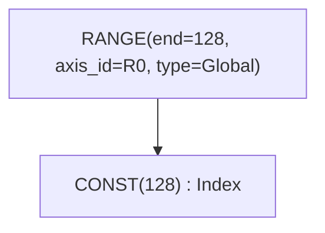

### END — закрытие скоупа цикла

```rust
End {
    computation: Arc<UOp>,              // value computed inside loop
    ranges: SmallVec<[Arc<UOp>; 4]>,    // ranges being closed
}
```

END закрывает один или несколько скоупов RANGE и убирает их из активного набора. Можно закрыть несколько RANGE одновременно.

**Пример:**
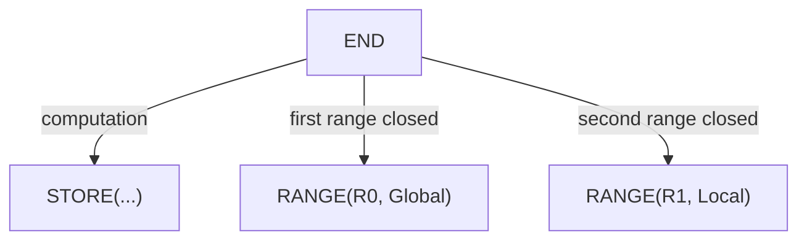

---

## Редукция: REDUCE vs REDUCE_AXIS

Две операции с похожими названиями, но с разным назначением.

### REDUCE_AXIS — редукция по измерению тензора (высокоуровневая)

```rust
ReduceAxis {
    src: Arc<UOp>,           // input tensor
    reduce_op: ReduceOp,     // Add, Mul, Max, Min
    axes: Vec<usize>,        // axes to reduce
}
```

Используется **до** rangeify. Работает по измерениям тензора, как `.sum(axis=0)` в NumPy.

**Пример:**
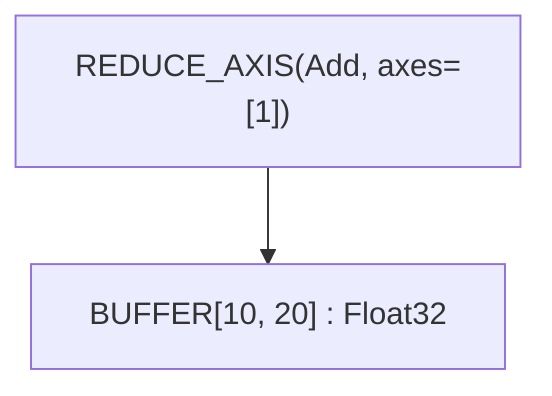

Редуцирует тензор `[10, 20]` до `[10]`, суммируя по оси 1.

### REDUCE — редукция по итерациям RANGE (низкоуровневая)

```rust
Reduce {
    src: Arc<UOp>,                      // value to accumulate
    ranges: SmallVec<[Arc<UOp>; 4]>,    // ranges being reduced
    reduce_op: ReduceOp,                // Add, Mul, Max, Min
}
```

Используется **после** rangeify. Аккумулирует значения по итерациям RANGE и закрывает указанные RANGE.

**Варианты ReduceOp:**

| Op | Нейтральный элемент | Операция | Tinygrad |
|----|---------------------|----------|----------|
| `Add` | 0 | `acc + value` | ✓ |
| `Mul` | 1 | `acc * value` | ✓ |
| `Max` | -∞ | `max(acc, value)` | ✓ |
| `Min` | +∞ | `min(acc, value)` | Только Svod |

> **Совместимость:** Спецификация Tinygrad ограничивает REDUCE_AXIS до `{Add, Mul, Max}`. Svod расширяет это добавлением `Min`.

**Пример:**
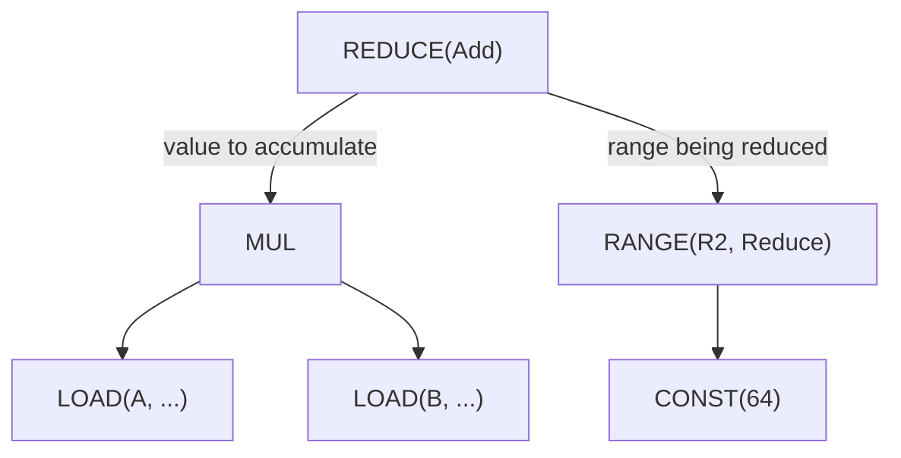

### ALLREDUCE — редукция между устройствами

```rust
AllReduce {
    src: Arc<UOp>,           // local partial result
    device: Arc<UOp>,        // device specification
    reduce_op: ReduceOp,     // reduction operation
}
```

Выполняет распределённую редукцию между несколькими устройствами. Используется для мульти-GPU обучения.

---

## Операции с буферами

### BUFFER — объявление буфера

```rust
Buffer {
    unique: Arc<UOp>,        // UNIQUE op for identity
    device: Arc<UOp>,        // DEVICE op
    size: usize,             // total element count
}
```

Объявляет буфер для хранения данных тензора. Поле `unique` гарантирует различимость буферов даже при одинаковых размере и устройстве.

### BUFFERIZE — маркер материализации

```rust
Bufferize {
    compute: Arc<UOp>,                  // computation to materialize
    ranges: SmallVec<[Arc<UOp>; 4]>,    // output dimensions
    opts: BufferizeOpts,                // address space, device
}
```

Отмечает место, где вычисление должно материализоваться в память. Триггерит разделение на ядра.

**BufferizeOpts:**

| Поле | Тип | Назначение |
|------|-----|------------|
| `device` | `Option<DeviceSpec>` | Целевое устройство, `None` для локального |
| `addrspace` | `AddrSpace` | `Global` (устройство) или `Local` (shared) |
| `removable` | `bool` | При `false` `buffer_removal` не имеет права инлайнить эту BUFFERIZE — используется на границах realize с несколькими потребителями, чтобы буфер сохранялся между итерациями фикспоинта мега-прохода |

**Пример:**
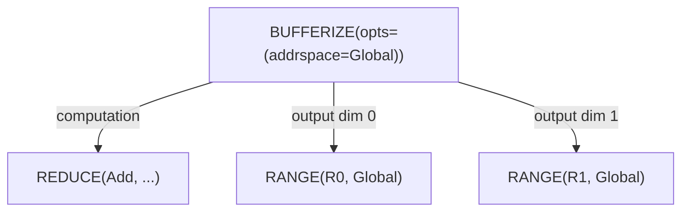

### INDEX — многомерный доступ к буферу

```rust
Index {
    buffer: Arc<UOp>,                   // BUFFER or PARAM
    indices: SmallVec<[Arc<UOp>; 4]>,   // index per dimension
    gate: Option<Arc<UOp>>,             // optional predicate
}
```

Вычисляет адрес в памяти из многомерных индексов. Возвращает DType элемента (не указатель).

**Пример:**
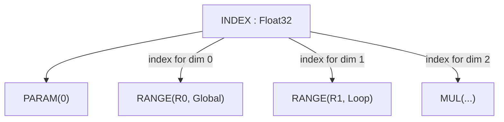

### POINTER_INDEX — низкоуровневая арифметика указателей

```rust
PointerIndex {
    ptr: Arc<UOp>,           // base pointer
    offset: Arc<UOp>,        // byte offset
}
```

Прямая арифметика указателей. Используется после линеаризации, когда индексы уже свёрнуты в линейные.

> **Совместимость:** Tinygrad использует `INDEX` с флагом `ptr=True` вместо отдельной операции.

### LOAD — чтение из памяти

```rust
Load {
    buffer: Arc<UOp>,        // buffer or pointer
    index: Arc<UOp>,         // INDEX op
    alt: Option<Arc<UOp>>,   // alternative value for gated loads
}
```

Читает значение из буфера по индексу. Для gated loads поле `alt` задаёт значение при ложном условии INDEX-а (позволяет полностью избежать обращения к памяти).

**Пример:**
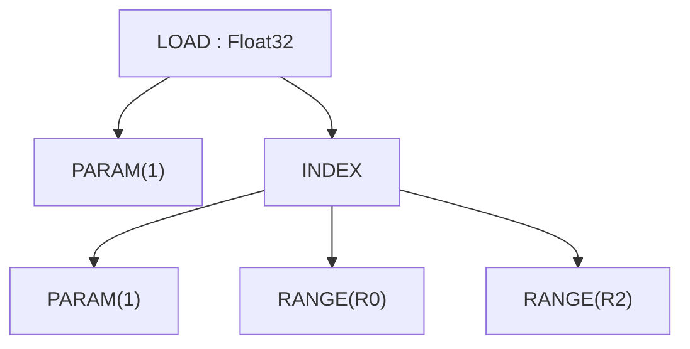

### STORE — запись в память

```rust
Store {
    index: Arc<UOp>,                    // INDEX op (buffer accessed via index.src[0])
    value: Arc<UOp>,                    // value to write
    ranges: SmallVec<[Arc<UOp>; 4]>,    // ranges being closed
}
```

Записывает значение в буфер. Буфер доступен через INDEX-узел (через `index.src[0]`), а не через отдельное поле. STORE закрывает указанные RANGE, которые представляют выходные измерения итерации. Поле ranges используется для output upcasting: когда включён `Range(Upcast)`, он становится `UNROLL` при расширении, а затем сжимается через `CONTRACT`.

Для условной записи используйте INDEX с gate (у INDEX есть опциональное поле `gate`).

> **Совместимость:** У STORE в Svod нет отдельного поля `buffer` — источники: index=0, value=1, ranges=2+ (range_start=2). Устройство Tinygrad аналогично.

**Пример:**
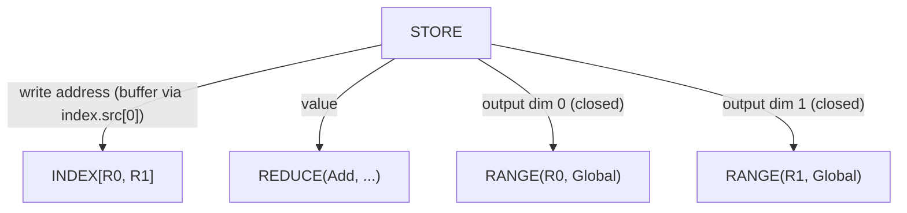

---

## Структура ядра и вызываемый IR

Работа уровня schedule выражается через вызываемый IR, повторяющий модель
`CALL`/`FUNCTION`/`PROGRAM` из tinygrad: `Function` определяет тело
(обычно `Sink` со store-операциями), параметризованное аргументами,
`Call` вызывает его с конкретными аргументами, а `Program` проводит тело
через строгий конвейер компиляции `SINK → LINEAR → SOURCE → BINARY`.

### CALL — вызов тела функции

```rust
Call {
    body: Arc<UOp>,                     // FUNCTION (или его тело)
    args: SmallVec<[Arc<UOp>; 4]>,      // конкретные значения аргументов
    info: CallInfo,                     // аннотации (name, origin, ...)
}
```

Вызывает тело callable с аргументами. Закрывает диапазоны: любые `Range`
из `args` (range_start_index = 1; `body=0`, `args=1+`).

`CallInfo` несёт безопасные для ключей кэша аннотации:

| Поле | Тип | Назначение |
|------|-----|------------|
| `name` | `Option<String>` | Человекочитаемое имя callable |
| `grad_tag` | `Option<String>` | Зарезервировано для идентичности градиентного коллбека |
| `origin` | `Option<OriginId>` | Происхождение корня сохраняемого значения — на него списывается ядро |
| `origins` | `OriginSet` | Все происхождения, достижимые в теле до их снятия |
| `precompile` / `precompile_backward` | `bool` | Подсказки для предкомпиляции |

Именно в CALL ядра запуск хранит привязку, которую читают сводки профайлера; см.
[Профилирование и бенчмаркинг ядер](../tile-kernels/profiling.md).

### FUNCTION — переиспользуемое тело

```rust
Function {
    body: Arc<UOp>,                     // вычисление
    args: SmallVec<[Arc<UOp>; 4]>,      // формальные параметры
    info: CallInfo,
}
```

Переиспользуемый callable. Его dtype всегда `Void`; тела, возвращающие
несколько значений, оборачиваются в `Tuple`, чтобы граница функции
оставалась Void. По форме закрытия диапазонов идентичен `Call`.

### TUPLE / GET_TUPLE — мульти-возврат

```rust
Tuple { src: SmallVec<[Arc<UOp>; 4]> }
GetTuple { src: Arc<UOp>, index: usize }
```

`Tuple` упаковывает разнородные значения; его dtype всегда `Void`.
`GetTuple` извлекает элемент `index` из `Tuple` (или из `Function`, чьё
тело — `Tuple`); dtype соответствует внутреннему элементу. Используется,
чтобы провести несколько выходов через Void-границу функции.

### PROGRAM — контейнер компиляционного конвейера

```rust
Program {
    sink: Arc<UOp>,                     // корневой SINK
    device: Arc<UOp>,                   // DEVICE
    linear: Option<Arc<UOp>>,           // LINEAR (после линеаризации)
    source: Option<Arc<UOp>>,           // SOURCE (после рендера)
    binary: Option<Arc<UOp>>,           // PROGRAM_BINARY (после компиляции)
}
```

Проводит ядро через стадии `SINK → LINEAR → SOURCE → PROGRAM_BINARY`,
которые жёстко выстроены в `codegen/src/program_pipeline.rs`
(`do_linearize`/`do_render`/`do_compile`/`get_program`). Каждая стадия
заполняет следующее поле. Рендерeры C/LLVM ожидают вход `Op::Linear`
и сообщают `Error::InvalidGraph` через `pending_error` контекста, не падая
с panic; многоиндексные `INDEX` должны быть приведены к одноиндексным
через `pm_linearize_multi_index` до рендера.

### LINEAR — линеаризованный поток операций

```rust
Linear { ops: SmallVec<[Arc<UOp>; 8]> }
```

Плоская последовательность операций, полученная при линеаризации.
Потребители итерируются по `ops` напрямую, без обхода графа.

### SOURCE / PROGRAM_BINARY — артефакты компиляции

```rust
Source { code: String }              // отрендеренный исходник (C / LLVM-IR)
ProgramBinary { bytes: Vec<u8> }     // скомпилированный артефакт
```

Терминальные стадии конвейера. Оба — листья (без потомков).

### SINK — коллектор нескольких корней

```rust
Sink {
    sources: SmallVec<[Arc<UOp>; 4]>,
    info: Option<KernelInfo>,           // структурный маркер для AST ядер
}
```

Собирает несколько выходов в один корень. Тело `Function` — как правило,
`Sink` из store-операций. Поле `info` — хеш-консолидированный структурный
маркер, отличающий SINK уровня kernel-AST от обычного SINK с теми же
источниками без опоры на боковой канал type-erased метаданных.

**Пример:**
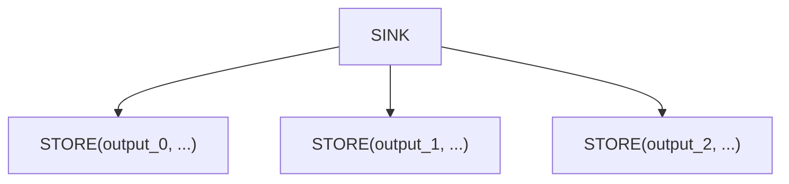

### AFTER — маркер зависимости

```rust
After {
    passthrough: Arc<UOp>,              // value that flows through
    deps: SmallVec<[Arc<UOp>; 4]>,      // operations that must complete
}
```

Выражает зависимости выполнения между ядрами без data dependency. Значение `passthrough` возвращается без изменений, но только после завершения всех `deps`.

**Пример:**
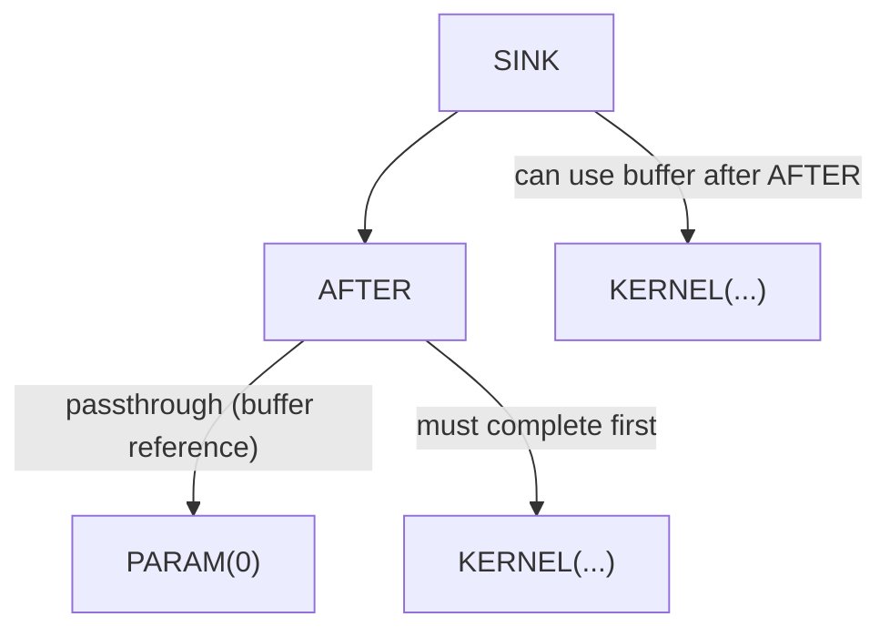

### BARRIER — барьер синхронизации

```rust
Barrier {
    src: Arc<UOp>,                      // value passing through
    deps: SmallVec<[Arc<UOp>; 4]>,      // operations to wait for
}
```

Синхронизация GPU-воркгруппы. Гарантирует, что все потоки в воркгруппе достигли барьера, прежде чем продолжить.

---

## Векторные операции

### VECTORIZE — создание вектора из скаляров

```rust
Vectorize {
    elements: SmallVec<[Arc<UOp>; 4]>,
}
```

Комбинирует N скалярных значений в вектор размера N. Все элементы должны иметь одинаковый базовый DType.

**Пример:**
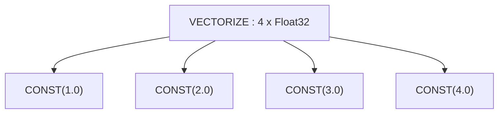

### GEP — Get Element Pointer (извлечение из вектора)

```rust
Gep {
    vector: Arc<UOp>,        // source vector
    indices: Vec<usize>,     // positions to extract
}
```

Извлекает элементы из вектора:
- Один индекс — скаляр
- Несколько индексов — вектор меньшего размера

**Пример:**
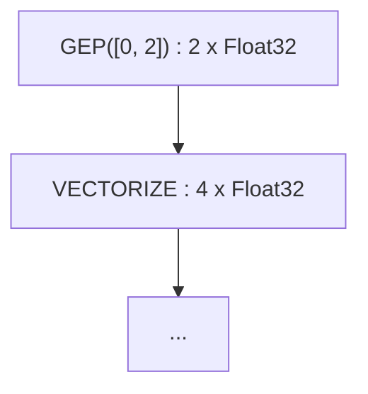

### VConst — векторная константа

```rust
VConst {
    values: Vec<ConstValue>,
}
```

Вектор констант, известных на этапе компиляции. Эффективнее, чем `VECTORIZE` из `CONST`-узлов.

### CAT — конкатенация векторов

```rust
Cat {
    sources: SmallVec<[Arc<UOp>; 4]>,
}
```

Конкатенирует векторы в вектор большего размера. `vcount` на выходе = сумма `vcount` входов.

**Пример:**
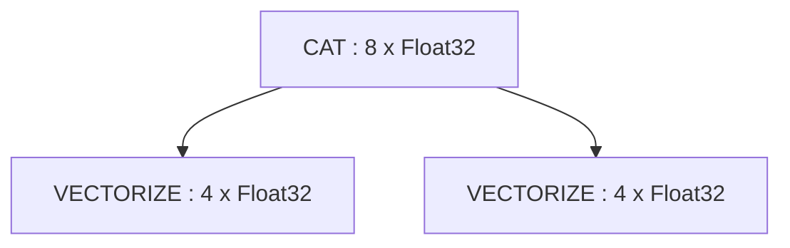

### PtrCat — конкатенация указателей

```rust
PtrCat {
    sources: SmallVec<[Arc<UOp>; 4]>,
}
```

Группирует обращения к памяти для векторизованного load/store. Используется проходом devectorizer.

---

## Расширение: UNROLL и CONTRACT

### UNROLL — расширение вычисления по итерациям

```rust
Unroll {
    src: Arc<UOp>,                       // computation to expand
    unroll_axes: Vec<(usize, usize)>,    // (axis_index, factor) pairs
}
```

Создаёт несколько версий вычисления для разных значений итерации. Используется для оптимизации развёртки циклов.

**Пример:** `UNROLL(unroll_axes=[(0, 4)])` расширяет вычисление 4 раза с разными значениями индекса.

### CONTRACT — свёртка развёрнутых значений в вектор

```rust
Contract {
    src: Arc<UOp>,                       // unrolled computation
    upcast_ranges: Vec<(usize, usize)>,  // (axis_index, factor) pairs
}
```

Обратная операция к UNROLL — собирает расширенные скалярные значения в вектор. Размер выходного вектора = произведение множителей.

**Пример:**
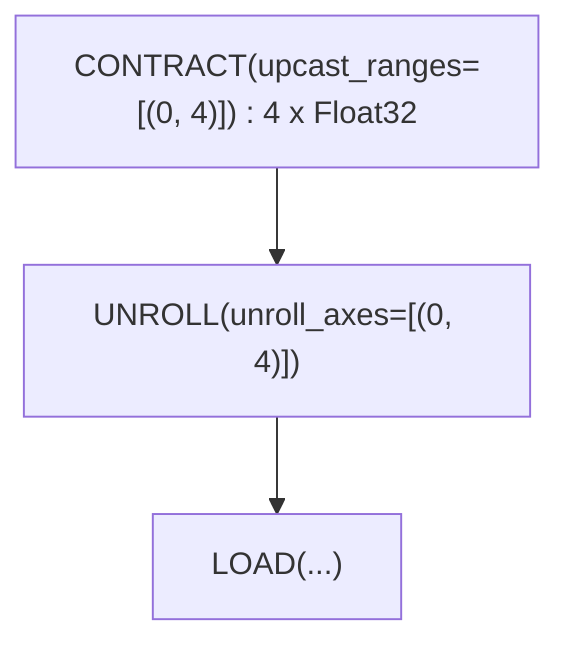

Этот паттерн векторизует загрузку: расширить 4 итерации, затем упаковать результаты в 4-элементный вектор.

---

## Тензорные ядра: WMMA

### WMMA — Warp Matrix Multiply-Accumulate

```rust
Wmma {
    a: Arc<UOp>,             // matrix A fragment
    b: Arc<UOp>,             // matrix B fragment
    c: Arc<UOp>,             // accumulator C fragment
    metadata: WmmaMetadata,  // hardware configuration
}
```

Аппаратная операция тензорного ядра: `D = A * B + C`. Требует конкретных форм матриц и раскладок данных.

**Поля WmmaMetadata:**

| Поле | Тип | Назначение |
|------|-----|------------|
| `name` | `String` | Имя инструкции (например, `"__hmma..."`) |
| `dims` | `(N, M, K)` | Размерности матриц (например, `(16, 16, 16)`) |
| `dtype_in` | `DType` | Точность входных матриц (например, `Float16`) |
| `dtype_out` | `DType` | Точность выхода (например, `Float32`) |
| `device` | `RendererDevice` | Рендерер / TC-бэкенд, породивший эту WMMA |
| `threads` | `usize` | Потоков на warp (обычно 32) |
| `upcast_axes` | `WmmaUpcastAxes` | Векторизация для каждого операнда (поля: `a`, `b`, `c`) |
| `reduce_axes` | `Vec<(usize, usize)>` | Оси свёртки |

**Пример:**
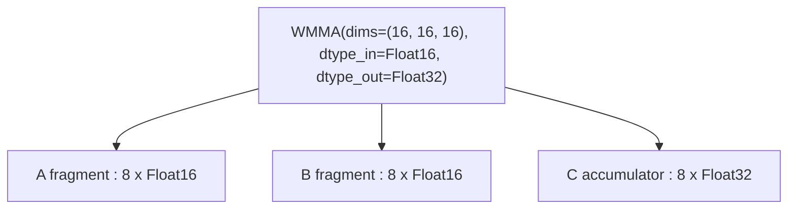

---

## Управление потоком выполнения

### IF / ENDIF — условное выполнение

```rust
If {
    condition: Arc<UOp>,                // boolean predicate
    body: SmallVec<[Arc<UOp>; 4]>,      // operations to execute
}

EndIf {
    if_op: Arc<UOp>,         // corresponding IF op
}
```

Выполнить тело, только если условие истинно. Используется для проверок границ и разреженных операций.

**Пример:**
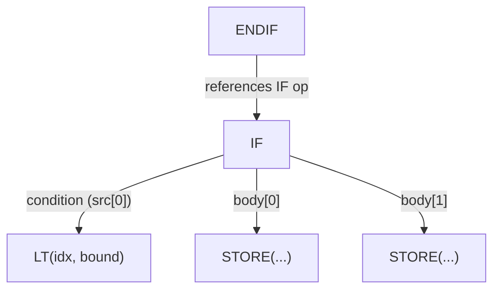

---

## Операции определения

### PARAM — параметр буфера

```rust
Param { slot: usize, size: usize, device: Option<Arc<UOp>> }
```

Нормализованный параметр буфера — позиционная ссылка на входной/выходной буфер.
Создаётся при предварительной нормализации расписания (BUFFER->PARAM) для стирания идентичности буфера,
что позволяет структурную дедупликацию идентичных вычислений на разных буферах.
`slot` — позиция в списке аргументов ядра, `size` — количество элементов.

### DEFINE_LOCAL — аллокация shared-памяти

```rust
DefineLocal(usize)           // local memory index
```

Аллокация GPU shared memory (LDS). Видна внутри воркгруппы.

### DEFINE_VAR — символическая рантайм-переменная

```rust
DefineVar {
    name: String,            // variable name
    min_val: i64,            // minimum bound
    max_val: i64,            // maximum bound
}
```

Рантайм-переменная с известными границами. Используется для динамических форм, когда границы известны.

**Пример:**
```text
DEFINE_VAR(name="batch_size", min=1, max=128) : Index
```

### DEFINE_REG — аллокация регистра

```rust
DefineReg {
    size: usize,             // register size
    id: usize,               // unique accumulator ID
}
```

Аллоцирует регистр для промежуточного хранения. Поле `id` различает регистры одного DType — без него два reduce с одинаковым DType разделили бы один DEFINE_REG через hash consing. Используется в кодогенерации.

### BIND — привязка переменной

```rust
Bind {
    var: Arc<UOp>,           // DEFINE_VAR
    value: Arc<UOp>,         // concrete value
}
```

Привязывает символическую переменную к конкретному значению в рантайме.

---

## Специальные операции

### SPECIAL — аппаратные значения

```rust
Special {
    end: Arc<UOp>,           // upper bound for this dimension
    name: String,            // e.g., "blockIdx.x", "threadIdx.y"
}
```

Доступ к значениям, предоставляемым аппаратурой (индексы потоков/блоков). Это не цикл — значение даётся напрямую оборудованием.

**Пример:**
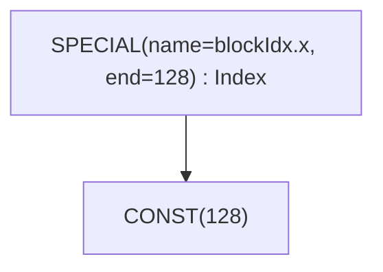

### UNIQUE / LUNIQUE — маркеры идентичности

```rust
Unique(usize)                // глобальный счётчик идентичности
LUnique(usize)               // счётчик идентичности локальной области
```

Создаёт уникальную идентичность для различения буферов. Два буфера с
разными `Unique`-значениями различимы, даже если в остальном идентичны.
`LUnique` обеспечивает такое же различение в пределах локальной области
(например, внутри тела `Function`), не пересекаясь с глобальным
счётчиком, — благодаря этому тела callable можно хеш-консолидировать
независимо от точек вызова.

### DEVICE — спецификация устройства

```rust
Device(DeviceSpec)           // device specification
```

Указывает целевое устройство для вычисления.

---

## Операции перемещения (Movement)

Высокоуровневые трансформации формы тензора. Преобразуются в явные INDEX-операции во время rangeify.

| Операция | Сигнатура | Назначение |
|----------|-----------|------------|
| `Reshape` | `{ src, new_shape }` | Изменить форму, те же элементы |
| `Permute` | `{ src, axes: Vec<usize> }` | Транспонирование / перестановка осей |
| `Expand` | `{ src, new_shape }` | Бродкаст до большей формы |
| `Pad` | `{ src, begin_pads, end_pads }` | Добавить паддинг |
| `Shrink` | `{ src, begins, ends }` | Извлечь подобласть |
| `Flip` | `{ src, axes: Vec<bool> }` | Развернуть по осям |

**Пример:** RESHAPE
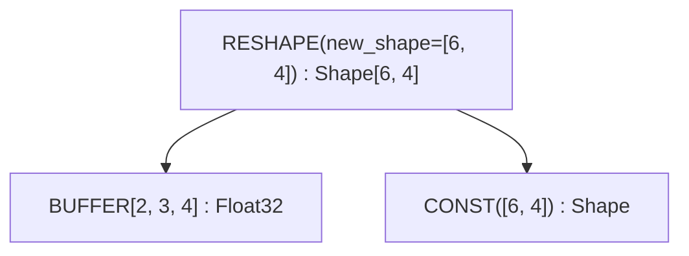

---

## Дополнительные операции

Следующие операции существуют в enum `Op`, но являются внутренними или редко встречаются при отладке:

| Операция | Назначение |
|----------|------------|
| `Copy` | Явное копирование значения |
| `Slice` | `{ buffer, offset, size }` — метаданные непрерывного типизированного среза буфера |
| `MStack` | Аллокация стека в памяти |
| `MSelect` | Выбор в памяти (условный доступ) |
| `Multi` | Операция с множественными выходами |
| `Group` | Группировка операций для планирования |
| `Detach` | Отсоединение от графа (запрет оптимизации через узел) |
| `Contiguous` | Хинт, что данные непрерывны |
| `ContiguousBackward` | Обратный проход для хинта contiguous |
| `Precast` | Предварительное приведение типа |
| `Custom` / `CustomI` | Инлайновое расширение пользовательскими операциями (`Custom` поддерживает только C) |
| `CustomFunction` | Хук пользовательской функции уровня runtime (виды: `EncDec`, `Graph`) |

---

## Краткий справочник

### По категориям

| Категория | Операции |
|-----------|----------|
| **Управление циклами** | `RANGE`, `END` |
| **Редукция** | `REDUCE_AXIS`, `REDUCE`, `ALLREDUCE` |
| **Память** | `BUFFER`, `SLICE`, `STAGE`, `INDEX`, `LOAD`, `STORE` |
| **Ядро и callable** | `SINK`, `CALL`, `FUNCTION`, `TUPLE`, `GET_TUPLE`, `PROGRAM`, `LINEAR`, `SOURCE`, `PROGRAM_BINARY`, `AFTER`, `BARRIER` |
| **Векторные** | `VECTORIZE`, `GEP`, `VCONST`, `CAT`, `PTRCAT` |
| **Расширение** | `UNROLL`, `CONTRACT` |
| **Аппаратные** | `WMMA`, `SPECIAL` |
| **Управление** | `IF`, `ENDIF` |
| **Определение** | `PARAM`, `DEFINE_LOCAL`, `DEFINE_VAR`, `DEFINE_REG`, `BIND`, `UNIQUE`, `LUNIQUE`, `DEVICE` |
| **Перемещение** | `RESHAPE`, `PERMUTE`, `EXPAND`, `PAD`, `SHRINK`, `FLIP` |
| **ALU** | `Unary(...)`, `Binary(...)`, `Ternary(...)`, `Cast`, `BitCast` |

### Операции, закрывающие RANGE

Операции, которые закрывают скоупы RANGE (убирают RANGE из активного набора):

| Операция | Начальный индекс RANGE |
|----------|------------------------|
| `BUFFERIZE` | 1 (compute=0, ranges=1+) |
| `REDUCE` | 1 (src=0, ranges=1+) |
| `STORE` | 2 (index=0, value=1, ranges=2+) |
| `WMMA` | 3 (a=0, b=1, c=2) |
| `END` | 1 (computation=0, ranges=1+) |
| `CALL` / `FUNCTION` | 1 (body=0, args=1+) |

### Расширяемые операции

Операции, через которые UNROLL пропагируется по графу вычислений:

- ALU: `Unary`, `Binary`, `Ternary`
- Типы: `Cast`, `BitCast`
- Векторные: `Gep`, `Vectorize`
- Память: `Load`, `Store`, `Index`, `PointerIndex`
- Управление: `Reduce`, `End`, `After`
- Буферы: `Bufferize`
- Аппаратные: `Wmma`
