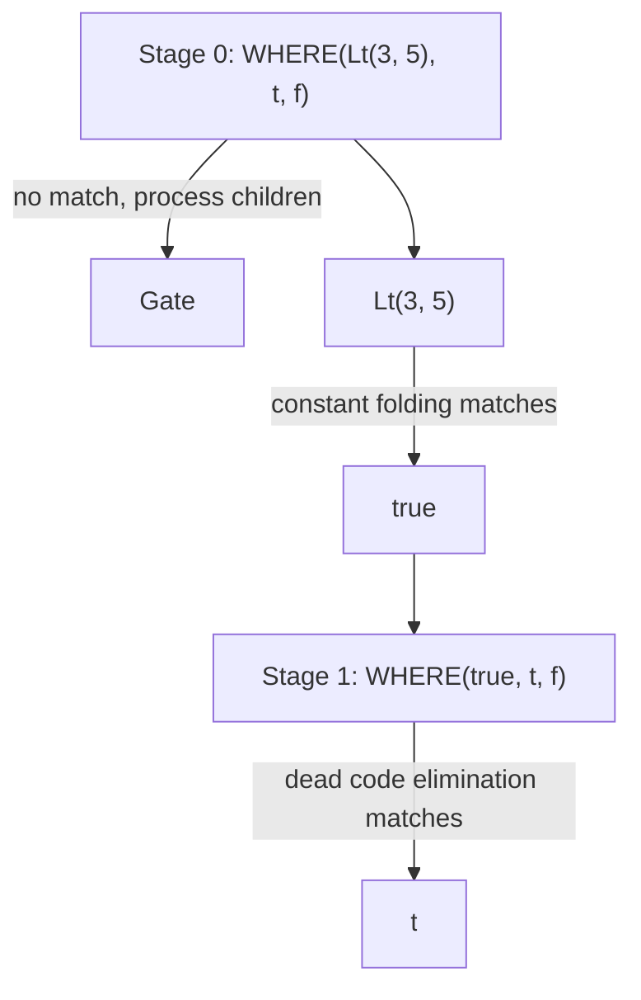

# Движок паттернов

Откройте любой продакшн ML-компилятор — и найдёте десятки оптимизационных проходов: свёртка констант, удаление мёртвого кода, фьюзинг операторов, тайлинг циклов, векторизация, оптимизация раскладки памяти. У каждого прохода свои структуры данных, своя логика обхода, свои баги.

Svod использует другой подход: **один механизм для всего**.


Каждая оптимизация в Svod выражается как **паттерн**: «когда видишь эту структуру, замени её вот этой». Одна и та же функция `graph_rewrite()` применяет [алгебраическое упрощение](./algebraic-simplification.md), [индексную арифметику](./index-arithmetic.md), [снижение стоимости](./strength-reduction.md) и [оптимизацию диапазонов](./range-optimization.md).

---

## DSL `patterns!`

Svod предоставляет предметно-ориентированный язык для написания оптимизационных паттернов:

```rust
patterns! {
    // Identity folding: x + 0 → x
    Add[x, @zero] => x,

    // Constant folding: 3 + 4 → 7
    Add(a @const(a_val), _b @const(b_val))
        => eval_add(a_val, b_val).map(|r| UOp::const_(a.dtype(), r)),

    // Self-folding: x / x → 1
    Idiv(x, x) => UOp::one(x.dtype()),

    // Dead code elimination: if(true) { t } else { f } → t
    Where(Const(ConstValue::Bool(true)), t, _f) => t,
}
```

Макрос компилирует эти паттерны в эффективный Rust-код:

| Синтаксис | Значение | Пример |
|-----------|----------|--------|
| `(x, y)` | **Упорядочено.** Сопоставляется в точном порядке. | `Sub(x, @zero) => x` |
| `[x, y]` | **Коммутативно.** Пробуются оба порядка. | `Add[x, @zero] => x` |
| `@zero` | **Нулевая константа.** Совпадает с 0 или 0.0. | `Mul[_, z @ @zero] => z` |
| `@one` | **Единичная константа.** Совпадает с 1 или 1.0. | `Mul[x, @one] => x` |
| `c @const(val)` | **Извлечение константы.** Связывает значение. | `Add(a @const(av), _b @const(bv))` |
| `x, x` | **Один и тот же операнд.** Автогенерируется проверка ptr_eq. | `Idiv(x, x) => UOp::one(...)` |
| `=>` | **Перезапись.** Возвращает `Arc<UOp>`, `Option<Arc<UOp>>` (`None` — отказ) или `RewriteResult`. | `=> eval(...).map(...)` |
| `for op in binary [...]` | **Шаблон.** Генерация паттернов для нескольких операций. | См. ниже |
| `@context Type` | **С состоянием.** Доступ к мутабельному контексту в паттернах. | См. ниже |

### Раскрытие шаблонов

Вместо написания одного и того же паттерна для каждой бинарной операции используйте for-цикл:

```rust
patterns! {
    for op in binary [Add, Mul, Sub, Idiv, Fdiv, Max] {
        op(a @const(a_val), _b @const(b_val))
            => eval_binary(op, a_val, b_val)
                .map(|r| UOp::const_(a.dtype(), r))
    }
}
```

Это раскрывается в шесть отдельных паттернов во время компиляции — по одному для каждой операции.

### Паттерны с состоянием

Некоторым оптимизациям нужен контекст (например, в каком ядре мы находимся, какие диапазоны активны):

```rust
patterns! {
    @context KernelContext;

    reduce @ ReduceAxis { src, .. } => {
        ctx.record_reduction(reduce);
        transform_reduce(reduce, src, ctx)
    }
}
```

### Подъём контекста

При комбинировании матчеров с разными типами контекста используется `.with_context()`:

```rust
let pm_add_images = symbolic_simple().clone().with_context::<AddImageContext>()
    + no_vectorized_alu().clone().with_context()
    + pm_simplify_add_image();
```

---

## Как работает сопоставление паттернов

Макрос `patterns!` компилирует блок в одну функцию, которая диспатчит по виду корневой операции через `match`, а затем пробует паттерны этого вида в порядке исходника.

### Индекс OpKey

У каждого UOp есть тип операции (Add, Mul, Load и т.д.). Макрос генерирует enum `OpKey`, отображающий операции в хэшируемые ключи:

```rust
match OpKey::from_op(tree.op()).index() {
    KEY_ADD => { /* rules rooted at Add, in source order */ }
    KEY_MUL => { /* rules rooted at Mul */ }
    _ => {}
}
// wildcard rules (`x if cond`) run as sequential steps between the matches
```

При сопоставлении UOp:

1. **Извлекаем OpKey** из операции UOp
2. **Переходим** в ветку `match` этого вида
3. **Пробуем каждое замыкание**, пока одно не сработает
4. **Откатываемся** на wildcards, если ни один индексированный паттерн не совпал

Это в 5–10 раз быстрее линейного перебора всех паттернов.

### Обработка коммутативности

Для паттернов вроде `Add[x, @zero]` макрос генерирует код, пробующий оба порядка:

```rust
// Try (x, @zero)
if let Some(result) = try_match_ordered(&children[0], &children[1]) {
    return result;
}
// Try (@zero, x)
if let Some(result) = try_match_ordered(&children[1], &children[0]) {
    return result;
}
```

### Обнаружение дубликатов

Когда вы пишете `Idiv(x, x)`, паттерн срабатывает только если оба операнда — *один и тот же* UOp (равенство указателей через `Arc::ptr_eq`, а не структурное равенство). Это использует hash consing — идентичные подвыражения разделяют один указатель.

---

## Движок перезаписи

Одного сопоставления паттернов недостаточно. Рассмотрим выражение:

```text
WHERE(Lt(3, 5), t, f)
```

Чтобы его упростить, нужны два шага:
1. `Lt(3, 5)` → `true` (свёртка констант)
2. `WHERE(true, t, f)` → `t` (удаление мёртвого кода)

Но паттерн `WHERE` не сработает, пока его дочерний узел не упрощён. Движок перезаписи решает это **двухстадийным алгоритмом**.

### Стадия 0: Применение паттернов

Паттерны применяются к каждому узлу. Если ни один паттерн не совпал, подаётся сигнал сначала обработать дочерние узлы.

### Стадия 1: Реконструкция источников

После перезаписи дочерних узлов перестраиваем узел с новыми потомками и снова пробуем паттерны:



Стадия реконструкции повторно применяет паттерны, что позволяет многошаговым оптимизациям сработать за один обход.

### Стратегии перезаписи

Три функции перезаписи, соответствующие `graph_rewrite` в Tinygrad:

| Стратегия | Паттерны видят | Когда использовать |
|-----------|---------------|-------------------|
| `graph_rewrite(pm)` (по умолчанию) | ОПТИМИЗИРОВАННЫХ потомков | Алгебраическое упрощение, раскрытие |
| `graph_rewrite_bottom_up(bpm)` | ИСХОДНЫХ потомков | Сопоставление вложенных структур, удаление буферов |
| `graph_rewrite_with_bpm(pm, bpm)` | Оба (bpm: исходные, pm: оптимизированные) | Разбиение ядер (gate + трансформация в одном проходе) |

Движок всегда обходит снизу вверх; различие в том, *когда* срабатывают паттерны: на Стадии 0 (до обработки потомков — видят оригиналы) или на Стадии 1 (после потомков — видят оптимизированные результаты). Матчеры комбинируются оператором `+`: `matcher_a() + matcher_b()` объединяет наборы паттернов в один.

### Ограничения безопасности

Для предотвращения бесконечных циклов:
- максимум **500 000 записей в стеке перезаписи** (`REWRITE_STACK_LIMIT`)
- Panic с диагностикой при превышении лимитов

На практике корректные паттерны сходятся быстро.

---

## Почему это важно

**Отладка прямая.** Паттерны — это читаемый код. Добавьте `println!` в любой паттерн, чтобы отследить, когда он срабатывает.

**Расширяемость простая.** Добавление своей оптимизации — пара строк. Не нужно разбираться во внутренностях компилятора, писать визиторы или модифицировать pass manager.

**Корректность локальна.** Каждый паттерн — маленькая теорема: «если появляется эта структура, замена на ту структуру сохраняет семантику». Каждый паттерн верифицируется независимо. Композиция корректных паттернов даёт корректные программы.

**Производительность настраиваема.** O(1) диспатч паттернов быстр по умолчанию. Комбинируйте с [beam search](./kernel-search.md) для продакшн-нагрузок.

---

## Глубинная идея

Сопоставление паттернов обменивает общность на компонуемость.

Универсальный оптимизационный проход может делать что угодно — и в этом проблема. Его трудно верифицировать, трудно расширять, трудно компоновать с другими проходами. Порядок важен. Взаимодействия тонки.

Паттерн ограничен: он сопоставляет конкретную структуру и порождает конкретную замену. Но ограничения дают компонуемость. Для корректно спроектированных наборов паттернов применение до фиксированной точки даёт детерминированные результаты. Новые паттерны добавляются с локальным влиянием, удаляются без каскадных сбоев — хотя на практике взаимодействия паттернов следует тестировать для обеспечения сходимости.

Каждый паттерн — теорема о семантической эквивалентности. Движок перезаписи — доказыватель теорем, находящий вывод от входа к оптимизированному выходу. Корректность следует из корректности отдельных шагов.

Это философия Unix, применённая к компиляторам: маленькие, сфокусированные инструменты, которые компонуются.
