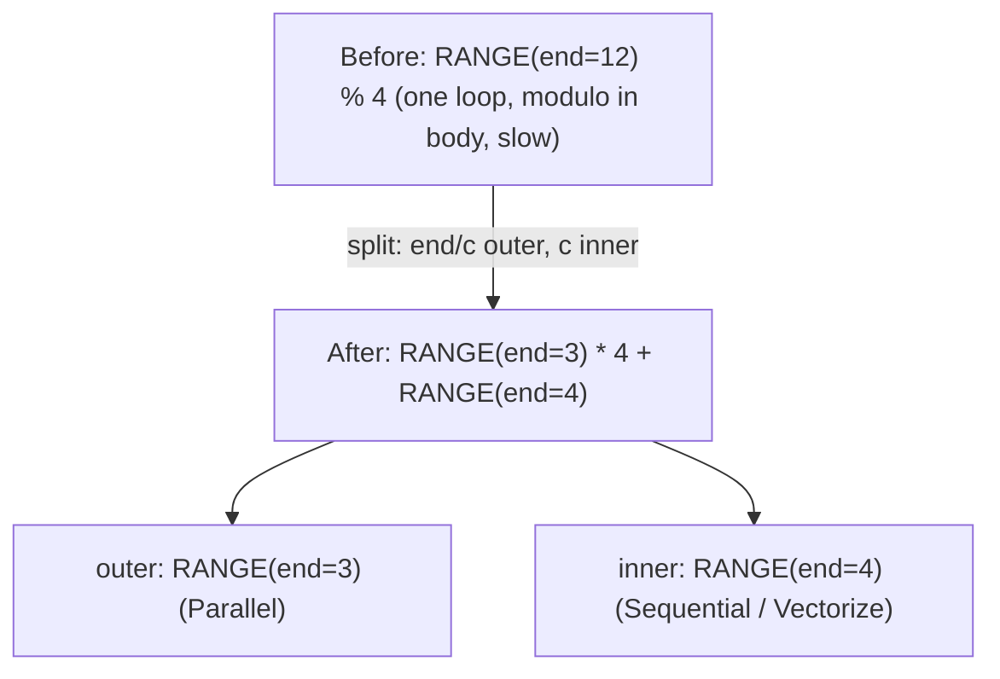
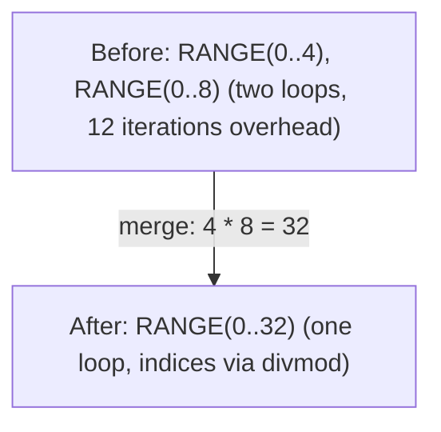
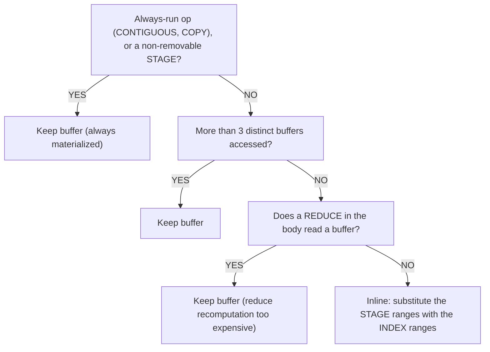

# Оптимизация Range и Reduce

Циклы — основная цель оптимизаций в тензорных компиляторах. Наивное поэлементное сложение двух тензоров `[1024, 1024]` порождает один цикл на 1М элементов. После оптимизации оно превращается в 1024 параллельных потока, каждый из которых обрабатывает 1024 элемента с векторизованными загрузками/записями. Оптимизация Range — это путь к такому результату.

Эти паттерны находятся в `schedule/src/rangeify/` и выполняются на Стадиях 1–5 [пайплайна кодогенерации](../codegen/overview.md).

Исходники Tinygrad: `tinygrad/codegen/simplify.py`.

---

## Разбиение Range

**Что**: Декомпозиция одного диапазона на внешнюю и внутреннюю компоненты через divmod.

**Когда**: Переменная диапазона используется с модулем: `RANGE(end) % c`, где `end % c == 0`.



**Зачем**: После разбиения внутренний диапазон может быть векторизован (UPCAST до ширины SIMD), а внешний — параллелизован (блоки GPU, потоки CPU). Без разбиения модуль препятствует обеим оптимизациям.

**Механизм**: Матчер паттернов `pm_split_ranges` собирает диапазоны с использованием модуля, но НЕ выполняет преобразование немедленно. Он ждёт узла SINK, затем выполняет все подстановки разом (избегая рассогласованных частичных перезаписей). Внешний и внутренний диапазоны дописывают `0` и `1` к исходному пути оси, повторяя Tinygrad и не выделяя глобальных ID диапазонов.

**Защита**: Срабатывает только при `end % c == 0` (точная делимость). Неделимые случаи остаются без изменений.

Tinygrad: `simplify.py:60-64`. Svod: `pm_split_ranges()` в `rangeify/transforms.rs`.

---

## Слияние Range

**Что**: Слияние двух смежных диапазонов в один, снижающее накладные расходы цикла.



**Зачем**: Накладные расходы цикла (предсказание ветвлений, инкремент счётчика) пропорциональны числу итераций. Слияние уменьшает количество циклов ценой операций divmod для восстановления исходных индексов.

**Критерий решения**: Слияние принимается, только если общее число операций divmod не увеличивается. Компилятор подсчитывает операции divmod до и после — если слияние вводит больше делений, чем устраняет накладных расходов цикла, оно отклоняется.

**Ограничения**:
- Оба диапазона должны иметь совместимые типы осей (оба выходные, оба редукционные и т.д.)
- Область REDUCE должна оставаться согласованной
- Оба диапазона должны присутствовать в одних и тех же областях REDUCE

Tinygrad: `simplify.py:39-41` (`simplify_merge_adjacent`). Svod: `pm_simplify_ranges()`.

---

## Выравнивание Range

**Что**: Выравнивание вложенных цепочек END/REDUCE/STORE в плоские списки диапазонов.

```text
Before:  END(END(END(comp, [r0]), [r1]), [r2])
After:   END(comp, [r0, r1, r2])
```

**Зачем**: Вложенные цепочки END возникают из последовательных преобразований. Выравнивание нормализует структуру, чтобы другие паттерны (слияние, разбиение) могли работать с чистым списком диапазонов.

Tinygrad: `simplify.py:14-17`. Svod: `pm_flatten_range()`.

---

## Свёртка загрузок

**Что**: Полное устранение цикла REDUCE, когда вычисление может быть выражено замкнутой арифметической формулой.

```text
Before:  sum(1 for k in 0..64 if k >= length)    // Loop: 64 iterations
After:   clamp(64 - length, 0, 64)                // Arithmetic: 3 ops
```

**Как работает**:
1. Идентифицировать подвыражения, не зависящие от диапазона REDUCE
2. Создать `DEFINE_VAR` для этих подвыражений (трактовать как инварианты цикла)
3. Подставить диапазон через `DEFINE_VAR` и запустить символьное упрощение
4. Если упрощённое выражение не содержит оставшихся диапазонов, REDUCE устраняется

Это самая мощная одиночная оптимизация — она может устранить целые циклы редукции, преобразуя O(N) вычислений в O(1).

Tinygrad: `simplify.py:145-149`. Svod: `pm_load_collapse()`.

---

## Свёртка Reduce

Аналитическое устранение редукций ADD. Более изощрённое, чем свёртка загрузок — применяет алгебраические преобразования внутри тела редукции.

### Паттерны границ

Обрабатывают условные редукции, где сравнение ограничивает, какие итерации вносят вклад:

| Паттерн | До | После |
|---------|-----|-------|
| Нижняя граница | `sum(r < cut ? 0 : val, r=0..N)` | `max(0, N - cut) * val` |
| Верхняя граница | `sum(r < cut ? val : 0, r=0..N)` | `max(0, min(N, cut)) * val` |
| Двусторонний | `sum(r >= lo & r < hi ? val : 0, r=0..N)` | `max(0, min(N,hi) - max(0,lo)) * val` |
| NE-условный (gather) | `sum(idx != r ? 0 : expr, r=0..N)` | `in_bounds ? expr[r:=idx] : 0` |

Паттерн NE-условного особенно важен для операций gather — он распознаёт, что суммирование по всем индексам, где `idx == r`, эквивалентно одному индексированному доступу.

### Преобразования подъёма

Вынос сравнений за пределы области reduce для экспонирования паттернов границ:

| Преобразование | До | После |
|----------------|-----|-------|
| Подъём Lt | `(x + y) < c` | `x < (c - y)` |
| Подъём Ge | `(x + y) >= c` | `x >= (c - y)` |
| Подъём EQ | `(x + y) == c` | `x == (c - y)` |

### Дистрибутивный закон

`sum(x + y) → sum(x) + sum(y)` — разделение reduce по сложению. Это позволяет каждой половине быть независимо свёрнутой паттернами границ.

### MUL-casted-bool

`x * bool.cast() → WHERE(bool, x, 0)` — преобразует умножение на приведённый bool в WHERE, который затем может быть проанализирован паттернами границ.

Tinygrad: `simplify.py:82-142`. Svod: `pm_reduce_simplify()` + `reduce_collapse_inner_patterns()`.

---

## Удаление буферов (Partial Contiguous)

**Что**: Решение, материализовать ли промежуточный результат в буфер или встроить вычисление, подставив вместо буферизованных диапазонов те, по которым индексирует читатель.

Когда проход rangeify создаёт узел `STAGE` (помечая «здесь нужен буфер»), проход удаления буферов оценивает, стоит ли реально выделять память. `STAGE` — это промежуточное представление Svod между «здесь нужен буфер» и финальным `STORE`+`BUFFER`+`AFTER` — оно позволяет этому проходу решить, действительно ли материализация нужна. Если вычисление достаточно дешёвое, подставляются переменные диапазонов и выражение встраивается напрямую.

### Дерево решений



:::caution[Чтения из буфера внутри Reduce]
Защита по reduce касается не дешевизны операции: она срабатывает всякий раз, когда любой REDUCE в теле читает буфер (`Param`, `Buffer` или `Stage`). Причина: если `argmax(-x)` встроит отрицание, `-x` пересчитывается на каждой итерации редукции — N лишних загрузок и отрицаний вместо одного чтения из буфера. Редукция над значениями, не затрагивающими буферы, по-прежнему может быть встроена.
:::

### Связанные паттерны

| Паттерн | Что делает |
|---------|------------|
| Свёртка STAGE | `STAGE(CONST) → CONST` — стадия константы — это просто константа |
| Свёртка индексов | `INDEX(CONST) → CONST` — индексация в константу — это константа |
| Свёртка COPY | `COPY(CONST) → CONST` — копия константы — это константа |
| Свёртка MSTACK | `INDEX(MSTACK([CONST, ...])) → CONST` — многоустройственный стек констант |
| Тождественная свёртка | `INDEX(STAGE(compute, ranges), ranges) → compute` — одинаковые диапазоны сокращаются |

Svod: `pm_remove_bufferize()` и `buffer_folding()` в `rangeify/patterns.rs`.

---

## Удаление мёртвых осей

**Что**: Удаление неиспользуемых размерностей из операций STAGE.

Размерность считается «мёртвой», когда:
- Имеет размер 1 (ничего не вносит)
- Появляется как константа в индексе (не как переменная)
- Вычислительное выражение не ссылается на неё

Мёртвые оси удаляются из STAGE, затем форма восстанавливается через RESHAPE (вставка размерностей размера 1) и EXPAND (broadcast до исходного размера). Это снижает размерность выделения буфера.

:::caution[Скалярный случай]
Даже когда ВСЕ диапазоны мертвы (скалярный выход), STAGE должен быть сохранён с пустыми диапазонами — его полное удаление вызывает `NoKernelsFound`, поскольку ни один STORE не будет создан при разбиении ядер.
:::

Svod: `dead_axis_removal()` в `rangeify/patterns.rs`.

---

## Reduce Unparented

**Что**: Удаление диапазонов из REDUCE, на которые не ссылается тело редукции.

| Операция Reduce | Неиспользуемый диапазон размера N | Преобразование |
|-----------------|-----------------------------------|----------------|
| ADD | Диапазон не используется в теле | Умножить результат на N |
| MUL | Диапазон не используется в теле | Возвести результат в степень N |
| MAX / MIN | Диапазон не используется в теле | Просто удалить диапазон |

Пример: `sum(x, r=0..N)`, где `x` не зависит от `r` → `x * N`. Сумма константы по N итерациям равна N-кратному значению этой константы.

Tinygrad: `simplify.py:82-86`. Svod: `pm_reduce_simplify()`.

---

## Разбиение ReduceOp

**Что**: Разбиение крупных редукций на две стадии для лучшего параллелизма.

**Когда**: Отношение входа к выходу превышает 32768.

```text
Before:  REDUCE(data, axes=[0])       // shape [65536] → scalar
After:   REDUCE(                       // shape [256] → scalar (second stage)
           CONTIGUOUS(
             REDUCE(                   // shape [65536] → [256] (first stage)
               RESHAPE(data, [256, 256]),
               axes=[1]
             )
           ),
           axes=[0]
         )
```

**Зачем**: Одна огромная редукция не может быть параллелизована. Разбиение на две стадии позволяет первой стадии выполняться параллельно (256 потоков, каждый редуцирует 256 элементов), затем вторая стадия редуцирует 256 частичных результатов.

**Защита**: Применяется, только когда размерность редукции может быть факторизована и отношение входа к выходу превышает порог. Нефакторизуемые размерности пропускаются.

Svod: `split_reduceop()` в `rangeify/kernel.rs`.
